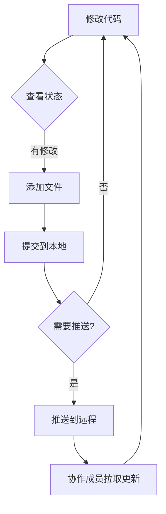

# 1. Git使用详细流程指南

Git是一个强大的分布式版本控制系统，用于高效地管理代码的修改历史。以下是使用Git进行项目开发的详细流程指南：

## 第一步：安装与配置
### 1.1 下载安装（Windows）
1. 访问[清华镜像站](https://mirrors.tuna.tsinghua.edu.cn/git-for-windows/)  
2. 下载最新版 `Git-x.x.x-64-bit.exe`  
3. 双击安装，全默认选项（勾选"Use Git from Windows Command Prompt"）

### 1.2 下载安装（Linux）
以下为主流Linux发行版的安装命令：
#### Debian/Ubuntu
```bash
sudo apt update
sudo apt install git -y           # 安装基础版
sudo apt install git-all -y       # 安装完整组件（含Git LFS）
```
#### RHEL/CentOS
```bash
sudo yum install git -y          # CentOS 7及以下
sudo dnf install git -y          # CentOS 8+/RHEL 8+
```
#### Fedora
```bash
sudo dnf install git -y
```
#### Arch/Manjaro
```bash
sudo pacman -S git                # Arch/Manjaro
```
#### 验证安装
```bash
git --version                    # 查看版本（需≥2.25）
git config --list                # 验证初始配置
```


### 1.3 初始配置（所有系统通用）
```bash
# 设置用户名（必须）
git config --global user.name "你的名字"
# 设置邮箱（必须）
git config --global user.email "你的邮箱@example.com"
# 设置默认编辑器为vim（可选）
git config --global core.editor "vim"
```

## 第二步：创建本地仓库
### 2.1 初始化新项目
```bash
mkdir my-project  # 创建项目目录
cd my-project     # 进入目录
git init          # 初始化仓库
```

### 2.2 添加初始文件
```bash
echo "# My Project" > README.md  # 创建示例文件
git add README.md                # 添加到暂存区
git commit -m "初始化项目：添加README"  # 提交到仓库
```

## 第三步：日常开发流程
### 3.1 修改并提交代码
```bash
# 1. 修改文件后查看状态
git status

# 2. 添加所有修改（或指定文件）
git add .        # 添加所有改动
# 或 git add src/main.c

# 3. 提交到本地仓库（必须写有意义的描述）
git commit -m "修复登录验证逻辑"

# 4. 查看提交历史
git log --oneline
```

### 3.2 分支管理（新功能开发）
```bash
# 1. 创建并切换分支
git checkout -b feature/new-login

# 2. 开发完成后提交
git add .
git commit -m "实现新的登录验证方式"

# 3. 切换回主分支
git checkout main

# 4. 合并功能分支
git merge feature/new-login

# 5. 删除已合并分支
git branch -d feature/new-login
```

## 第四步：远程仓库协作
### 4.1 连接远程仓库
```bash
# 添加远程仓库地址（首次使用）
git remote add origin https://github.com/yourname/repo.git

# 查看远程仓库信息
git remote -v
```

### 4.2 推送与拉取
```bash
# 首次推送（设置上游分支）
git push -u origin main

# 后续推送更新
git push

# 拉取远程更新
git pull
```

## 第五步：解决常见问题
### 5.1 撤销未提交的修改
```bash
# 撤销某个文件的修改
git checkout -- src/error.js

# 撤销所有未暂存的修改
git restore .
```

### 5.2 修改最后一次提交
```bash
git add forgotten_file.txt  # 添加漏掉的文件
git commit --amend -m "修正：补充遗漏的配置文件"
```

### 5.3 处理合并冲突
1. 执行 `git pull` 出现冲突时：
2. 打开冲突文件，定位 `<<<<<<<` 标记
3. 手动修改后保存文件
4. 标记冲突已解决：
```bash
git add resolved_file.txt
git commit -m "解决合并冲突"
```

## 第六步：进阶配置
### 6.1 忽略文件配置（.gitignore）
```text
# 示例内容
node_modules/
*.log
.env
.DS_Store
```

### 6.2 设置命令别名
```bash
git config --global alias.st "status -sb"
git config --global alias.lg "log --graph --pretty=format:'%Cred%h%Creset -%C(yellow)%d%Creset %s %Cgreen(%cr) %C(bold blue)<%an>%Creset'"
```

## 完整工作流程图


## 每日检查清单
1. 开始工作前：`git pull`
2. 修改过程中：频繁 `git add/commit`
3. 提交前验证：`git diff --cached`
4. 下班前必做：`git push`
5. 查看状态：`git status`

**提示：遇到问题时，首先运行 `git status` 查看当前状态，再根据提示信息操作。重要操作前建议备份分支：`git branch backup/日期`**

```{note}
**关于Git配置编辑器**

Git配置编辑器（如Vim）主要用于编写提交信息、解决合并冲突等交互式操作，而非直接用于修改项目代码文件，它​不会限制你如何修改文件本身。

针对代码文件的修改，你可以使用任何文本编辑器，如VS Code、Sublime Text等。这与 Git 配置的编辑器​无关。只要文件修改后通过`git add`和`git commit`提交即可。

**推荐实践**
1. 日常代码修改：使用你喜欢的任意编辑器。
2. 提交信息编写：使用Git配置的编辑器(Vim)，或直接用命令行（`git commit -m "消息"`）。
3. 解决合并冲突：直接在编辑器中手动解决，然后使用`git add`命令标记为已解决。
```
