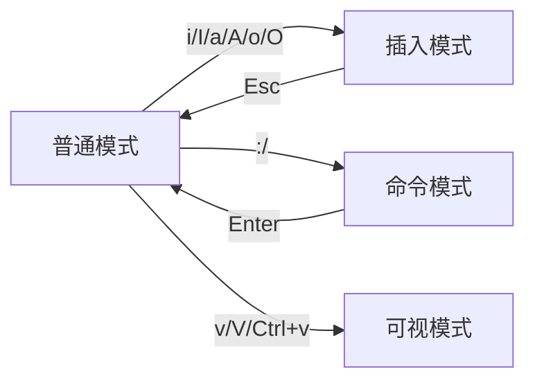

# 11. Linux文本编辑器

## 常用编辑器对比
| 编辑器      | 优点                          | 缺点                          | 适用场景               |
|-------------|-------------------------------|-------------------------------|-----------------------|
| **Vim**     | 高度可定制、高效键盘操作        | 学习曲线陡峭                  | 开发/系统运维          |
| **Emacs**   | 功能强大（可扩展为IDE）         | 内存占用高、快捷键复杂          | 编程/文档处理          |
| **Nano**    | 操作简单、新手友好              | 功能有限、不支持高级编辑        | 快速简单编辑           |
| **VS Code** | 图形化界面、插件生态丰富        | 依赖图形环境、资源消耗较大      | 跨平台开发             |

---

## 11.1 Vi/Vim编辑器安装
### 不同发行版安装命令
```bash
# Ubuntu/Debian
sudo apt install vim

# CentOS/RHEL
sudo yum install vim-enhanced

# Arch Linux
sudo pacman -S vim

# 验证安装
vim --version | head -1
```

---

## 11.2 Vi/Vim编辑器使用

```{warning}
使用vim编辑文本的时候，输入法务必切换为英文输入法，否则无法输入。
```

### 11.2.1 打开文件
```bash
vim filename.txt          # 打开文件（不存在则新建）
vim +10 filename.txt     # 打开并跳转到第10行
vim -O2 file1 file2      # 分屏打开两个文件
```

### 11.2.2 编辑文本
#### 插入模式操作
| 快捷键   | 功能                      |
|----------|--------------------------|
| `i`      | 光标前插入                |
| `a`      | 光标后插入                |
| `o`      | 下方新行插入              |
| `O`      | 上方新行插入              |

#### 文本编辑命令
```vim
dd    删除当前行
5dd   删除5行
yy    复制当前行
p     粘贴
u     撤销操作
Ctrl+r 重做操作
```

### 11.2.3 保存和退出
| 命令        | 操作说明                  |
|-------------|--------------------------|
| `:w`        | 保存文件                 |
| `:wq`       | 保存并退出               |
| `:q!`       | 强制退出不保存           |
| `:w newfile`| 另存为新文件             |

### 11.2.4 模式切换


#### 模式切换技巧
1. **快速返回普通模式**：  
   `Ctrl+[` 等效于 `Esc`
2. **临时执行命令**：  
   普通模式下按 `:!ls` 执行Shell命令
3. **批量插入**：  
   `Ctrl+v`进入块选择模式 → 选中区域 → `I`输入内容 → `Esc`

---

## 综合案例演示
```bash
# 步骤1：创建并编辑文件
vim demo.txt

# 步骤2：进入插入模式（按i）
Hello World!
This is Vim tutorial.

# 步骤3：返回普通模式（按Esc）
# 步骤4：保存退出（输入:wq）
```

## 总结
### Vim核心优势
1. **纯键盘操作**：手指无需离开主键盘区
2. **高效移动**：`w`（按词跳转）、`gg/G`（文件首尾）
3. **宏录制**：`qa`开始录制 → 操作 → `q`停止，`@a`重复

### 学习建议
1. 通过`vimtutor`完成交互教程（终端直接输入命令）
2. 配置`~/.vimrc`文件实现个性化设置
3. 安装插件管理器（如Vundle）扩展功能

附：Vim极简配置示例
```vimrc
" ~/.vimrc
set number        " 显示行号
syntax on         " 启用语法高亮
set tabstop=4     " Tab显示为4空格
set mouse=a       " 启用鼠标支持
```

**文档版本控制**  
`Rev 1.0.0 | 最后更新：2025-02-26 | 适用硬件版本：RK平台系列产品`

**版权声明**  
© 2025 福州牛新牛科技有限公司. 保留所有权利。