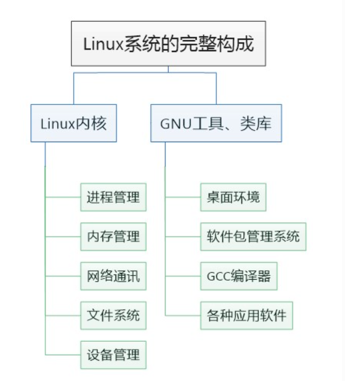
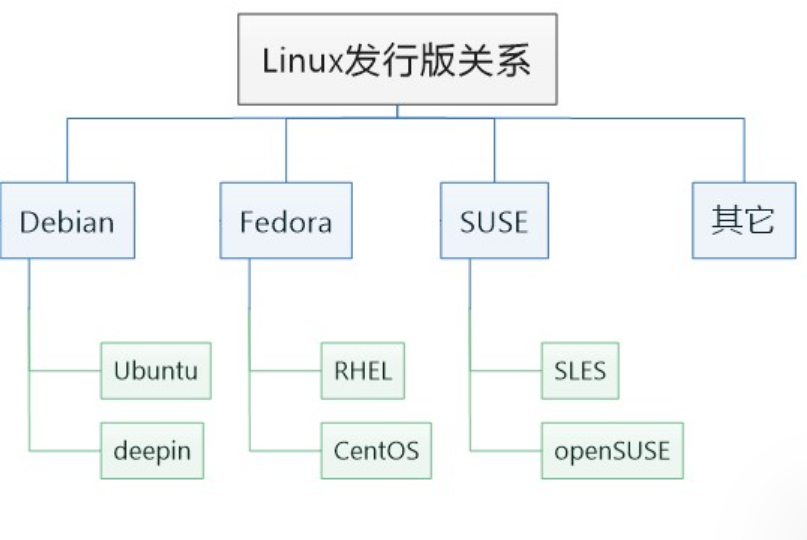

# 3. Linux操作系统概述

## 1.1 基本定义  
Linux​ 是一套开源操作系统，其核心是名为Linux内核的底层软件。操作系统通过分层架构管理计算机硬件（如CPU、内存、外设），并为用户程序提供运行环境。其设计遵循模块化原则，允许开发者根据需求自由裁剪功能，小到智能手表、大到超级计算机均可适配。  

## 1.2 Linux内核与发行版  
当我们说Linux系统时，其含义往往是指采用Linux内核的操作系统。Linux内核负责控制硬件、 管理文件系统、进程管理、网络通讯等，但它本身并没有给用户提供必要的工具和应用软件。Linux发行版在此基础上提供了用户友好的图形界面和预装软件，极大降低了使用门槛。完整的Linux系统就如同汽车， Linux内核构成了最为关键的引擎，不同的发行版就类似使用相同引擎的不同车型。


因为大家实际使用场景不一致，而且对性能要求也不一样，所以Linux发行版有很多种。常见的有Debian、Ubuntu、Fedora、CentOS等。每种发行版都有自己的特点，比如Ubuntu侧重桌面用户，而CentOS则更适合服务器环境。  各类常见Linux发行版的对比可以参考下面的表格：
| 发行版        | 适用场景                  | 包管理工具    | 默认桌面环境   | 发布周期       | 内核更新策略   | 硬件要求       | 社区支持       |
|---------------|--------------------------|---------------|----------------|----------------|----------------|----------------|----------------|
| **Ubuntu**    | 桌面/服务器/开发         | APT (DEB)     | GNOME          | 6个月(LTS 2年) | 保守更新       | 双核CPU/2GB RAM| Canonical商业  |
| **Debian**    | 服务器/嵌入式基础        | APT (DEB)     | 无默认         | 约2年          | 极度保守       | 单核CPU/512MB  | 纯社区         |
| **Fedora**    | 开发者/新技术验证        | DNF (RPM)     | GNOME          | 6个月          | 激进更新       | 双核CPU/4GB RAM| Red Hat支持    |
| **CentOS**    | 企业服务器               | YUM (RPM)     | 无默认         | 停止维护       | 安全更新       | 双核CPU/2GB RAM| Red Hat下游    |
| **Arch**      | 极客/定制化             | pacman (AUR)  | 无默认         | 滚动更新       | 最新内核       | 双核CPU/1GB RAM| 社区Wiki驱动   |
| **openSUSE**  | 企业桌面/服务器          | Zypper (RPM)  | KDE            | 8个月          | Leap版保守     | 双核CPU/2GB RAM| SUSE商业支持   |
| **Alpine**    | 容器/嵌入式             | APK (APK)     | 无GUI          | 滚动更新       | 定制内核       | 单核CPU/128MB  | 轻量级社区     |
| **Yocto**     | 嵌入式系统定制           | 元数据构建     | 无默认         | 定制化发布     | 完全定制       | 依目标设备     | 开源协作       |

```{note}
**关键差异说明：**
1. **软件包格式**：
   - DEB系（Ubuntu/Debian）：依赖处理更严格，适合稳定部署
   - RPM系（Fedora/CentOS）：企业级软件兼容性更好
   - APK（Alpine）：最小化依赖，适合容器化

2. **内核策略**：
   - 保守型（Debian/CentOS）：长期支持内核，适合生产环境
   - 激进型（Fedora/Arch）：快速跟进最新内核特性

3. **嵌入式适配**：
   - Yocto：提供完整构建系统，支持自定义文件系统
   - Alpine：musl libc + 精简设计，容器镜像<5MB

4. **企业支持**：
   - RHEL系（CentOS/Fedora）：获得Red Hat商业支持
   - Ubuntu LTS：提供5年安全更新

### 典型应用场景推荐：
- **工业控制**：Yocto定制镜像 + Debian基础库
- **云服务器**：Ubuntu LTS / CentOS Stream
- **开发学习**：Fedora（前沿技术） / Ubuntu（生态丰富）
- **旧硬件复用**：Lubuntu（LXQt桌面） / Alpine

建议根据**硬件资源**、**维护周期需求**和**软件生态兼容性**三个维度进行选择，需要快速验证并且产品功能复杂需要迭代的产品的选用成熟的发行版Debian/Ubuntu系统，功能单一并且不用怎么修改的嵌入式开发优先考虑Yocto或Buildroot定制方案。
```

另外我们需要了解，不同Linux发行版之间也有一些派生关系，比如基于Debian的发行版有Ubuntu、Linux Mint等，而基于Red Hat的则有CentOS和Fedora。这种派生关系类似于生物学中的物种进化，每种发行版都继承了前者的特性并在此基础上发展出新的功能。  


## 1.3 国产Linux操作系统 
由于军政系统对信息安全要求严格，我国基于Linux内核构建了银河麒麟KylinOS（基于Ubuntu）、统信UOS（基于Ubuntu）、欧拉OpenEulerOS（基于CentOS）等发行版， 其特色主要在于自主研发、风险可控。

以下是国产主流Linux操作系统的对比表格，包含技术特性、适用场景和核心优势：
| 操作系统               | 开发公司             | 基于发行版      | 发布时间 | 核心特点                                                                 | 适用场景                  | 软件生态     | 硬件兼容性   |
|------------------------|----------------------|-----------------|----------|----------------------------------------------|---------------------------|---------------------------------|------------|
| **统信UOS**            | 统信软件             | Deepin          | 2019     | 自主研发桌面环境（DDE），Windows兼容模式 | 政企办公/金融/教育        | 原生应用+Windows兼容层          | 龙芯/鲲鹏/飞腾/兆芯      |
| **银河麒麟**           | 中国电子(CEC)        | Ubuntu/CentOS   | 2002     | 军B+级安全认证，可信计算3.0              | 国防/政府/关键基础设施    | 国家政务应用商店                 | 申威/海光/鲲鹏           |
| **中标麒麟**           | 中标软件             | Fedora          | 2010     | 等保四级认证，支持国产密码算法            | 能源/交通/金融            | 行业定制软件包                   | 龙芯/飞腾/兆芯           |
| **OpenEuler**          | 华为                 | RHEL            | 2019     | 支持ARM/x86/鲲鹏多架构，混合部署能力     | 云计算/大数据中心         | openEuler社区仓库               | 鲲鹏/昇腾/海光           |
| **Alibaba Cloud Linux**| 阿里云               | CentOS          | 2017     | 深度集成阿里云服务，容器优化             | 云原生/企业上云           | 云市场应用镜像                   | 弹性裸金属服务器         |
| **Linx**               | 中科方德             | Debian          | 2018     | 实时性优化（响应延迟<50μs）              | 工业控制/智能制造          | 工业协议库（Modbus/OPC UA）     | 国产PLC/工控机           |
| **红旗Linux**          | 中科红旗             | RHEL            | 1999     | 支持国产数据库（达梦/人大金仓）           | 政府/央企信息化            | 国家电子公文系统                 | 龙芯/飞腾               |
| **新支点OS**           | 广东新支点           | Debian          | 2004     | 微内核设计（安全等级EAL4+）               | 轨道交通/电力调度          | 工业实时数据库                   | 国产RTU/SCADA设备        |

```{note}
**常用统信UOS、银河麒麟KylinOS、华为OpenEuler核心技术指标对比：**
| 特性                | 统信UOS       | 银河麒麟       | OpenEuler     |
|---------------------|---------------|----------------|---------------|
| **国产化率**        | 90%+          | 95%+           | 85%           |
| **内核版本**        | 5.10 LTS      | 4.19.90        | 5.15 LTS      |
| **安全认证**        | 等保2.0三级   | 军B+级         | CC EAL4+      |
| **应用兼容性**      | 支持Wine/安卓 | 仅原生应用      | 云原生应用     |
| **更新策略**        | 5年LTS        | 10年支持周期   | 2年发布周期    |

**典型应用案例：**
1. **政务领域**：统信UOS在全国30+省市机关部署超500万终端
2. **金融行业**：银河麒麟支撑央行数字货币（DC/EP）试点系统
3. **工业控制**：Linx在高铁信号控制系统实现100%国产化替代
4. **云计算**：OpenEuler成为全球首个装机量破百万的服务器国产OS

**发展现状：**
- **生态适配**：统信UOS已适配40万+软硬件（2023年数据）
- **技术突破**：银河麒麟V10实现异构算力统一调度（CPU+GPU+NPU）
- **国际影响**：OpenEuler社区贡献者来自70+国家，全球下载量超300万

（注：数据截至2023年Q3，部分指标可能随版本更新变化）
```

## 1.4 发展沿革  
- **创始阶段**（1991年）：Linus Torvalds发布首个x86架构内核原型  
- **生态融合**（1992年）：与GNU项目的工具链（GCC/Bash）结合形成完整操作系统  
- **开源演进**：采用**GPLv2协议**，全球开发者协同贡献代码  

## 1.5 核心特性  
| 特性                | 技术内涵                                                                 |  
|---------------------|--------------------------------------------------------------------------|  
| **开源可定制**       | 源码开放，支持从嵌入式设备到超级计算机的跨平台移植                          |  
| **多用户多任务**     | 支持数千用户并发访问，采用CFS调度算法实现公平进程管理                       |  
| **高稳定性**         | 内核态与用户态隔离机制（MMU保护），平均无故障时间（MTBF）达数万小时         |  
| **模块化架构**       | 动态加载内核模块（.ko文件），支持运行时扩展功能                            |  

## 1.6 应用领域  
- **嵌入式系统**：智能终端、工控设备（占市场份额68%）  
- **服务器领域**：驱动全球79%的Web服务器（Netcraft统计）  
- **超级计算**：TOP500超算中95%采用Linux系统  
- **云计算平台**：OpenStack/Kubernetes等基础设施的核心载体  
- **桌面环境**：Ubuntu/Fedora等发行版提供图形化操作界面  

## 1.7 本章小结  
Linux凭借其开放性、稳定性和可扩展性，已成为现代计算生态的基础设施。对于嵌入式开发者而言，深入理解Linux系统机制是构建智能设备的必备技能，后续章节将逐步展开其技术实现细节。  

**文档版本控制**  
`Rev 1.0.0 | 最后更新：2025-02-26 | 适用硬件版本：RK平台系列产品`

**版权声明**  
本手册版权所有©2025 福州牛新牛科技有限公司，未经许可不得复制或分发。


