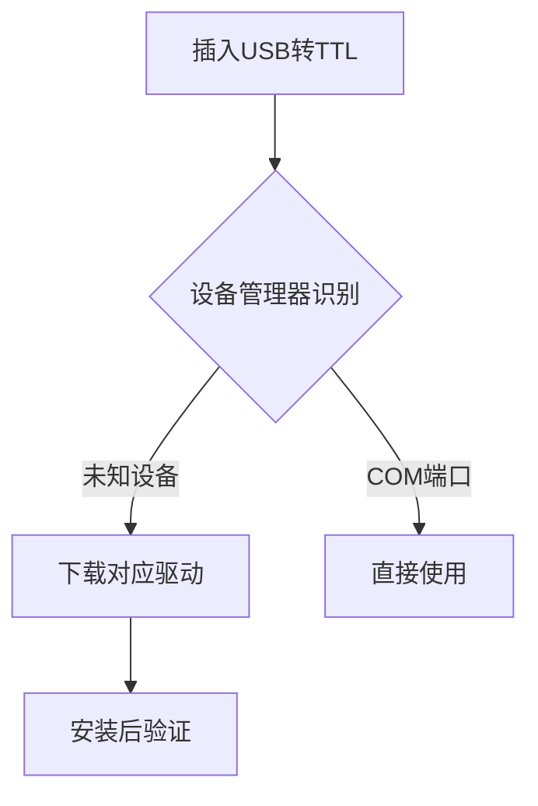
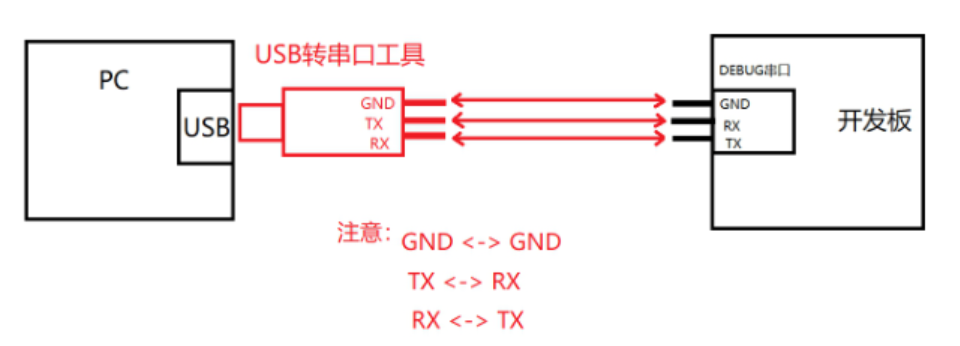
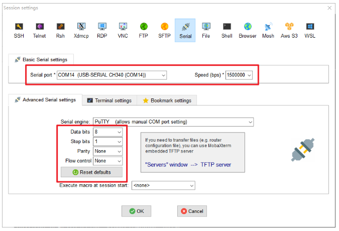
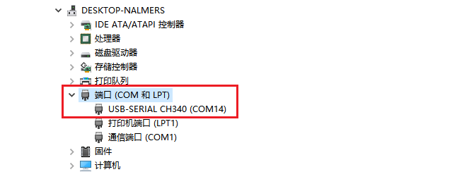
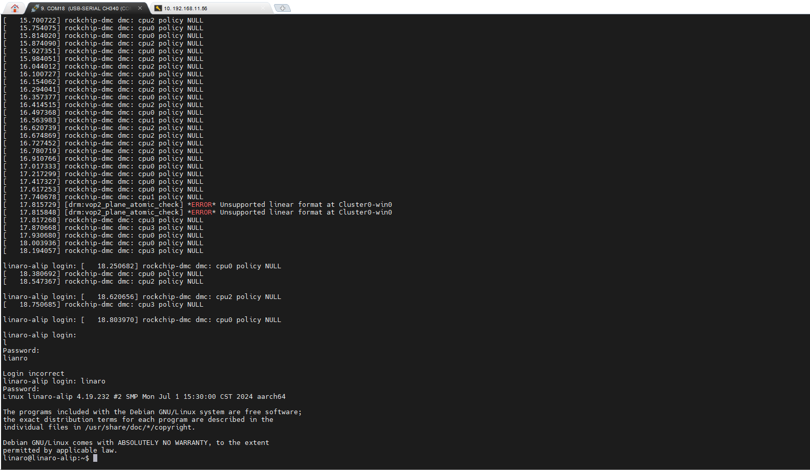

# 5. 通过串口访问终端

本文主要介绍如何通过串口访问终端设备，并进行DEBUG串口调试！

## 5.1 软件安装

请确保你的电脑已安装串口小板对应的串口驱动（推荐`CH340`）和串口调试终端软件（推荐`MobaXterm`），如未安装以上软件，请按照如下步骤安装串口驱动及串口调试终端软件。

### 5.1.1 安装CH340串口驱动（Windows系统）

**1) 下载驱动**  
   访问芯片厂商官网驱动下载链接（点击访问）：<a href="https://www.wch.cn/downloads/CH341SER_EXE.html" target="_blank" rel="noopener noreferrer">下载CH340驱动</a>，下载适用于Windows的驱动压缩包。

**2) 解压文件**  
   将下载的压缩包解压至本地文件夹（右键点击压缩包选择“解压到当前文件夹”）。

**3) 连接设备**  
   使用USB线将开发板或串口设备连接到电脑，确保设备通电。

**4) 手动安装驱动**  
```
a 右键点击 **开始菜单** → 选择 **设备管理器**。  
b 在“其他设备”中找到带有黄色叹号的 **USB2.0-Serial** 设备。  
c 右键选择 **更新驱动程序** → **浏览我的电脑以查找驱动程序** → 指向解压后的驱动文件夹，点击“下一步”完成安装。
```

**5) 验证安装**  
   安装成功后，在设备管理器的 **端口（COM和LPT）** 列表中会显示新的COM端口（如“CH340”或“USB-SERIAL CH340”），无感叹号即表示成功。

```{warning}
- 若安装失败，尝试更换USB接口或重启电脑。  
- 部分系统需关闭驱动强制签名（搜索“禁用驱动程序强制签名”按指引操作）。 
```

### 5.1.2 安装MobaXterm

**MobaXterm**​ 是一款专为Windows系统设计的多功能远程计算工具，集成了终端、网络工具和远程连接功能于一体，旨在简化开发、运维及网络管理任务。
点击下载：<a href="https://mobaxterm.mobatek.net/download.html" target="_blank" rel="noopener noreferrer">下载MobaXterm</a>


## 5.2 设备连线

请按照如下接线方式将**串口小板**连接到设备的DEBUG调试串口：

| 串口小板接口 | 开发板DEBUG调试接口 | 信号类型 | 电压范围 |
|----------|------------|----------|----------|
| RX       | DEBUG-TX        | 数据接收 | 0-3.3V   |
| TX       | DEBUG-RX        | 数据发送 | 0-3.3V   |
| GND      | GND        | 参考地   | 0V       |



```{warning}
严禁带电插拔！操作前必须佩戴防静电手环，接触PCB前先触摸接地金属释放静电！
```
```{note}
**DBUEG调试串口**

DEBUG调试串口是一种起到系统调试、日志查看、uboot/kernel交互等开发工具，物理接口为包含`RX TX GND`三根信号线的UART串口。
NNEWN出品的产品均带有DEBUG调试串口，并且除特别注明外，DEBUG串口均具有如下特性：
- 接口类型：UART
- 接口电平：3.3V
- 波特率：1500000
- 数据位： 8位
- 停止位： 1位
- 校验位： 无（None）
- 流控： 无（Nnoe）
```
```{note}
**串口小板**

所谓**串口小板**就是一种可以将`UART-TTL信号`转换成`USB信号`从而让上位机（开发用Windows电脑）可以和下位机（主板或者终端设备）进行通讯的主板。

以下是常见USB转串口方案的对比表格：

| 芯片型号 | 最大波特率 | 优点 | 缺点 | 
|----------|------------|------|------|
| **CH340** | 2Mbps | 成本最低，供货稳定，驱动完善 | 无流控，高波特率误差大  | 
| **CP2102** | 1Mbps | 免驱支持macOS，工业级稳定性 | 价格较高，功能固定 | 
| **FT232RL** | 3Mbps | 超低延迟，可编程IO | 价格昂贵，假货多 | 

用户可以根据自己的实际需求进行选择。针对DEBUG应用场景，因为波特率要求为1.5M，因此排除CP2102，综合考虑价格供应，我司常用方案为CH340。
```

## 5.3 打开并配置MobaXterm
打开MobaXterm 软件，点击图标 sessions 即可弹出 session setting，选择 Serial。我们选择正确的串口，设置波特率为 1500000，关闭流控，具体设置如下图所示：

```{note}
**Serial port 串口编号可以通过如下方式查看：**

a 用电脑连接串口小板

b 打开电脑的设备管理然后查看端口编号，例如下图为串口编号为：COM14


```
**设置完毕后，点击OK，即可连接到串口，然后设备开机，即可进行串口调试！**



**文档版本控制**  
`Rev 1.0.0 | 最后更新：2025-02-26 | 适用硬件版本：RK平台系列产品`

**版权声明**  
© 2025 福州牛新牛科技有限公司. 保留所有权利。

