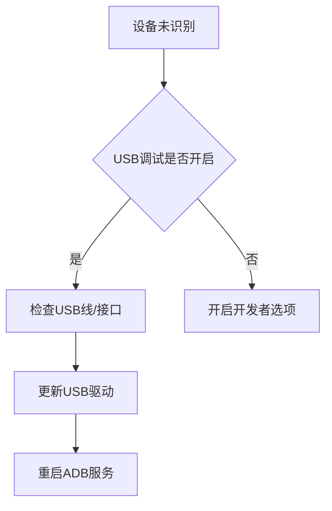

# 7. 通过ADB访问终端

## 7.1 前言
### 为什么要通过ADB访问终端
ADB（Android Debug Bridge）是开发者与Android/Linux设备交互的核心工具，主要应用于：
- **应用调试**：实时查看系统日志与崩溃信息
- **文件传输**：跨设备快速传输APK/配置文件
- **系统级操作**：刷机、修改系统分区、性能调优
- **自动化测试**：与UI Automator/Appium集成

### 什么是ADB工具
ADB是Android SDK中的命令行工具，包含三个核心组件：
1. **客户端**（adb命令）：运行在开发机的终端工具
2. **守护进程**（adbd）：运行在目标设备的后台服务
3. **服务端**（ADB Server）：管理客户端与设备的通信

---

## 7.2 ADB工具下载与安装
### Windows
1. 下载[Android SDK Platform Tools](https://developer.android.com/studio/releases/platform-tools)
2. 解压zip包至`C:\platform-tools`
3. 添加环境变量：
   ```powershell
   [Environment]::SetEnvironmentVariable("Path", "$env:Path;C:\platform-tools", "User")
   ```

### Linux
```bash
# Ubuntu/Debian
sudo apt install android-tools-adb

# CentOS/RHEL
sudo yum install android-tools

# 添加用户组
sudo usermod -aG plugdev $USER
```

### MacOS
```bash
# Homebrew安装
brew install android-platform-tools

# 或手动下载
curl -O https://dl.google.com/android/repository/platform-tools-latest-darwin.zip
unzip platform-tools-latest-darwin.zip -d ~/Library/Android/
```

### 验证ADB是否安装成功
```bash
adb version
# 输出示例：Android Debug Bridge version 1.0.41
```

---

## 7.3 连接设备
### 开启开发者模式
1. **Android设备**：设置 → 关于手机 → 连续点击"版本号"7次
2. **Linux设备**：
   ```bash
   sudo systemctl start adbd  # 启动ADB服务
   sudo systemctl enable adbd  # 设置开机自启
   ```

### 通过USB连接设备
1. **接线**：使用原装USB线连接设备与电脑
2. **查看设备**：
   ```bash
   adb devices
   # 输出示例：5200ad1d45d58f3d	device
   ```
3. **授权弹窗**：设备端需确认"允许USB调试"
4. **退出连接**：
   ```bash
   adb kill-server  # 终止所有连接
   ```

### 通过网络连接设备
1. **初始USB连接**：
   ```bash
   adb tcpip 5555  # 启用TCP端口
   adb connect 192.168.1.5:5555
   ```
2. **纯无线连接**（需root权限）：
   ```bash
   adb shell setprop persist.adb.tcp.port 5555
   adb reboot
   ```
3. **断开连接**：
   ```bash
   adb disconnect 192.168.1.5:5555
   ```

---

## 7.4 常用ADB命令
### 查看帮助
```bash
adb --help       # 查看全局帮助
adb shell help   # 查看shell子命令
```

### adb shell
```bash
adb shell "ls /sdcard"          # 执行单条命令
adb shell                        # 进入交互式终端
exit                             # 退出shell
```

### adb install
```bash
adb install app-debug.apk              # 普通安装
adb install -t -r app-debug.apk        # 覆盖安装
adb install --abi armeabi-v7a app.apk  # 指定CPU架构
```

### adb push/pull
```bash
adb push local.txt /sdcard/          # 上传文件
adb pull /sdcard/remote.txt ~/       # 下载文件
```

### 高级操作
```bash
adb logcat -v time | grep "E/AndroidRuntime"  # 过滤崩溃日志
adb reboot recovery                            # 进入恢复模式
adb shell screencap -p /sdcard/screen.png     # 屏幕截图
adb shell input tap 100 200                   # 模拟触控点击
```

---

## 7.5 总结
### 连接方式对比
| 连接类型 | 速度     | 稳定性 | 适用场景           |
|----------|----------|--------|--------------------|
| USB      | 480Mbps | 高     | 刷机/大数据传输    |
| 无线     | 150Mbps | 中     | 远程调试/多设备    |

### 安全建议
1. 生产环境禁用`adb root`权限
2. 定期检查已授权设备列表：`adb devices -l`
3. 关闭未使用的ADB端口：`adb shell setprop service.adb.tcp.port -1`

### 故障排查流程


附：ADB命令速查表
```bash
# 查看设备信息
adb shell getprop ro.product.model

# 清除应用数据
adb shell pm clear com.example.app

# 屏幕录像（30秒）
adb shell screenrecord --time-limit 30 /sdcard/demo.mp4
```


**文档版本控制**  
`Rev 1.0.0 | 最后更新：2025-02-26 | 适用硬件版本：RK平台系列产品`

**版权声明**  
© 2025 福州牛新牛科技有限公司. 保留所有权利。