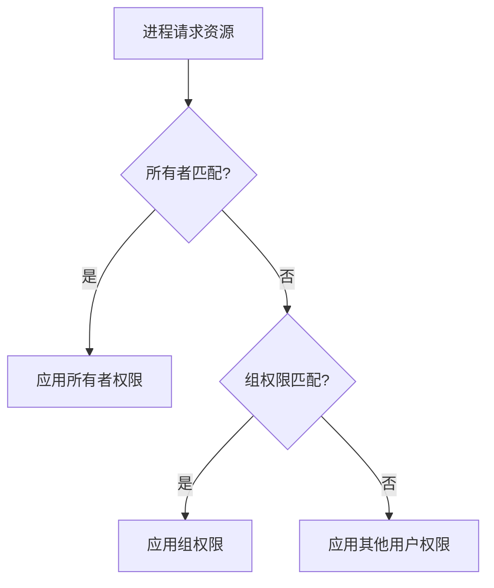

# 9. 用户与文件

## 9.1 前言
Linux作为多用户操作系统，其核心设计包含两大支柱：
- **用户体系**：实现资源隔离与权限控制
- **文件系统**：贯彻"一切皆文件"的设计哲学

本章将解析用户与文件的关联机制，以及其在系统安全中的关键作用。

---

## 9.2 用户
### 9.2.1 用户体系架构
| 概念          | 存储位置          | 技术说明                     |
|---------------|-------------------|----------------------------|
| 用户账户      | /etc/passwd       | 记录用户名/UID/主目录等信息 |
| 用户密码      | /etc/shadow       | 加密存储密码哈希值          |
| 用户组        | /etc/group        | 定义GID及组成员关系         |

### 9.2.2 核心管理命令
```bash
# 创建用户
sudo useradd -m -s /bin/bash dev_user  # -m创建主目录

# 修改密码
passwd dev_user  # 交互式设置新密码

# 权限提升
su - root        # 切换root用户
sudo apt update  # 临时获取root权限

# 删除用户
userdel -r test_user  # -r删除主目录
```

### 9.2.3 权限验证流程


---

## 9.3 文件
### 9.3.1 "一切皆文件"实践
| 文件类型        | 路径示例            | 访问方式          |
|-----------------|---------------------|------------------|
| 普通文件        | /home/user/file.txt | cat/vi等文本工具 |
| 设备文件        | /dev/sda1           | dd命令读写       |
| 进程信息        | /proc/1/status      | cat查看进程状态  |
| 网络套接字      | /var/run/docker.sock | API通信         |

### 9.3.2 文件权限模型
**权限符号解析**：
```
-rwxr-xr-- 1 user group 4096 Jan 1 10:00 demo.sh
↑┬┬┬┬┬┬┬   ↑    ↑      ↑     ↑        ↑
 │└┴┴┴┴┴┴ 链接数 所属用户 大小 修改时间 文件名
 └─权限位(r=4,w=2,x=1)
```

**权限修改示例**：
```bash
chmod 755 script.sh    # 所有者rwx，其他用户rx
chown user:group file  # 修改所属用户和组
```

### 9.3.3 特殊权限位
| 标记 | 数字值 | 作用                      | 典型场景          |
|------|--------|---------------------------|------------------|
| SUID | 4      | 以文件所有者身份运行       | /usr/bin/passwd  |
| SGID | 2      | 继承目录的组权限          | 共享目录          |
| Sticky| 1     | 仅所有者可删除文件         | /tmp目录         |

---

## 9.4 总结
### 用户与文件的关系
1. **身份验证**：用户凭据决定文件访问权限
2. **资源隔离**：通过用户/组实现多环境隔离
3. **审计追踪**：结合文件日志追溯操作记录

### 9.4.1 最佳安全实践
1. 遵循最小权限原则（Principle of Least Privilege）
2. 定期审核特殊权限文件：
   ```bash
   find / -perm /4000 -ls  # 查找SUID文件
   find / -perm /2000 -ls  # 查找SGID文件
   ```
3. 重要配置文件设置严格权限：
   ```bash
   chmod 600 /etc/ssh/sshd_config  # 禁止其他用户读取
   ```

### 9.4.2 权限冲突处理
当用户同时属于多个组时，权限按"最大访问原则"生效。建议使用`getfacl`命令查看详细ACL规则：
```bash
getfacl /shared_data
# 输出示例：
# user::rwx
# group::r-x
# group:developers:rwx  # 额外赋予developers组权限
```

附：用户文件资源限额配置
```bash
# 设置用户磁盘配额
setquota -u dev_user 500000 1000000 0 0 /data
```

**文档版本控制**  
`Rev 1.0.0 | 最后更新：2025-02-26 | 适用硬件版本：RK平台系列产品`

**版权声明**  
© 2025 福州牛新牛科技有限公司. 保留所有权利。