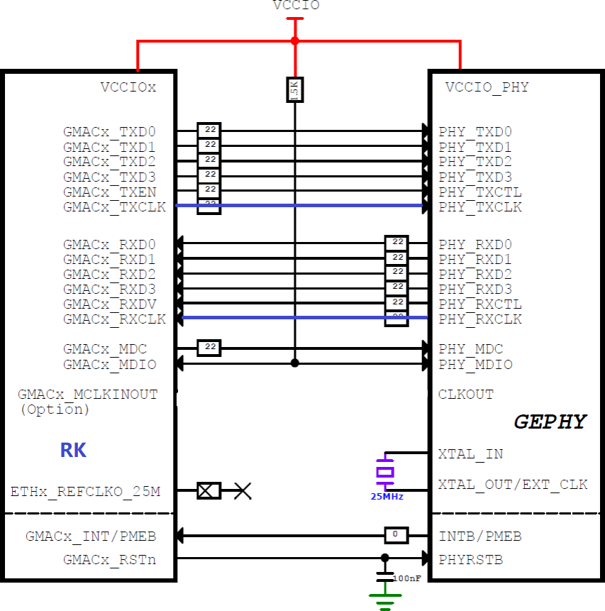
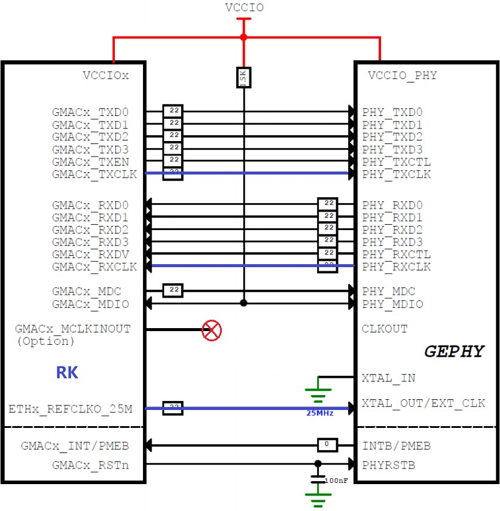
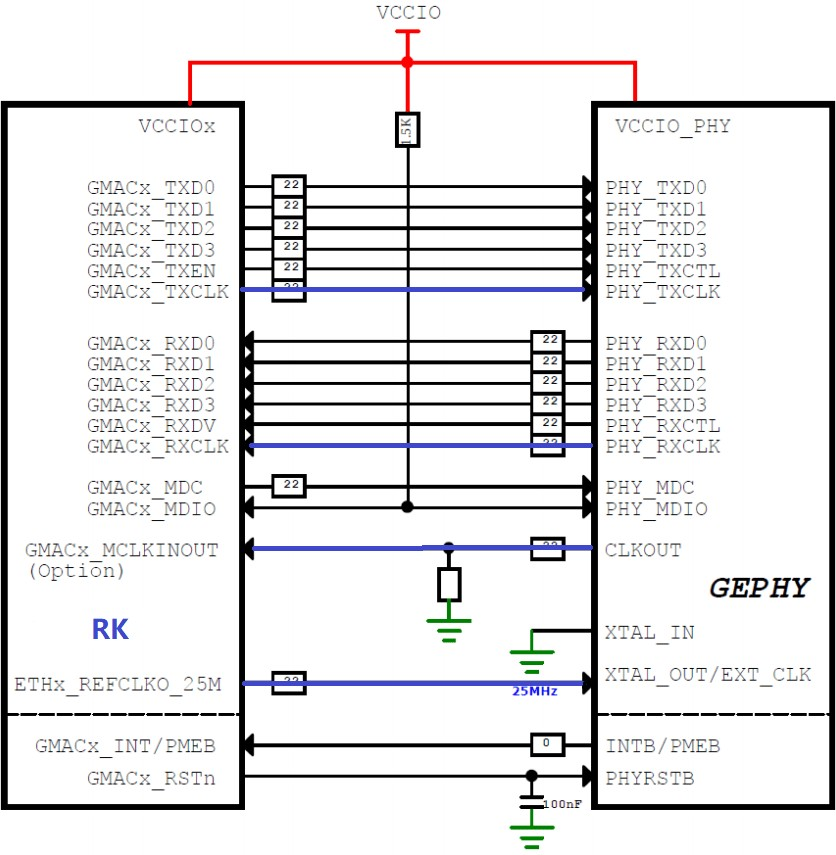
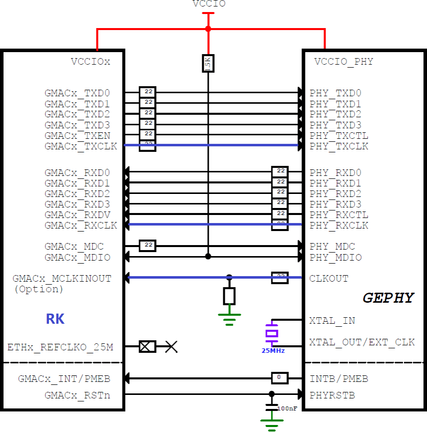
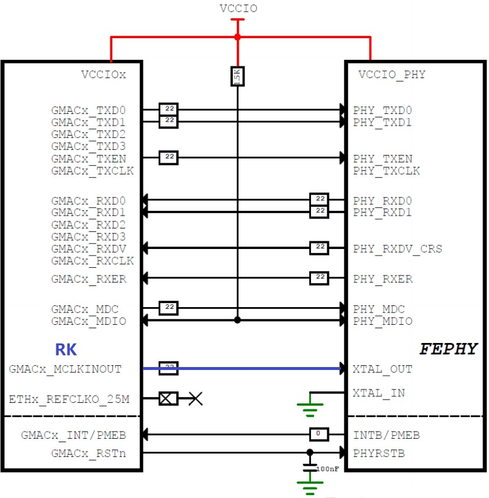
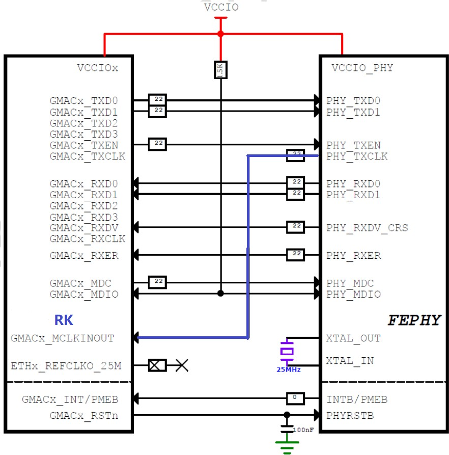

 # **Rockchip Developer Guide Linux GMAC Mode Configuration**


 前言概述

 本文提供 Rockchip 平台以太网 GMAC
 接口不同模式下的配置用例，用于解决以太网配置问题。

 产品版本
| 芯片名称 | 内核版本 |
|--|--|
| ROCKCHIP 芯片 | 所有版本 |

 读者对象

 本文档（本指南）主要适用于以下工程师： 技术支持工程师

 软件开发工程师


 


 RGMII/RMII 主要模式连接图罗列如下：

## 1.**RGMII** 模式

 一般使用主控 PLL 输出 时钟 output 方式，PHY 提供的 125M 时钟作为 input
 方式为备选方案。

### 1.1  **PLL output 125M for TX\_CLK, Crystal 25M for PHY**

 主控 PLL 提供 TXCLK 所需时钟，PHY 25M 时钟由晶振提供。



### 1.2  **PLL output 125M for TX\_CLK, PLL 25M for PHY**

 主控 PLL 提供 TXCLK 所需时钟，PHY 25M 时钟由主控提供。

 

### 1.3  **125M TX\_CLK input from PHY, PLL 25M for PHY**

 TXCLK 所需时钟由 PHY 提供，PHY 25M 时钟由主控提供。

 

### 1.4  **125M TX\_CLK input from PHY, Crystal 25M for PHY**

 TXCLK 所需时钟由 PHY 提供，PHY 25M 时钟由晶振提供。

 

## 2.  **RMII** 模式

###   2.1  RMII Clock Output

 主控提供 RMII 所需时钟

 

## 2.2  **RMII Clock Input**

 PHY 提供 RMII 所需时钟

 

 同样，RMII 模式下，晶振也可以由主控输出 25M 替代。

## 3 模式配置

 不同模式下的配置主要包含了 phy mode，clock 和 pinctrl的配置，这些配置都是关联的，需要同时配置，否则无法工作。以下是各芯片不同模式下，以 SDK 板级 DTS 为例的不同配置方式的参考，关注dts 中 gmac 节点里 \'+\'部分的修改。

### 3.1  **PX30**

#### 3.1.1  **RMII Clock Output**
```dts
&gmac {
    phy-supply = <&vcc_phy>;
+    clock_in_out = "output";
+    assigned-clocks = <&cru SCLK_MAC>;
+    assigned-clock-rates = <50000000>;
    snps,reset-gpio = <&gpio2 13 GPIO_ACTIVE_LOW>;
    snps,reset-active-low;
    snps,reset-delays-us = <0 50000 50000>;
+    pinctrl-names = "default";
+    pinctrl-0 = <&rmii_pins &mac_refclk_12ma>;
    status = "okay";
};

```
#### 3.1.2.  **RMII Clock Input**
```dts
&gmac {
    phy-supply = <&vcc_phy>;
+    clock_in_out = "input";
+    assigned-clocks = <&cru SCLK_MAC>;
+    assigned-clock-parents = <&gmac_clkin>;
    snps,reset-gpio = <&gpio2 13 GPIO_ACTIVE_LOW>;
    snps,reset-active-low;
    snps,reset-delays-us = <0 50000 50000>;
+    pinctrl-names = "default";
+    pinctrl-0 = <&rmii_pins &mac_refclk>;
    status = "okay";
}
```
### **3.2 RK1808**

#### 3.2.1.  **RMII Clock Output**：
```dts

&gmac {
    phy-supply = <&vcc_phy>;
+   phy-mode = "rmii";
+   clocks = <&cru SCLK_GMAC>, <&cru SCLK_GMAC_RX_TX>,
+           <&cru SCLK_GMAC_RX_TX>, <&cru SCLK_GMAC_REF>,
+           <&cru SCLK_GMAC_REFOUT>, <&cru ACLK_GMAC>,
+           <&cru PCLK_GMAC>, <&cru SCLK_GMAC_RMII_SPEED>;
+   clock-names = "stmmaceth", "mac_clk_rx",
+                "mac_clk_tx", "clk_mac_ref",
+                "clk_mac_refout", "aclk_mac",
+                "pclk_mac", "clk_mac_speed";
+   assigned-clocks = <&cru SCLK_GMAC_RX_TX>;
+   assigned-clock-parents = <&cru SCLK_GMAC_RMII_SPEED>;
    snps,reset-gpio = <&gpio0 10 GPIO_ACTIVE_LOW>;
    snps,reset-active-low;
    snps,reset-delays-us = <0 50000 50000>;
+   pinctrl-names = "default";
+   pinctrl-0 = <&rmii_pins>;
    status = "okay";
}
```

#### 3.2.2.  **RMII Clock Input**`
```dts
+&gmac_clkin {
+    clock-frequency = <50000000>;
+}
&gmac {
    phy-supply = <&vcc_phy>;
+   phy-mode = "rmii";
+   clock_in_out = "input";
+   clocks = <&cru SCLK_GMAC>, <&cru SCLK_GMAC_RX_TX>,
+            <&cru SCLK_GMAC_RX_TX>, <&cru SCLK_GMAC_REF>,
+           <&cru SCLK_GMAC_REFOUT>, <&cru ACLK_GMAC>,
+            <&cru PCLK_GMAC>, <&cru SCLK_GMAC_RMII_SPEED>;
+   clock-names = "stmmaceth", "mac_clk_rx",
+                "mac_clk_tx", "clk_mac_ref",
+                "clk_mac_refout", "aclk_mac",
+                "pclk_mac", "clk_mac_speed";
+   assigned-clocks = <&cru SCLK_GMAC_RX_TX>, <&cru SCLK_GMAC>;
+   assigned-clock-parents = <&cru SCLK_GMAC_RMII_SPEED>, <&gmac_clkin>;
    snps,reset-gpio = <&gpio0 10 GPIO_ACTIVE_LOW>;
    snps,reset-active-low;
    snps,reset-delays-us = <0 50000 50000>;
+   pinctrl-names = "default";
+   pinctrl-0 = <&rmii_pins>;
    status = "okay";
}
```

#### 3.2.3  **RGMII Clock Output**
```dts
&gmac {
    phy-supply = <&vcc_Phy>;
+     phy-mode = "rgmii";
+     clock_in_out = "output";
+     assigned-clocks = <&cru SCLK_MAC>;
+     assigned-clock-rates = <125000000>;
    snps,reset-gpio = <&gpio0 10 GPIO_ACTIVE_LOW>;
    snps,reset-active-low;
    /* Reset time is 20ms, 100ms for rtl8211f */
    snps,reset-delays-us = <0 20000 100000>;
    tx_delay = <0x50>;
    rx_delay = <0x3a>;
    status = "okay";
}
```
#### 3.2.4.  **RGMII Clock Input**
```dts
&gmac {
+   phy-mode = "rgmii";
+   clock_in_out = "Output";

    snps,reset-gpio = <&gpio3 RK_PA0 GPIO_ACTIVE_LOW>;
    snps,reset-active-low;
    /* Reset time is 20ms, 100ms for rtl8211f */
    snps,reset-delays-us = <0 20000 100000>;

+   assigned-clocks = <&cru CLK_GMAC_SRC>, <&cru CLK_GMAC_TX_RX>, <&cru CLK_GMAC_ETHERNET_OUT>;
+   assigned-clock-parents = <&cru CLK_GMAC_SRC_M0>, <&cru RGMII_MODE_CLK>;
+   assigned-clock-rates = <125000000>, <0>, <25000000>;

+   pinctrl-names = "default";
+   pinctrl-0 = <&rgmii0_miim &rgmii0_bus2 &rgmii0_bus4 &clkm0_out_ethernet>;

    tx_delay = <0x2a>;
    rx_delay = <0x1a>;

    phy-handle = <&phy>;
    status = "okay";
};

&mdio {
    phy: phy@0 {
        compatible = "ethernet-phy-ieee802.3-c22";
        reg = <0x0>;
+       clocks = <&cru CLK_GMAC_ETHERNET_OUT>;
    };
};
```

### **3.3 RK3128**

#### 3.3.1.  **RMII Clock Output**
```dts
&gmac {
    assigned-clocks = <&cru SCLK_MAC_SRC>;
+     assigned-clock-rates = <50000000>;
+     clock_in_out = "output";
+     pinctrl-names = "default";
+     pinctrl-0 = <&rmii_pins>;
    phy-supply = <&vcc_phy>;
+     phy-mode = "rmii";
    snps,reset-active-low;
    snps,reset-delays-us = <0 10000 50000>;
    snps,reset-gpio = <&gpio2 24 GPIO_ACTIVE_LOW>;
    status = "okay";
};
```


#### 3.3.2 **RMII Clock Input**
```dts
+&clkin_gmac {
+       clock-frequency = <50000000>;
+};

&gmac {
+       assigned-clocks = <&cru SCLK_MAC>;
+       assigned-clock-parents = <&clkin_gmac>;
+       clock_in_out = "input";
+       pinctrl-names = "default";
+       pinctrl-0 = <&rmii_pins>;
        phy-supply = <&vcc_phy>;
+       phy-mode = "rmii";
        snps,reset-active-low;

        snps,reset-delays-us = <0 10000 50000>;
        snps,reset-gpio = <&gpio2 24 GPIO_ACTIVE_LOW>;
        status = "okay";
};
```

#### 3.3.3  **RGMII Clock Input**
```dts
&gmac {
    +       assigned-clocks = <&cru SCLK_MAC>;
    +       assigned-clock-parents = <&clkin_gmac>;
    +       clock_in_out = "input";
    +       pinctrl-names = "default";
    +       pinctrl-0 = <&rgmii_pins>;
    phy-supply = <&vcc_phy>;
    +       phy-mode = "rgmii";
    snps,reset-active-low;
    snps,reset-delays-us = <0 20000 100000>;
    snps,reset-gpio = <&gpio2 24 GPIO_ACTIVE_LOW>;
    tx_delay = <0x30>;
    rx_delay = <0x16>;
    status = "okay";
};
```

###  3.4 RK3228

#### 3.4.1 RMII Clock Output 
```dts
&gmac {
    assigned-clocks = <&cru SCLK_MAC_EXTCLK>, <&cru SCLK_MAC>;
+       assigned-clock-parents = <&ext_gmac>, <&cru SCLK_MAC_EXTCLK>;
+       assigned-clock-rates = <0>, <50000000>;
+       clock_in_out = "output";
    phy-supply = <&vcc_phy>;
+       phy-mode = "rmii";
    pinctrl-names = "default";
    pinctrl-0 = <&rmii_pins>;
    snps,reset-gpio = <&gpio2 RK_PD0 GPIO_ACTIVE_LOW>;
    snps,reset-active-low;
    snps,reset-delays-us = <0 20000 100000>;
    status = "okay";
};
```
#### 3.42 **RMII Clock Input**
```dts
+&ext_gmac: external-gmac-clock {
+       clock-frequency = <50000000>;
+}

&gmac {
    assigned-clocks = <&cru SCLK_MAC_EXTCLK>, <&cru SCLK_MAC>;
+       assigned-clock-parents = <&ext_gmac>, <&cru SCLK_MAC_EXTCLK>;
+       clock_in_out = "input";
    phy-supply = <&vcc_phy>;
+       phy-mode = "rmii";
+       pinctrl-names = "default";
+       pinctrl-0 = <&rmii_pins>;
    snps,reset-gpio = <&gpio2 RK_PD0 GPIO_ACTIVE_LOW>;
    snps,reset-active-low;
    snps,reset-delays-us = <0 20000 100000>;
    status = "okay";
}
```
#### 3.4.3 **RGMII Clock Output**
```dts
&gmac {
    +       assigned-clocks = <&cru SCLK_MAC_EXTCLK>, <&cru SCLK_MAC>;
    +       assigned-clock-parents = <&ext_gmac>, <&cru SCLK_MAC_EXTCLK>;
    +       assigned-clock-rates = <0>, <125000000>;
    +       clock_in_out = "output";
    phy-supply = <&vcc_phy>;
    +       phy-mode = "rgmii";
    +       pinctrl-names = "default";
    +       pinctrl-0 = <&rgmii_pins>;
    snps,reset-gpio = <&gpio2 RK_PD0 GPIO_ACTIVE_LOW>;
    snps,reset-active-low;
    snps,reset-delays-us = <0 20000 100000>;
    tx_delay = <0x30>;
    rx_delay = <0x10>;
    status = "okay";
};
```

#### 3.4.4 **RGMII Clock Input**
```dts
&gmac {
    +       assigned-clocks = <&cru SCLK_MAC_EXTCLK>, <&cru SCLK_MAC>;
    +       assigned-clock-parents = <&ext_gmac>, <&cru SCLK_MAC_EXTCLK>;
    +       clock_in_out = "input";
    phy-supply = <&vcc_phy>;
    +       phy-mode = "rgmii";
    +       pinctrl-names = "default";
    +       pinctrl-0 = <&rgmii_pins>;
    snps,reset-gpio = <&gpio2 RK_PD0 GPIO_ACTIVE_LOW>;
    snps,reset-active-low;
    snps,reset-delays-us = <0 20000 100000>;
    tx_delay = <0x30>;
    rx_delay = <0x10>;
    status = "okay";
};
```

#### 3.4.5 Internal EPHY
```dts
&gmac {
    +       assigned-clocks = <&cru SCLK_MAC_SRC>;
    +       assigned-clock-rates = <5000000>;
    +       clock_in_out = "output";
    phy-supply = <&vcc_phy>;
    +       phy-mode = "rmii";
    phy-handle = <&phy>;
    status = "okay";

    mdio {
            compatible = "snps,dwmac-mdio";
            #address-cells = <1>;
            #size-cells = <0>;

            phy: ethernet-phy@0 {
                    compatible = "ethernet-phy-id1234.d400", "ethernet-phy-ieee802.3-c22";
                    reg = <0>;
                    clocks = <&cru SCLK_MAC_PHY>;
                    resets = <&cru SRST_MACPHY>;
                    phy-is-integrated;
            };
    };
};
```

### **3.5 RK3288**

#### 3.5.1 **RMII Clock Output**
```dts
&gmac {
    phy-supply = <&vcc_phy>;
+       phy-mode = "rmii";
+       clock_in_out = "output";
+       assigned-clocks = <&cru SCLK_MAC>;
+       assigned-clock-rates = <5000000>;
    snps,reset-gpio = <&gpio4 RK_PA7 GPIO_ACTIVE_HIGH>;
    snps,reset-active-low;
    snps,reset-delays-us = <0 20000 1000000>;
+       pinctrl-names = "default";
+       pinctrl-0 = <&rmii_pins>;
    status = "okay";
};
```

#### 3.5.2 **RMII Clock Input**
```dts
+&ext_gmac: external-gmac-clock {
+       clock-frequency = <50000000>;
+}

&gmac {
phy-supply = <&vcc_phy>;
+       phy-mode = "rmii";
+       clock_in_out = "input";
+       assigned-clocks = <&cru SCLK_MAC>;
+       assigned-clock-parents = <&ext_gmac>;
    snps,reset-gpio = <&gpio4 RK_PA7 GPIO_ACTIVE_HIGH>;
    snps,reset-active-low;
    snps,reset-delays-us = <0 20000 100000>;
+       pinctrl-names = "default";
+       pinctrl-0 = <&rmii_pins>;
status = "okay";
}
```

#### 3.5.3  **RGMII Clock Input**
```dts
&gmac {
phy-supply = <&vcc_phy>;
+       phy-mode = "rgmii";
+       clock_in_out = "input";
snps,reset-gpio = <&gpio4 RK_PA7 GPIO_ACTIVE_HIGH>;
snps,reset-active-low;
snps,reset-delays-us = <0 20000 100000>;
+       assigned-clocks = <&cru SCLK_MAC>;
+       assigned-clock-parents = <&ext_gmac>;
+       pinctrl-names = "default";
+       pinctrl-0 = <&rgmii_pins>;
tx_delay = <0x30>;
rx_delay = <0x10>;
status = "okay";
}
```

### **3.6 RK3328**

#### 3.6.1  **RMII Clock Output**
```dts
&gmac2io {
        phy-supply = <&vcc_phy>;
+       phy-mode = "rmii";
+       clock_in_out = "output";
+       assigned-clocks = <&cru SCLK_MAC2IO>;
+       assigned-clock-rates = <5000000>;
        snps,reset-gpio = <&gpio1 RK_PC2 GPIO_ACTIVE_LOW>;
        snps,reset-active-low;
        snps,reset-delays-us = <0 20000 100000>;
+       pinctrl-names = "default";
+       pinctrl-0 = <&rmiiml_pins>;
        status = "okay";
}
```

#### 3.6.2  **RMII Clock Input**
```dts
+&clkin_gmac {
+       clock-frequency = <5000000>;
+}

&gmac2io {
    phy-supply = <&vcc_phy>;
+       phy-mode = "rmii";
+       clock_in_out = "input";
+       assigned-clocks = <&cru SCLK_MAC2IO>, <&cru SCLK_MAC2IO_EXT>;
+       assigned-clock-parents = <&gmac_clkin>, <&gmac_clkin>;
    snps,reset-gpio = <&gpio1 RK_PC2 GPIO_ACTIVE_LOW>;
    snps,reset-active-low;
    snps,reset-delays-us = <0 20000 100000>;
+       pinctrl-names = "default";
+       pinctrl-0 = <&rmiiml_pins>;
    status = "okay";
}
```
#### 3.6.3 **RGMII Clock Input**
```dts
&gmac2io {
    phy-supply = <&vcc_phy>;
+       phy-mode = "rgmii";
+       clock_in_out = "input";
+       assigned-clocks = <&cru SCLK_MAC2IO>, <&cru SCLK_MAC2IO_EXT>;
+       assigned-clock-parents = <&gmac_clkin>, <&gmac_clkin>;
    snps,reset-gpio = <&gpio1 RK_PC2 GPIO_ACTIVE_LOW>;
    snps,reset-active-low;
    snps,reset-delays-us = <0 20000 100000>;
+       pinctrl-names = "default";
+       pinctrl-0 = <&rgmiiml_pins>;
    tx_delay = <0x26>;
    rx_delay = <0x11>;
    status = "okay";
}
```

#### 3.6.4 **Internal EPHY**
```dts
&gmac2phy {
    phy-supply = <&vcc_phy>;
+       clock_in_out = "output";
+       assigned-clocks = <&cru SCLK_MAC2PHY_SRC>;
+       assigned-clock-rate = <5000000>;
+       assigned-clocks = <&cru SCLK_MAC2PHY>;
+       assigned-clock-parents = <&cru SCLK_MAC2PHY_SRC>;
    status = "okay";
}
```

### **3.7 RK3368**

#### 3.7.1  **RMII Clock Output**
```dts
&gmac {
    phy-supply = <&vcc_lan>;
+       phy-mode = "rmii";
+       clock_in_out = "output";
+       assigned-clocks = <&cru SCLK_MAC>;
+       assigned-clock-rates = <5000000>;
    snps,reset-gpio = <&gpio3 12 0>;
    snps,reset-active-low;
    snps,reset-delays-us = <0 20000 100000>;
+       pinctrl-names = "default";
+       pinctrl-0 = <&rmii_pins>;
    status = "ok";
}
```
#### 3.7.2 **RMII Clock Input**
```dts
+&ext_gmac {
+       clock-frequency = <50000000>;
+}

&gmac {
    phy-supply = <&vcc_lan>;
+       phy-mode = "rmii";
+       clock_in_out = "input";
+       assigned-clocks = <&cru SCLK_MAC>;
+       assigned-clock-parents = <&ext_gmac>;
    snps,reset-gpio = <&gpio3 12 0>;
    snps,reset-active-low;
    snps,reset-delays-us = <0 20000 100000>;
+       pinctrl-names = "default";
+       pinctrl-0 = <&rmiipins>;
    status = "ok";
}
```
#### 3.7.3 **RGMII Clock Input**
```dts
&gmac {
    phy-supply = <&vcc_lan>;
+       phy-mode = "rmii";
+       clock_in_out = "input";
+       assigned-clocks = <&cru SCLK_MAC>;
+       assigned-clock-parents = <&ext_gmac>;
    snps,reset-gpio = <&gpio3 12 0>;
    snps,reset-active-low;
    snps,reset-delays-us = <0 20000 100000>;
+       pinctrl-names = "default";
+       pinctrl-0 = <&rmii_pins>;
    status = "okay";
}
```
### **3.8 RK3399**

#### 3.8.1 **RMII Clock Output**
```dts
&gmac {
    assigned-clocks = <&cru SCLK_MAC>;
+       assigned-clock-rates = <5000000>;
+       clock_in_out = "output";
    phy-supply = <&vcc_phy>;
+       phy-mode = "rmii";
+       pinctrl-names = "default";
+       pinctrl-0 = <&rmii_pins>;
    snps,reset-gpio = <&gpio3 RK_PB7 GPIO_ACTIVE_LOW>;
    snps,reset-active-low;
    snps,reset-delays-us = <0 20000 100000>;
    status = "okay";
}
```
#### 3.8.2 **RMII Clock Input**
```dts
+&clkin_gmac {
+       clock-frequency = <5000000>;
+}

&gmac {
    assigned-clocks = <&cru SCLK_RMII_SRC>;
    +       assigned-clock-parents = <&clkin_gmac>;
    +       clock_in_out = "input";
    phy-supply = <&vcc_phy>;
    +       phy-mode = "rmii";
    +       pinctrl-names = "default";
    +       pinctrl-0 = <&rmii_pins>;
    snps,reset-gpio = <&gpio3 RK_PB7 GPIO_ACTIVE_LOW>;
    snps,reset-active-low;
    snps,reset-delays-us = <0 20000 100000>;
    status = "okay";
}
```
#### 3.8.3 **RGMII Clock Input**
```dts
&gmac {
    assigned-clocks = <&cru SCLK_RMII_SRC>;
    +       assigned-clock-parents = <&clkin_gmac>;
    +       clock_in_out = "input";
    phy-supply = <&vcc_phy>;
    +       phy-mode = "rgmii";
    +       pinctrl-names = "default";
    +       pinctrl-0 = <&rgmii_pins>;
    snps,reset-gpio = <&gpio3 RK_PB7 GPIO_ACTIVE_LOW>;
    snps,reset-active-low;
    snps,reset-delays-us = <0 20000 100000>;
    tx_delay = <0x28>;
    rx_delay = <0x11>;
    status = "okay";
}
```

###  **3.9 RK3568**

#### 3.9.1.  **RMII Clock Output**

 gmac0:
 ```dts
&gmac0 {
    phy-mode = "rmii";
+       clock_in_out = "output";
+       assigned-clocks = <&cru SCLK_GMAC0_RX_TX>, <&cru SCLK_GMAC0>;
+       assigned-clock-parents = <&cru SCLK_GMAC0_RMII_SPEED>;
+       assigned-clock-rates = <0>, <50000000>;
    snps,reset-gpio = <&gpio3 RK_PC2 GPIO_ACTIVE_LOW>;
    snps,reset-active-low;
    snps,reset-delays-us = <0 20000 100000>;
    pinctrl-names = "default";
    pinctrl-0 = <&gmac0_miim &gmac0_clkinout &gmac0_rx_bus2 &gmac0_tx_bus2>;
    phy-handle = <&rmiiphy0>;
    status = "okay";
}

&mdio0 {
    rmiiphy0: phy@0 {
            compatible = "ethernet-phy-ieee802.3-c22";
            reg = <0x0>;
    };
}
 ```
 gmac1m0:
 ```dts
 &gmac1 {
    +       phy-mode = "rmii";
    +       clock_in_out = "output";
    +       assigned-clocks = <&cru SCLK_GMAC1_RX_TX>, <&cru SCLK_GMAC1>;
    +       assigned-clock-parents = <&cru SCLK_GMAC1_RMII_SPEED>;
    +       assigned-clock-rates = <0>, <50000000>;
    snps,reset-gpio = <&gpio3 RK_PC2 GPIO_ACTIVE_LOW>;
    snps,reset-active-low;
    snps,reset-delays-us = <0 20000 100000>;
    +       pinctrl-names = "default";
    +       pinctrl-0 = <&gmac1m0_miim &gmac1m0_clkinout &gmac1m0_rx_bus2 &gmac1m0_tx_bus2>;
    phy-handle = <&rmiiphy1>;
    status = "okay";
}

&mdio1 {
    rmiiphy1: phy@0 {
            compatible = "ethernet-phy-ieee802.3-c22";
            reg = <0x0>;
    };
}
 ```
gmac1m1:
 ```dts
 &gmac1 {
    +       phy-mode = "rmii";
    +       clock_in_out = "output";
    +       assigned-clocks = <&cru SCLK_GMAC1_RX_TX>, <&cru SCLK_GMAC1>;
    +       assigned-clock-parents = <&cru SCLK_GMAC1_RMII_SPEED>;
    +       assigned-clock-rates = <0>, <50000000>;
    snps,reset-gpio = <&gpio3 RK_PC2 GPIO_ACTIVE_LOW>;
    snps,reset-active-low;
    snps,reset-delays-us = <0 20000 100000>;
    +       pinctrl-names = "default";
    +       pinctrl-0 = <&gmac1m1_miim &gmac1m1_clkinout &gmac1m1_rx_bus2 &gmac1m1_tx_bus2>;
    phy-handle = <&rmiiphy1>;
    status = "okay";
}

&mdio1 {
    rmiiphy1: phy@0 {
            compatible = "ethernet-phy-ieee802.3-c22";
            reg = <0x0>;
    };
}
 ```

#### 3.9.2 **RMII Clock Input**

 gmac0
```dts
+&gmac0_clkin{
+       clock-frequency = <50000000>;
+}

&gmac0 {
    +       phy-mode = "rmii";
    +       clock_in_out = "input";
    snps,reset-gpio = <&gpio3 RK_PC2 GPIO_ACTIVE_LOW>;
    snps,reset-active-low;
    snps,reset-delays-us = <0 20000 100000>;
    +       assigned-clocks = <&cru SCLK_GMAC0_RX_TX>, <&cru SCLK_GMAC0>;
    +       assigned-clock-parents = <&cru SCLK_GMAC0_RMII_SPEED>, <&gmac0_clkin>;
    +       pinctrl-names = "default";
    +       pinctrl-0 = <&gmac0_miim &gmac0_clkinout &gmac0_rx_bus2 &gmac0_tx_bus2>;
    phy-handle = <&rmiiphy0>;
    status = "okay";
}

&mdio0 {
    rmiiphy0: phy@0 {
            compatible = "ethernet-phy-ieee802.3-c22";
            reg = <0x0>;
    };
}
```
 gmac1m0:
 ```dts
 +&gmac1_clkin{
+       clock-frequency = <50000000>;
+}

&gmac1 {
+       phy-mode = "rmii";
+       clock_in_out = "input";
    snps,reset-gpio = <&gpio3 RK_PC2 GPIO_ACTIVE_LOW>;
    snps,reset-active-low;
    snps,reset-delays-us = <0 20000 100000>;
+       assigned-clocks = <&cru SCLK_GMAC1_RX_TX>, <&cru SCLK_GMAC1>;
+       assigned-clock-parents = <&cru SCLK_GMAC1_RMII_SPEED>, <&gmac1_clkin>;
+       pinctrl-names = "default";
+       pinctrl-0 = <&gmac1m0_miim &gmac1m0_clkinout &gmac1m0_rx_bus2 &gmac1m0_tx_bus2>;
    phy-handle = <&rmiiphy1>;
    status = "okay";
}

&mdio1 {
    rmiiphy1: phy@0 {
            compatible = "ethernet-phy-ieee802.3-c22";
            reg = <0x0>;
    };
}
 ```

 gmac1m1:
 ```dts
 +&gmac1_clkin{
+       clock-frequency = <50000000>;
+}

&gmac1 {
+       phy-mode = "rmii";
+       clock_in_out = "input";
    snps,reset-gpio = <&gpio3 RK_PC2 GPIO_ACTIVE_LOW>;
    snps,reset-active-low;
    snps,reset-delays-us = <0 20000 100000>;
+       assigned-clocks = <&cru SCLK_GMAC1_RX_TX>, <&cru SCLK_GMAC1>;
+       assigned-clock-parents = <&cru SCLK_GMAC1_RMII_SPEED>, <&gmac1_clkin>;
+       pinctrl-names = "default";
+       pinctrl-0 = <&gmac1m1_miim &gmac1m1_clkinout &gmac1m1_rx_bus2 &gmac1m1_tx_bus2>;
    phy-handle = <&rmiiphy1>;
    status = "okay";
}

&mdio1 {
    rmiiphy1: phy@0 {
            compatible = "ethernet-phy-ieee802.3-c22";
            reg = <0x0>;
    };
}
 ```

### 3.9.3 **RGMII PLL output 25M for PHY, PLL output 125M for TX\_CLK**

 gmac0:
 ```dts
 &gmac0 {
    +       phy-mode = "rgmii";
    +       clock_in_out = "output";
    +       assigned-clocks = <&cru SCLK_GMAC0_RX_TX>, <&cru SCLK_GMAC0>, <&cru SCLK_GMAC0_OUT>;
    +       assigned-clock-parents = <&cru SCLK_GMAC0_RGMII_SPEED>;
    +       assigned-clock-rates = <0>, <125000000>, <25000000>;
            snps,reset-gpio = <&gpio2 RK_PD3 GPIO_ACTIVE_LOW>;
            snps,reset-active-low;
                /* Reset time is 20ms, 100ms for rtl8211f */
            snps,reset-delays-us = <0 20000 100000>;
    +       pinctrl-names = "default";
    +       pinctrl-0 = <&gmac0_mim &gmac0_tx_bus2 &gmac0_rx_bus2 &gmac0_rgmii_clk &gmac0_rgmii_bus &eth0_pins>;
    tx_delay = <0x3c>;
    rx_delay = <0x2f>;
    phy-handle = <&rgmii_phy0>;
    status = "okay";
}

&mdio0 {
    rgmii_phy0: phy@0 {
            compatible = "ethernet-phy-ieee802.3-c22";
            reg = <0x0>;
    +       clocks = <&cru CLK_GMAC0_OUT>;
    };
}
 ```

 gmac1m0:
 ```dts
 &gmac1 {
    +       phy-mode = "rgmii";
    +       clock_in_out = "output";
        snps,reset-gpio = <&gpio2 RK_PD1 GPIO_ACTIVE_LOW>;
    snps,reset-active-low;
    /* Reset time is 20ms, 100ms for rtl8211f */
    snps,reset-delays-us = <0 20000 100000>;
    +       assigned-clocks = <&cru SCLK_GMAC1_RX_TX>, <&cru SCLK_GMAC1>, <&cru CLK_GMAC1_OUT>;
    +       assigned-clock-parents = <&cru SCLK_GMAC1_RGMII_SPEED>;
    +       assigned-clock-rates = <0>, <125000000>, <25000000>;
    +       pinctrl-names = "default";
    +       pinctrl-0 = <&gmac1m0_mim &gmac1m0_tx_bus2 &gmac1m0_rx_bus2 &gmac1m0_rgmii_clk &gmac1m0_rgmii_bus &eth1m0_pins>;
    tx_delay = <0x4f>;
    rx_delay = <0x26>;
    phy-handle = <&rgmii_phy1>;
    status = "okay";
}

&mdio1 {
    rgmii_phy1: phy@0 {
            compatible = "ethernet-phy-ieee802.3-c22";
            reg = <0x0>;
    +       clocks = <&cru CLK_GMAC1_OUT>;
    };
}
 ```

 gmac1m1:
 ```dts
 &gmac1 {
    +       phy-mode = "rgmii";
    +       clock_in_out = "output";
    snps,reset-gpio = <&gpio2 RK_PD1 GPIO_ACTIVE_LOW>;
    snps,reset-active-low;
    /* Reset time is 20ms, 100ms for rtl8211f */
    snps,reset-delays-us = <0 20000 100000>;
    +       assigned-clocks = <&cru SCLK_GMAC1_RX_TX>, <&cru SCLK_GMAC1>, <&cru CLK_GMAC1_OUT>;
    +       assigned-clock-parents = <&cru SCLK_GMAC1_RGMII_SPEED>;
    +       assigned-clock-rates = <0>, <125000000>, <25000000>;
    +       pinctrl-names = "default";
    +       pinctrl-0 = <&gmac1m1_miim &gmac1m1_tx_bus2 &gmac1m1_rx_bus2 &gmac1m1_rgmii_clk &gmac1m1_rgmii_bus &eth1m1_pins>;
    tx_delay = <0x4f>;
    rx_delay = <0x26>;
    phy-handle = <&rgmii_phy1>;
    status = "okay";
}

&mdio1 {
    rgmii_phy1: phy@0 {
            compatible = "ethernet-phy-ieee802.3-c22";
            reg = <0x0>;
    +       clocks = <&cru CLK_GMAC1_OUT>;
    };
}
 ```

#### 3.9.4 **RGMII PLL output 25M for PHY, RGMII\_CLK input 125M for TX\_CLK**

 gmac0:
 ```dts
 &gmac0 {
    +       phy-mode = "rgmii";
    +       clock_in_out = "input";
    +       assigned-clocks = <&cru SCLK_GMAC0_RX_TX>, <&cru SCLK_GMAC0>, <&cru CLK_GMAC0_OUT>;
    +       assigned-clock-parents = <&cru SCLK_GMAC0_RGMII_SPEED>, <&gmac0_clkin>;
    +       assigned-clock-rates = <0>, <125000000>, <25000000>;
    snps,reset-gpio = <&gpio2 RK_PD3 GPIO_ACTIVE_LOW>;
    snps,reset-active-low;
    /* Reset time is 20ms, 100ms for rtl8211f */
    snps,reset-delays-us = <0 20000 100000>;
    +       pinctrl-names = "default";
    +       pinctrl-0 = <&gmac0_miim &gmac0_tx_bus2 &gmac0_rx_bus2 &gmac0_rgmii_clk &gmac0_rgmii_bus &eth0_pins &gmac0_clkinout>;
    tx_delay = <0x3c>;
    rx_delay = <0x2f>;
    phy-handle = <&rgmii_phy0>;
    status = "okay";
}

&mdio0 {
    rgmii_phy0: phy@0 {
            compatible = "ethernet-phy-ieee802.3-c22";
            reg = <0x0>;
    +       clocks = <&cru CLK_GMAC0_OUT>;
    };
}
 ```

 gmac1m0
 ```dts
 &gmac1 {
    +       phy-mode = "rgmii";
    +       clock_in_out = "input";
            snps,reset-gpio = <&gpio2 RK_PD1 GPIO_ACTIVE_LOW>;
            snps,reset-active-low;
    /* Reset time is 20ms, 100ms for rtl8211f */
            snps,reset-delays-us = <0 20000 100000>;
    +       assigned-clocks = <&cru SCLK_GMAC1_RX_TX>, <&cru SCLK_GMAC1>, <&cru CLK_GMAC1_OUT>;
    +       assigned-clock-parents = <&cru SCLK_GMAC1_RGMII_SPEED>, <&gmac1_clkin>;
    +       assigned-clock-rates = <0>, <125000000>, <25000000>;
    +       pinctrl-names = "default";
    +       pinctrl-0 = <&gmac1m0_miim &gmac1m0_tx_bus2 &gmac1m0_rx_bus2 &gmac1m0_rgmii_clk &gmac1m0_rgmii_bus &eth1m0_pins &gmac1m0_clkinout>;
            tx_delay = <0x4f>;
            rx_delay = <0x26>;
            phy-handle = <&rgmii_phy1>;
            status = "okay";
}

&mdio0 {
    rgmii_phy1: phy@0 {
            compatible = "ethernet-phy-ieee802.3-c22";
            reg = <0x0>;
    +       clocks = <&cru CLK_GMAC0_OUT>;
    };
}
 ```

 gmac1m1
 ```dts
 &gmac1 {
    +       phy-mode = "rgmii";
    +       clock_in_out = "input";
    snps,reset-gpio = <&gpio2 RK_PD1 GPIO_ACTIVE_LOW>;
    snps,reset-active-low;
    /* Reset time is 20ms, 100ms for rtl8211f */
    snps,reset-delays-us = <0 20000 100000>;
    +       assigned-clocks = <&cru SCLK_GMAC1_RX_TX>, <&cru SCLK_GMAC1>, <&cru CLK_GMAC1_OUT>;
    +       assigned-clock-parents = <&cru SCLK_GMAC1_RGMII_SPEED>, <&gmac1_clkin>;
    +       assigned-clock-rates = <0>, <125000000>, <25000000>;
    +       pinctrl-names = "default";
    +       pinctrl-0 = <&gmac1m1_miim &gmac1m1_tx_bus2 &gmac1m1_rx_bus2 &gmac1m1_rgmii_clk &gmac1m1_rgmii_bus &eth1m1_pins &gmac1m1_clkinout>;
    tx_delay = <0x4f>;
    rx_delay = <0x26>;
    phy-handle = <&rgmii_phy1>;
    status = "okay";
}

&mdio1 {
    rgmii_phy1: phy@0 {
            compatible = "ethernet-phy-ieee802.3-c22";
            reg = <0x0>;
    +       clocks = <&cru CLK_GMAC1_OUT>;
    };
}
```
#### 3.9.5 **RGMII Crystal 25M for PHY, PLL output 125M for TX\_CLK**

 gmac0
 ```dts
 &gmac0 {
    +       phy-mode = "rgmii";
    +       clock_in_out = "output";
    +       assigned-clocks = <&cru SCLK_GMAC0_RX_TX>, <&cru SCLK_GMAC0>;
    +       assigned-clock-parents = <&cru SCLK_GMAC0_RGMII_SPEED>;
    +       assigned-clock-rates = <0>, <125000000>;
    snps,reset-gpio = <&gpio2 RK_PD3 GPIO_ACTIVE_LOW>;
    snps,reset-active-low;
    /* Reset time is 20ms, 100ms for rtl8211f */
    snps,reset-delays-us = <0 20000 100000>;
    +       pinctrl-names = "default";
    +       pinctrl-0 = <&gmac0_miim &gmac0_tx_bus2 &gmac0_rx_bus2 &gmac0_rgmii_clk &gmac0_rgmii_bus>;
    tx_delay = <0x3c>;
    rx_delay = <0x2f>;
    phy-handle = <&rgmii_phy0>;
    status = "okay";
}

&mdio0 {
    rgmii_phy0: phy@0 {
            compatible = "ethernet-phy-ieee802.3-c22";
            reg = <0x0>;
    };
}
 ```

 gmac1m0
```dts
&gmac1 {
    +       phy-mode = "rgmii";
    +       clock_in_out = "output";
    snps,reset-gpio = <&gpio2 RK_PD1 GPIO_ACTIVE_LOW>;
    snps,reset-active-low;
    /* Reset time is 20ms, 100ms for rtl8211f */
    snps,reset-delays-us = <0 20000 100000>;
    +       assigned-clocks = <&cru SCLK_GMAC1_RX_TX>, <&cru SCLK_GMAC1>;
    +       assigned-clock-parents = <&cru SCLK_GMAC1_RGMII_SPEED>;
    +       assigned-clock-rates = <0>, <125000000>;
    +       pinctrl-names = "default";
    +       pinctrl-0 = <&gmac1m0_miim &gmac1m0_tx_bus2 &gmac1m0_rx_bus2 &gmac1m0_rgmii_clk &gmac1m0_rgmii_bus>;
    tx_delay = <0x4f>;
    rx_delay = <0x26>;
    phy-handle = <&rgmii_phy1>;
    status = "okay";
}

&mdio1 {
    rgmii_phy1: phy@0 {
            compatible = "ethernet-phy-ieee802.3-c22";
            reg = <0x0>;
    };
}
```
 gmac1m1
```dts
&gmac1 {
    +       phy-mode = "rgmii";
    +       clock_in_out = "output";
    snps,reset-gpio = <&gpio2 RK_PD1 GPIO_ACTIVE_LOW>;
    snps,reset-active-low;
    /* Reset time is 20ms, 100ms for rtl8211f */
    snps,reset-delays-us = <0 20000 100000>;
    +       assigned-clocks = <&cru SCLK_GMAC1_RX_TX>, <&cru SCLK_GMAC1>;
    +       assigned-clock-parents = <&cru SCLK_GMAC1_RGMII_SPEED>;
    +       assigned-clock-rates = <0>, <125000000>;
    +       pinctrl-names = "default";
    +       pinctrl-0 = <&gmac1m1_miim &gmac1m1_tx_bus2 &gmac1m1_rx_bus2 &gmac1m1_rgmii_clk &gmac1m1_rgmii_bus>;
    tx_delay = <0x4f>;
    rx_delay = <0x26>;
    phy-handle = <&rgmii_phy1>;
    status = "okay";
}

&mdio1 {
    rgmii_phy1: phy@0 {
            compatible = "ethernet-phy-ieee802.3-c22";
            reg = <0x0>;
    };
}
```
#### 3.9.6 **RGMII Crystal 25M for PHY, RGMII\_CLK input 125M for TX\_CLK**

 gmac0
```dts
&gmac0 {
    +       phy-mode = "rgmii";
    +       clock_in_out = "input";
    +       assigned-clocks = <&cru SCLK_GMAC0_RX_TX>, <&cru SCLK_GMAC0>;
    +       assigned-clock-parents = <&cru SCLK_GMAC0_RGMII_SPEED>, <&gmac0_clkin>;
    +       assigned-clock-rates = <0>, <125000000>;
    snps,reset-gpio = <&gpio2 RK_PD3 GPIO_ACTIVE_LOW>;
    snps,reset-active-low;
    /* Reset time is 20ms, 100ms for rtl8211f */
    snps,reset-delays-us = <0 20000 100000>;
    +       pinctrl-names = "default";
    +       pinctrl-0 = <&gmac0_miim &gmac0_tx_bus2 &gmac0_rx_bus2 &gmac0_rgmii_clk &gmac0_rgmii_bus &gmac0_clkinout>;
    tx_delay = <0x3c>;
    rx_delay = <0x2f>;
    phy-handle = <&rgmii_phy0>;
    status = "okay";
}

&mdio0 {
    rgmii_phy0: phy@0 {
            compatible = "ethernet-phy-ieee802.3-c22";
            reg = <0x0>;
    };
}
```
 gmac1m0
 ```dts
 &gmac1 {
    +       phy-mode = "rgmii";
    +       clock_in_out = "input";
    snps,reset-gpio = <&gpio2 RK_PD1 GPIO_ACTIVE_LOW>;
    snps,reset-active-low;
    /* Reset time is 20ms, 100ms for rtl8211f */
    snps,reset-delays-us = <0 20000 100000>;
    +       assigned-clocks = <&cru SCLK_GMAC1_RX_TX>, <&cru SCLK_GMAC1>;
    +       assigned-clock-parents = <&cru SCLK_GMAC1_RGMII_SPEED>, <&gmac1_clkin>;
    +       assigned-clock-rates = <0>, <125000000>;
    +       pinctrl-names = "default";
    +       pinctrl-0 = <&gmac1m0_miim &gmac1m0_tx_bus2 &gmac1m0_rx_bus2 &gmac1m0_rgmii_clk &gmac1m0_rgmii_bus &gmac1m0_clkinout>;
    tx_delay = <0x4f>;
    rx_delay = <0x26>;
    phy-handle = <&rgmii_phy1>;
    status = "okay";
}

&mdio1 {
    rgmii_phy1: phy@0 {
            compatible = "ethernet-phy-ieee802.3-c22";
            reg = <0x0>;
    };
}
 ```

 gmac1m1
 ```dts
 &gmac1 {
    +       phy-mode = "rgmii";
    +       clock_in_out = "input";
    snps,reset-gpio = <&gpio2 RK_PD1 GPIO_ACTIVE_LOW>;
    snps,reset-active-low;
    /* Reset time is 20ms, 100ms for rtl8211f */
    snps,reset-delays-us = <0 20000 100000>;
    +       assigned-clocks = <&cru SCLK_GMAC1_RX_TX>, <&cru SCLK_GMAC1>;
    +       assigned-clock-parents = <&cru SCLK_GMAC1_RGMII_SPEED>, <&gmac1_clkin>;
    +       assigned-clock-rates = <0>, <125000000>;
    +       pinctrl-names = "default";
    +       pinctrl-0 = <&gmac1m1_miim &gmac1m1_tx_bus2 &gmac1m1_rx_bus2 &gmac1m1_rgmii_clk &gmac1m1_rgmii_bus &gmac1m1_clkinout>;
    tx_delay = <0x4f>;
    rx_delay = <0x26>;
    phy-handle = <&rgmii_phy1>;
    status = "okay";
}

&mdio1 {
    rgmii_phy1: phy@0 {
            compatible = "ethernet-phy-ieee802.3-c22";
            reg = <0x0>;
    };
}
```
#### 3.9.7  **SGMII**

 DTS 除了配置 gmac 和 mac phy 节点外，还需要配置 xpcs 和 combophy
 节点。

 combophy

 其中属性,表示使用的是哪个 gmac：
 ```dts
 &combphy1_usq {
+   rockchip,sgmii-mac-sel = <0>; /* Use gmac0 for sgmii */
    status = "okay";
};
 ```

 xpcs
 ```dts
 &xpcs {
    status = "okay";
};
 ```

 gmac0
 ```dts
 &gmac0 {
    phy-mode = "sgmii";
    rockchip,pipegrf = <&pipegrf>;
    rockchip,xpcs = <&xpcs>;
    snps,reset-gpio = <&gpio2 RK_PC2 GPIO_ACTIVE_LOW>;
    snps,reset-active-low;
    snps,reset-delays-us = <0 20000 100000>;
    assigned-clocks = <&cru SCLK_GMAC0_RX_TX>;
    assigned-clock-parents = <&gmac0_xpcsclk>;
    pinctrl-names = "default";
    pinctrl-0 = <&gmac0_miim>;
    power-domains = <&power RK3568_PD_PIPE>;
    phys = <&combphy1_usq PHY_TYPE_SGMII>;
    phy-handle = <&sgmii_phy>;
    status = "okay";
}

&mdio0 {
    sgmii_phy: phy@1 {
        compatible = "ethernet-phy-ieee802.3-c22";
        reg = <0x1>;
    };
}
```
 gmac1
 ```dts
 &gmac1 {
    phy-mode = "sgmii";
    rockchip,pipegrf = <&pipegrf>;
    rockchip,xpcs = <&xpcs>;
    snps,reset-gpio = <&gpio2 RK_PC2 GPIO_ACTIVE_LOW>;
    snps,reset-active-low;
    snps,reset-delays-us = <0 20000 100000>;
    assigned-clocks = <&cru SCLK_GMAC1_RX_TX>;
    assigned-clock-parents = <&gmac1_xpcsclk>;
    pinctrl-names = "default";
    pinctrl-0 = <&gmac1_miim>;
    power-domains = <&power RK3568_PD_PIPE>;
    phys = <&combphy1_usq PHY_TYPE_SGMII>;
    phy-handle = <&sgmii_phy>;
    status = "okay";
}

&mdio1 {
    sgmii_phy: phy@1 {
        compatible = "ethernet-phy-ieee802.3-c22";
        reg = <0x1>;
    };
}
 ```

#### 3.9.8 **QSGMII**

 同 SGMIIl 类似，DTS 除了配置 gmac 和 mac phy 节点外，还需要配置 xpcs
 和 combophy 节点。

 combophy
 ```dts
 &combphy2_psq {
status = "okay";
};
 ```

 xpcs
 ```dts
 &xpcs {
status = "okay";
};
 ```
 ```dts
 &gmac0 {
    phy-supply = <&pcie20_3v3>;
    phy-mode = "qsgmii";
    rockchip,xpcs = <&xpcs>;
    snps,reset-gpio = <&gpio2 RK_PC2 GPIO_ACTIVE_LOW>;
    snps,reset-active-low;
    snps,reset-delays-us = <0 20000 100000>;
    assigned-clocks = <&cru SCLK_GMAC0_RX_TX>;
    assigned-clock-parents = <&gmac0_xpcsclk>;
    pinctrl-names = "default";
    pinctrl-0 = <&gmac0_miim>;
    power-domains = <&power RK3568_PD_PIPE>;
    phys = <&combphy2_psq PHY_TYPE_QSGMII>;
    phy-handle = <&qsgmii_phy0>;
    status = "okay";
};

&gmac1 {
    phy-supply = <&pcie20_3v3>;
    phy-mode = "qsgmii";
    assigned-clocks = <&cru SCLK_GMAC1_RX_TX>;
    assigned-clock-parents = <&gmac1_xpcsclk>;
    power-domains = <&power RK3568_PD_PIPE>;
    phy-handle = <&qsgmii_phy1>;
    status = "okay";
};

&mdio0 {
    qsgmii_phy0: phy@0 {
        compatible = "ethernet-phy-id001c.c942", "ethernet-phy-ieee802.3-c22";
        reg = <0x0>;
    };
    qsgmii_phy1: phy@1 {
        compatible = "ethernet-phy-id001c.c942", "ethernet-phy-ieee802.3-c22";
        reg = <0x1>;
    };
    qsgmii_phy2: phy@2 {
        compatible = "ethernet-phy-id001c.c942", "ethernet-phy-ieee802.3-c22";
        reg = <0x2>;
    };
    qsgmii_phy3: phy@3 {
        compatible = "ethernet-phy-id001c.c942", "ethernet-phy-ieee802.3-c22";
        reg = <0x3>;
    };
};
 ```

 ### **3.10 RK3588**

#### 3.10.1  **RMII Clock Output**

 gmac0
```dts
&gmac0 {
+       phy-mode = "rmi";
+       clock_in_out = "output";
    snps,reset-gpio = <&gpio4 RK_PB3 GPIO_ACTIVE_LOW>;
    snps,reset-active-low;
    /* Reset time is 20ms, 100ms for rtl8211f */
    snps,reset-delays-us = <0 20000 100000>;
+       pinctrl-names = "default";
+       pinctrl-0 = <&gmac0_miim &gmac0_tx_bus2 &gmac0_rx_bus2 &gmac0_clkinout>;
    phy-handle = <&rmi_phy>;
    status = "okay";
}

&mdio0 {
    rmi_phy: phy@1 {
            compatible = "ethernet-phy-ieee802.3-c22";
            reg = <0x1>;
    };
}
```
 gmac1:
 ```dts
 &gmac1 {
+       phy-mode = "rmi";
+       clock_in_out = "output";
    snps,reset-gpio = <&gpio3 RK_PB2 GPIO_ACTIVE_LOW>;
    snps,reset-active-low;
    /* Reset time is 20ms, 100ms for rtl8211f */
    snps,reset-delays-us = <0 20000 100000>;
+       pinctrl-names = "default";
+       pinctrl-0 = <&gmac1_miim &gmac1_tx_bus2 &gmac1_rx_bus2 &gmac1_clkinout>;
    phy-handle = <&rmi_phy>;
    status = "okay";
}

&mdio1 {
    rmi_phy: phy@1 {
            compatible = "ethernet-phy-ieee802.3-c22";
            reg = <0x1>;
    };
}
 ```

#### 3.10.2 **RMII Clock Input**

 gmac0:
 ```dts
 &gmac0 {
+       phy-mode = "rmi";
+       clock_in_out = "input";
    snps,reset-gpio = <&gpio4 RK_PB3 GPIO_ACTIVE_LOW>;
    snps,reset-active-low;
    /* Reset time is 20ms, 100ms for rtl8211f */
    snps,reset-delays-us = <0 20000 100000>;
+       pinctrl-names = "default";
+       pinctrl-0 = <&gmac0_miim &gmac0_tx_bus2 &gmac0_rx_bus2 &gmac0_clkinout>;
    phy-handle = <&rmi_phy>;
    status = "okay";
}

&mdio0 {
    rmi_phy: phy@1 {
            compatible = "ethernet-phy-ieee802.3-c22";
            reg = <0x1>;
    };
}
 ```

 gmac1:
 ```dts
 &gmac1 {
+       phy-mode = "rmi";
+       clock_in_out = "input";
    snps,reset-gpio = <&gpio3 RK_PB2 GPIO_ACTIVE_LOW>;
    snps,reset-active-low;
    /* Reset time is 20ms, 100ms for rtl8211f */
    snps,reset-delays-us = <0 20000 100000>;
+       pinctrl-names = "default";
+       pinctrl-0 = <&gmac1_miim &gmac1_tx_bus2 &gmac1_rx_bus2 &gmac1_clkinout>;
    phy-handle = <&rmi_phy>;
    status = "okay";
}

&mdio1 {
    rmi_phy: phy@1 {
            compatible = "ethernet-phy-ieee802.3-c22";
            reg = <0x1>;
    };
}
 ```
#### 3.10.3**RGMII PLL output 25M for PHY, PLL output 125M for TX\_CLK**

 gmac0
 ```dts
 &gmac0 {
    /* Use rgmi-rxid mode to disable rx delay inside Soc */
    +       phy-mode = "rgmi-rxid";
    +       clock_in_out = "output";
    snps,reset-gpio = <&gpio4 RK_PB3 GPIO_ACTIVE_LOW>;
    snps,reset-active-low;
    /* Reset time is 20ms, 100ms for rtl8211f */
    snps,reset-delays-us = <0 20000 100000>;
    +       pinctrl-names = "default";
    +       pinctrl-0 = <&gmac0_miim &gmac0_tx_bus2 &gmac0_rx_bus2 &gmac0_rgmii_clk &gmac0_rgmii_bus &eth0_pins>;
    tx_delay = <0x45>;
    /* rx_delay = <0x43>; */
    phy-handle = <&rgmi_phy>;
    status = "okay";
}

&mdio0 {
    rgmi_phy: phy@1 {
            compatible = "ethernet-phy-ieee802.3-c22";
            reg = <0x1>;
    +       clocks = <&cru REFCLK025M_ETH0_OUT>;
    };
}
 ```

 gmac1
 ```dts
 &gmac1 {
    /* Use rgmi-rxid mode to disable rx delay inside Soc */
    +       phy-mode = "rgmi-rxid";
    +       clock_in_out = "output";
    snps,reset-gpio = <&gpio3 RK_PB2 GPIO_ACTIVE_LOW>;
    snps,reset-active-low;
    /* Reset time is 20ms, 100ms for rtl8211f */
    snps,reset-delays-us = <0 20000 100000>;
    +       pinctrl-names = "default";
    +       pinctrl-0 = <&gmac1_miim &gmac1_tx_bus2 &gmac1_rx_bus2 &gmac1_rgmii_clk &gmac1_rgmii_bus &eth1_pins>;
    tx_delay = <0x45>;
    /* rx_delay = <0x43>; */
    phy-handle = <&rgmi_phy>;
    status = "okay";
}

&mdio1 {
    rgmi_phy: phy@1 {
            compatible = "ethernet-phy-ieee802.3-c22";
            reg = <0x1>;
    +       clocks = <&cru REFCLK025M_ETH0_OUT>;
    };
}
 ```

#### 3.10.4  **RGMII PLL output 25M for PHY, RGMII\_CLK input 125M for TX\_CLK**

 gmac0
 ```dts
 &gmac0 {
    /* Use rgmi-rxid mode to disable rx delay inside Soc */
    +       phy-mode = "rgmi-rxid";
    +       clock_in_out = "input";
    snps,reset-gpio = <&gpio4 RK_PB3 GPIO_ACTIVE_LOW>;
    snps,reset-active-low;
    /* Reset time is 20ms, 100ms for rtl8211f */
    snps,reset-delays-us = <0 20000 100000>;
    +       pinctrl-names = "default";
    +       pinctrl-0 = <&gmac0_miim &gmac0_tx_bus2 &gmac0_rx_bus2 &gmac0_rgmii_clk &gmac0_rgmii_bus &gmac0_clkinout &eth0_pins>;
    tx_delay = <0x45>;
    /* rx_delay = <0x43>; */
    phy-handle = <&rgmi_phy>;
    status = "okay";
}

&mdio0 {
    rgmi_phy: phy@1 {
            compatible = "ethernet-phy-ieee802.3-c22";
            reg = <0x1>;
    +       clocks = <&cru REFCLK025M_ETH0_OUT>;
    };
}
 ```

 gmac1
 ```dts
 &gmac1 {
    /* Use rgmi-rxid mode to disable rx delay inside Soc */
    +       phy-mode = "rgmi-rxid";
    +       clock_in_out = "input";
    snps,reset-gpio = <&gpio3 RK_PB2 GPIO_ACTIVE_LOW>;
    snps,reset-active-low;
    /* Reset time is 20ms, 100ms for rtl8211f */
    snps,reset-delays-us = <0 20000 100000>;
    +       pinctrl-names = "default";
    +       pinctrl-0 = <&gmac1_miim &gmac1_tx_bus2 &gmac1_rx_bus2 &gmac1_rgmii_clk &gmac1_rgmii_bus &gmac1_clkinout &eth1_pins>;
    tx_delay = <0x45>;
    /* rx_delay = <0x43>; */
    phy-handle = <&rgmi_phy>;
    status = "okay";
}

&mdio1 {
    rgmi_phy: phy@1 {
            compatible = "ethernet-phy-ieee802.3-c22";
            reg = <0x1>;
    +       clocks = <&cru REFCLK025M_ETH0_OUT>;
    };
}
 ```

#### 3.10.5 **RGMII Crystal 25M for PHY, PLL output 125M for TX\_CLK**

 gmac0
 ```dts
 &gmac0 {
    /* Use rgmi-rxid mode to disable rx delay inside Soc */
    +       phy-mode = "rgmi-rxid";
    +       clock_in_out = "output";
    snps,reset-gpio = <&gpio4 RK_PB3 GPIO_ACTIVE_LOW>;
    snps,reset-active-low;
    /* Reset time is 20ms, 100ms for rtl8211f */
    snps,reset-delays-us = <0 20000 100000>;
    +       pinctrl-names = "default";
    +       pinctrl-0 = <&gmac0_miim &gmac0_tx_bus2 &gmac0_rx_bus2 &gmac0_rgmii_clk &gmac0_rgmii_bus>;
    tx_delay = <0x45>;
    /* rx_delay = <0x43>; */
    phy-handle = <&rgmi_phy>;
    status = "okay";
}

&mdio0 {
    rgmi_phy: phy@0 {
            compatible = "ethernet-phy-ieee802.3-c22";
            reg = <0x0>;
    };
}
 ```

 gmac1
 ```dts
 &gmac1 {
    /* Use rgmi-rxid mode to disable rx delay inside Soc */
    +       phy-mode = "rgmi-rxid";
    +       clock_in_out = "output";
    snps,reset-gpio = <&gpio3 RK_PB2 GPIO_ACTIVE_LOW>;
    snps,reset-active-low;
    /* Reset time is 20ms, 100ms for rtl8211f */
    snps,reset-delays-us = <0 20000 100000>;
    +       pinctrl-names = "default";
    +       pinctrl-0 = <&gmac0_miim &gmac1_rx_bus2 &gmac1_rgmii_clk &gmac1_rgmii_bus>;
    tx_delay = <0x45>;
    /* rx_delay = <0x43>; */
    phy-handle = <&rgmi_phy>;
    status = "okay";
}

&mdio1 {
    rgmi_phy: phy@0 {
            compatible = "ethernet-phy-ieee802.3-c22";
            reg = <0x0>;
    };
}
 ```

#### 3.10.6 **RGMII Crystal 25M for PHY, RGMII\_CLK input 125M for TX\_CLK**

 gmac0
```dts
&gmac0 {
    /* Use rgmi-rxid mode to disable rx delay inside Soc */
    +       phy-mode = "rgmi-rxid";
    +       clock_in_out = "input";
    snps,reset-gpio = <&gpio4 RK_PB3 GPIO_ACTIVE_LOW>;
    snps,reset-active-low;
    /* Reset time is 20ms, 100ms for rtl8211f */
    snps,reset-delays-us = <0 20000 100000>;
    +       pinctrl-names = "default";
    +       pinctrl-0 = <&gmac0_miim &gmac0_tx_bus2 &gmac0_rx_bus2 &gmac0_rgmii_clk &gmac0_rgmii_bus &gmac0_clkinout>;
    tx_delay = <0x45>;
    /* rx_delay = <0x43>; */
    phy-handle = <&rgmi_phy>;
    status = "okay";
}

&mdio0 {
    rgmi_phy: phy@0 {
            compatible = "ethernet-phy-ieee802.3-c22";
            reg = <0x0>;
    };
}
```
 gmac1
 ```dts
 &gmac1 {
    /* Use rgmi-rxid mode to disable rx delay inside Soc */
    +       phy-mode = "rgmi-rxid";
    +       clock_in_out = "input";
    snps,reset-gpio = <&gpio3 RK_PB2 GPIO_ACTIVE_LOW>;
    snps,reset-active-low;
    /* Reset time is 20ms, 100ms for rtl8211f */
    snps,reset-delays-us = <0 20000 100000>;
    +       pinctrl-names = "default";
    +       pinctrl-0 = <&gmac0_miim &gmac1_tx_bus2 &gmac1_rx_bus2 &gmac1_rgmii_clk &gmac1_rgmii_bus &gmac1_clkinout>;
    tx_delay = <0x45>;
    /* rx_delay = <0x43>; */
    phy-handle = <&rgmi_phy>;
    status = "okay";
}

&mdio1 {
    rgmi_phy: phy@0 {
            compatible = "ethernet-phy-ieee802.3-c22";
            reg = <0x0>;
    };
}
 ```

### **3.11 RV1108**

#### 3.11.1  **RMII Clock Input**
```dts
&gmac_clk: gmac_clkin {
    +       compatible = "fixed-clock";
    +       clock-output-names = "gmac_clkin";
    +       clock-frequency = <50000000>;
    +       #clock-cells = <0>;
}

&gmac {
    +       phy-mode = "rmi";
    +       clock_in_out = "input";
    +       assigned-clocks = <&cru SCLK_MAC>;
    +       assigned-clock-parents = <assigned-clock_mac_clkin>;
    snps,reset-gpio = <&gpio3 12>;
    snps,reset-active-low;
    snps,reset-delays-us = <0 20000 100000>;
    +       pinctrl-names = "default";
    +       pinctrl-0 = <&rmi_pins>;
    status = "ok";
}
```
#### 3.11.2  **RMII Clock Output**
```dts
&gmac {
    +       phy-mode = "rmi";
    +       clock_in_out = "output";
    +       assigned-clocks = <&cru SCLK_MAC>;
    +       assigned-clock-rates = <5000000>;
    snps,reset-gpio = <&gpio3 12>;
    snps,reset-active-low;
    snps,reset-delays-us = <0 20000 100000>;
    +       pinctrl-names = "default";
    +       pinctrl-0 = <&rmi_pins>;
    status = "ok";
}
```
### **3.12 RV1126**

#### **RGMII PLL output 25M for PHY, PLL output 125M for TX\_CLK**
 gmac m0
 ```dts
 &gmac {
    +       phy-mode = "rgmi";
    +       clock_in_out = "output";
    snps,reset-gpio = <&gpio3 RK_PA0 GPIO_ACTIVE_LOW>;
    snps,reset-active-low;
    /* Reset time is 20ms, 100ms for rtl8211f */
    snps,reset-delays-us = <0 20000 100000>;
    +       assigned-clocks = <&cru CLK_GMAC_SRC>, <&cru CLK_GMAC_TX_RX>, <&cru CLK_GMAC_ETHERNET_OUT>;
    +       assigned-clock-parents = <&cru CLK_GMAC_SRC_MD>, <&cru RGMII_MODE_CLK>;
    +       assigned-clock-rates = <125000000>, <0>, <25000000>;
    +       pinctrl-names = "default";
    +       pinctrl-0 = <&rgmii0_miim &rgmii0_bus2 &rgmii0_bus4 &clkm0_out_ethernet>;
    tx_delay = <0x2a>;
    rx_delay = <0x1a>;
    phy-handle = <&phy>;
    status = "okay";
}

&mdio {
    phy: phy@0 {
            compatible = "ethernet-phy-ieee802.3-c22";
            reg = <0x0>;
    +       clocks = <&cru CLK_GMAC_ETHERNET_OUT>;
    };
}
 ```

 gmac m1
```dts
&gmac {
    +       phy-mode = "rgmi";
    +       clock_in_out = "output";
    snps,reset-gpio = <&gpio3 RK_PA0 GPIO_ACTIVE_LOW>;
    snps,reset-active-low;
    /* Reset time is 20ms, 100ms for rtl8211f */
    snps,reset-delays-us = <0 20000 100000>;
    +       assigned-clocks = <&cru CLK_GMAC_SRC>, <&cru CLK_GMAC_TX_RX>, <&cru CLK_GMAC_ETHERNET_OUT>;
    +       assigned-clock-parents = <&cru CLK_GMAC_SRC_M1>, <&cru RGMII_MODE_CLK>;
    +       assigned-clock-rates = <125000000>, <0>, <25000000>;
    +       pinctrl-names = "default";
    +       pinctrl-0 = <&rgmii1_miim &rgmii1_bus2 &rgmii1_bus4 &clkm1_out_ethernet>;
    tx_delay = <0x2a>;
    rx_delay = <0x1a>;
    phy-handle = <&phy>;
    status = "okay";
}

&mdio {
    phy: phy@0 {
            compatible = "ethernet-phy-ieee802.3-c22";
            reg = <0x0>;
    +       clocks = <&cru CLK_GMAC_ETHERNET_OUT>;
    };
}
```
#### 3.12.2 **RGMII PLL output 25M for PHY, RGMII Clock input 125M for TX\_CLK**

 gmac m0
 ```dts
 &gmac {
    +       phy-mode = "rgmi";
    +       clock_in_out = "input";
    snps,reset-gpio = <&gpio3 RK_PA0 GPIO_ACTIVE_LOW>;
    snps,reset-active-low;
    /* Reset time is 20ms, 100ms for rtl8211f */
    snps,reset-delays-us = <0 20000 100000>;
    +       assigned-clocks = <&cru CLK_GMAC_SRC>, <&cru CLK_GMAC_TX_RX>, <&cru CLK_GMAC_ETHERNET_OUT>;
    +       assigned-clock-parents = <&cru CLK_GMAC_SRC_M0>, <&cru RGMII_MODE_CLK>;
    +       assigned-clock-rates = <125000000>, <0>, <25000000>;
    +       pinctrl-names = "default";
    +       pinctrl-0 = <&rgmii0_miim &rgmii0_bus2 &rgmii0_bus4 &clkm0_out_ethernet>;
    tx_delay = <0x2a>;
    rx_delay = <0x1a>;
    phy-handle = <&phy>;
    status = "okay";
}

&mdio {
    phy: phy@0 {
            compatible = "ethernet-phy-ieee802.3-c22";
            reg = <0x0>;
    +       clocks = <&cru CLK_GMAC_ETHERNET_OUT>;
    };
}
 ```

 gmac m1
 ```dts
 &gmac {
    +       phy-mode = "rgmi";
    +       clock_in_out = "input";
    snps,reset-gpio = <&gpio3 RK_PA0 GPIO_ACTIVE_LOW>;
    snps,reset-active-low;
    /* Reset time is 20ms, 100ms for rtl8211f */
    snps,reset-delays-us = <0 20000 100000>;
    +       assigned-clocks = <&cru CLK_GMAC_SRC>, <&cru CLK_GMAC_TX_RX>, <&cru CLK_GMAC_ETHERNET_OUT>;
    +       assigned-clock-parents = <&cru CLK_GMAC_SRC_M1>, <&cru RGMII_MODE_CLK>;
    +       assigned-clock-rates = <125000000>, <0>, <25000000>;
    +       pinctrl-names = "default";
    +       pinctrl-0 = <&rgmii1_miim &rgmii1_bus2 &rgmii1_bus4 &clkm1_out_ethernet>;
    tx_delay = <0x2a>;
    rx_delay = <0x1a>;
    phy-handle = <&phy>;
    status = "okay";
}

&mdio {
    phy: phy@0 {
            compatible = "ethernet-phy-ieee802.3-c22";
            reg = <0x0>;
    +       clocks = <&cru CLK_GMAC_ETHERNET_OUT>;
    };
}
 ```

#### 3.12.3 **RGMII Crytal 25M for PHY, PLL output 125M for TX\_CLK**

 gmac m0
```dts
&gmac {
    +       phy-mode = "rgmi";
    +       clock_in_out = "output";
    snps,reset-gpio = <&gpio3 RK_PA0 GPIO_ACTIVE_LOW>;
    snps,reset-active-low;
    /* Reset time is 20ms, 100ms for rtl8211f */
    snps,reset-delays-us = <0 20000 100000>;
    +       assigned-clocks = <&cru CLK_GMAC_SRC>, <&cru CLK_GMAC_TX_RX>;
    +       assigned-clock-parents = <&cru CLK_GMAC_SRC_M0>, <&cru RGMII_MODE_CLK>;
    +       assigned-clock-rates = <125000000>, <0>;
    +       pinctrl-names = "default";
    +       pinctrl-0 = <&rgmii0_miim &rgmii0_bus2 &rgmii0_bus4 &clkm0_out_ethernet>;
    tx_delay = <0x2a>;
    rx_delay = <0x1a>;
    phy-handle = <&phy>;
    status = "okay";
}

&mdio {
    phy: phy@0 {
            compatible = "ethernet-phy-ieee802.3-c22";
            reg = <0x0>;
    };
}
```
 gmac m1
 ```dts
 &gmac {
    +       phy-mode = "rgmi";
    +       clock_in_out = "output";
    snps,reset-gpio = <&gpio3 RK_PA0 GPIO_ACTIVE_LOW>;
    snps,reset-active-low;
    /* Reset time is 20ms, 100ms for rtl8211f */
    snps,reset-delays-us = <0 20000 100000>;
    +       assigned-clocks = <&cru CLK_GMAC_SRC>, <&cru CLK_GMAC_TX_RX>;
    +       assigned-clock-parents = <&cru CLK_GMAC_SRC_M1>, <&cru RGMII_MODE_CLK>;
    +       assigned-clock-rates = <125000000>, <0>;
    +       pinctrl-names = "default";
    +       pinctrl-0 = <&rgmii1_miim &rgmii1_bus2 &rgmii1_bus4 &clkm1_out_ethernet>;
    tx_delay = <0x2a>;
    rx_delay = <0x1a>;
    phy-handle = <&phy>;
    status = "okay";
}

&mdio {
    phy: phy@0 {
            compatible = "ethernet-phy-ieee802.3-c22";
            reg = <0x0>;
    };
}
 ```

#### 3.12.4 **RGMII Crytal 25M for PHY, RGMII\_CLK input 125M for TX\_CLK**

 gmac m0
 ```dts
&gmac {
    +       phy-mode = "rgmi";
    +       clock_in_out = "input";
    snps,reset-gpio = <&gpio3 RK_PA0 GPIO_ACTIVE_LOW>;
    snps,reset-active-low;
    /* Reset time is 20ms, 100ms for rtl8211f */
    snps,reset-delays-us = <0 20000 100000>;
    +       assigned-clocks = <&cru CLK_GMAC_RGMII_M0>, <&cru CLK_GMAC_SRC_M0>, <&cru CLK_GMAC_SRC>, <&cru CLK_GMAC_TX_RX>;
    +       assigned-clock-parents = <&gmac_clkin_m0>, <&cru CLK_GMAC_RGMII_M0>, <&cru CLK_GMAC_SRC_M0>, <&cru RGMII_MODE_CLK>;
    +       pinctrl-names = "default";
    +       pinctrl-0 = <&rgmii0_miim &rgmii0_bus2 &rgmii0_bus4>;
    tx_delay = <0x2a>;
    rx_delay = <0x1a>;
    phy-handle = <&phy>;
    status = "okay";
}

&mdio {
    phy: phy@0 {
            compatible = "ethernet-phy-ieee802.3-c22";
            reg = <0x0>;
    };
}
 ```

 gmac m1
 ```dts
 &gmac {
    +       phy-mode = "rgmi";
    +       clock_in_out = "input";
    snps,reset-gpio = <&gpio3 RK_PA0 GPIO_ACTIVE_LOW>;
    snps,reset-active-low;
    /* Reset time is 20ms, 100ms for rtl8211f */
    snps,reset-delays-us = <0 20000 100000>;
    +       assigned-clocks = <&cru CLK_GMAC_SRC>, <&cru CLK_GMAC_TX_RX>, <&cru CLK_GMAC_ETHERNET_OUT>;
    +       assigned-clock-parents = <&cru CLK_GMAC_SRC_M1>, <&cru RGMII_MODE_CLK>;
    +       assigned-clock-rates = <125000000>, <0>, <25000000>;
    +       pinctrl-names = "default";
    +       pinctrl-0 = <&rgmii1_miim &rgmii1_bus2 &rgmii1_bus4>;
    tx_delay = <0x2a>;
    rx_delay = <0x1a>;
    phy-handle = <&phy>;
    status = "okay";
}

&mdio {
    phy: phy@0 {
            compatible = "ethernet-phy-ieee802.3-c22";
            reg = <0x0>;
    };
}
 ```

#### 3.12.5   **RMII Clock Output**

 gmac m0
```dts
&gmac {
    +       phy-mode = "rmi";
    +       clock_in_out = "output";
    snps,reset-gpio = <&gpio3 RK_PC5 GPIO_ACTIVE_LOW>;
    snps,reset-active-low;
    snps,reset-delays-us = <0 50000 50000>;
    +       assigned-clocks = <&cru CLK_GMAC_SRC_M0>, <&cru CLK_GMAC_SRC>, <&cru CLK_GMAC_TX_RX>;
    +       assigned-clock-rates = <0>, <50000000>;
    +       assigned-clock-parents = <&cru CLK_GMAC_RGMII_M0>, <&cru CLK_GMAC_SRC_M0>, <&cru RGMII_MODE_CLK>;
    +       pinctrl-names = "default";
    +       pinctrl-0 = <&rmii0_miim &rgmii0_rxer &rmii0_bus2 &rgmii0_mckinout>;
    phy-handle = <&phy>;
    status = "okay";
}

&mdio {
    phy: phy@0 {
            compatible = "ethernet-phy-ieee802.3-c22";
            reg = <0x0>;
    };
}
```
 gmac m1
```dts
&gmac {
    +       phy-mode = "rmii";
    +       clock_in_out = "output";
    snps,reset-gpio = <&gpio3 RK_PC5 GPIO_ACTIVE_LOW>;
    snps,reset-active-low;
    snps,reset-delays-us = <0 50000 50000>;
    +       assigned-clocks = <&cru CLK_GMAC_SRC_M1>, <&cru CLK_GMAC_SRC>, <&cru CLK_GMAC_TX_RX>;
    +       assigned-clock-rates = <0>, <50000000>;
    +       assigned-clock-parents = <&cru CLK_GMAC_RGMII_M1>, <&cru CLK_GMAC_SRC_M1>, <&cru RGMII_MODE_CLK>;
    +       pinctrl-names = "default";
    +       pinctrl-0 = <&rmii1_miim &rmii1_rxer &rmii1_bus2 &rmii1_mckinout>;
    phy-handle = <&phy>;
    status = "okay";
}

&mdio {
    phy: phy@0 {
            compatible = "ethernet-phy-ieee8002.3-c22";
            reg = <0x0>;
    };
}
```
#### 3.12.6 **RMII Clock Input**

 gmac m0
```dts
&gmac_clkin_m0 {
    +       clock-frequency = <50000000>;
}

&gmac {
    +       phy-mode = "rmii";
    +       clock_in_out = "input";
    snps,reset-gpio = <&gpio3 RK_PC5 GPIO_ACTIVE_LOW>;
    snps,reset-active-low;
    snps,reset-delays-us = <0 50000 50000>;
    +       assigned-clocks = <&cru CLK_GMAC_RGMII_M0>, <&cru CLK_GMAC_SRC_M0>, <&cru CLK_GMAC_SRC>, <&cru CLK_GMAC_TX_RX>;
    +       assigned-clock-rates = <0>, <0>, <50000000>;
    +       assigned-clock-parents = <&gmac_clkin_m0>, <&cru CLK_GMAC_RGMII_M0>, <&cru CLK_GMAC_SRC_M0>, <&cru RGMII_MODE_CLK>;
    +       pinctrl-names = "default";
    +       pinctrl-0 = <&rmii0_miim &rmii0_rxer &rmii0_bus2 &rgmii0_mckinout_level0>;
    phy-handle = <&phy>;
    status = "okay";
}

&mdio {
    phy: phy@0 {
            compatible = "ethernet-phy-ieee802.3-c22";
            reg = <0x0>;
    };
}
```
 gmac m1
 ```dts
 &gmac_clkin_m1 {
    +       clock-frequency = <50000000>;
}

&gmac {
    +       phy-mode = "mii";
    +       clock_in_out = "input";
    snps,reset-gpio = <&gpio3 RK_PC5 GPIO_ACTIVE_LOW>;
    snps,reset-active-low;
    snps,reset-delays-us = <0 50000 50000>;
    +       assigned-clocks = <&cru CLK_GMAC_RGMII_M1>, <&cru CLK_GMAC_SRC_M1>, <&cru CLK_GMAC_SRC>, <&cru CLK_GMAC_TX_RX>;
    +       assigned-clock-rates = <0>, <0>, <50000000>;
    +       assigned-clock-parents = <&gmac_clkin_m1>, <&cru CLK_GMAC_RGMII_M1>, <&cru CLK_GMAC_SRC_M1>, <&cru RGMII_MODE_CLK>;
    +       pinctrl-names = "default";
    +       pinctrl-0 = <&mii1_miim &rgmii1_rxer &mii1_bus2 &rgmii1_mckinout_level10>;
    phy-handle = <&phy>;
    status = "okay";
}

&mdio {
    phy: phy@0 {
            compatible = "ethernet-phy-ieee802.3-c22";
            reg = <0x0>;
    };
}
 ```
