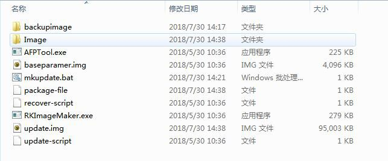
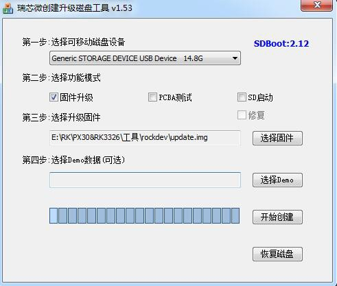
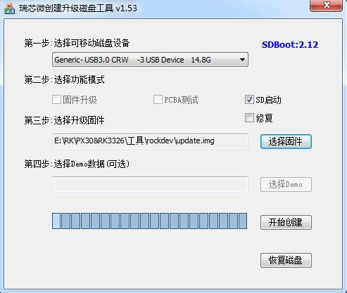
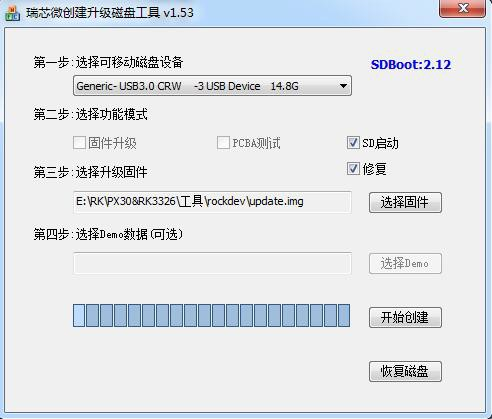
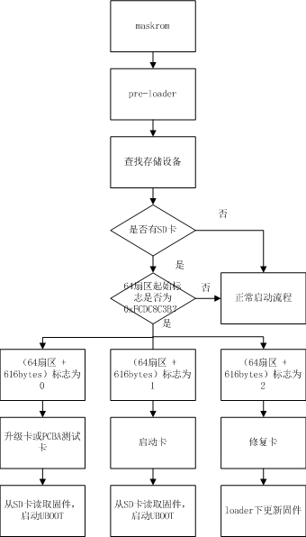
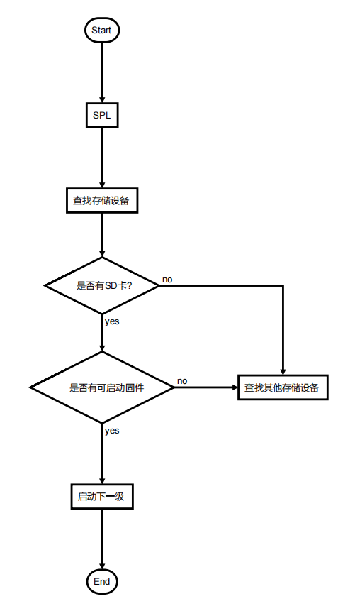
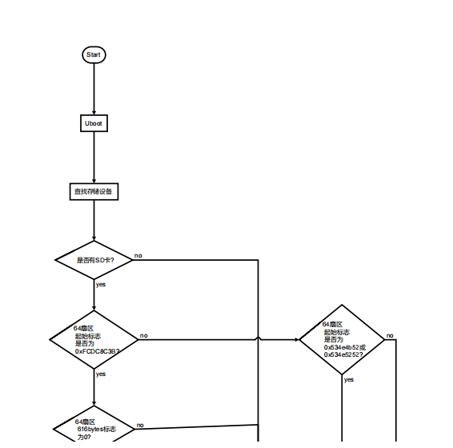
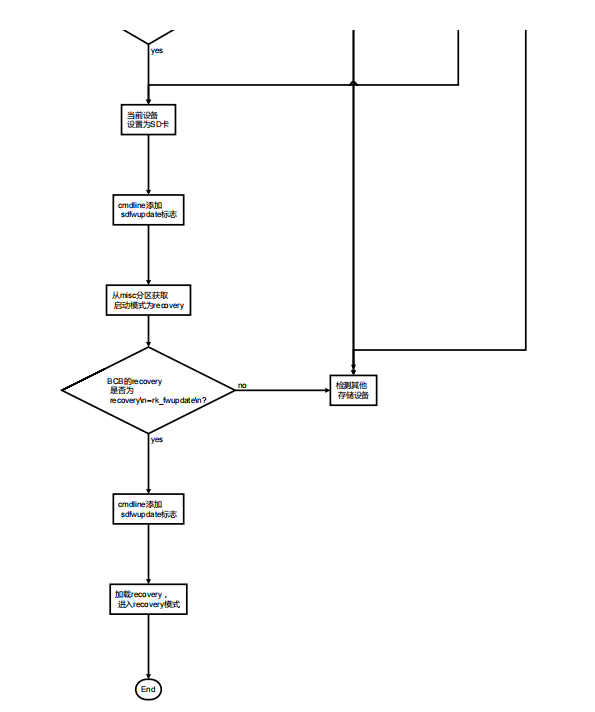

 # **Rockchip SD Card Boot Reference**

 前言概述

 本文主要介绍 Rockchip 对 SD 卡的几种使用，包括制作固件，制作各种 SD
 功能卡，固件在 SD 卡内的

 分布以及 boot 的流程，工程师可以依据文档排查使用 SD
 卡过程出现的各类问题。读者对象

 本文档（本指南）主要适用于以下工程师：

 技术支持工程师软件开发工程师


## 1. 类型简介

Rockchip 将 SD 卡划分为常规 SD 卡、SD 升级卡、SD 启动卡、SD 修复卡。可以通过瑞芯微创建升级磁盘工具将 `update.img` 下载到 SD 卡内，制作不同的卡类型。

| 卡类型       | 功能                                                                 |
|--------------|----------------------------------------------------------------------|
| 常规 SD 卡   | 普通的存储设备                                                       |
| SD 升级卡    | 设备从 SD 卡内启动到 recovery，由 recovery 负责将固件更新到设备存储    |
| SD 启动卡    | 设备直接从 SD 卡启动                                                 |
| SD 修复卡    | 从 pre-loader 开始拷贝 SD 卡内的固件到设备存储                        |

---

## 2. 固件制作

`update.img` 是 Rockchip 提供的整套固件合集，包含完整固件和固件完整性校验等数据。通过该文件，用户可以便捷地更新整套固件。

Rockchip 提供了专用工具制作 `update.img`。若使用 Rockchip SDK，可进入以下目录操作：  
`RKTools/Linux/Linux_Pack_Firmware/rockdev/`

 

 我们可以通过修改 package-file 来打包需要生成的
 update.img。package-file 文件内容如下：
```bash
 # NAME Relative path \#

 #HWDEF HWDEF

 package-file package-file bootloader Image/MiniLoaderAll.bin parameter
 Image/parameter.txt uboot Image/uboot.img

 trust Image/trust.img

 misc Image/misc.img resource Image/resource.img kernel
 Image/kernel.img

 boot Image/boot.img \#recovery Image/recovery.img \#system
 Image/system.img \#vendor Image/vendor.img \#oem Image/oem.img

 # baseparamer Image/baseparamer.img

 # 要写入backup分区的文件就是自身（update.img）

 # SELF 是关键字，表示升级文件（update.img）自身

 # 在生成升级文件时，不加入SELF文件的内容，但在头部信息中有记录

 # 在解包升级文件时，不解包SELF文件的内容。

 # RESERVED不打包backup

 backup backupimage/backup.img update-script update-script
 recover-script recover-script
```
 添加文件时，写入文件名及固件地址。如果是不需要打包某个固件，则在固件名前面加"\#"屏蔽掉即可。
 点击运行 mkupdate.bat 即可生成 update.img。

## 3. 工具使用

### 3.1 常规 SD 卡

普通 SD 卡与 PC 使用完全一样，可以在 U - Boot 和 Kernel 系统中作为普通的存储空间使用，无需工具对 SD 卡做任何操作。

### 3.2 SD 升级卡

SD 卡升级卡是通过 RK 的工具制作，实现通过 SD 卡对本地存储(如 eMMC，nand flash)内系统的升级。SD 卡升级是可以脱离 PC 机或网络的一种固件升级方法。具体是将 SD 卡启动代码写到 SD 卡的保留区，然后将固件拷贝到 SD 卡可见分区。主控从 SD 卡启动时，SD 卡启动代码和升级代码将固件烧写到本地主存储中。同时 SD 卡升级卡支持 PCBA 测试和 Demo 文件的拷贝。SD 升级卡的这些功能可以使固件升级做到脱离 PC 机进行，提高生产效率。

制作 SD 升级卡流程如下：


 操作步骤如下：

1.  选择可移动磁盘设备

2.  选择功能模式为固件升级

3.  选择需要升级的固件

4.  点击开始创建

 具体配置可以参考上图设置。再次制作：

 已经制作好 SD 升级卡，如果只需要更新固件和 demo
 文件时，可以按下面步骤来完成：

1.  拷贝固件到 SD 卡根目录，并重命名为 sdupdate.img

2.  拷贝 demo 文件到 SD 卡根目录下的 Demo 目录中

 SD 引导升级卡格式(非 GPT)

| 偏移 | 数据段 |
| --- | --- |
| 扇区 0 | MBR |
| 扇区 64-4M | IDBLOCK(启动标志置 0) |
| 4M-8M | Parameter |
| 12M-16M | uboot |
| 16M-20M | trust |
| …… | misc（BCB写入recovery\n--rk_fwupdate\n） |
| …… | resource |
| …… | kernel |
| …… | recovery |
| 剩下空间 | Fat32 存放 update.img |

 SD 引导升级卡格式(GPT)

| 偏移 | 数据段 |
| --- | --- |
| 扇区 0 | MBR |
| 扇区 1-34 | GPT 分区表 |
| 扇区 64-4M | IDBLOCK(启动标志置 0) |
| 4M-8M | Parameter |
| …… | uboot |
| …… | trust |
| …… | misc |
| …… | resource |
| …… | kernel |
| …… | recovery |
| 剩下空间 | Fat32 存放 update.img |

### 3.3  **SD** 启动卡

 SD 启动卡是通过 RK 的工具制作，实现设备系统直接从 SD
 卡启动，极大的方便用户更新新编译的固件而不用烧写固件到设备存储内，也可以作为设备主存储使用。目前主要用于系统从
 SD 卡启动，或用于PCBA 测试。注意：PCBA 测试只是 recovery
 下面的一个功能项，可用于升级卡与启动卡。

 制作启动卡流程如下：

 

1.  选择可移动磁盘设备

2.  选择功能模式为 SD 启动

3.  选择需要升级的固件

4.  点击开始创建

 具体配置可以参考上图设置。

 SD 引导启动卡格式(非 GPT)

| 偏移 | 数据段 |
| --- | --- |
| 扇区 0 | MBR |
| 扇区 64-4M | IDBLOCK(启动标志置 1) |
| 4M-8M | Parameter |
| 8M-12M | uboot |
| 12M-16M | trust |
| …… | misc |
| …… | resource |
| …… | boot |
| …… | kernel |
| …… | recovery |
| …… | system |
| …… | user |

 SD 引导启动卡格式(GPT)

+----------------+-------------------------+
|  偏移         |  数据段                |
+================+=========================+
|  扇区 0       |  MBR                   |
+----------------+-------------------------+
|  扇区 1-34    |  GPT 分区表            |
+----------------+-------------------------+
|  扇区 64-4M   |  IDBLOCK(启动标志置 1) |
+----------------+-------------------------+
|  ......       |  uboot                 |
+----------------+-------------------------+
|  ......       |  Boot                  |
+----------------+-------------------------+
|  ......       |  trust                 |
+----------------+-------------------------+
|  ......       |  resource              |
+----------------+-------------------------+
|  ......       |  kernel                |
+----------------+-------------------------+
|  ......       |  recovery              |
+----------------+-------------------------+
|  ......       |  system                |
+----------------+-------------------------+
|  ......       |  vendor                |
+----------------+-------------------------+
|  ......       |  oem                   |
+----------------+-------------------------+
|  ......       |  user                  |
+----------------+-------------------------+
|  最后 33 扇区 |  备份 GPT              |
+----------------+-------------------------+

### 3.4  **SD** 修复卡

 SD 修复卡运行功能，类似于 SD 卡升级功能，但固件升级发生在
 pre-loader（miniloader）的 SD 卡升级代码。首先工具会将启动代码写到 SD
 卡的保留区，然后将固件拷贝到 SD 卡可见分区上，主控从 SD 卡启动时，SD
 卡升级代码将固件升级到本地主存储中。主要用于设备固件损坏，SD
 卡可以修复设备。制作修复卡流程如下：

 
1.  选择可移动磁盘设备

2.  选择功能模式为 SD 启动和修复

3.  选择需要升级的固件

4.  点击开始创建

 具体配置可以参考上图设置。

 SD 修复卡格式(非 GPT)

| 偏移 | 数据段 |
| --- | --- |
| 扇区 0 | MBR |
| 扇区 64-4M | IDBLOCK(启动标志置 2) |
| 4M-8M | Parameter |
| 8M-12M | uboot |
| 12M-16M | trust |
| …… | misc |
| …… | resource |
| …… | boot |
| …… | kernel |
| …… | recovery |
| …… | system |
| …… | user |

 SD 修复卡格式(GPT)
| 偏移 | 数据段 |
| --- | --- |
| 扇区 0 | MBR |
| 扇区 1-34 | GPT 分区表 |
| 扇区 64-4M | IDBLOCK(启动标志置 2) |
| …… | uboot |
| …… | Boot |
| …… | trust |
| …… | resource |
| …… | kernel |
| …… | recovery |
| …… | system |
| …… | vendor |
| …… | oem |
| …… | user |
| 最后 33 扇区 | 备份 GPT |

## 4. 标志说明

 SD 卡作为各种不同功能的卡，会在 SD 卡内做一些标志。

 在 SD 卡的第 64 扇区处，起始标志若为（magic number）为
 0xFCDC8C3B，则为一些特殊卡，会从 SD卡内读取固件，启动设备。如果不是，则作为普通 SD 卡看待。在第（64 扇区
 + 616bytes）地方，存放各种卡的标志。目前有三种类型：

  |标志 |  卡类型|
  |------| ----------------------|
  0   |   升级卡或 PCBA 测试卡
  1  |    启动卡
  2   |   修复卡

 目前，这种写idb block flag的方式有以下劣势：

 - RK独有设计，不兼容

-  存在安全问题，因为这个标志是制卡的时候写入到idb block，破坏idb
 block的完整性新版的idb
 block没有预留该标志位置（其实没必要留，因为会碰到上面所述问题）

 - 为了解决以上问题，RK复用Android
 BCB的设计，在recovery内添加recovery\\n\--rk\_fwupdate\\n
 作为进入SD升级的标志。

 两种标志支持情况：

| 平台 | idb block flag | Android BCB |
| --- | --- | --- |
| rk3588 |  | √ |
| rk3568/rk3566 |  | √ |
| rv1126/rv1109 | √ | √ |
| rk3399 | √ | √ |
| rk3368 | √ | √ |
| rk3328 | √ | √ |
| rk3326 | √ | √ |
| rk3308 | √ | √ |
| rk3288 | √ | √ |
| rk3229 | √ | √ |
| rk3128 | √ | √ |
| rk3126 | √ | √ |

 后续随着平台升级，工具更新，会逐渐摒弃写idb block flag这种方式。

 注意：**SDDiskTool**需要更新到**v1.67**或更高版本才会支持**Android
 BCB**这种方式。

## 5流程分析


 SD 卡的 boot 流程可分为 pre-loader/SPL 启动流程与
 U-Boot启动流程，pre-loader与U-Boot流程都需要加载检测 SD 卡及 SD 卡 IDB
 Block 内 Startup Flag
 标志，并且会依据这些标志执行不同的功能。SPL流程则是设置SD卡为最高优先级的启动设备，如果SD卡有可以启动的固件，则优先从sd卡加载固件并启动。

### 5.1  **pre-loader** 启动流程

 

### 5.2 **SPL** 启动流程

### 5.3 **U-Boot** 启动流程




## 5.4  **recovery** 及 **PCBA** 说明

 具体可参考《Rockchip Recovery 用户操作指南 V1.03.pdf》。

## 6 注意事项


1.  非 GPT 格式，U-Boot 需要配置 CONFIG\_RKPARM\_PARTITION。

2.  在制作 SD 升级卡时，update.img 必须包含
     MiniloaderAll.bin，parameter.txt，uboot.img，trust.img，
     misc.img，resource.img，recovery.img 这些固件，否则烧写 update.img
     会出现写入 MBR 失败的提示。
