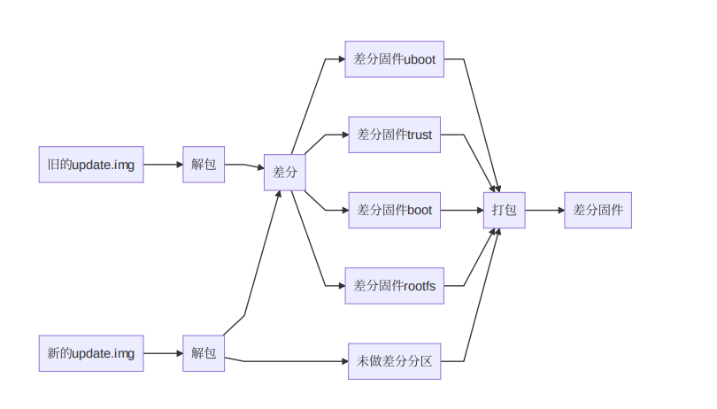
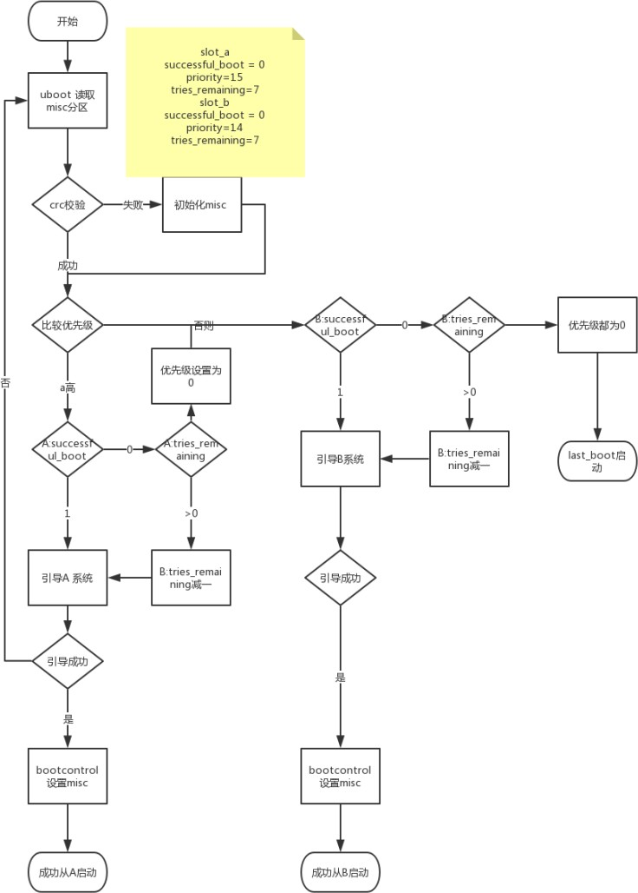
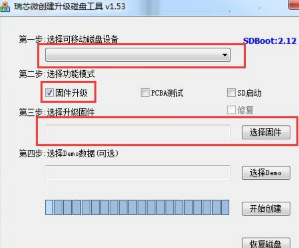

 # **Rockchip Linux updateEngine**升级⽅案介绍

 前⾔概述

 本⽂档旨在指导⼯程师如何快速使⽤Rockchip Linux
 平台升级⽅案，并进⾏⼆次开发。

 读者对象

 本⽂档（本指南）主要适⽤于以下⼯程师： 技术⽀持⼯程师

 软件开发⼯程师产品版本

|  芯⽚名称      |  内核版本   |
|-|-|
|  RK3308        |  4.4        |

|  RV1126/RV1109 |  Linux 4.19 |


## 1.  简介以及代码

  ###  1. 1 简介

 Rockchip Linux 平台⽀持两种启动⽅案，Recovery 模式和Linux A/B 模式：

1.  Recovery 模式，设备上有⼀个单独的分区(recovery)⽤于升级操作。

2.  Linux A/B 模式，设备上有两套固件，可切换使⽤。

 这两种启动模式各有优缺点，⽤⼾根据需求选择使⽤。

### 1.2  代码

 Rockchip Linux 平台有两套升级⽅案代码。

| 升级方案 | 代码路径 | 是否支持Recovery启动模式升级 | 是否支持A/B启动模式升级 | 简介 |
| ---- | ---- | ---- | ---- | ---- |
| updateEngine | external/recovery/update_engine<br>external/recovery | 支持 | 支持 | RV1126/RV1109平台使用 |
| rkupdate | external/rkupdate | 支持 | 不支持 | 其它平台使用，本文档不作介绍 |
## 2. Recovery 模式

### 2.1 概述

Recovery 模式是在设备上多一个 Recovery 分区，该分区由 kernel+resource+ramdisk 组成，主要用于升级操作。u-boot 会根据 misc 分区（详见 misc 分区章节）存放的字段来判断将要引导的系统是 Normal 系统还是 Recovery 系统。由于系统的独立性，所以 Recovery 模式能保证升级的完整性，即升级过程被中断，如异常掉电，升级仍然能继续执行。

优点：
1. 能保证升级的完整性

缺点：
1. 系统多了一个分区，该分区仅用于升级
2. 升级过程必须重启进入 recovery 模式，不能在 Normal 系统直接进行升级

分区简介：
| 分区名 | 镜像名 | 简介 |
| ---- | ---- | ---- |
| loader | MiniLoaderAll.bin | 一级loader |
| u - boot | uboot.img | 二级loader |
| trust | trust.img | 安全环境，如OP - TEE、ATF（有些平台上会把trust和uboot合并） |
| misc | misc.img | 引导参数分区 |
| recovery | recovery.img | kernel+dtb+ramdisk组成的根文件系统 |
| boot | boot.img | kernel+dtb |
| rootfs | rootfs.img | 根文件系统，只读 |
| oem | oem.img | 厂商预制，可读写 |
| userdata | userdata.img | 用于数据，可读写 |+

### 2.2 配置和编译

 Buildroot：recovery 配置⽂件选择如下（make menuconfig）
```bash
BR2_PACKAGE_RECOVERY=y #开启升级相关功能
BR2_PACKAGE_RECOVERY_USE_UPDATEENGINE=y #使⽤新升级程序，不配置则默认使⽤原有升级流程
BR2_PACKAGE_RECOVERY_RECOVERYBIN=y #开启recovery bin ⽂件
BR2_PACKAGE_RECOVERY_UPDATEENGINEBIN=y #编译新升级程序
BR2_PACKAGE_RECOVERY_NO_UI=y # 关掉UI
```
 Buildroot：rootfs 配置⽂件选择如下(make menuconfig)
```bash
BR2_PACKAGE_RECOVERY=y #开启升级相关功能
BR2_PACKAGE_RECOVERY_USE_UPDATEENGINE=y #使⽤新升级程序
BR2_PACKAGE_RECOVERY_UPDATEENGINEBIN=y #编译新升级程序
BR2_PACKAGE_RECOVERY_NO_UI=y # 关掉UI
```
 **带屏与不带屏**

 ⽬前只有RK3308使⽤不带屏的recovery，如有其它要让recovery不显⽰界⾯，在⽂件

 buildroot/package/rockchip/recovery/recovery.mk做如下配置即可：
 ```bash
 TARGET_MAKE_ENV += RecoveryNoUi=true
 ```

 SDK默认会开启以上配置，⽤⼾⽆需再次配置。源码⽬录位于external/recovery/，若有进⾏相关修改，则按照如下进⾏编译：
 ```bash
 1. source envsetup.sh
2. 选择某⼀个平台的rootfs配置
3. make recovery-dirclean
4. source envsetup.sh
5. 选择某⼀平台的 recovery 配置
6. make recovery-dirclean
7. ./build.sh
8. 重新烧写固件
 ```

 如果SDK版本⽐较新，可以尝试如下编译：
 ```bash
 ./build.sh external/recovery
./build.sh
# 重新烧写固件
 ```

### 2.3  **OTA**升级

 升级⽀持⽹络下载和本地升级，且可指定要升级的分区，在normal系统运⾏如下命令：

 ⽹络升级：
```bash
# updateEngine --misc=update --image_url=固件地址 --partition=0x3FFC00 --
version_url=版本⽂件地址 --savepath=/userdata/update.img --reboot
updateEngine --image_url=http://172.16.21.110:8080/recovery/update.img \
--misc=update --savepath=/userdata/update.img --reboot &
```
 本地升级：
```bash
updateEngine --image_url=/userdata/update.img --misc=update \
--savepath=/userdata/update.img --reboot &
```
 流程介绍：

1.  固件版本⽐较(\--version\_url)

2.  下载固件(\--image\_url)，并保存到本地(\--savepath)

3.  升级recovery 分区

4.  重启(\--reboot)

5.  进⼊recovery模式，升级指定的分区(\--partition)

6.  升级成功，重启进⼊normal系统

 可缺省参数：

1.  \--version\_url：远程地址或本地地址，没有设置该参数，则不会进⾏版本⽐较

2.  \--savepath：固件保存地址，缺省时为/tmp/update.img，建议传⼊/userdata/update.img

3.  \--partition：设置将要升级的分区，建议使⽤0x3FFC00，不⽀持升级**parameter**
     和**loader**分区。详⻅[参数说明章节]

4.  \--reboot：升级recovery 完后，重启进⼊recovery模式

###   2.4 ### ⽇志的查看

1.  串口⽇志查看

 buildroot/output/rockchip\_\*\*\*/target ⽬录下
```bash
touch .rkdebug
```
 创建这个隐藏⽂件，可将 recovery 模式中升级的 log 在串口中打印出来。

2.  通过查看 userdata/recovery/Log ⽂件查看

 升级之后，在设备 userdata/recovery ⽬录中查看 log ⽂件。
 ```bash
 cat userdata/recovery/Log
 ```

## 3.  差分升级

 Linux SDK中提供了tools/linux/Linux\_Diff\_Firmware/
 ⽤来做差分升级包，⽀持的功能有:

 - uboot/trust/kernel分区
 - rootfs分区⽀持squashfs

 尚未⽀持的功能有:

 - ext2/ext4格式的⽂件系统

-  使⽤mtd驱动的nand flash系统加密分区

 - A/B模式

### 3.1  依赖及编译

 差分包制作、升级涉及到3部分代码，如下:
 ```bash
 .
├── buildroot
│ └── 0001-package-recovery-add-bzip2-dependency.
│ └── 0002-bsdiff-use-mmap-to-save-memory-when-apply-patch.patch
├── external
│ └── recovery
│ └── 0001-update_engine-add-differ-ota-funcion.patch
│ └── 0002-update_engine-recover-from-unexpected-reboot-when-do.patch
└── tools
└── 0001-ota-add-diff-firmware-script.patch
 ```

 请确保上述三个⼯程中已经包含如上提交。如果还未包含，可通过升级sdk或向RK索要升级补丁。

 PC端依赖的⼯具有: bsdiff，md5sum。其中bsdiff可通过下述命令安装:
 ```bash
 $ sudo apt install bsdiff
 ```

### 3.2 分区⼤小要求

 在板端， 对ddr及分区⼤小的要求:

- ddr⽆要求，与差分补丁包⼤小⽆关

- 空闲分区⼤小有要求：空闲分区⼤小应不小于update\_diff.img和rootfs.img的⼤小

   - update\_diff.img例如保存在/userdata/⽬录下，那么

   - /userdata/的空闲⼤小，⾄少还要能放下完整的新的rootfs.img固件

### 3.3 制作差分补丁包

 通过对新、旧OTA固件(update.img)解包、差分、打包，制作补丁包。



 注意

 - 新的update.img需要为OTAimage，而不是下载固件使⽤的update.img，即只包含要升级的分区
 - 旧的固件，建议使⽤包含所有分区的update.img，⾄少应该包含需要差分的分区
- 旧的固件务必要与⽬标机器上的固件相同

 使⽤⽰例:
```bash
$ cd tools/linux/Linux_Diff_Firmware/
$ ./mk-diff-ota.sh update_old.img update_new.img update_diff.img
```
 ⽣成的update\_diff.img即可⽤于OTA升级。注意

 仅⽀持updateEngine ⼯具升级, rkupdate升级⼯具还不⽀持差分包解析升级

## 4. Linux A/B 模式

### 4.1 概述

 Linux A/B，即准备两份独⽴的系统固件，分别存放在 flash上，系统可以从其中⼀个 slot 启动，如果当前 slot启动失败，可以从另外⼀个 slot启动，在Normal模式下直接升级系统，⽆需进⼊系统升级模式，  只需重启系统即可进⼊升级过的系统。

 Linux A/B 由于有两个引导 slot，所以具有以下优点：

1.  升级⽆需重启进⼊升级模式，即机器可以在当前系统上直接进⾏升级。

2.  防⽌由于升级失败导致机器变砖，如果升级失败，机器可以回到当前版本。

3.  当前系统如果由于⼀些误操作被破坏掉，系统会⾃动切换到另外⼀个 slot
     上。

 缺点：

 1.Linux A/B 有两个 slot，所以会增加 flash 上系统固件的占⽤率。分区：

 由于miniloader，trust，uboot，机器上原有已经进⾏了多备份，所以⽬前这⼏个分区暂不⽀持双分区⽅案，只对boot 和 system 进⾏了双分区。分区表如下：

| 分区名 | 镜像名 | 简介 |
| ---- | ---- | ---- |
| loader | Miniloader.bin | 一级loader，机器备份4份 |
| uboot_a | uboot.img | 二级loader，机器备份2份，可修改u-boot/make.sh来修改备份份数 |
| uboot_b | uboot.img | uboot_a的备份分区 |
| trust | trust.img | 安全相关，机器备份2份，可修改u-boot/make.sh来修改备份份数（有些平台上会把trust和uboot合并） |
| misc | misc.img | 引导参数分区 |
| boot_a | boot.img | kernel+dtb，引导system_a |
| boot_b | boot.img | kernel+dtb，引导system_b |
| system_a | rootfs.img | 根文件系统 |
| system_b | rootfs.img | 根文件系统 |
| oem | oem.img | 厂商预制，可读写 |
| userdata | userdata.img | 用于数据，可读写，无备份 |

### 4.2 引导流程以及数据格式

####  数据格式及存储

 存储位置为 misc 分区偏移 2K 位置，AvbABSlotData 和 AvbABData
 数据结构如下：

 AvbABSlotData：存储 slot\_a 和 slot\_b

| 数据名称 | 数据作用 |
| ---- | ---- |
| unsigned char priority | 分区优先级，0~15，0为不可自动，15为最高优先级 |
| unsigned char tries_remaining | 尝试启动次数，最高为7次，可修改 |
| unsigned char successful_boot | 0：不可启动，1：可启动 |
| unsigned char is_update:1 | 0：升级失败，1：升级成功，后7位为保留数据 |

 AvbABData：slot\_a 和 slot\_b 的引导信息

| 数据名称 | 数据作用 |
| ---- | ---- |
| unsigned char magic[AVB_AB_MAGIC_LEN] | 结构体头部信息：`\0AB0` |
| unsigned char version_major | 版本信息 |
| unsigned char version_minor | 版本信息 |
| unsigned char reserved1[2] | 保留数据 |
| AvbABSlotData slots[2] | 分区引导信息 |
| unsigned char last_boot | 上一次成功启动的分区：0->slot_a，1->slot_b |
| unsigned char reserved2[11] | 保留数据 |
| unsigned char crc32 | Crc 数据校验 |

#### 4.2.2 引导流程

 根据上层 bootcontrol 程序的设置⽅式，可分为两种引导⽅式
 successful\_boot 和 reset retry。 两种模式的对

 ⽐如下：

| 模式 | 优点 | 缺点 | 成功启动设置的数据（A启动） | 升级时设置的数据（A启动，B升级） |
| ---- | ---- | ---- | ---- | ---- |
| Successful boot | 只要正常启动系统，不会回退到旧版本固件 | 设备长时间工作后，如果存储某些颗粒异常，会导致系统一直重启 | tries_remaining=0<br>successful_boot=1<br>last_boot=0 | A:priority=14<br>B:priority=15 |
| Reset retry | 始终保持retry机制，可以应对存储异常问题 | 1. 机器会回到旧的版本上，可能出现版本不可控问题<br>2. 如果因为用户误操作，retry尝试次数过了，会误判为当前分区为可
#### 4.2.3 引导流程图

 
### 4.3   编译配置

#### 4.3.1  **uboot**

 defconfig 增加如下配置，如 rk3308
 64bit：u-boot/configs/rk3308\_defconfig
 ```bash
 CONFIG_AVB_LIBAVB=y
CONFIG_AVB_LIBAVB_AB=y
CONFIG_AVB_LIBAVB_ATX=y
CONFIG_AVB_LIBAVB_USER=y
CONFIG_RK_AVB_LIBAVB_USER=y
CONFIG_ANDROID_AB=y
 ```

#### 4.3.2 **Buildroot**
```bash
BR2_PACKAGE_RECOVERY=y #开启升级功能
BR2_PACKAGE_RECOVERY_BOOTCONTROL=y #开启引导控制脚本
BR2_PACKAGE_RECOVERY_RETRY=y #引导⽅式为retry模式，不配置则默认为
successful_boot模式
BR2_PACKAGE_RECOVERY_USE_UPDATEENGINE=y #使⽤新升级程序
BR2_PACKAGE_RECOVERY_UPDATEENGINEBIN=y #编译新升级程序
BR2_PACKAGE_RECOVERY_NO_UI=y # 关掉UI
```

 注意：设置完成之后，须进⾏重新编译，如下：
```bash
make recovery-dirclean
make recovery
./build.sh
```
 如果SDK版本⽐较新，可以尝试如下编译：
```bash
./build.sh external/recovery
./build.sh
# 重新烧写固件
```
#### 4.3.3 分区表

 相应的 BoardConfig.mk，设置 parameter 分区表，如下：
```bash
#选择了 device/rockchip/rk3308/parameter-ab-64bit.txt ⽂件
# parameter for GPT table
export RK_PARAMETER=parameter-ab-64bit.txt
```
 64bit：参考/device/rockchip/rk3308/parameter-ab-64bit.txt
 32bit：参考/device/rockchip/rk3308/parameter-ab-32bit.txt

#### 4.3.4  固件输出

 选择相应的板级配置（如BoardConfig\*\*\*-ab.mk）。如果要使⽤SD卡启动盘升级AB系统模式，⽅式如下：
 ```bash
 # enable build update_sdcard.img
export RK_UPDATE_SDCARD_ENABLE_FOR_AB=true
 ```

 设置完成之后，运⾏
```bash
./build.sh
```
 即可⽣成如下固件：

```bash
tree rockdev/
rockdev/
├── boot.img
├── MiniLoaderAll.bin
├── misc.img
├── oem.img
├── parameter.txt
├── rootfs.img
├── uboot.img
├── update_ab.img
├── update_sdcard.img
├── update_ota.img
└── userdata.img
```
 升级固件

 rockdev 和 IMAGE ⽬录下，都会有 update\_ota.img，⽤于 OTA 升级，该
 IMAGE 包，包含boot.img
 和rootfs.img。可根据实际需求修改tools/linux/Linux\_Pack\_Firmware/rockdev/rv1126\_rv1109-
 package-file-2-ota ⽂件。如下图：
 ```bash
 # NAME Relative path
#
#HWDEF HWDEF
package-file package-file
bootloader Image/MiniLoaderAll.bin
parameter Image/parameter.txt
uboot_a Image/uboot.img
boot_a Image/boot.img
system_a Image/rootfs.img
oem Image/oem.img
 ```

 烧写固件

 rockdev 和 IMAGE ⽬录下，都会⽣成update_ab.img，该固件⽤于烧写。根据需求修改该⽂件

 `tools/linux/Linux\_Pack\_Firmware/rockdev/rv1126\_rv1109-package-file-2-ab`
 ⽂件。如下图：
 ```bash
 # NAME Relative path
#
#HWDEF HWDEF
package-file package-file
bootloader Image/MiniLoaderAll.bin
parameter Image/parameter.txt
misc Image/misc.img
uboot_a Image/uboot.img
uboot_b Image/uboot.img
boot_a Image/boot.img
boot_b Image/boot.img
system_a Image/rootfs.img
system_b Image/rootfs.img
oem Image/oem.img
 ```

#### 4.4 **OTA**升级

 ⽹络升级：
 ```bash
 # updateEngine --update --image_url=固件地址 --partition=0x3FFC00 --version_url=版
本⽂件地址 --savepath=保存的固件地址 --reboot
updateEngine --image_url=http://172.16.21.110:8080/linuxab/update_ota.img --
update --reboot
 ```

 本地升级：
```bash
# updateEngine --update --image_url=固件地址(update_ab.img 或 update_ota.img) --
partition=0x3FFC00 --version_url=版本⽂件地址 --savepath=保存的固件地址 --reboot
updateEngine --image_url=/userdata/update_ota.img --update --reboot
```
 流程介绍：

1.  固件版本⽐较

2.  下载固件(\--image\_url)，并保存到本地(\--savepath)

3.  升级指定的分区(\--partition)

4.  设置升级分区为将要引导分区

5.  重启

6.  尝试引导升级的分区

 可缺省参数：

1.  \--partition：设置将要升级的分区 ，Linux
     A/B模式下，建议只升级uboot\_a/uboot\_b、boot\_a/boot\_b和system\_a/system\_b，即0xFC00，不⽀持升级**parameter**
     和**loader**分区。详⻅参数说明

2.  \--version：没有设置该参数，则不会进⾏版本⽐较

3.  \--savepath：固件保存地址，缺省时为/tmp/update.img，建议使⽤默认值

4.  \--reboot：升级完后重启

 ### 4.5 分区引导设置

#### 4.5.1 可引导设置

 通过misc设置当前分区为可引导分区，要在 system
 成功引导之后执⾏，标记系统成功启动，参考如下脚本
 ```bash
 $external/recovery/update_engine$ cat S99_bootcontrol
case "$1" in
start)
/usr/bin/updateEngine --misc=now
;;
stop)
printf "stop finished\n"
;;
*)
echo "Usage: $0 {start|stop}"
4.5.2 升级分区设置
流程介绍：
1. 往misc 偏移4K位置写⼊⼀个命令，该命令为引导另⼀个分区的命令
2. 重启
可缺省参数：
1. --reboot，缺省则机器不会⽴即重启，在下⼀次重启才会⽣效
注意：updateEngine程序在OTA升级结束之后会⾃动设置，⽆需重复设置。
5. SD 卡制作启动盘升级
SD卡启动盘升级指将通过SDDiskTool 制卡⼯具制作的SD卡插⼊到机器中进⾏升级，详细描述 SD 卡启动
盘的制作及相关升级的问题。
5.1 制作SD卡启动盘
如图所⽰，使⽤⼯程⽬录 tools\windows\SDDiskTool 中的 SD 卡启动盘升级制作⼯具制作 SD 卡启动盘。
exit 1
;;
esac
exit 0
 ```

#### 4.5.2 升级分区设置
```bash
updateEngine --misc=other --reboot
```
 流程介绍：

1.  往misc 偏移4K位置写⼊⼀个命令，该命令为引导另⼀个分区的命令

2.  重启

 可缺省参数：

 1\. \--reboot，缺省则机器不会⽴即重启，在下⼀次重启才会⽣效

 注意：updateEngine程序在OTA升级结束之后会⾃动设置，⽆需重复设置。

## 5.  **SD** 卡制作启动盘升级

 SD卡启动盘升级指将通过SDDiskTool
 制卡⼯具制作的SD卡插⼊到机器中进⾏升级，详细描述 SD
 卡启动盘的制作及相关升级的问题。

### 5.1   制作**SD**卡启动盘

 如图所⽰，使⽤⼯程⽬录 tools\\windows\\SDDiskTool 中的 SD
 卡启动盘升级制作⼯具制作 SD 卡启动盘。

 

 选择固件中选择打包好的 update.img ⽂件。

 所有准备⼯作完成后，点击开始创建按钮，如果创建成功，会弹窗提⽰。

 此时 SD 卡中根⽬录会存在两个⽂件，其中选择升级的固件
 update.img，会被命名为 sdupdate.img.

 所有准备⼯作做好后，设备中插⼊ SD 卡，并重新上电。

### 5.2  **Recovery**系统模式的**SD**卡启动盘制作说明

 Recovery系统模式的SD卡启动盘制作只要把update.img⽤SDDiskTool⼯具直接制作成sdupdate.img即可。

### 5.3  **AB**系统模式的**SD**卡启动盘制作说明

 SDK编译AB系统模式时， ./build.sh updateimg
 命令会打包出3个update.img，如下：

 update\_ab.img: 包含完整的AB系统分区，可⽤于完整烧录
 update\_ota.img:只包含A slot分区系统或B slot分区系统
 update\_sdcard.img:只能⽤于制作AB系统模式SD卡启动盘

 制作AB系统模式SD卡启动盘时，使⽤SDDiskTool⼯具加载update\_sdcard.img，制作好SD卡启动盘后，再将update\_ab.img或update\_ota.img拷⻉到SD卡启动盘上即可。
```bash
rksdfw.tag
sd_boot_config.config
sdupdate.img
update_ab.img # first priority
update_ota.img # second priority
```
## 6 恢复出⼚设置

 我们把可以读写的配置⽂件保存在 userdata 分区，
 出⼚固件会默认⼀些配置参数， ⽤⼾使⽤⼀段时间后会⽣成或修改配置⽂件，
 有时⽤⼾需要清除这些数据， 我们就需要恢复到出⼚配置。

 SDK 实现：

 功能键 RECOVERY + VOLUMEUP 触发恢复出⼚配置， 代码请参考：
 buildroot/board/rockchip/rk3308/fs-overlay/etc/input-event-daemon.conf

 board/rockchip/rk3308/fs-overlay/usr/sbin/factory\_reset\_cfg
 ```bash
 updateEngine --misc=wipe_userdata --reboot
 ```

 流程介绍：

1.  往misc 分区偏移4k位置处写⼊格式命令

2.  重启(\--reboot)

3.  S21mountall.sh 识别misc中有格式化命令

4.  格式化userdata

 可缺省参数:

 1\. \--reboot 如果没有传⼊该参数，则在机器下次重启后才会恢复出⼚设置。

## 7.  升级程序详细说明

### 7.1 参数说明

 updateEngine主要包含升级分区和写Misc配置功能，⽀持命令参数如下：
 ```bash
 *** update_engine: Version V1.1.0 ***.
--misc=now Linux A/B mode: Setting the current partition to bootable.
--misc=other Linux A/B mode: Setting another partition to bootable.
--misc=update Recovery mode: Setting the partition to be upgraded.
--misc=wipe_userdata Format data partition.
--update Upgrade mode.
--partition=0x3FFC00 Set the partition to be upgraded.(NOTICE: OTA not support
upgrade loader and parameter)
    0x3FFC00: 0011 1111 1111 1100 0000 0000.
                uboot trust boot recovery rootfs oem
                uboot_a uboot_b boot_a boot_b system_a system_b.
            000000000000000000000000: reserved
            100000000000000000000000: Upgrade loader
            010000000000000000000000: Upgrade parameter
            001000000000000000000000: Upgrade uboot
            000100000000000000000000: Upgrade trust
            000010000000000000000000: Upgrade boot
            000001000000000000000000: Upgrade recovery
            000000100000000000000000: Upgrade rootfs
            000000010000000000000000: Upgrade oem
            000000001000000000000000: Upgrade uboot_a
            000000000100000000000000: Upgrade uboot_b
            000000000010000000000000: Upgrade boot_a
            000000000001000000000000: Upgrade boot_b
            000000000000100000000000: Upgrade system_a
            000000000000010000000000: Upgrade system_b
            000000000000001000000000: Upgrade misc
            000000000000000100000000: Upgrade userdata
--reboot Restart the machine at the end of the program.
--version_url=url The path to the file of version.
--image_url=url Path to upgrade firmware.
--savepath=url save the update.img to url
 ```

 \--misc

 now：供Linux A/B 模式使⽤，将当前分区设置为可引导分区。

 注意：external/recovery/update\_engine/S99\_bootcontrol
 脚本在开机最后阶段会运⾏该命令，将当前分区设置为可引导分区，需要开启
```bash
BR2_PACKAGE_RECOVERY_BOOTCONTROL=y
```
 other：供Linux A/B
 模式使⽤，将另外⼀个分区设置为升级完成分区，重启之后会尝试从另外⼀个分区引导。

 注意：如果使⽤updateEngine升级，在升级结束之后，会⾃动设置，⽆需重复设置。

 update：供Recovery模式使⽤，在normal系统升级recovery分区，在recovery
 系统升级其余分区。

 display：调试使⽤，显⽰misc分区的数据结构

 \--update

 sdboot：走sdboot升级流程，即直接对flash操作，没有分区概念。
 不带参数：主要供Linux A/B使⽤，在当前模式下，直接进⾏升级。

 \--partition=0x0000

 设置将要升级的分区，如果缺省，默认值为0x3FFC00，升级uboot，trust，boot，recovery，rootfs，
 oem，uboot\_a，uboot\_b，boot\_a，boot\_b，system\_a，system\_b分区。⾼16位已经使⽤，低8位为保留位，可扩展使⽤。

 1：升级，0：不升级

| 段数 | 23 | 22 | 21 | 20 | 19 | 18 | 17 | 16 | 15 | 14 | 13 | 12 | 11 | 10 | 9 | 8 | 7-0 |
| ---- | ---- | ---- | ---- | ---- | ---- | ---- | ---- | ---- | ---- | ---- | ---- | ---- | ---- | ---- | ---- | ---- | ---- |
| 分区 | loader | parameter | uboot | trust | boot | recovery | rootfs | oem | uboot\_a | uboot\_b | boot\_a | boot\_b | system\_a | system\_b | misc | userdata | 保留 |

 \--reboot

 updateEngine 运⾏成功之后，机器重启

 \--vsersion\_url

 如果有传⼊路径，升级之前会与/etc/version ⽂件中的 RK\_VERSION=
 版本值进⾏⽐较本地路径：从固件中读取版本号

 远程路径：从远程下载版本⽂件，远程版本⽂件格式必须跟/etc/version ⼀致

 \--image\_url

 设置升级固件的路径，可为远程或本地路径。

 \--savepath

 设置保存固件的位置，如果没有传⼊且升级的固件路径为远程地址，则默认值为/tmp/update.img

### 7.2 ⾃定义分区升级
```bash
typedef struct {
char name[32]; //固件名称
bool need_update; //需要升级
bool is_ab; //是否为A/B双分区
long long size; //固件⻓度
long long offset; //在update.img 中的偏移位置
long long flash_offset; //flash上的偏移位置
char dest_path[100]; //⽬标路径
update_func cmd; //升级函数
}UPDATE_CMD, *PUPDATE_CMD;
```
 如要升级⾃定义分区，factory，则再下⾯添加⼀⾏, 且\--partition
 需要对应设置位值为1
```bash
{"factory", false, false, 0, 0, 0, "", flash_normal},
```
 external/recovery/update\_engine/update.cpp
 ```bash
 UPDATE_CMD update_cmd[] = {
{"bootloader" , false , false , 0 , 0 , 0 , "" , flash_bootloader} ,
{"parameter" , false , false , 0 , 0 , 0 , "" , flash_parameter} ,
{"uboot" , false , false , 0 , 0 , 0 , "" , flash_normal} ,
{"trust" , false , false , 0 , 0 , 0 , "" , flash_normal} ,
{"boot" , false , true , 0 , 0 , 0 , "" , flash_normal} ,
{"recovery" , false , false , 0 , 0 , 0 , "" , flash_normal} ,
{"rootfs" , false , true , 0 , 0 , 0 , "" , flash_normal} ,
{"oem" , false , false , 0 , 0 , 0 , "" , flash_normal} ,
{"uboot_a" , false , false , 0 , 0 , 0 , "" , flash_normal} ,
{"uboot_b" , false , false , 0 , 0 , 0 , "" , flash_normal} ,
{"boot_a" , false , false , 0 , 0 , 0 , "" , flash_normal} ,
{"boot_b" , false , false , 0 , 0 , 0 , "" , flash_normal} ,
{"system_a" , false , false , 0 , 0 , 0 , "" , flash_normal} ,
{"system_b" , false , false , 0 , 0 , 0 , "" , flash_normal} ,
{"misc" , false , false , 0 , 0 , 0 , "" , flash_normal} ,
{"userdata" , false , false , 0 , 0 , 0 , "" , flash_normal} ,
};
 ```

<thead
<tr class="header"
<th<blockquote
<pUPDATE_CMD</p
</blockquote</th
<th<blockquote
<pupdate_cmd[] = {</p
</blockquote</th
<th</th
<th</th
<th</th
<th</th
<th</th
<th</th
<th</th
<th</th
<th</th
<th</th
<th</th
<th</th
<th</th
<th</th
</tr
</thead
<tbody
<tr class="odd"
<td</td
<td<blockquote
<p{"bootloader" ,</p
</blockquote</td
<td<blockquote
<pfalse</p
</blockquote</td
<td<blockquote
<p,</p
</blockquote</td
<td<blockquote
<pfalse</p
</blockquote</td
<td<blockquote
<p,</p
</blockquote</td
<td<blockquote
<p0</p
</blockquote</td
<td,</td
<td<blockquote
<p0</p
</blockquote</td
<td<blockquote
<p,</p
</blockquote</td
<td<blockquote
<p0</p
</blockquote</td
<td<blockquote
<p,</p
</blockquote</td
<td<blockquote
<p""</p
</blockquote</td
<td<blockquote
<p,</p
</blockquote</td
<td<blockquote
<pflash_bootloader}</p
</blockquote</td
<td<blockquote
<p,</p
</blockquote</td
</tr
<tr class="even"
<td</td
<td<blockquote
<p{"parameter" ,</p
</blockquote</td
<td<blockquote
<pfalse</p
</blockquote</td
<td<blockquote
<p,</p
</blockquote</td
<td<blockquote
<pfalse</p
</blockquote</td
<td<blockquote
<p,</p
</blockquote</td
<td<blockquote
<p0</p
</blockquote</td
<td,</td
<td<blockquote
<p0</p
</blockquote</td
<td<blockquote
<p,</p
</blockquote</td
<td<blockquote
<p0</p
</blockquote</td
<td<blockquote
<p,</p
</blockquote</td
<td<blockquote
<p""</p
</blockquote</td
<td<blockquote
<p,</p
</blockquote</td
<td<blockquote
<pflash_parameter}</p
</blockquote</td
<td<blockquote
<p,</p
</blockquote</td
</tr
<tr class="odd"
<td</td
<td<blockquote
<p{"uboot" ,</p
</blockquote</td
<td<blockquote
<pfalse</p
</blockquote</td
<td<blockquote
<p,</p
</blockquote</td
<td<blockquote
<pfalse</p
</blockquote</td
<td<blockquote
<p,</p
</blockquote</td
<td<blockquote
<p0</p
</blockquote</td
<td,</td
<td<blockquote
<p0</p
</blockquote</td
<td<blockquote
<p,</p
</blockquote</td
<td<blockquote
<p0</p
</blockquote</td
<td<blockquote
<p,</p
</blockquote</td
<td<blockquote
<p""</p
</blockquote</td
<td<blockquote
<p,</p
</blockquote</td
<td<blockquote
<pflash_normal}</p
</blockquote</td
<td<blockquote
<p,</p
</blockquote</td
</tr
<tr class="even"
<td</td
<td<blockquote
<p{"trust" ,</p
</blockquote</td
<td<blockquote
<pfalse</p
</blockquote</td
<td<blockquote
<p,</p
</blockquote</td
<td<blockquote
<pfalse</p
</blockquote</td
<td<blockquote
<p,</p
</blockquote</td
<td<blockquote
<p0</p
</blockquote</td
<td,</td
<td<blockquote
<p0</p
</blockquote</td
<td<blockquote
<p,</p
</blockquote</td
<td<blockquote
<p0</p
</blockquote</td
<td<blockquote
<p,</p
</blockquote</td
<td<blockquote
<p""</p
</blockquote</td
<td<blockquote
<p,</p
</blockquote</td
<td<blockquote
<pflash_normal}</p
</blockquote</td
<td<blockquote
<p,</p
</blockquote</td
</tr
<tr class="odd"
<td</td
<td<blockquote
<p{"boot" ,</p
</blockquote</td
<td<blockquote
<pfalse</p
</blockquote</td
<td<blockquote
<p,</p
</blockquote</td
<td<blockquote
<ptrue</p
</blockquote</td
<td<blockquote
<p,</p
</blockquote</td
<td<blockquote
<p0</p
</blockquote</td
<td,</td
<td<blockquote
<p0</p
</blockquote</td
<td<blockquote
<p,</p
</blockquote</td
<td<blockquote
<p0</p
</blockquote</td
<td<blockquote
<p,</p
</blockquote</td
<td<blockquote
<p""</p
</blockquote</td
<td<blockquote
<p,</p
</blockquote</td
<td<blockquote
<pflash_normal}</p
</blockquote</td
<td<blockquote
<p,</p
</blockquote</td
</tr
<tr class="even"
<td</td
<td<blockquote
<p{"recovery" ,</p
</blockquote</td
<td<blockquote
<pfalse</p
</blockquote</td
<td<blockquote
<p,</p
</blockquote</td
<td<blockquote
<pfalse</p
</blockquote</td
<td<blockquote
<p,</p
</blockquote</td
<td<blockquote
<p0</p
</blockquote</td
<td,</td
<td<blockquote
<p0</p
</blockquote</td
<td<blockquote
<p,</p
</blockquote</td
<td<blockquote
<p0</p
</blockquote</td
<td<blockquote
<p,</p
</blockquote</td
<td<blockquote
<p""</p
</blockquote</td
<td<blockquote
<p,</p
</blockquote</td
<td<blockquote
<pflash_normal}</p
</blockquote</td
<td<blockquote
<p,</p
</blockquote</td
</tr
<tr class="odd"
<td</td
<td<blockquote
<p{"rootfs" ,</p
</blockquote</td
<td<blockquote
<pfalse</p
</blockquote</td
<td<blockquote
<p,</p
</blockquote</td
<td<blockquote
<ptrue</p
</blockquote</td
<td<blockquote
<p,</p
</blockquote</td
<td<blockquote
<p0</p
</blockquote</td
<td,</td
<td<blockquote
<p0</p
</blockquote</td
<td<blockquote
<p,</p
</blockquote</td
<td<blockquote
<p0</p
</blockquote</td
<td<blockquote
<p,</p
</blockquote</td
<td<blockquote
<p""</p
</blockquote</td
<td<blockquote
<p,</p
</blockquote</td
<td<blockquote
<pflash_normal}</p
</blockquote</td
<td<blockquote
<p,</p
</blockquote</td
</tr
<tr class="even"
<td</td
<td<blockquote
<p{"oem" ,</p
</blockquote</td
<td<blockquote
<pfalse</p
</blockquote</td
<td<blockquote
<p,</p
</blockquote</td
<td<blockquote
<pfalse</p
</blockquote</td
<td<blockquote
<p,</p
</blockquote</td
<td<blockquote
<p0</p
</blockquote</td
<td,</td
<td<blockquote
<p0</p
</blockquote</td
<td<blockquote
<p,</p
</blockquote</td
<td<blockquote
<p0</p
</blockquote</td
<td<blockquote
<p,</p
</blockquote</td
<td<blockquote
<p""</p
</blockquote</td
<td<blockquote
<p,</p
</blockquote</td
<td<blockquote
<pflash_normal}</p
</blockquote</td
<td<blockquote
<p,</p
</blockquote</td
</tr
<tr class="odd"
<td</td
<td<blockquote
<p{"uboot_a" ,</p
</blockquote</td
<td<blockquote
<pfalse</p
</blockquote</td
<td<blockquote
<p,</p
</blockquote</td
<td<blockquote
<pfalse</p
</blockquote</td
<td<blockquote
<p,</p
</blockquote</td
<td<blockquote
<p0</p
</blockquote</td
<td,</td
<td<blockquote
<p0</p
</blockquote</td
<td<blockquote
<p,</p
</blockquote</td
<td<blockquote
<p0</p
</blockquote</td
<td<blockquote
<p,</p
</blockquote</td
<td<blockquote
<p""</p
</blockquote</td
<td<blockquote
<p,</p
</blockquote</td
<td<blockquote
<pflash_normal}</p
</blockquote</td
<td<blockquote
<p,</p
</blockquote</td
</tr
<tr class="even"
<td</td
<td<blockquote
<p{"uboot_b" ,</p
</blockquote</td
<td<blockquote
<pfalse</p
</blockquote</td
<td<blockquote
<p,</p
</blockquote</td
<td<blockquote
<pfalse</p
</blockquote</td
<td<blockquote
<p,</p
</blockquote</td
<td<blockquote
<p0</p
</blockquote</td
<td,</td
<td<blockquote
<p0</p
</blockquote</td
<td<blockquote
<p,</p
</blockquote</td
<td<blockquote
<p0</p
</blockquote</td
<td<blockquote
<p,</p
</blockquote</td
<td<blockquote
<p""</p
</blockquote</td
<td<blockquote
<p,</p
</blockquote</td
<td<blockquote
<pflash_normal}</p
</blockquote</td
<td<blockquote
<p,</p
</blockquote</td
</tr
<tr class="odd"
<td</td
<td<blockquote
<p{"boot_a" ,</p
</blockquote</td
<td<blockquote
<pfalse</p
</blockquote</td
<td<blockquote
<p,</p
</blockquote</td
<td<blockquote
<pfalse</p
</blockquote</td
<td<blockquote
<p,</p
</blockquote</td
<td<blockquote
<p0</p
</blockquote</td
<td,</td
<td<blockquote
<p0</p
</blockquote</td
<td<blockquote
<p,</p
</blockquote</td
<td<blockquote
<p0</p
</blockquote</td
<td<blockquote
<p,</p
</blockquote</td
<td<blockquote
<p""</p
</blockquote</td
<td<blockquote
<p,</p
</blockquote</td
<td<blockquote
<pflash_normal}</p
</blockquote</td
<td<blockquote
<p,</p
</blockquote</td
</tr
<tr class="even"
<td</td
<td<blockquote
<p{"boot_b" ,</p
</blockquote</td
<td<blockquote
<pfalse</p
</blockquote</td
<td<blockquote
<p,</p
</blockquote</td
<td<blockquote
<pfalse</p
</blockquote</td
<td<blockquote
<p,</p
</blockquote</td
<td<blockquote
<p0</p
</blockquote</td
<td,</td
<td<blockquote
<p0</p
</blockquote</td
<td<blockquote
<p,</p
</blockquote</td
<td<blockquote
<p0</p
</blockquote</td
<td<blockquote
<p,</p
</blockquote</td
<td<blockquote
<p""</p
</blockquote</td
<td<blockquote
<p,</p
</blockquote</td
<td<blockquote
<pflash_normal}</p
</blockquote</td
<td<blockquote
<p,</p
</blockquote</td
</tr
<tr class="odd"
<td</td
<td<blockquote
<p{"system_a" ,</p
</blockquote</td
<td<blockquote
<pfalse</p
</blockquote</td
<td<blockquote
<p,</p
</blockquote</td
<td<blockquote
<pfalse</p
</blockquote</td
<td<blockquote
<p,</p
</blockquote</td
<td<blockquote
<p0</p
</blockquote</td
<td,</td
<td<blockquote
<p0</p
</blockquote</td
<td<blockquote
<p,</p
</blockquote</td
<td<blockquote
<p0</p
</blockquote</td
<td<blockquote
<p,</p
</blockquote</td
<td<blockquote
<p""</p
</blockquote</td
<td<blockquote
<p,</p
</blockquote</td
<td<blockquote
<pflash_normal}</p
</blockquote</td
<td<blockquote
<p,</p
</blockquote</td
</tr
<tr class="even"
<td</td
<td<blockquote
<p{"system_b" ,</p
</blockquote</td
<td<blockquote
<pfalse</p
</blockquote</td
<td<blockquote
<p,</p
</blockquote</td
<td<blockquote
<pfalse</p
</blockquote</td
<td<blockquote
<p,</p
</blockquote</td
<td<blockquote
<p0</p
</blockquote</td
<td,</td
<td<blockquote
<p0</p
</blockquote</td
<td<blockquote
<p,</p
</blockquote</td
<td<blockquote
<p0</p
</blockquote</td
<td<blockquote
<p,</p
</blockquote</td
<td<blockquote
<p""</p
</blockquote</td
<td<blockquote
<p,</p
</blockquote</td
<td<blockquote
<pflash_normal}</p
</blockquote</td
<td<blockquote
<p,</p
</blockquote</td
</tr
<tr class="odd"
<td</td
<td<blockquote
<p{"misc" ,</p
</blockquote</td
<td<blockquote
<pfalse</p
</blockquote</td
<td<blockquote
<p,</p
</blockquote</td
<td<blockquote
<pfalse</p
</blockquote</td
<td<blockquote
<p,</p
</blockquote</td
<td<blockquote
<p0</p
</blockquote</td
<td,</td
<td<blockquote
<p0</p
</blockquote</td
<td<blockquote
<p,</p
</blockquote</td
<td<blockquote
<p0</p
</blockquote</td
<td<blockquote
<p,</p
</blockquote</td
<td<blockquote
<p""</p
</blockquote</td
<td<blockquote
<p,</p
</blockquote</td
<td<blockquote
<pflash_normal}</p
</blockquote</td
<td<blockquote
<p,</p
</blockquote</td
</tr
<tr class="even"
<td</td
<td<blockquote
<p{"userdata" ,</p
</blockquote</td
<td<blockquote
<pfalse</p
</blockquote</td
<td<blockquote
<p,</p
</blockquote</td
<td<blockquote
<pfalse</p
</blockquote</td
<td<blockquote
<p,</p
</blockquote</td
<td<blockquote
<p0</p
</blockquote</td
<td,</td
<td<blockquote
<p0</p
</blockquote</td
<td<blockquote
<p,</p
</blockquote</td
<td<blockquote
<p0</p
</blockquote</td
<td<blockquote
<p,</p
</blockquote</td
<td<blockquote
<p""</p
</blockquote</td
<td<blockquote
<p,</p
</blockquote</td
<td<blockquote
<pflash_normal}</p
</blockquote</td
<td<blockquote
<p,</p
</blockquote</td
</tr
<tr class="odd"
<td<blockquote
<p};</p
</blockquote</td
<td</td
<td</td
<td</td
<td</td
<td</td
<td</td
<td</td
<td</td
<td</td
<td</td
<td</td
<td</td
<td</td
<td</td
<td</td
</tr
</tbody
</table

## 8 附录
    

   ### 8.1  固件打包⼯具

   #### 8.1.1  windows ⼯具

 Windows 打包⼯具在 tools\\windows\\AndroidTool\\rockdev ⽬录下。先修改
 package-file ⽂件将需要升级的image
 加⼊打包。注意路径是这⾥的路径是相对路径。 mkupdate.bat
 批处理程序会把tools\\windows\\AndroidTool\\rockdev\\Image
 链接到根⽬录下的 rockdev ⽬录。所以请保证 rockdev 下 的相应image
 存在。接着执⾏ mkupdate.bat。mkupdate.bat 脚本会把根⽬录下 rockdev
 中的相应的 image 打包成update.img 存放在根⽬录下 rockdev。

#### 8.1.2  **linux**⼯具

 Linux 打包⼯具在 tools/linux/Linux\_Pack\_Firmware/rockdev
 ⽬录下。先修改 package-file ⽂件将需要升级的 image
 加⼊打包。注意路径是这⾥的路径是相对路径。
 tools/linux/Linux\_Pack\_Firmware/rockdev/Image
 会链接到根⽬录下rockdev ⽬录。所以请保证 rockdev 下的相应 image 存在。
 接着执⾏mkupdate.sh。mkupdate.sh脚本会把根⽬录下rockdev中的相应的image打包成update.img
 存放在根⽬录下 rockdev。

### 8.2  **Misc** 分区说明

 Misc分区是⼀个没有⽂件系统的分区，⽤于存放⼀些引导配置参数，现有结构如下，详⻅external/recovery/bootloader.h、external/recovery/update\_engine/rkbootloader.cpp


|  偏移地址 |  作⽤                    |
|-|-|
|  2k       |  Linux A/B 分区引导信息        |
|  4k       |  格式化命令                    |
|  16k      |  Recovery 系统与Normal系统通信 |

