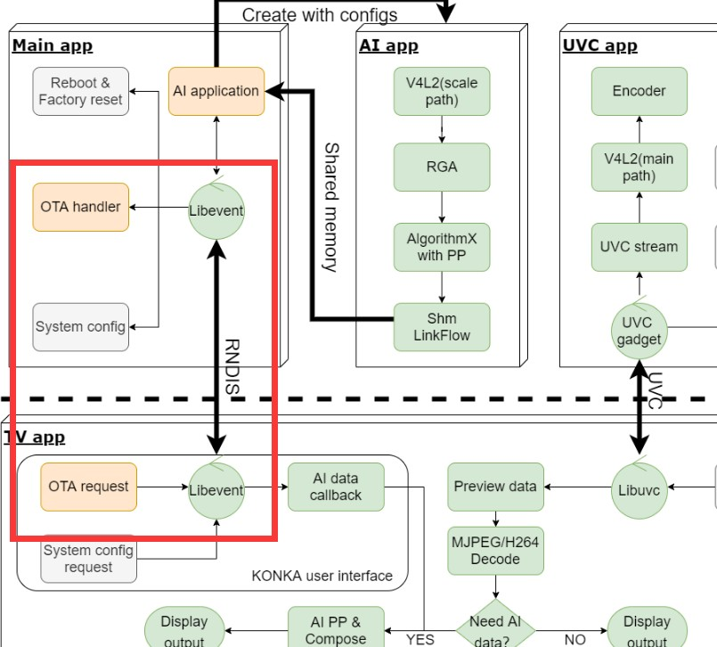

 # 智慧屏**OTA**升级方案


 前言概述

 本文档介绍智慧屏产品形态下的OTA升级方案。

 产品版本

  |芯片名称 |     内核版本|
|-|-|
  |RV1109/1126|   4.19|

 读者对象

 本文档（本指南）主要适用于以下工程师： 技术支持工程师

 软件开发工程师


## 1.  流程框架

 ###   1.  **HOST-DEVICE**



如上图所示，OTA升级由TV端的app发起升级请求，基于RNDIS，通过网络传输，将OTA包传输DEVICE端的/data/update.img目录，DEVICE端收到OTA包后进行MD5校验，校验成功，则执行升级应用 程序进行OTA升级。


## 2. **HOST**端实现

  ### 2.1.  **APK**实现传输功能

APK需要实现对/data/update.img进行分包传输，sendCmd接口是对DEVICE端发送升级命令，sendData接 口是对DEVICE端发送OTA包数据，具体接口说明请查看Rockchip AI Camera 安卓端API接口说明文档， 代码实现可参考以下代码：
```bash
byte[] inUpdate = new byte[0]; //byte数组接受文件的数据
int leaveNum = 0; //文件剩下的字符数
long streamTotal = 0; //接受流的容量
int streamNum = 0; //流需要分开的数量
File inFile = new File("/data/update.img");
FileInputStream inStream = null;
try {
inStream = new FileInputStream(inFile);
} catch (FileNotFoundException e) {
Log.d(TAG, "inStream fail");
e.printStackTrace();
return;
}
mAIDeviceHandler.sendCmd(mDevHandle, AIDevice.RNDIS_CMD_UPGRADE,
"DOWNLOAD");
try {
streamTotal = inStream.available();
} catch (IOException e) {
e.printStackTrace();
}
Log.d(TAG, "streamTotal is:" + streamTotal);
//取得流文件需要分开的数量
streamNum = (int) Math.floor(streamTotal / MAX_BYTE);
//分开文件之后,剩余的数量
leaveNum = (int) streamTotal % MAX_BYTE;
Log.d(TAG, "streamNum is:" + streamNum + "leaveNum is:" + leaveNum);
//文件的容量大于60Mb时进入循环
if (streamNum > 0) {
for (int i = 0; i < streamNum; ++i) {
inUpdate = new byte[MAX_BYTE];
//读入流,保存在byte数组
try {
inStream.read(inUpdate, 0, MAX_BYTE);
} catch (IOException e) {
e.printStackTrace();
}
try {
sleep(10);
} catch (InterruptedException e) {
e.printStackTrace();
}
mAIDeviceHandler.sendData(mDevHandle, inUpdate, MAX_BYTE, 1);
}
}
//写出剩下的流数据
inUpdate = new byte[leaveNum];
try {
inStream.read(inUpdate, 0, leaveNum);
} catch (IOException e) {
e.printStackTrace();
}
mAIDeviceHandler.sendData(mDevHandle, inUpdate, leaveNum, 0);
```

 

## 3.  **DEVICE**端实现
### 3.1  **AB**固件的编译

DEVICE端需要编译生成AB固件，参考Rockchip\_Developer\_Guide\_Linux\_Upgrade\_CN文档，Linux A/B模式章节，进行相应配置生成AB固件。
### 3.2   升级功能的实现

DEVICE端完整接收TV端发送的OTA包后，进行MD5值校验，校验成功，则调用updateEngine升级程序 进行OTA升级。

