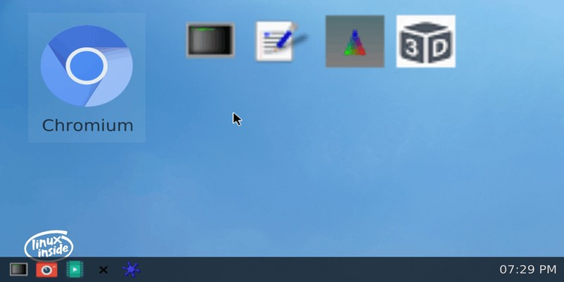
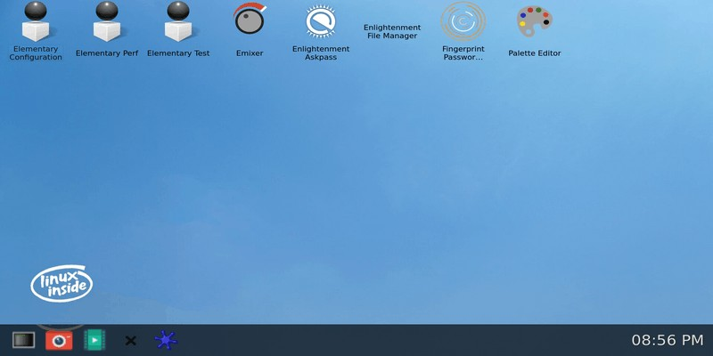

 # **Rockchip Buildroot Developer Guide**


 前⾔概述

 本⽂档介绍基于Rockchip
 的ARM平台，如何使⽤官⽅Buildroot发⾏版来构建和适配相关硬件功能的开发

 ⽂档。

 [Buildroot](https://buildroot.org/)是使⽤交叉编译，为嵌⼊式系统搭建⼀个完整的linux系统的⼯具，操作简单，⾃动。基于原⽣
 的Buildroot上Rockchip已集成相关芯⽚的BSP配置、各硬件模块加速功能的配置、和第三⽅包深度定制开
 发，⽅便客⼾对产品进⾏深度定制和⼆次开发。

 芯⽚⽀持情况

| Buildroot 版本 | SDK 发布时间 | 已验芯片 |
| --- | --- | --- |
| 2021.11 | 2018-06-20 | RK3588、RK356X、RK3399、RK3326/PX30、RK3358、RK3308、RK3399、RK3288、RK312X、RK3036 |
| 2018.02 | 2022-01-15 | RK356X、RK3399、RK3326/PX30、RK3358、RK3308、RK3399、RK3288、RK312X、RK3036、RK3399PRO、RK1808、RK1806、RV1126/RV1109、RK3328 |

 读者对象

 本⽂档（本指南）主要适⽤于以下⼯程师： 技术⽀持⼯程师

 软件开发⼯程师
 ⽬录


## 1.  **Buildroot**第三⽅包下载机制

 SDK中集成了Buildroot第三⽅包下载机制，确保客⼾能够有效下载。现在采⽤了更灵活的机制，
 在原⽣

 dl基础上增加archives⽬录，预置第三⽅包。同时如果⽆法连接Google，将切换到使⽤国内的kgithub镜

 像，并优先从mk脚本指定的源下载，如果失败将尝试mk脚本和defconfig配置的镜像源，最后才是官⽅备
 份源。

 在官⽅树中，⼤多数源码都是使⽤wget来获取；只有小部分通过他们的git，mercurial,或者svn储存库。

## 2. 坏境变量的设定


 在SDK⽬录中：
 ```bash
 source buildroot/envsetup.sh <config_name>
 ```

 config\_name 可以source buildroot/envsetup.sh列出来，选择具体平台编译。

## 3. 编译模块和系统

 选好编译平台，接下来就可以编译每⼀个package，它主要是config、build、install三部分组成，
 具体如下： 进⼊buildroot⽬录。

 运⾏make
 构建和安装特定的包及其依赖项。对于依赖于Buildroot基础设施的包，有许多特殊的make⽬标可以独⽴调⽤。像这样：
 ```bash
 make <package>-<target>
 ```

| command/target | Description |
| --- | --- |
| source | 获取源代码（下载tarball，克隆源存储库等） |
| depends | 构建和安装构建软件包所需的所有相依性 |
| extract | 将源代码放在包构建目录中（提取tarball，复制源代码，等等） |
| patch | 应用补丁，如果有的话 |
| configure | 运行configure命令，如果有的话 |
| build | 运行编译命令 |
| install-staging | 目标包：在暂存目录中，运行软件包的必要安装 |
| install | 目标包：运行前面的两个安装命令<br>主机包：在宿主目录中运行包的安装 |
+----------------------+----------------------------------------------+

 此外，还有⼀些其他有⽤的⽬标

| command/target | Description |
| --- | --- |
| show-depends | 显示构建软件包所需的依赖性 |
| clean | 运行软件包的清除命令，也可以从目标和暂存目录中卸载软件;注意，这并不是针对所有包实现的 |
| dirclean | 删除整个包构建目录 |
| rebuild | 重新运行编译命令 |
| reconfigure | 重新运行配置命令 |

 举个例⼦，对rockchip-test这个包进⾏编译、配置、安装，和进⾏修改重编等。
 ```bash
 ### 编译package
buildroot$ make rockchip-test-configure
buildroot$ make rockchip-test-build
buildroot$ make rockchip-test-install
### 重译package
buildroot$ make rockchip-test-reconfigure
buildroot$ make rockchip-test-rebuild
buildroot$ make rockchip-test-reinstall
### 清除package
buildroot$ make rockchip-test-dirclean
 ```

 如果需要对配置进⾏修改，可运⾏make menuconfig , ⽐如：
 ```bash
 buildroot$ make menuconfig
 ```

 在配置⼯具中，您可以找到相关的帮助来描述每个菜单条⽬的⽬的。⼀旦⼯具完成配置，它将⽣成⼀个
 包含配置描述的 .config ⽂件。该⽂件将被 Makefile
 ⽤于执⾏所需的任务。然后，执⾏ make 命令。

 编译Buildroot系统，直接make即可
```bash
buildroot$ make
```
    保存到rootfs配置⽂件
     buildroot\$ make update-defconfig

 Buildroot编译后输出在output这个⽬录， 它包含⼏个⼦⽬录：

 - images：
 所有镜像（⽂件系统，⽐如ext2/4、squashfs、cpio等格式镜像）存储⽬录。

 - build：
 除了交叉编译的⼯具链之外的所有组件，编译（这包括运⾏所需的⼯具在主机上的Buildroot
 和为⽬标编译的包）。build/⽬录包含每个组件的⼀个⼦⽬录。

 - staging：
 其中的层次结构类似于根⽂件系统层次结构。这个⽬录包含了安装交叉编译⼯具链和为⽬标选择的所有⽤⼾空间包。但是，这个⽬录不是⽤来成为⽬标的根⽂件系统：它包含许多开发⽂
 件、未剥离的⼆进制⽂件和库，这些⽂件和库也⾮常多。对嵌⼊式系统来说是很⼤的。这些开发⽂
 件⽤于为所依赖的⽬标提供编译库和应⽤程序需要的其他库。

 - target：
 它⼏乎包含了⽬标的完整根⽂件系统：除了/dev/⽬录中的设备⽂件，所有需要的东西都是存在（Buildroot不能创建它们，因为Buildroot不会以root⾝份运⾏，也不希望以root⾝份运⾏）。此
外，它没有正确的权限（例如，busybox⼆进制⽂件的setuid）。因此，该⽬录不应该⽤于你的⽬标。相反，您应该使⽤
images/⽬录中构建的映像之⼀。如果你需要在根⽂件系统中⽤NFS挂载外部镜像，必须⽤root⽤⼾在images/⽬录中⽣成镜像。相⽐对于staging/，target/只包含运⾏所选⽬标应⽤程序所需的⽂件和库：开发⽂件（头⽂件）不存在，⼆进制⽂件被剥离。

 - host：包含为主机编译的⼯具的安装，这些⼯具是正确执⾏Buildroot所必需的，包括交叉编译⼯具
 链。
## 4. 交叉编译工具链

Buildroot 提供了不同的交叉编译工具链结构来解决方案：
- 内部工具链端， 在配置界面中选择为 Buildroot 工具链。
- 外部工具链端，在配置界面中选择为内部工具链。


 $ make menuconfig 
    -> Toolchain
         -> Toolchain type ([=y])

SDK 联网使用内部工具链


### 4.1 内部工具链端

内部工具链端是内部的后端，在构建之前，Buildroot 自己构建了一个交叉编译的工具链。用于目标嵌入式系统的用户空间应用程序开发，这个后端是 Buildroot 的历史遗产，并且仅限于使用 libc 库的使用（i.e., glibc 和使用 glibc C 库不支持外部工具链后端和跨界工具链后端解决方案使用 Hglibc 或 eglibc）。

优点：
- 与 Buildroot 有良好的兼容性
- 快速，只构建必要的东西

缺点：
- 在进行流行工作时，需要重建工具链，这需要时间。如果你想减少你的构建时间，考虑使用外部工具链。
- 仅限于使用 C libc 库

### 4.2 外部工具链端

外部工具链后端允许使用现在的预构建交叉编译工具链。Buildroot 能识别几种常见的交叉编译工具链（从 ARM 的 Linaro，ARM 的 Sourcery CodeBench，x86，x86-64，PowerPC，MIPS 和 SuperH，来自 ADI 的 Blackfin 工具链，Xilinx 用于 Microblaze 的工具链，等等）。并且能够自动下载它们，或者它可以指向一个自定义的工具链，可以在本地下载或安装。

**优点**：
允许使用知名的，经改良过测试过的交叉编译工具链。
- 避免交叉编译工具链的构建时间，这使得 Linux 系统的整体构建时间中通常非常重要。
- 不限于使用 libc: glibc 或 uclibc 工具链都可以支持。

**缺点**：
- 如果你的预构建的外部工具链有缺陷，可能很难从工具链供应商那里得到解决方案，除非你构建外部工具链使用交叉工具链。

SDK 目录内设置交叉编译，当 Buildroot 外部工具链使用 SDK prebuilt 目录预置交叉编译时，如下：

| 目录                                         | 说明                  |
|----------------------------------------------|-----------------------|
| prebuilt/gcc/linux-x86/aarch64/gcc-arm-10.3-2021.07-x86_64-aarch64-none-linux-gnu | gcc arm 10.3.1 64位工具链  |
| prebuilt/gcc/linux-x86/arm/gcc-arm-10.3-2021.07-x86_64-arm-none-linux-gnueabihf | gcc arm 10.3.1 32位工具链  |


 可从以下百度云⽹盘地址下载⼯具链：

 [⼯具链下载](https://eyun.baidu.com/s/3smN9fml)

 SDK若需要编译单个模块或者第三⽅应⽤，需交叉编译环境进⾏配置。⽐如RK3562其交叉编译⼯具位于buildroot/output/rockchip\_rk3562/host/usr
 ⽬录下，需要将⼯具的bin/⽬录和aarch64-buildroot-linux-gnu/bin/
 ⽬录设为环境变量，在顶层⽬录执⾏⾃动配置环境变量的脚本：
```bash
source buildroot/envsetup.sh rockchip_rk3562
```

 输⼊命令查看：
 ```bash
 cd buildroot/output/rockchip_rk3562/host/usr/bin
./aarch64-linux-gcc --version
 ```

 此时会打印如下信息：
 ```bash
 aarch64-linux-gcc.br_real (Buildroot) 12.3.0
 ```

    外部⼯具链如果需要SDK⾃带的⼯具链，
    可集成 configs/rockchip/toolchain/\* 相关配置。

## 5. 使⽤**ccache Buildroot**

 默认SDK编译Buildroot都开启ccache，[ccache](https://ccache.samba.org/)是⼀个编译器缓存。缓存位于\$HOME/.buildroot-ccache。如
 果想要删除缓存，只需删除这个⽬录。也可以通过运⾏make ccache-stats来获得关于缓存的统计信息（它的⼤小、命中数、遗漏等）。

## 6 下载包位置


 由Buildroot下载的各种tarball都存储在BR2\_DL\_DIR中，默认情况下是dl⽬录。预置dl包如可提⾼编译效
 率和解决⼀些第三⽅包下载失败的问题。SDK可可通过设置BUILDROOT\_DL\_DIR
 环境来指定⽬录。
 ```bash
 $ export BUILDROOT_DL_DIR <shared download location>
在~/.bashrc中添加上⾯⼀⾏设置环境变量
 ```

 下载位置也可以设置在.config⽂件中，使⽤BR2\_DL\_DIR选项。这个值会被BUILDROOT\_DL\_DIR环境变
 量覆盖。

## 7 如何在**Buildroot**添加新软件包

 如何将新软件包（⽤⼾空间库或应⽤程序）集成到Buildroot中。可参考`builroot/package/rockchip/` 相关包添加。

### 7.1 在软件包⽬录下为您的软件创建⼀个⽬录

 例如`package/rockchip`

### 7.2  **Config.in**⽂件

 然后，创建⼀个Config.in⽂件。这个⽂件将包含与我们的rockchip软件相关的选项描述在配置⼯具中使⽤
 和显⽰。它基本上应该包含:
 ```bash
 menuconfig BR2_PACKAGE_ROCKCHIP
    bool "Rockchip Platform"

if BR2_PACKAGE_ROCKCHIP

config BR2_PACKAGE_ROCKCHIP_HAS_ISP1
    bool
    help
    Has Rockchip ISP1
 ```

### 7.3 **.mk**⽂件

 这是最难的部分。创建⼀个名为rockchip.mk的⽂件。它描述了如何下载、配置、构建、安装等等。根据
 包类型的不同，.mk⽂件必须以不同的⽅式编写，使⽤不同的基础结构：

 - makefile⽤于⼀般软件包（不使⽤⾃动⼯具或CMake）：这些都是基于⼀个类似于使⽤的基础设施
 对于基于⾃动⼯具的包，但是需要开发⼈员做更多的⼯作。他们指定了应该做什么配置、编译、安
 装和清理包。这个基础结构必须⽤于所有的包，不使⽤⾃动⼯具作为他们的构建系统。在将来，可
 能会为其他构建而编写其他专⻔的基础设施系统。

 - 基于⾃动⼯具的软件（autoconf、automake等）的makefile：我们为这些包提供了专⻔的基础设施，
 因为⾃动⼯具是⼀个⾮常常⻅的构建系统。这个基础设施必须⽤于依赖于他们⽤构建系统⾃动⼯具
 的新软件包。

 - 基于cmak基软件的makefile：我们为这些包提供了⼀个专⽤的基础设施，因为CMake是越来越多的
 常⽤的构建系统，具有标准化的⾏为。这个基础结构必须⽤于依赖于CMake的新软件包。

## 8 包名、配置条⽬名称和**makefile**变量关系

 Buildroot中，有⼀些关联：

 - the package name，它是包⽬录名(以及\*.mk⽂件的名称);

 - 配置条⽬名称在 Config.in ⽂件中声明；

 - makefile变量前缀

 必须使⽤以下规则来保持这些要素之间的⼀致性：

 - 包⽬录和\*mk名字是包名本⾝(例如:package/foo-bar\_boo/foo-bar\_boo.mk);

 - ⽬标名称是包名本⾝（如：foo-barboo）;

 - 配置条⽬是⼤写的包名。 - 字符替换为 \_，前缀为BR2\_PACKAGE\_。(例如:BR2\_PACKAGE\_FOO\_BAR\_BOO);

 - 后缀.mk变量的以⼤写的包名为前缀，字符替换为\_(例如：FOO\_BAR\_BOO\_VERSION);

## 9 如何从**github**中添加⼀个软件包

 在github上管理的软件包⼀般没有发布包的下载地址。然而，从github仓库上直接下载软件包也是可以
 的。


 ```bash
 FOO_VERSION = v1.0 # tag or (abbreviated) commit ID
FOO_SITE = http://github.com/<user>/<package>/tarball/$(FOO_VERSION)
 ```
 注意
-   FOO\_VERSION可以是标签也可以是提交ID

-   github⽣成的tarball名称与Buildroot的默认值匹配（例如：foo-1234567.tar.gz），所以它不需要在.mk⽂件中指定。

-   当使⽤提交ID作为版本时，通常情况下，SHA1的前7个字符就⾜够了。

## 10 定制模块开发


 参考/buildroot/configs/rockchip\* 配置开关，各模块可⾃⾏定制开发。

```bash
buildroot$ tree -L 2 configs/rockchip/
configs/rockchip/
├── base # 通⽤基础包
│ ├── base.config
│ ├── common.config
│ ├── kernel.config
│ ├── recovery.config
│ └── tiny.config
├── benchmark.config # benchmark跑分测试⼯具
├── chips # 相关芯⽚配置
│ ├── rk3036_arm.config
│ ├── rk3036.config
│ ├── rk312x_arm.config
│ ├── rk312x.config
│ ├── rk3288_arm.config
│ ├── rk3288.config
│ ├── rk3308_aarch64.config
│ ├── rk3308_arm.config
│ ├── rk3308.config
│ ├── rk3326_aarch64.config
│ ├── rk3326_arm.config
│ ├── rk3326.config
│ ├── rk3399_aarch64.config
│ ├── rk3399_arm.config
│ ├── rk3399.config
│ ├── rk3399pro_aarch64.config
│ ├── rk3399pro_arm.config
│ ├── rk3399pro.config
│ ├── rk3399pro_npu_aarch64.config
│ ├── rk3399pro_npu_arm.config
│ ├── rk3399pro_npu.config
│ ├── rk3528_aarch64.config
│ ├── rk3528.config
│ ├── rk3562_aarch64.config
│ ├── rk3562_arm.config
│ ├── rk3562.config
│ ├── rk3566_rk3568_aarch64.config
│ ├── rk3566_rk3568_arm.config
│ ├── rk3566_rk3568.config
│ ├── rk3588_aarch64.config
│ ├── rk3588_arm.config
│ └── rk3588.config
├── chromium.config # chromium浏览器
├── debug.config # 调试⼯具配置
├── electric.config # 电⼒配置
├── font # 字体配置
│ ├── chinese.config
│ └── font.config
├── fs # ⽂件系统格式配置
│ ├── e2fs.config
│ ├── exfat.config
│ ├── ntfs.config
│ ├── ubifs.config
│ └── vfat.config
├── gdb.config # gdb调试
├── gpu # GPU配置
│ └── gpu.config
├── libcamera.config # libcamera配置
├── locale
│ ├── chinese.config
│ └── locale.config
├── multimedia # 多媒体配置
│ ├── audio.config
│ ├── camera.config
│ ├── gst
│ ├── mpp.config
│ └── rockit.config
├── npu2.config # npu配置
├── powermanager.config #电源管理配置
├── rknn_demo.conf
├── tee_aarch64_v2.config
├── test.config
├── toolchain # ⼯具链配置
│ ├── arm_10_aarch64.config
│ ├── arm_10_armhf.config
│ └── arm_8_armhf.config
├── weston.config # Weston配置
├── wifibt # RKWIFIBT⽹络配置
│ ├── bt.config
│ ├── network.config
│ └── wireless.config
└── x11.config # X
...
```

## 11.桌⾯应⽤

Buildroot默认使⽤基于wayland协议的weston
 drm来作为显⽰后端。如下图：

 

 这些 Weston
 应⽤提供了⼀些状态栏和背景等基础功能配置，如Chromium浏览器、Terminal终端、Launchers配置，摄像头预览，多路视频，GPU，⿏标等demo。如需更多Demo可以通过/etc/xdg/weston/weston.ini.d/\*
 配置添加即可。更多Weston参数配置和使⽤参考 [Weston 开发]

 注意：
 第三⽅UI框架在未经商业授权的情况下可能涉及侵权⻛险。如果在Rockchip平台上使⽤Buildroot
 QT/Enlightenment/Minigui/LVGL等UI框架，需要获得第三⽅授权和技术⽀持，因为Rockchip官⽅不提供相关技术⽀持和维护。

### 11.1  **Weston**应用

 基于Wayland上使⽤的weston客⼾端相关应⽤：
 ```bash
 /usr/bin/#
├── weston-calibrator
├── weston-clickdot
├── weston-cliptest
├── weston-confine
├── weston-content_protection
├── weston-debug
├── weston-dnd
├── weston-editor
├── weston-eventdemo
├── weston-flower
├── weston-fullscreen
├── weston-image
├── weston-multi-resource
├── weston-presentation-shm
├── weston-resizor
├── weston-scaler
├── weston-screenshooter
├── weston-simple-damage
├── weston-simple-dmabuf-egl
├── weston-simple-dmabuf-v4l
├── weston-simple-egl
├── weston-simple-shm
├── weston-simple-touch
├── weston-smoke
├── weston-stacking
├── weston-subsurfaces
├── weston-tablet
├── weston-terminal
├── weston-touch-calibrator
├── weston-transformed
 ```

### 11.2.  **Enlightenment**桌⾯应⽤

 相关配置开启即可，⽐如下：
 ```bash
 BR2_PACKAGE_EFL=y
BR2_PACKAGE_LUAJIT=y
BR2_PACKAGE_EFL_GSTREAMER1=y
BR2_PACKAGE_ENLIGHTENMENT=y
BR2_PACKAGE_EFL_WAYLAND=y
 ```

 
### 11.3  **LVGL**桌⾯应⽤

 相关配置开启即可，⽐如下：
```bash
BR2_PACKAGE_LVGL=y
BR2_PACKAGE_LVGL_COLOR_DEPTH=32
BR2_PACKAGE_LV_DRIVERS=y
BR2_PACKAGE_LV_DRIVERS_USE_DRM=y
BR2_PACKAGE_LVGL_DEMO=y
BR2_PACKAGE_RK_DEMO=y
BR2_PACKAGE_LVGL_DEMO_USE_DRM=y
BR2_PACKAGE_FREETYPE=y
```


## 12. ⽤⼾和密码


 ⽤⼾：root

 密码：rockchip

## 13 **Weston** 开发

 Weston是Wayland开源显⽰协议的官⽅参考实现，Rockchip Buildroot SDK的显⽰服务默认使⽤Weston drm后端。

### 13.1 配置方式

Buildroot SDK 中 Weston 的配置方式有以下几种:

a、启动参数
即启动 Weston 时命令所带参数，如 weston --tty=2，位于 /etc/init.d/S49weston，对应 SDK 代码中位置为: buildroot/package/weston/S49weston

 b、weston.ini 配置文件
位于 /etc/xdg/weston/weston.ini 及 /etc/xdg/weston/weston.ini.d/ 下的.ini 文件，对应 SDK 代码中位置如: buildroot/board/rockchip/common/base/etc/xdg/weston/weston.ini
参考: [https://fossies.org/linux/weston/man/weston.ini.man](https://fossies.org/linux/weston/man/weston.ini.man)

 c、特殊环境变量
此类环境变量一般设置在 /etc/profile.d/weston.sh，对应 SDK 代码中位置为: buildroot/package/weston/weston.sh
 d、动态配置文件
对于 drm 后端显示功能，Buildroot SDK 中的 Weston 提供一些动态配置支持，默认路径为 /tmp/weston_drm.conf，可以通过环境变量 WESTON_DRM_CONFIG 指定。

 e、udev rules
Weston 中输入设备的部分配置需要通过 udev rules。

## 14.  具体配置

### 14.1  屏幕区分
 Weston使⽤output(head)
 name区分屏幕设备。具体信息获取可以通过Weston启动log：
```bash
# weston&
[02:11:29.746] DRM: head 'DSI-1' found ...
```
### 14.2 ⿏标样式及⼤小
 Weston⽀持在weston.ini配置⽂件的shell段设置⿏标样式和⼤小，如
 ```bash
 # /etc/xdg/weston/weston.ini
[shell]
cursor-theme=whiteglass # Buildroot SDK⽀持comix/obsidian/xcursor/xcursortransparent⿏标主题包
cursor-size=24 
 ```

### 14.3 状态栏相关配置
 Weston⽀持在weston.ini配置⽂件的shell段设置状态栏的背景⾊、位置、缩放，以及在launcher段设置快捷
 启动程序，如：
 ```bash
 # /etc/xdg/weston/weston.ini
[shell]
panel-color=0x90ff0000
# 颜⾊格式为ARGB8888
panel-position=bottom
# top|bottom|left|right|none，none为禁⽌
panel-scale=4
# 缩放为4倍
[launcher]
icon=/usr/share/icons/gnome/24x24/apps/utilities-terminal.png
# 图标路径
path=/usr/bin/gnome-terminal
# 快捷启动命令
 ```

### 14.4 背景配置
 Weston⽀持在weston.ini配置⽂件的shell段设置背景图案、颜⾊，以及在desktop-launcher段设置快捷启动
 程序，如
 ```bash
# /etc/xdg/weston/weston.ini
[shell]
background-image=/usr/share/backgrounds/gnome/Aqua.jpg
# 背景图案（壁纸）绝对路径
background-type=tile
# scale|scale-crop|tile
background-color=0xff002244
# 颜⾊格式为ARGB8888，未设置背景图案时⽣效
[desktop-launcher]
icon=/usr/share/icons/hicolor/256x256/apps/chromium.png
# 图标路径
path=/usr/bin/chromium www.baidu.com
# 快捷启动命令
displayname=chromium
# 显⽰名称 
 ```

### 14.5 待机及锁屏配置
Weston的超时待机时⻓可以在启动参数中配置，也可以在weston.ini的core段配置，如：
```bash
# /etc/init.d/S49weston
start_weston()
{
/usr/bin/weston --idle-time=0& # 0为禁⽌待机，单位为秒
}
```
 或者
 ```bash
 # /etc/xdg/weston/weston.ini
[core]
idle-time=10
 ```
 Weston的锁屏可以在weston.ini的shell段配置，如：
 ```bash
 # /etc/xdg/weston/weston.ini
[shell]
locking=false
# 禁⽌锁屏
lockscreen-icon=/usr/share/icons/gnome/256x256/actions/lock.png
# 解锁按钮图案
lockscreen=/usr/share/backgrounds/gnome/Garden.jpg
# 锁屏界⾯背景
 ```

### 14.6 显⽰颜⾊格式配置

 Buildroot SDK内Weston⽬前默认显⽰格式为ARGB8888，对于某些低性能平台，可以在weston.ini的core 段配置为RGB565，如：
```bash
# /etc/xdg/weston/weston.ini
[core]
gbm-format=rgb565
# xrgb8888|argb8888|rgb565|xrgb2101010
```
 也可以在weston.ini的output段单独配置每个屏幕的显⽰格式，如：
```bash
# /etc/xdg/weston/weston.ini
[output]
name=LVDS-1
gbm-format=rgb565
# xrgb8888|argb8888|rgb565|xrgb2101010
```
### 14.7 屏幕⽅向配置


 Weston的屏幕显⽰⽅向可以在weston.ini的output段配置，如
 ```bash
 # /etc/xdg/weston/weston.ini
[output]
name=LVDS-1
transform=rotate-90
# normal|rotate-90|rotate-180|rotate-270|flipped|flipped-90|flipped-
180|flipped-270
 ```

 如果需要动态配置屏幕⽅向，可以通过动态配置⽂件，如：
 ```bash
 echo "output:all:rotate90" > /tmp/.weston_drm.conf # 所有屏幕旋转90度
echo "output:eDP-1::rotate180" > /tmp/.weston_drm.conf # eDP-1旋转180度
 ```

### 14.8 分辨率及缩放配置

 Weston的屏幕分辨率及缩放可以在weston.ini的output段配置，如：
 ```bash
 # /etc/xdg/weston/weston.ini
[output]
name=LVDS-1
mode=1280x800
# 需为屏幕⽀持的有效分辨率
scale=2
# 需为整数倍数，⽀持应⽤内部实现缩放
 ```

 如需要缩放到特定分辨率(物理分辨率不变)，可以通过WESTON\_DRM\_VIRTUAL\_SIZE环境变量配置所
 有屏幕的⼤小，如：
```bash
# /etc/profile.d/weston.sh
export WESTON_DRM_VIRTUAL_SIZE=1024x768
```
 如果需要动态配置分辨率及缩放，可以通过动态配置⽂件，如：
 ```bash
 echo "output:HDMI-A-1:mode=800x600" > /tmp/.weston_drm.conf # 修改HDMI-A-1分辨
率为800x600
echo "output:eDP-1:rect=<10,20,410,620>" > /tmp/.weston_drm.conf # eDP-1显⽰到
(10,20)位置，⼤小缩放为400x600
echo "output:HDMI-A-1:size=1920x1080" > /tmp/.weston_drm.conf # 缩放HDMI-A-1到
1080p，物理分辨率不变
 ```

 以上缩放时，如果硬件VOP显⽰模块不⽀持缩放，则需要依赖RGA处理。

## 14.9 冻结屏幕


 在启动Weston时，开机logo到UI显⽰之间存在短暂切换⿊屏。如需要防⽌⿊屏，可以通过以下⽅式短暂
 冻结Weston屏幕内容：

 使⽤定制\--warm-up运⾏参数在UI启动后开始显⽰
```bash
# /etc/init.d/S49weston
start_weston()
{
/usr/bin/weston --warm-up&
}
```
 或者
 ```bash
 # /etc/init.d/S49weston
start_weston()
{
export WESTON_FREEZE_DISPLAY=/tmp/.weston_freeze # 设置特殊配置⽂件路径
touch /tmp/.weston_freeze # 冻结显⽰
/usr/bin/weston&
sleep 1 && rm /tmp/.weston_freeze& # 1秒后解冻
}
 ```

 ⼜或者
 ```bash
 # /etc/init.d/S49weston
start_weston()
{
echo "output:all:freeze" > /tmp/.weston_drm.conf # 冻结显⽰
/usr/bin/weston&
...
sleep 1 && \
echo "output:all:unfreeze" > /tmp/.weston_drm.conf& # 1秒后解冻
}
 ```

## 14.10 屏幕状态配置

 DRM框架⽀持强制配置屏幕状态:
 ```bash
 echo on > /sys/class/drm/card0-HDMI-A-1/status # 强制HDMI-A-1为接⼊状态
#on|off|detect，detect为热拔插
 ```

 如果需要更具体的动态屏幕状态配置，可以通过动态配置⽂件，如：
 ```bash
 echo "output:DSI-1:off" > /tmp/.weston_drm.conf #关闭DSI（⾮拔出）
echo "output:HDMI-A-1:freeze" > /tmp/.weston_drm.conf #冻结HDMI-A-1
echo "output:eDP-1:on" > /tmp/.weston_drm.conf #开启eDP
echo "compositor:state:off" > /tmp/.weston_drm.conf #显⽰休眠
echo "compositor:state:sleep" > /tmp/.weston_drm.conf #显⽰休眠，触屏唤醒
echo "compositor:state:freeze" > /tmp/.weston_drm.conf #冻结显⽰
echo "compositor:state:on" > /tmp/.weston_drm.conf #显⽰唤醒
 ```

## 14.11 多屏管理

 Buildroot SDK的Weston⽀持多屏镜像同显、多屏异显、屏幕位置配置及热拔插等功能。镜像模式缩放时，如果硬件VOP显⽰模块不⽀持缩放，则需要依赖RGA处理。
相关配置通过环境变量设置，如：
```bash
# /etc/profile.d/weston.sh
export WESTON_DRM_PRIMARY=HDMI-A-1 # 指定主显为HDMI-A-1
export WESTON_DRM_SINGLE_HEAD=1 # 强制单显
export WESTON_DRM_MIRROR=1 # 使⽤镜像模式（多屏同显），不设置此环境变量即为异显
export WESTON_DRM_KEEP_RATIO=1 # 镜像模式下缩放保持纵横⽐，不设置此变量即为强制全屏
export WESTON_DRM_HEAD_MODE=primary # 只使能主显
export WESTON_DRM_HEAD_MODE=internal # 只使能内置显⽰器
export WESTON_DRM_HEAD_MODE=external # 只使能外置显⽰器
export WESTON_DRM_HEAD_MODE=external-dual # 使能所有显⽰器，优先外置显⽰器
export WESTON_DRM_HEAD_FALLBACK=1 # 未匹配到显⽰器时，使能任意⼀个有效显⽰器
export WESTON_DRM_MASTER=1 # 允许关闭未使⽤的屏幕
export WESTON_OUTPUT_FLOW=horizontal # 默认⽔平排列
export WESTON_OUTPUT_FLOW=vertical # 默认垂直排列
export WESTON_OUTPUT_FLOW=same-as # 所有显⽰器默认位置(0,0)
```

 也⽀持在weston.ini的output段单独禁⽤指定屏幕：
```bash
# /etc/xdg/weston/weston.ini
[output]
name=LVDS-1
mode=off
# off|current|preferred|<WIDTHxHEIGHT@RATE>
```
 也可以通过动态配置⽂件，如：
 ```bash
 echo "output:HDMI-A-1:pos=100,200" > /tmp/.weston_drm.conf # 设置HDMI显⽰位置
echo "output:HDMI-A-1:prefer" > /tmp/.weston_drm.conf # 设置应⽤默认显⽰HDMI上
echo "output:HDMI-A-1:primary" > /tmp/.weston_drm.conf # 设置主显为HDMI
 ```

## 14.12 输⼊设备配置
 Weston服务默认需要⾄少⼀个输⼊设备，如⽆输⼊设备，则需要在weston.ini中的core段特殊设置：
```bash
# /etc/xdg/weston/weston.ini
[core]
require-input=false
```
 Weston中如存在多个屏幕，需求绑定把输⼊设备和屏幕，则可通过udev规则配置WL\_OUTPUT，如：
 ```bash
 # /lib/udev/rules.d/99-goodix-ts.rules
ATTRS{name}=="goodix-ts", ENV{WL_OUTPUT}="HDMI-A-1"
 ```

 或者配置WL\_SEAT：
 ```bash
 # /lib/udev/rules.d/99-goodix-ts.rules
ATTRS{name}=="goodix-ts", ENV{WL_SEAT}="seat1"
 ```
```bash
# /etc/xdg/weston/weston.ini
[output]
name=LVDS-1
seat=seat1
```
 或者通过动态配置⽂件，如：
```bash
echo "output:HDMI-A-1:input=*" > /tmp/.weston_drm.conf # 匹配所有设备
echo "output:HDMI-A-1:input=" > /tmp/.weston_drm.conf # 禁⽤输⼊
echo "output:HDMI-A-1:input=event6" > /tmp/.weston_drm.conf
echo "output:HDMI-A-1:input=goodix*" > /tmp/.weston_drm.conf
echo "output:HDMI-A-1:input=goodix-ts" > /tmp/.weston_drm.conf
```
 输⼊设备的vendor id、product id及设备名可通过evtest⼯具查询，如：
 ```bash
 # evtest /dev/input/event8 | head -3
Input driver version is 1.0.1
Input device ID: bus 0x18 vendor 0xdead product 0xbeef version 0x28bb
Input device name: "goodix-ts"
 ```

## 14.13  触屏校准

 Weston如果需要校准触屏，可以通过WESTON\_TOUCH\_CALIBRATION环境变量，如：
 ```bash
 # /etc/profile.d/weston.sh
export WESTON_TOUCH_CALIBRATION="1.013788 0.0 -0.061495 0.0 1.332709
-0.276154"
 ```

 或者通过udev规则配置，如：
 ```bash
 # /lib/udev/rules.d/99-goodix-ts.rules
ATTRS{name}=="goodix-ts", ENV{LIBINPUT_CALIBRATION_MATRIX}="1.013788 0.0
-0.061495 0.0 1.332709 -0.276154
 ```

 校准参数的获取可以使⽤Weston校准⼯具:
 weston-calibrator，⼯具运⾏后会⽣成若⼲随机点，依次点击后输出校准参数，如：Final
 calibration values: 1.013788 0.0 -0.061495 0.0 1.332709 -0.276154

 也可以直接使⽤Weston提供的另⼀个校准⼯具：weston-touch-calibrator，需要配置:
 ```bash
 # /etc/xdg/weston/weston.ini
[libinput]
touchscreen_calibrator=true
calibration_helper=/bin/weston-calibration-helper.sh
 ```

## 14.14 ⽆**GPU**平台配置
SDK中的Weston默认使⽤GPU进⾏渲染合成加速，对于⽆GPU或GPU性能不⾜的平台，也可以选⽤RGA
替代进⾏加速。

具体配置需要Buildroot SDK开启BR2\_PACKAGE\_LINUX\_RGA以及BR2\_PACKAGE\_WESTON\_DEFAULT\_PIXMAN。

## 14.15 **ARM AFBC modifier**配置

 当芯⽚⽀持AFBC时，SDK中的Weston⽀持使⽤基于GPU的AFBC压缩格式进⾏显⽰。具体配置：
 ```bash
 # /etc/profile.d/weston.sh
# export WESTON_DISABLE_ATOMIC=1
export WESTON_ALLOW_GBM_MODIFIERS=1
 ```

## 14.16 降低**UI**分辨率

 当UI性能或DDR带宽不⾜时，可以降低UI的分辨率。具体配置：
 ```bash
 echo "output:HDMI-A-1:down-scale=0.5" >> /tmp/.weston_drm.conf # UI缩放0.5倍
 ```

 具体可参考Weston开发⽂档
 `<SDK>/docs/cn/Linux/Graphics/Rockchip_Developer_Guide_Buildroot_Weston_CN.pdf`


## 15.截屏功能
```bash
buildroot:/# killall weston
buildroot:/# weston --debug&
buildroot:/# weston-screenshooter
就可以截图当前画⾯
```

1.  中⽂显⽰的⽀持

 weston如下配置:
 ```bash
 $ cat /etc/xdg/weston/weston.ini
[terminal]
font=Source Han Sans CN Medium
font-size=14
term=xterm-256color
```

 把buildroot的configs/rockchip/locale/chinese.config导⼊或者开启以下配置:
 ```bash
 BR2_TOOLCHAIN_GLIBC_GCONV_LIBS_COPY=y
BR2_PACKAGE_BUSYBOX_UNICODE=y
# BR2_ENABLE_LOCALE_PURGE is not set
BR2_GENERATE_LOCALE="zh_CN.UTF-8
 ```

 buildroot中环境变量的设定:
 ```bash
 root@rk3588:/# cat /etc/profile.d/lang.sh
export LANG=zh_CN.utf8
 ```

 buildroot中相关提交如下:
 ```bash
 buildroot$ git log --oneline
c476944fee configs: locale.config: Disable BR2_ENABLE_LOCALE_PURGE
f9654d67c8 localedef: Sync with 2018 SDK
2cbb75a54c coreutils: Support bypassing Unicode when printing
15340338dc busybox: Support bypassing Unicode when printing
5e9b8ba00c configs: rockchip: Add locale.config
863eed048e busybox: Support enabling unicode
device/rockchip$ git log --oneline
5c42211 post-rootfs.sh: Support setting LANG environment
 ```
