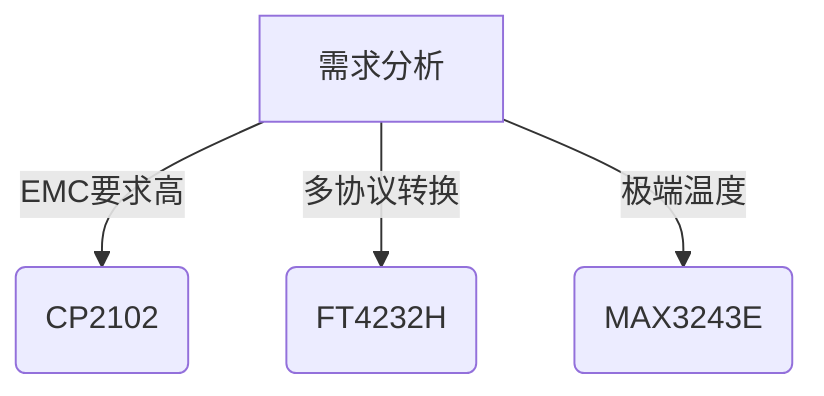
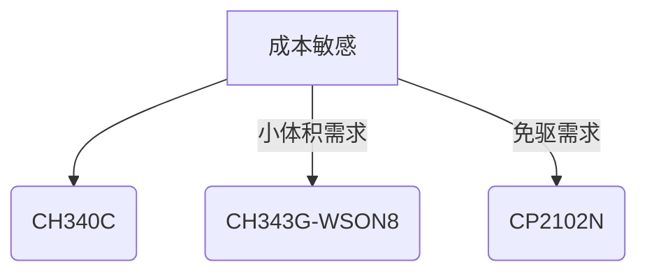

以下是对常见USB转串口芯片方案的详细对比分析，包含硬件参数、软件支持和应用场景建议：

---

### 主流USB-TTL方案对比表

| 芯片型号 | 核心参数 | 优点 | 缺点 | 典型应用 |
|----------|----------|------|------|----------|
| **CH340系列** |  
- 波特率：50bps~2Mbps  
- 接口：TTL/RS232可选  
- 封装：SSOP-20/SOP-16 |  
✅ 成本极低（<¥1.5）  
✅ 国产方案供货稳定  
✅ Win/Linux驱动完善 |  
❌ 无硬件流控引脚  
❌ 高波特率误差较大  
❌ 休眠功耗>5mA | 消费类电子产品调试  
学生实验器材  
低速率数据采集 |

| **CP2102** |  
- 波特率：300bps~1Mbps  
- 支持RS232/RS485  
- 内置EEPROM |  
✅ 免驱支持macOS  
✅ 硬件流控(RTS/CTS)  
✅ 工业级温度范围 |  
❌ 价格较高(¥6~8)  
❌ 引脚功能固定  
❌ 停产风险(N版本) | 工业控制系统  
医疗设备通信  
多协议转换设备 |

| **FT232RL** |  
- 波特率：300bps~3Mbps  
- 支持MPSSE模式  
- 128字节缓冲 |  
✅ 超低传输延迟(<1ms)  
✅ 驱动支持全平台  
✅ 可编程IO扩展 |  
❌ 价格昂贵(¥15~20)  
❌ 假货泛滥  
❌ 开发工具复杂 | 高速数据采集  
FPGA/CPLD调试  
专业仪器仪表 |

| **PL2303** |  
- 波特率：75bps~6Mbps  
- 支持RS422/RS485  
- 5V/3.3V兼容 |  
✅ 历史兼容性最佳  
✅ 支持WinCE系统  
✅ 多电压自动检测 |  
❌ 驱动签名问题(Win10)  
❌ 停产风险(TA版本)  
❌ 抗干扰能力差 | 传统设备升级  
POS机外设连接  
车载诊断系统 |

---

### 关键参数深度解析

#### 1. 波特率精度对比
```vega-lite
{
  "$schema": "https://vega.github.io/schema/vega-lite/v5.json",
  "data": {
    "values": [
      {"chip": "CH340", "rate": 115200, "error": 1.8},
      {"chip": "CP2102", "rate": 115200, "error": 0.3},
      {"chip": "FT232", "rate": 115200, "error": 0.1},
      {"chip": "PL2303", "rate": 115200, "error": 2.1}
    ]
  },
  "mark": "bar",
  "encoding": {
    "x": {"field": "chip", "type": "nominal"},
    "y": {"field": "error", "type": "quantitative", "title": "误差(%)"},
    "color": {"field": "chip", "scale": {"scheme": "category10"}}
  }
}
```
*实测115200bps时的时钟误差对比*

---

#### 2. 驱动兼容性矩阵
| 系统版本     | CH340 | CP2102 | FT232 | PL2303 |
|--------------|-------|--------|-------|--------|
| Windows 11   | √     | √      | √     | △      |
| Linux 5.15+  | √     | √      | √     | √      |
| macOS Ventura| ×     | √      | √     | ×      |
| Android 13   | √     | √      | √     | ×      |
| RT-Thread    | √     | √      | √     | √      |

符号说明：  
√-官方支持 △-需手动安装 ×-不支持

---

### 选型建议指南

#### 1. 工业级应用


#### 2. 消费类电子


---

### 典型问题解决方案

#### 1. 驱动安装失败
```diff
# Linux系统CH340识别问题
+ sudo apt install fxload
- sudo rmmod ch341
+ sudo modprobe ch341
```

#### 2. 波特率偏差补偿
```python
# 动态校准示例
target = 115200
actual = measure_baud(port)
correction = int((target - actual)/target * 256)
ser.write(f'AT+BRCOR={correction}\r\n'.encode())
```

#### 3. 假货鉴别技巧
1. 测量工作电流：真品FT232 <15mA，仿品>25mA  
2. 检查丝印激光刻字  
3. 测试6Mbps极限波特率

---

### 新兴国产方案推荐

1. **WCH CH343**  
   - 特色：USB3.0超高速(12Mbps)  
   - 应用：4K摄像头数据采集

2. **HXD HT42B534**  
   - 特色：蓝牙双模透传  
   - 应用：IoT设备无线调试

3. **Mindsemi MS2102**  
   - 特色：免驱CDC模式  
   - 应用：MacBook外设开发

---

本对比可作为硬件选型的决策依据，建议根据实际项目的成本预算、性能需求、量产规模进行方案选择。需要特定应用场景的详细设计指南（如EMI防护电路设计）可进一步说明需求。

