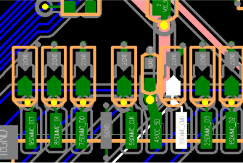
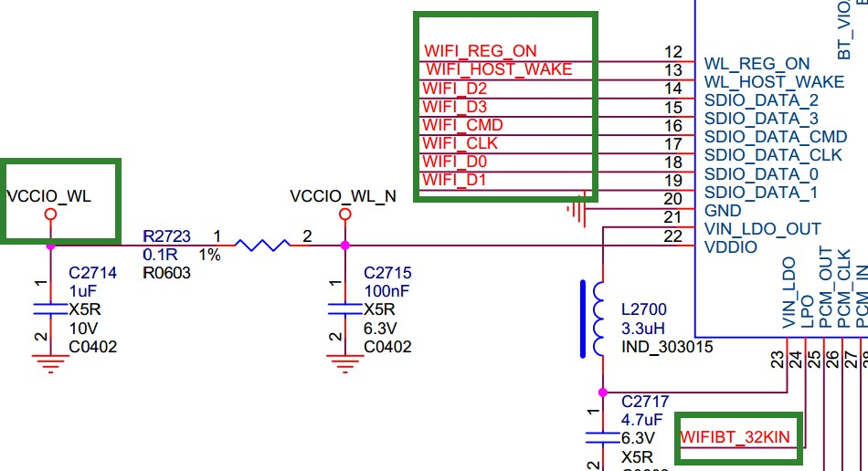
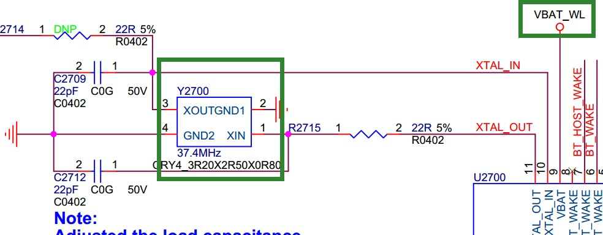
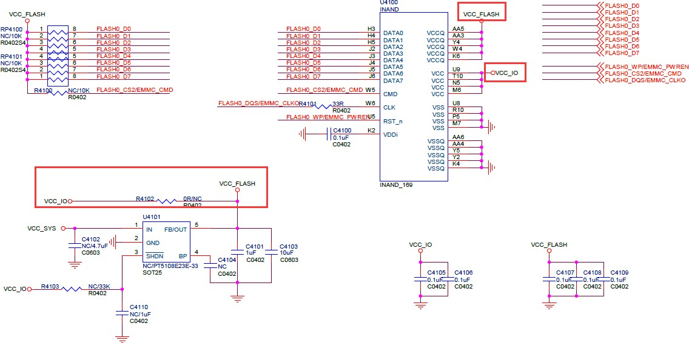
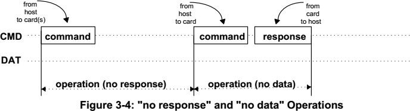
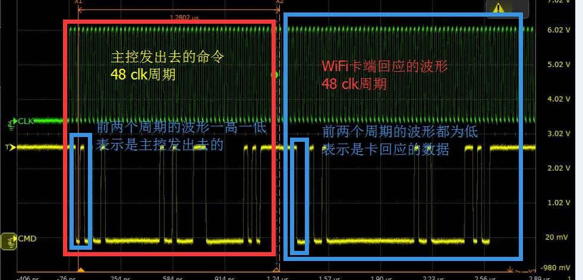

# **SDMMC SDIO eMMC** 开发指南


前⾔概述

产品版本


|  芯⽚名称 | 内核版本        |
|-----           |-|
|  全系列   | 4.4, 4.19，5.10 |

读者对象

本⽂档（本指南）主要适⽤于以下⼯程师： 技术⽀持⼯程师

软件开发⼯程师


## 1. DTS 配置

### 1.1 SDMMC 的 DTS 配置说明

1. **max-frequency = <150000000;**  
   设置 SD 卡运行频率，最大值为 150MHz。实际频率会根据 SD 卡模式自动调整，用户无需手动干预。

2. **supports-sd;**  
   必须添加此配置以启用 SD 卡功能，否则无法初始化 SD 卡。

3. **bus-width = <4;**  
   定义 SD 卡数据线宽度，支持 `1` 或 `4` 线模式。非法值将强制使用 1 线模式。

4. **cap-mmc-highspeed; cap-sd-highspeed;**  
   标识卡槽支持高速 SD 卡。若不配置，则默认不支持高速模式。

5. **配置 SD3.0 模式**  
   - 芯片需支持 SD3.0（如 3288、3328、3399、3368）。
   - 需配置 `vqmmc` 电源，并添加以下速度模式：

```bash
sd-uhs-sdr12: 时钟频率不超过24M
sd-uhs-sdr25: 时钟频率不超过50M
sd-uhs-sdr50: 时钟频率不超过100M
sd-uhs-ddr50: 时钟频率不超过50M，并且采⽤双沿采样
sd-uhs-sdr104: 时钟频率不超过208M
```
6. **配置 SD 卡 3V3 电源**  
  如果硬件上使⽤的电源控制引脚是芯⽚上 SDMMC 控制器默认的电源控制脚：sdmmc_pwren，那么只需
要在 pinctrl 上配置为 sdmmc_pwren 的功能脚，并在 sdmmc 节点内引⼊到 default 的 pinctrl 内即可，例如
以 RK312X 为例：
```dts
sdmmc_pwren: sdmmc-pwren {
    rockchip,pins = <1 RK_PB6 1 &pcfg_pull_default;
};
    pinctrl-0 = <&sdmmc_pwr &sdmmc_clk &sdmmc_cmd &sdmmc_bus4;
```
如果硬件是使⽤其他 GPIO 作为 SD 卡设备的 3V3 电源控制引脚，则需要将其定义成 regulator 来使⽤，
并在 sdmmc 的节点内将其引⽤到 vmmc-supply 内，例如：：
```dts
sdmmc_pwr: sdmmc-pwr {
    rockchip,pins = <7 11 RK_FUNC_GPIO &pcfg_pull_none;
};
vcc_sd: sdmmc-regulator {
    compatible = "regulator-fixed";
    gpio = <&gpio7 11 GPIO_ACTIVE_LOW;
    pinctrl-names = "default";
    pinctrl-0 = <&sdmmc_pwr;
    regulator-name = "vcc_sd";
    regulator-min-microvolt = <3300000;
    regulator-max-microvolt = <3300000;
    startup-delay-us = <100000;
    vin-supply = <&vcc_io;
}
&sdmmc {
    vmmc-supply = <&vcc_sd;
};
```

7.  配置 SD 卡热拔插检测脚

如果检测脚是直接连接到芯⽚的 SDMMC 控制器的 sdmmc\_cd
脚，则请直接将该脚位配置为功能脚，并在 sdmmc 节点的 default 的 pinctrl
内进⾏引⽤即可。

如果检测脚是使⽤其他 GPIO，则需要在 sdmmc 节点内使⽤ cd-gpios
来进配置，例如
`cd-gpios = <&gpio4 24 GPIO_ACTIVE_LOW;`

如果使⽤ GPIO 的检测脚，但是⼜要求反向检测⽅式(即 SD
卡插⼊时检测脚为⾼电平)，则需要追加
`cd-inverted;`
### 1.2  **SDIO** 的 **DTS** 配置说明


1. `max-frequency = <15000000>;`

   此项同 SD 卡的配置，最大运行频率不超过 150Mhz；SDIO2.0 卡最大 50M，SDIO3.0 最大支持 150M。

2. `supports-SDIO;`

   此配置项标识此插槽为 SDIO 功能，为必须添加项。否则无法初始化化 SDIO 外设。

3. `bus-width = <4>;`

   此配置同 SD 功能。

4. `cap-sd-highspeed;`

   此配置同 SD 卡功能，作为 SDIO 外设，也有区分是否为 highspeed 的 SDIO 外设。

5. `cap-sdio-irq;`

   此配置标识 SDIO 外设（通常是 Wifi）是否支持 sdio 中断，如果你的外设是 OOB 中断，请不要加入此项。支持哪种类型的中断请联系 Wifi 厂商确认。

6. `keep-power-in-suspend;`

   此配置表示是否支持挂起模式，请根据加入该选项。Wifi 一般都有深度唤醒的要求。

7. `mmc-pwrseq = <&sdio_pwreq>;`

   配置项 SDIO 外设（一般是 Wifi）的电源控制，为必须项，否则 Wifi 无法正常工作。请参考下面的例子，检查是否和我们提供的硬件平台电源管理级别需要进行配置。
```dts
sdio_pwrseq:sdio-pwrseq {
    compatible ="mmc-pwrseq-simple";
    clocks = <&rk808 1>;
    clock-names ="ext_clock";
    pinctrl-names ="default";
    pinctrl-0 =<&wifi_enable_h>;
    /*
    * On the module itself this isone of these (depending
    * on the actual cardpopulated):
    * - SDIO_RESET_L_WL_REG_ON
    * - PDN (power down when low)
    */
    reset-gpios = <&gpio0 10GPIO_ACTIVE_LOW>; /* GPIO0_B2 */
};
```
8. `non-removable;`

   此项表示该插槽为不可移动设备且此项为 SDIO 设备，设备必须添加项。

9. `num-slots = <4>;`

   此配置同 SD 卡的配置。

10. `sd-uhs-sdr104;`

    此项配置设置定义 SDIO 设备是否支持 SDIO3.0 模式。前提是需要 Wifi 的 IO 电压为 1.8v。

### 1.3 eMMC 的 DTS 配置

1. `max-frequency = <15000000>;`

   eMMC 普通模式 50M，eMMC HS200 最大支持 150M；

2. `supports-emmc;`

   此配置标识此插槽为 emmc 功能，为必须添加项。否则无法初始化化 emmc 外设。

3. `bus-width = <4>;`

   此配置同 SD 功能。

4. `mmc-ddr-1.8v;`

   此配置表示支持 50MDDR 模式；

5. `mmc-hs200-1.8v;`

   此配置表示支持 HS200 模式；

6. `mmc-hs400-1.8v; mmc-hs400-enhanced-strobe;`

   此项配置表示支持 HS400 模式以及 HS400ES 模式，仅 RK3399 芯片支持。

7. `non-removable;`

   此项表示该插槽为不可移动设备。此项为必须添加项。


## 2.  常⻅问题排查

###    2.1.  硬件问题分析




从左到右依次是：

DET -检测脚
DATA1 -数据线

DATA0 
GND

CLK -时钟

VCC\_SD - SD 卡供电电源

VCCIO\_SD 数据线的 -IO 供电电源

CMD -命令线

DATA3 
DATA2

除了 DET/CLK/GND 外，其它的 DATA0-3/VCC_SD/VCCIO_SD/CMD 必须都为 3.3v 左右，最小不能低
于 3v；DET 脚插⼊为低，拔出为⾼； DATA0-3/CMD 的电压都是 VCCIO_SD 供给的，所以 DATA0-
3/CMD 必须跟 VCCIO_SD 保持⼀致，而 VCC_SD 和 VCCIO_SD 要保持⼀致（NOTE: SD 3.0，要求
VCCIO_SD 为 1.8v）；
如果 VCC_SD/VCCIO_SD 的电源是⻓供电，那么请保证 VCC_SD 和 VCCIO_SD 在卡拔插时不会有塌
陷；

2. SDIO

{width="5.858094925634296in"
height="1.161874453193351in"}

 {width="6.136760717410324in"
 height="3.332498906386702in"}

{width="6.130754593175853in"
height="2.4in"}
⾸先看下硬件：主要的部分都在绿⾊⽅框内
WIFI_D0~3：数据线，平时为⾼，电压取决于 VCCIO_WL 的电压；
WIFI_CMD：命令线，平时为⾼，电压取决于 VCCIO_WL 的电压；
WIFI_CLK：时钟，平时为低，电压取决于 VCCIO_WL 的电压；
VBAT_WL：WIFI 模组供电电源，⼀直都为⾼，供电需打印 3.3v；
VCCIO_WL：给 DATA/CMD/CLK 的 IO 供电电源，可以为 3.3 或者 1.8v，但 SDIO3.0
必须为 1.8v；
WIFI_REG_ON: 正常⼯作时为 3.3v，WiFi 关闭时为 0v；
两个晶振：32K 和 26M/37.4M,正常⼯作时都会有波形输出；

3.eMMC

 {width="6.037495625546807in"
 height="3.0121872265966756in"}

 eMMC 有效电压的组合：

{width="5.987472659667541in"
height="1.173853893263342in"}

VCC_FLASH 对应 VCC；
VCC_IO 对应 VCCQ；
确保 eMMC_CMD/DATA0~7/VCC_IO 电压都⼀致（1.8 或 3.3v）；
确保 VCC_FLAHS/VCC_IO 的电压在开机和运⾏时或者休眠唤醒时必须保持稳定、不能有塌陷或者纹波
过⼤的情况；
有条件的话，测下 clk 和 cmd 以及 data 的波形质量，确保波形正常；

### 2.2 波形分析


下图是 SD 卡识别模式时的波形时序图（sdio、emmc ⼀样）

简单说⼀下识别 SD 卡的⽅式：主控发出 48clk 并携带 48bit 的数据发给 SD
卡，而 SD 卡要回应给主控48clk 加 48bit 的数据；如下图：





绿⾊：SDMMC\_CLK

⻩⾊：SDMMC\_CMD: SDMMC\_CMD 空闲时⼀直处于⾼电平；

主控发出的波形：当最开始的两个电平有⼀⾼⼀低时，是主控发出去的命令；

SD 卡响应的波形： 当最开始的两个电平有连续的两个低电平是表⽰卡端有响应；

其次主控和响应⼀般包含 48 个 bit 的数据，所以 48 个 clk为⼀个完整的包。要确认的就是：主控发出去命令包后,SD 卡端是否有响应。

### 2.3  **LOG** 分析

1.  正确识别 SD 卡的 LOG

```bash
[ 293.194013] mmc1: new high speed SDXC card at address 59b4
[ 293.198185] mmcblk1: mmc1:59b4 00000 59.6 GiB
[ 293.204351] mmcblk1: p1
```

如果在内核看到这样的打印，说明 SD
卡已经被正确识别，并且已经有⼀个可⽤的分区 p1。如果在⽤⼾界⾯看不到 SD
卡设备或者设备不可使⽤，请排查⽤⼾态磁盘守护进程，如
vold。另外可⼿动验证分区是否可以使⽤
`mount -t vfat /dev/block/mmcblk1p1 /mnt`
或者
`mount -t vfat /dev/block/mmcblk1 /mnt`
然后到 mnt ⽬录下看下是否有 SD 卡⾥⾯的⽂件

   2 开机不读卡,运⾏时拔插 OK：⼤概率时电源问题

例如：拔掉所有电源，发现查着 HDMI 发现有漏电到 VCC\_SD
卡⾥⾯；或者使⽤外接电源进⾏测试。

   3 挂载失败：

如果已经看到(1)中的 LOG，但是看到如下挂载失败的 LOG
```bash
[ 2229.405694] FAT-fs (mmcblk1p1): bogus number of reserved sectors
[ 2229.405751] FAT-fs (mmcblk1p1): Can't find a valid FAT filesystem
```

请格式化 SD 卡为 FAT32 ⽂件系统；

或者 NTFS: make menuconfig 选择 NTFS ⽂件系统的⽀持即可；

4.  概率性不识别：
```bash
mmc1: new high speed SD card at address b368
mmcblk1: mmc1:b368 SMI 486 MiB
[mmc1] Data transmission error !!!! MINTSTS: [0x00002000]
dwmmc_rockchip ff0c0000.rksdmmc: data FIFO error (status=00002000)
mmcblk1: error -110 sending status command, retrying
need_retune:0,brq->retune_retry_done:0.
```

降频和增加卡检测延时增强电源稳定性，如果降频 OK 的话，请检查硬件
layout；
```bash
&sdmmc {
card-detect-delay = <1200>;
｝
```

5.  TF 卡已经 mount，但不能访问 TF
     卡⽬录，看起来是卡⽂件系统问题，但卡在 Windows 下可以访问。

请尝试使⽤ fsck 对 TF 卡做修复。

6.  硬件问题，io 电压异常
```dts
Workqueue: kmmcd mmc_rescan
[<c0013e24>] (unwind_backtrace+0x0/0xe0) from [<c001172c>] (show_stack+0x10/0x14)
[<c001172c>] (show_stack+0x10/0x14) from [<c04fa444>] (dw_mci_set_ios+0x9c/0x21c)
[<c04fa444>] (dw_mci_set_ios+0x9c/0x21c) from [<c04e7748>]
(mmc_set_chip_select+0x18/0x1c)
[<c04e7748>] (mmc_set_chip_select+0x18/0x1c) from [<c04ebd5c>]
(mmc_go_idle+0x94/0xc4)
[<c04ebd5c>] (mmc_go_idle+0x94/0xc4) from [<c0748d80>]
(mmc_rescan_try_freq+0x54/0xd0)
[<c0748d80>] (mmc_rescan_try_freq+0x54/0xd0) from [<c04e85d0>]
(mmc_rescan+0x2c4/0x390)
[<c04e85d0>] (mmc_rescan+0x2c4/0x390) from [<c004d738>]
(process_one_work+0x29c/0x458)
[<c004d738>] (process_one_work+0x29c/0x458) from [<c004da88>]
(worker_thread+0x194/0x2d4)
[<c004da88>] (worker_thread+0x194/0x2d4) from [<c0052fb4>] (kthread+0xa0/0xac)
[<c0052fb4>] (kthread+0xa0/0xac) from [<c000da98>] (ret_from_fork+0x14/0x3c)
1409..dw_mci_set_ios: wait for unbusy timeout....... STATUS = 0x306 [mmc1]
```

请检查 CMD 线与 DATA 的电压是否在空载状态下为⾼电平。并且检测 IO
电压是否过低，以及 IO 电压与电源域的配置是否⼀致。如果是 SDIO
接口，建议排查 VCCIO\_WL 电压，VBAT\_WL 和WIFI\_REG\_ON
以及晶振是否正常。另可以尝试排查走线太⻓导致波形质量很差，降频进⾏测试。

### 2.4 其他问题


1.  u-boot下SD卡1线模式⼯作正常，4线模式⼯作报错

⼤部分SOC的SD卡都会和JTAG复⽤，在没有插卡时，SOC会⾃动切换IO到JTAG功能。

EVB参考板会按SOC要求设计SD
DET低电平为有插卡，个别客⼾会修改原理图，设计SD
DET⾼电平为有插卡，这时SOC会误判，把IO切换到JTAG功能。

解决办法： 查找对应芯⽚GRF寄存器定义，配置force\_jtag为Disable，关闭JTAG
IO⾃动切换功能。RV1126参考代码：
```dts
diff --git a/arch/arm/mach-rockchip/rv1126/rv1126.c b/arch/arm/machrockchip/rv1126/rv1126.c
index 311310d3f2..29b694df9c 100644
--- a/arch/arm/mach-rockchip/rv1126/rv1126.c
+++ b/arch/arm/mach-rockchip/rv1126/rv1126.c
@@ -544,6 +544,9 @@ void board_debug_uart_init(void)
#ifndef CONFIG_TPL_BUILD
int arch_cpu_init(void)
{
    + struct rv1126_grf * const grf = (void *)GRF_BASE;
    +
    + writel(0x00100000, &grf->iofunc_con3);
    /*
    * CONFIG_DM_RAMDISK: for ramboot that without SPL.
    */
```
2.  SD卡漏电导致卡⼯作异常

当SD模块的IO电源不可控时，若插⼊卡后，卡的3V3供电还未提供前，此时会从IO上产⽣漏电倒灌到SD
卡，使得SD卡的3V3供电有半电平，易使得个别卡概率性异常，表现为平台兼容性差。因此为了解决漏
电问题，驱动会在插⼊卡时，先将SD卡IO设置为下拉，释放掉漏电后再对SD卡的3V3电源进⾏上电。当SD卡上电完成之后再恢复SD卡的IO为SD功能脚并设置上拉，从而避免漏电可能导致的⼀系列异常。对
SD卡兼容性要求较⾼的客⼾，请确认SDK内核的drivers/mmc/host/dw\_mmc.c⽂件包含了提交"mmc:
dw\_mmc: Add normal and idle pinctrl
control"，并参考下⾯的例⼦，修改⾃⼰的DTS节点，新增pinctrl的idle模式，需要根据实际板⼦的使⽤情况，配置所需的clk、cmd和data线：
```dt--- a/arch/arm/boot/dts/rv1126-evb-v10.dtsi
+++ b/arch/arm/boot/dts/rv1126-evb-v10.dtsi
wireless_wlan: wireless-wlan {
@@ -104,9 +99,14 @@ sdmmc_pwren: sdmmc-pwren {
rockchip,pins = <0 RK_PA1 RK_FUNC_GPIO &pcfg_pull_none>;
};
+ sdmmc0_idle_pins: sdmmc-idle-pins {
+ rockchip,pins =
+ <3 RK_PA2 RK_FUNC_GPIO &pcfg_pull_down>,
+ <3 RK_PA3 RK_FUNC_GPIO &pcfg_pull_down>,
+ <3 RK_PA4 RK_FUNC_GPIO &pcfg_pull_down>,
+ <3 RK_PA5 RK_FUNC_GPIO &pcfg_pull_down>,
+ <3 RK_PA6 RK_FUNC_GPIO &pcfg_pull_down>,
+ <3 RK_PA7 RK_FUNC_GPIO &pcfg_pull_down>;
+ };
};
@@ -140,21 +140,18 @@ &sdio {
};
&sdmmc {
max-frequency = <200000000>;
no-sdio;
no-mmc;
bus-width = <4>;
cap-mmc-highspeed;
cap-sd-highspeed;
disable-wp;
- pinctrl-names = "default";
+ pinctrl-names = "normal", "idle";
pinctrl-0 = <&sdmmc0_clk &sdmmc0_cmd &sdmmc0_det &sdmmc0_bus4>;
+ pinctrl-1 = <&sdmmc0_idle_gpios &sdmmc0_det>;
vmmc-supply = <&vcc3v3_sd>;
vqmmc-supply = <&vccio_sd>;
status = "okay";
};
```
