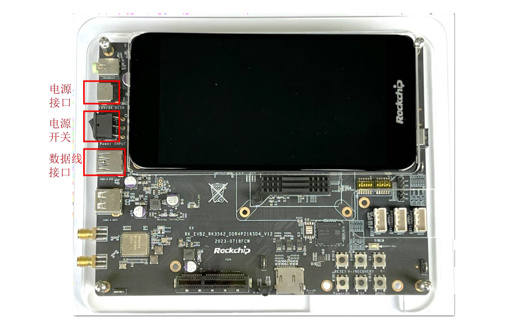
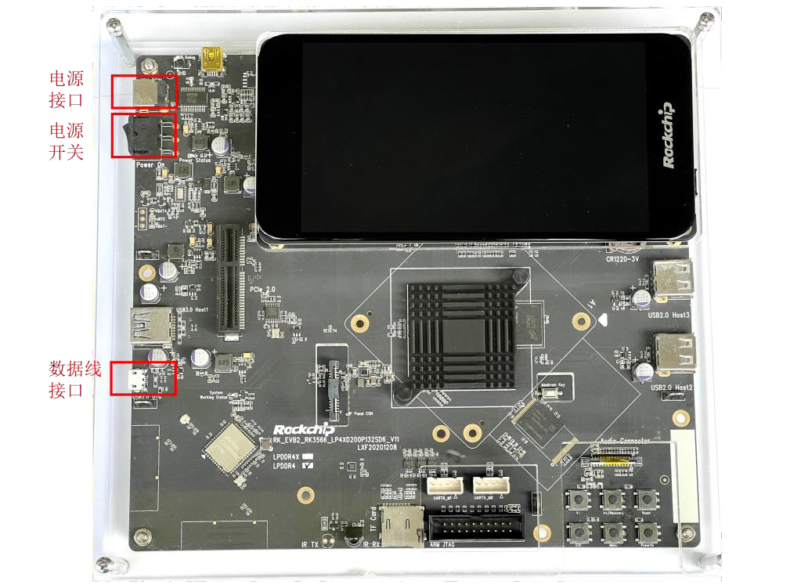
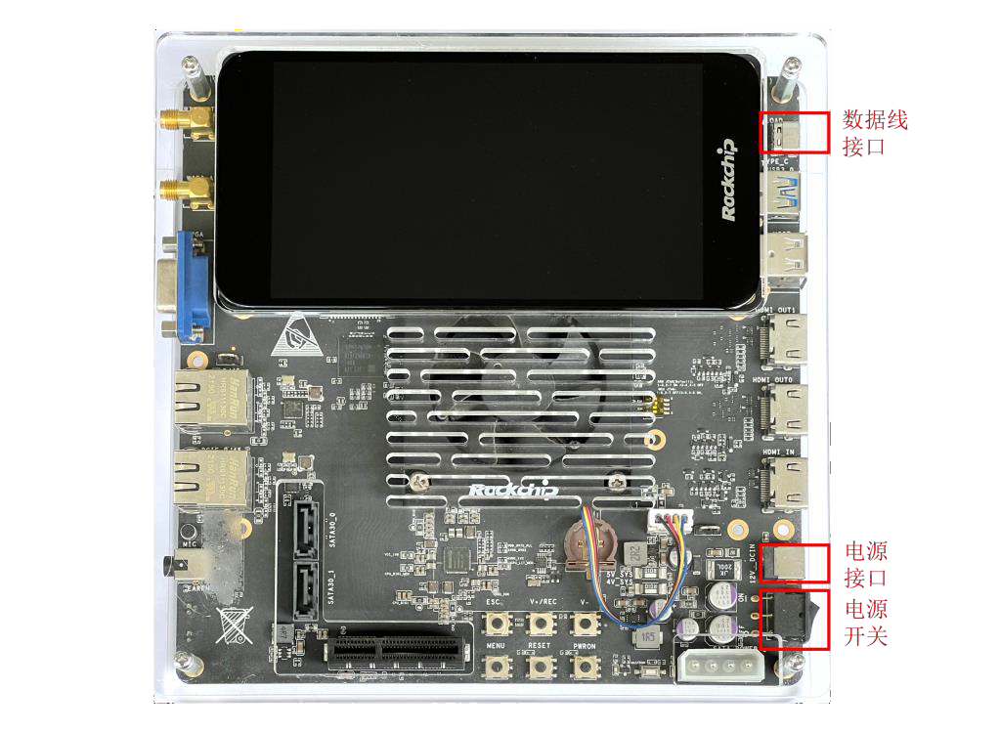
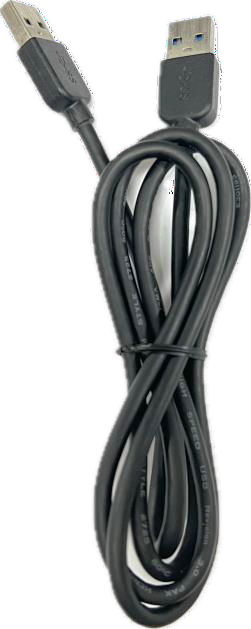
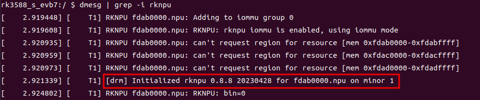

**RKNN SDK 快速上手指南**
------------------------------

[TOC]

# 1. **主要说明**

此文档面向零基础用户详细介绍如何快速在计算机上使用 RKNN-Toolkit2 完成模型转换，
并通过 RKNPU2 部署到 Rockchip 开发板上。本文所用示例已集成到 RKNN Model Zoo 中。
支持的平台：RK3562、RK3566 系列、RK3568 系列、RK3588 系列。

# 2. 准备开发板
本章将介绍如何将开发板连接到计算机。分为两个部分：
-   开发板和连接工具介绍

-   连接开发板

1.  **开发板**


图 2-1 RK3562 开发板


图 2-2 RK3566 开发板


图 2-3 RK3568 开发板


图 2-4 RK3588 开发板

2.  **连接开发板和计算机的数据线**



图 2-5 USB-A --- USB-A 数据线（适用于 RK3562/RK3568 开发板）


图 2-6 USB-A --- Micro USB 数据线（适用于RK3566 开发板）


图 2-7 USB-A --- USB-C 数据线（适用于 RK3588 开发板）


3. **电源适配器**


图 2-8 输出 12V-2A 的电源适配器（适用于 RK3562/RK3566/RK3568 开发板）


图 2-9 输出 12V-3A 的电源适配器（适用于 RK3588 开发板）

## 2.2 连接开发板

下面以 RK3568 为例说明如何将开发板连至计算机：

1.  准备一台操作系统为 Ubuntu18.04 / Ubuntu20.04 / Ubuntu22.04的计算机。

2.  找到下图中电源接口的位置，连接开发板电源适配器。

3.  使用数据线连接开发板与计算机（注意，由于生产批次不同，开发板的数据线接口类型和位置可能会发生变化。通常情况下，开发板上印有 OTG 字样的接口为数据线接口）。

4.  
图 2-10 RK3568 开发板

打开电源开关，等待开发板系统启动完成。

5.  查看开发板是否连接至计算机

在计算机的终端窗口（命令行界面）中，执行以下命令：
```bash
# 如果没有安装过 adb，请先使用 sudo apt install adb 安装
adb devices
```
连接成功时输出信息如下，其中 13af7b28115662cd 为 RK3568 的设备
ID。若无设备显示请参考第 [6.1](#命令-adb-devices-查看不到设备)
章节进行排查。
```bash
$ adb devices
List of devices attached
13af7b28115662cd device
```
# 3. 准备开发环境

本章介绍如何在计算机中直接安装开发环境，后续的示例程序运行过程也将以直接安装为例说明。如果需要在
Docker 环境中运行示例程序，可以参考第
[5](#docker-中运行-rknn-python-demo可选) 章中的内容准备开发环境。

本章分为四个部分：

-   下载 RKNN 相关仓库

- 安装RKNN-Toolkit2 环境

-   安装编译工具

-   安装板端 RKNPU2 环境

## 3.1 下载 RKNN 相关仓库

建议新建一个目录用来存放 RKNN 仓库，例如新建一个名称为 Projects
的文件夹，并将
RKNN-Toolkit2 和 RKNN Model Zoo 仓库存放至该目录下，参考命令如下：
```bash
# 新建 Projects 文件夹
mkdir Projects
# 进入该目录
cd Projects
# 下载 RKNN-Toolkit2 仓库
git clone https://github.com/airockchip/rknn-toolkit2.git --depth 1
# 下载 RKNN Model Zoo 仓库
git clone https://github.com/airockchip/rknn_model_zoo.git --depth 1
# 注意：
# 1.参数 --depth 1 表示只克隆最近一次 commit
# 2.如果遇到 git clone 失败的情况，也可以直接在 github 中下载压缩包到本地，然后
解压至该目录
```
整体目录结构如下：
```bash
Projects
├── rknn-toolkit2
│ ├── doc
│ ├── rknn-toolkit2
│ │ ├── packages
│ │ ├── docker
│ │ └── ...
│ ├── rknpu2
│ │ ├── runtime
│ │ └── ...
│ └── ...
└── rknn_model_zoo
 ├── datasets
 ├── examples
 └── ...
```
## 3.2 安装 RKNN-Toolkit2 环境
### 3.2.1 安装 Python
如果系统中没有安装 Python 3.8（建议版本），或者同时有多个版本的 Python
环境，建议使用 Conda 创建新的 Python 3.8 环境。

#### 3.2.1.1 安装 Conda

在计算机的终端窗口中执行以下命令，检查是否安装
Conda，若已安装则可省略此节步骤。
```bash
conda --version
```
如果输出 Conda 的版本号，则表示已安装 Conda，否则表示未安装
Conda。

如果没有安装 Conda，可以通过下面的链接下载 Conda 安装包：
```bash
wget -c https://mirrors.bfsu.edu.cn/anaconda/miniconda/Miniconda3-
latest-Linux-x86_64.sh
```
然后通过以下命令安装 Conda：
```bash
chmod 777 Miniconda3-latest-Linux-x86_64.sh
bash Miniconda3-latest-Linux-x86_64.sh
```
####  3.2.1.2 使用 Conda 创建 Python 环境

在计算机的终端窗口中，执行以下命令进入 Conda base 环境：
```bash
source ~/miniconda3/bin/activate # miniconda3 安装的目录
# 成功后，命令行提示符会变成以下形式：
# (base) xxx@xxx:~$
```
通过以下命令创建名称为 toolkit2 的 Python 3.8 环境：
```bash
conda create -n toolkit2 python=3.8
```
激活 toolkit2 环境，后续将在此环境中安装 RKNN-Toolkit2：
```bash
conda activate toolkit2
# 成功后，命令行提示符会变成以下形式：
# (toolkit2) xxx@xxx:~$
```

### 3.2.2 安装依赖库和 RKNN-Toolkit2

激活 conda toolkit2 环境后，进入 rknn-toolkit2 目录，根据
requirements\_cpxx.txt 安装依赖库，并通过 wheel 包安装
RKNN-Toolkit2，参考命令如下：
```bash
# 进入 rknn-toolkit2 目录
cd Projects/rknn-toolkit2/rknn-toolkit2
# 请根据不同的 python 版本，选择不同的 requirements 文件
# 例如 python3.8 对应 requirements_cp38.txt 
pip install -r doc/requirements_cpxx.txt
# 安装 RKNN-Toolkit2
# 请根据不同的 python 版本及处理器架构，选择不同的 wheel 安装包文件：
# 其中 x.x.x 是 RKNN-Toolkit2 版本号，xxxxxxxx 是提交号，cpxx 是 python 版
本号，请根据实际数值进行替换
pip install packages/rknn_toolkit2-x.x.x+xxxxxxxx-cpxx-cpxxlinux_x86_64.whl
```

### 3.2.3 验证是否安装成功

执行以下命令，若没有报错，则代表 RKNN-Toolkit2 环境安装成功。
```bash
# 进入 Python 交互模式
python
# 导入 RKNN 类
from rknn.api import RKNN 
```
如果安装失败，请查阅《Rockchip\_RKNPU\_User\_Guide\_RKNN\_SDK\_V1.6.0\_CN.pdf》文档中的第
10.2 章节 "工具安装问题"，其中详细介绍了 RKNN-Toolkit2
环境安装失败的解决方法。

## 3.3 安装编译工具
### 3.3.1 安装 CMake
在计算机的终端中，执行以下命令：
```bash
# 更新包列表
sudo apt update
# 安装 cmake
sudo apt install cmake
```
### 3.3.2 安装编译器

#### 3.3.2.1  **确认开发板的系统类型、系统架构**

为了方便描述，后续文档使用板端来表示开发板端。

1.  确认板端系统类型

在计算机的终端中，执行以下命令：
`adb shell getprop ro.build.version.release`
如果输出是数字（Android 系统版本号），则表示板端是 Android 系统：
```bash
$ adb shell getprop ro.build.version.release
12
```
否则板端是 Linux 系统：
```bash
$ adb shell getprop ro.build.version.release
/bin/sh: getprop: not_found
```
2.  确认板端系统架构

如果板端是 Android 系统，可以在计算机端执行以下命令查询系统架构：
```bash
adb shell getprop ro.product.cpu.abi
```
该命令的输出信息参考如下，其中 arm64-v8a 表示 ARM 64位架构、第八版本的 ABI。
```bash
$ adb shell getprop ro.product.cpu.abi
arm64-v8a
```
如果板端是 Linux 系统，可以在计算机端执行以下命令查询系统架构：
```bash
adb shell uname -a
```
该命令的参考输出信息如下，其中 aarch64 表示 ARM 64 位架构。
```bash
$ adb shell uname -a
Linux Rockchip 5.10.160 #183 SMP Tue Oct 24 18:52:11 CST 2023 aarch64 
GNU/Linux
```
#### 3.3.2.2 Android 系统开发板安装 NDK
注：该章节适用于 Android 系统的开发板，如果板端是 Linux系统，请忽略此章节。

-   NDK 下载地址（建议下载 r19c版本）：[https://dl.google.com/android/repository/android-](https://dl.google.com/android/repository/android-ndk-r19c-linux-x86_64.zip)


- 解压软件包

建议将 NDK 软件包解压到 Projects 的文件夹中，位置如下：
```bash
Projects
├── rknn-toolkit2
├── rknn_model_zoo
└── android-ndk-r19c # 此路径在后面编译 RKNN C Demo 时会用到
```
此时，NDK 编译器的路径就是 Projects/android-ndk-r19c

#### 3.3.2.3 Linux 系统开发板安装 GCC 交叉编译器

注：该章节适用于 Linux 系统的开发板，如果板端是 Android系统，请忽略此章节。

-   GCC 下载地址

    -   板端为 64 位 系 统 ：
        [https://releases.linaro.org/components/toolchain/binaries/6.3-](https://releases.linaro.org/components/toolchain/binaries/6.3-2017.05/aarch64-linux-gnu/gcc-linaro-6.3.1-2017.05-x86_64_aarch64-linux-gnu.tar.xz)

-   板端为 32 位 系 统 ：
    [https://releases.linaro.org/components/toolchain/binaries/6.3-](https://releases.linaro.org/components/toolchain/binaries/6.3-2017.05/arm-linux-gnueabihf/gcc-linaro-6.3.1-2017.05-x86_64_arm-linux-gnueabihf.tar.xz)

-   解压软件包

建议将 GCC 软件包解压到 Projects 的文件夹中。以板端为 64 位系统的 GCC 软件
包为例，存放位置如下：
```bash
Projects
├── rknn-toolkit2
├── rknn_model_zoo
└── gcc-linaro-6.3.1-2017.05-x86_64_aarch64-linux-gnu # 此路径在
后面编译 RKNN C Demo 时会用到

```
此时， GCC 编译器的路径是 `Projects/gcc-linaro-6.3.1-2017.05-x86_64_
aarch64-linux-gnu/bin/aarch64-linux-gnu`

## 3.4 安装板端 RKNPU2 环境
### 3.4.1 确认 RKNPU2 驱动版本

可以在板端执行以下命令查询 RKNPU2 驱动版本：
`dmesg \| grep -i rknpu`

如下图所示，当前 RKNPU2 驱动版本为 0.8.8。


图 3-1 RKNPU2 驱动版本信息

Rockchip开发板的官方固件均自带RKNNPU2驱动。若以上命令查询不到NPU驱动版本，则可能使用的是第三方固件，其中可能没有安装NPU驱动。如果有固件源码，可以在kernel config中将CONFIG_ROCKCHIP_RKNNPU选项的值改成y以集成NPU驱动，然后重新编译内核驱动并烧录。建议RKNNPU2驱动版本 >= 0.9.2。

### 3.4.2检查RKNNPU2环境是否安装
RKNN - Toolkit2的连板调试功能要求板端已安装RKNNPU2环境，并且启动rknn_server服务。以下是RKNNPU2环境中的两个基本概念：
- RKNN Server：一个运行在开发板上的后台代理服务。该服务的主要功能是调用板端Runtime对应的接口处理计算机通过USB传输过来的数据，并将处理结果返回给计算机。
- RKNNPU2 Runtime库（librknnrt.so）：主要职责是负责在系统中加载RKNN模型，并通过调用专用的神经处理单元（NPU）执行RKNN模型的推理操作。

如果板端没有安装RKNN Server和Runtime库，或者RKNN Server和Runtime库的版本不一致，都需要重新安装RKNNPU2环境。（注意：1.若使用动态维度输入的RKNN模型，则要求RKNN Server和Runtime库版本 >= 1.5.0。2.要保证RKNN Server、Runtime库的版本、RKNN - Toolkit2的版本是一致的，建议都安装最新的版本）

通常情况下，开发板默认已经安装版本一致的RKNNPU2环境，可以通过下面命令确认（如果没有安装RKNNPU2环境或者版本不一致，请按照下一节中的步骤来安装/更新RKNNPU2环境）：
1. 板端为Android系统
- 检查RKNNPU2环境是否安装
如果能够启动rknn_server服务，则代表板端已经安装RKNNPU2环境。
```bash
# 进入板端
adb shell
# 启动 rknn_server
su
setenforce 0
/vendor/bin/rknn_server &
```

如果能够启动 rknn_server服务，则代表板端已经安装 RKNPU2 环境。
如果出现以下输出信息，则代表启动 rknn\_server 服务成功，即已经安装RKNPU2 环境。
```bash
start rknn server, version: x.x.x
```
-   检查版本是否一致
```bash
# 查询 rknn_server 版本
strings /vendor/bin/rknn_server | grep -i "rknn_server version"
# 查询 librknnrt.so 库版本
# 64 位系统
strings /vendor/lib64/librknnrt.so | grep -i "librknnrt version"
# 32 位系统
strings /vendor/lib/librknnrt.so | grep -i "librknnrt version"
```
如果出现以下输出信息，则代表 rknn\_server 版本为 x.x.x，librknnrt.so的版本为 x.x.x。

2.  板端为 Linux 系统

- 检查 RKNPU2 环境是否安装
如果能够启动 rknn_server 服务，则代表板端已经安装 RKNPU2 环境。
```bash
# 进入板端
adb shell
# 启动 rknn_server
restart_rknn.sh
```
如果出现以下输出信息，则代表启动 rknn_server服务成功，即已经安装RKNPU2 环境。
```bash
start rknn server, version: x.x.x
```
-  检查版本是否一致
```bash
# 查询 rknn_server 版本
strings /usr/bin/rknn_server | grep -i "rknn_server version"
# 查询 librknnrt.so 库版本
strings /usr/lib/librknnrt.so | grep -i "librknnrt version"
```
如果出现以下输出信息，则代表 rknn_server 版本为 x.x.x，librknnrt.so
的版本为 x.x.x。
```bash
rknn_server version: x.x.x 
librknnrt version: x.x.x
```
### 3.4.3 安装/更新 RKNPU2 环境

不同的板端系统需要安装不同的 RKNPU2
环境，下面分别介绍各自的安装方法。注：如果已经安装版本一致 RKNPU2
环境，则此节内容可以跳过。

1.  板端为 Android 系统

进入 rknpu2 目录，使用 adb 工具将相应的 rknn_server 和 librknnrt.so
推送至板端，然后启动 rknn_server，参考命令如下：
```bash
# 进入 rknpu2 目录
cd Projects/rknn-toolkit2/rknpu2
# 切换到 root 用户权限
adb root
# 挂载文件系统为可读写模式
adb remount
# 推送 rknn_server 
# 注：在 64 位 Android 系统中，BOARD_ARCH 对应 arm64 目录；在 32 位系统中，对
应 arm 目录。
adb push runtime/Android/rknn_server/${BOARD_ARCH}/rknn_server 
/vendor/bin/
# 推送 librknnrt.so
# 64 位系统
adb push runtime/Android/librknn_api/arm64-v8a/librknnrt.so 
/vendor/lib64/
# 32 位系统
adb push runtime/Android/librknn_api/armeabi-v7a/librknnrt.so 
/vendor/lib/
# 进入板端
adb shell
# 赋予可执行权限
chmod +x /vendor/bin/rknn_server
# 重启 rknn_server 服务
su
setenforce 0
/vendor/bin/rknn_server &
```
2.  板端为 Linux 系统

进入 rknpu2 目录，使用 adb 工具将相应的 rknn_server 和 librknnrt.so
推送至板端，然后启动 rknn_server，参考命令如下：
```bash
# 进入 rknpu2 目录
cd Projects/rknn-toolkit2/rknpu2
# 推送 rknn_server 到板端
# 注：在 64 位 Linux 系统中，BOARD_ARCH 对应 aarch64 目录，在 32 位系统，对应
armhf 目录。
adb push runtime/Linux/rknn_server/${BOARD_ARCH}/usr/bin/* /usr/bin
# 推送 librknnrt.so
adb push runtime/Linux/librknn_api/${BOARD_ARCH}/librknnrt.so 
/usr/lib
# 进入板端
adb shell
# 赋予可执行权限
chmod +x /usr/bin/rknn_server
chmod +x /usr/bin/start_rknn.sh
chmod +x /usr/bin/restart_rknn.sh
# 重启 rknn_server 服务
restart_rknn.sh
```


# . 运行示例程序

本章将介绍如何快速在开发板上运行示例程序，内容分为三个部分：

-   RKNN Model Zoo 介绍

-   RKNN Python Demo 使用方法

- RKNN C Demo 使用方法

RKNN Model Zoo 介绍
-------------------

RKNN Model Zoo 提供了示例代码，旨在帮助用户快速在 Rockchip
的开发板上运行各种常用模型，整个工程的目录结构如下：
```bash
rknn_model_zoo
├── 3rdparty # 第三方库
├── datasets # 数据集
├── examples # 示例代码
├── utils # 常用方法，如文件操作，画图等
├── build-android.sh # 用于目标为 Android 系统开发板的编译脚本
├── build-linux.sh # 用于目标为 Linux 系统开发板的编译脚本
└── ...
```
其中，examples 目录包括了一些常用模型的示例，例如 MobileNet 和 YOLO
等。每个模型示例提供了 Python 和 C/C++
两个版本的示例代码（为了方便描述，后续用 RKNN Python Demo 和 RKNN C
Demo 来表示）。以 YOLOv5 模型为例，其目录结构如下：
```bash
rknn_model_zoo
├── examples
│ └── yolov5
│ ├── cpp # C/C++ 版本的示例代码
│ ├── model # 模型、测试图片等文件
│ ├── python # 模型转换脚本和 Python 版本的示例代码
│ └── README.md
└── ...
```
## 4.2 RKNN Python Demo 使用方法

下面以 YOLOv5 模型为例，介绍 RKNN Python Demo 的使用方法。

注：不同的 RKNN Python Demo 用法存在差异，请按照各自目录下 README.md
中的步骤运行。

### 4.2.1 准备模型

进入 rknn_mode_zoo/examples/yolov5/model 目录，运行
download_model.sh 脚本，该脚本将下载一个可用的YOLOv5 ONNX
模型，并存放在当前 model 目录下，参考命令如下：
```bash
# 进入 rknn_model_zoo/examples/yolov5/model 目录
cd Projects/rknn_model_zoo/examples/yolov5/model
# 运行 download_model.sh 脚本，下载 yolov5 onnx 模型
# 例如，下载好的 onnx 模型存放路径为 model/yolov5s_relu.onnx
./download_model.sh
```
### 4.2.2 模型转换

进入 rknn_model_zoo/examples/yolov5/python 目录，运行 convert.py
脚本，该脚本将原始的ONNX 模型转成 RKNN 模型，参考命令如下：
```bash
# 进入 rknn_model_zoo/examples/yolov5/python 目录
cd Projects/rknn_model_zoo/examples/yolov5/python
# 运行 convert.py 脚本，将原始的 ONNX 模型转成 RKNN 模型
# 用法: python convert.py model_path [rk3566|rk3588|rk3562] [i8/fp] 
[output_path]
python convert.py ../model/yolov5s_relu.onnx rk3588
i8 ../model/yolov5s_relu.rknn
```
### 运行 RKNN Python Demo

进入 rknn_model_zoo/examples/yolov5/python 目录，运行 yolov5.py脚本，便可通过连板调试的方式在板端运行 YOLOv5 模型，参考命令如下：
```bash
# 进入 rknn_model_zoo/examples/yolov5/python 目录
cd Projects/rknn_model_zoo/examples/yolov5/python
# 运行 yolov5.py 脚本，在板端运行 yolov5 模型
# 用法: python yolov5.py --model_path {rknn_model} --target 
{target_platform} --img_show
# 其中，如果带上 --img_show 参数，则会显示结果图片
# 注：这里以 rk3588 平台为例，如果是其他开发板，则需要修改命令中的平台类型
python yolov5.py --model_path ../model/yolov5s_relu.rknn --target 
rk3588 --img_show
# 如果想先在计算机端运行原始的 onnx 模型，可以参考以下命令
# 用法: python yolov5.py --model_path {onnx_model} --img_show
python yolov5.py --model_path ../model/yolov5s_relu.onnx --img_show
```
默认输入图片是 model/bus.jpg，输出图片如下所示：


图 4-1 RKNN Python Demo 输出图片

### 4.2.4 数据集精度评估（可选）

rknn_model_zoo/datasets目录存放数据集，用于精度评估，需要先下载评估数据集并保存至该 目 录 。
例 如 ， 对 于 YOLOv5 模 型 ， 需 要 下 载 COCO 数 据 集 。 进 入

rknn_model_zoo/datasets/COCO 目录，运行 download_eval_dataset.py
脚本， 该脚本将下载val2017 数据集，并存放在当前 COCO 目录下，参考命令如下：
```bash
# 进入 rknn_model_zoo/datasets/COCO 目录
cd Projects/rknn_model_zoo/datasets/COCO
# 运行 download_eval_dataset.py 脚本，下载 COCO 数据集
python download_eval_dataset.py
```
进行数据集精度评估时， 需要指定 --coco_map_test 参数，
并指定评估数据集路径 -- img_folder，参考命令如下：
```bash
# 请先安装 pycocotools
pip install pycocotools
# 进入 rknn_model_zoo/examples/yolov5/python 目录
cd Projects/rknn_model_zoo/examples/yolov5/python
# 运行 yolov5.py 脚本
python yolov5.py \
 --model_path ../model/yolov5s_relu.rknn \
 --target rk3588 \
 --img_folder ../../../datasets/COCO/val2017 \
 --coco_map_test
```
## 4.3 RKNN C Demo 使用方法
下面以 YOLOv5 模型为例，介绍 RKNN C Demo 的使用方法。
注：不同的 RKNN C Demo 用法存在差异，请按照各自目录下 README.md 中的步骤运行。
### 4.3.1 准备模型
进入 rknn_model_zoo/examples/yolov5/model 目录，运行 download_model.sh 脚本，该脚本
将下载一个可用的 YOLOv5 ONNX 模型，并存放在当前 model 目录下，参考命令如下：
### 4.3.2 模型转换

进入 rknn_model_zoo/examples/yolov5/python 目录，运行 convert.py
脚本，该脚本将原始的ONNX 模型转成 RKNN 模型，参考命令如下：
```bash
# 进入 rknn_model_zoo/examples/yolov5/python 目录
cd Projects/rknn_model_zoo/examples/yolov5/python
# 运行 convert.py 脚本，将原始的 ONNX 模型转成 RKNN 模型
# 用法: python convert.py model_path [rk3566|rk3588|rk3562] [i8/fp] 
[output_path]
python convert.py ../model/yolov5s_relu.onnx rk3588 
i8 ../model/yolov5s_relu.rknn
```
### 4.3.3 运行 RKNN C Demo

完整运行一个 RKNN C Demo，需要先将 C/C++ 源代码编译成可执行文件，然后将可执行
文件、模型文件、测试图片等相关文件推送到板端上，最后在板端运行可执行文件。
对应不同的板端系统，执行过程有所差异。下面以 Android 系统的 RK3588 平台和 Linux 
系统的 RK356x 平台为例，简要介绍运行 RKNN C Demo 的过程。
#### 4.3.3.1 编译
- 板端为 Android 系统
以 Android 系统（arm64-v8a 架构）的 RK3588 平台为例，需要使用 rknn_model_zoo 目录
下的 build-android.sh 脚本进行编译。在运行 build-android.sh 脚本之前，需要指定编译器的路径
ANDROID_NDK_PATH 为本地的 NDK 编译器路径。即在 build-android.sh 脚本中，需要加入
以下命令：
```bash
 添加到 build-android.sh 脚本的开头位置即可
ANDROID_NDK_PATH=Projects/android-ndk-r19c
```
然后在 rknn_model_zoo 目录下，运行 build-android.sh 脚本，参考命令如下：
```bash
# 进入 rknn_model_zoo 目录
cd Projects/rknn_model_zoo
# 运行 build-android.sh 脚本
# 用法:./build-android.sh -t <target> -a <arch> -d <build_demo_name> 
[-b <build_type>] [-m]
# -t : target (rk356x/rk3588) # 平台类型
# -a : arch (arm64-v8a/armeabi-v7a) # 板端系统架构
# -d : demo name # 对应 examples 目录下子文件夹的名称，如 yolov5、mobilenet
# -b : build_type (Debug/Release)
# -m : enable address sanitizer, build_type need set to Debug
./build-android.sh -t rk3588 -a arm64-v8a -d yolov5
```

- 板端为 Linux 系统

以 Linux 系统（aarch64 架构）的 RK356x 平台为例，需要使用 rknn_model_zoo 目录下的
build-linux.sh 脚本进行编译。在运行 build-linux.sh 脚本之前，需要指定编译器的路径
GCC_COMPILER 为本地的 GCC 编译器路径。即在 build-linux.sh 脚本中，需要加入以下命
令：
```bash
# 添加到 build-linux.sh 脚本的开头位置即可
GCC_COMPILER=Projects/gcc-linaro-6.3.1-2017.05-x86_64_aarch64-linuxgnu/bin/aarch64-linux-gnu
```
然后在 rknn_model_zoo 目录下，运行 build-linux.sh
脚本，参考命令如下：
```bash
#进入 rknn_model_zoo 目录
cd Projects/rknn_model_zoo
# 运行 build-linux.sh 脚本
# 用法:./build-linux.sh -t <target> -a <arch> -d <build_demo_name> [-
b <build_type>] [-m]
# -t : target (rk356x/rk3588) # 平台类型，rk3568/rk3566 都统一为 rk356x
# -a : arch (aarch64/armhf) # 板端系统架构
# -d : demo name # 对应 examples 目录下子文件夹的名称，如 yolov5、mobilenet
# -b : build_type(Debug/Release)
# -m : enable address sanitizer, build_type need set to Debug
./build-linux.sh -t rk356x -a aarch64 -d yolov5
```

### 4.3.3.2 推送文件到板端

编译完成后，会在 rknn_model_zoo 目录下产生 install 文件夹， 其中有编译好的可执行文
件，以及测试图片等相关文件。参考目录结构如下：
```bash
install
├── rk356x_linux_aarch64 # rk356x 平台
└── rk3588_android_arm64-v8a # rk3588 平台
 └── rknn_yolov5_demo 
 ├── lib # 依赖库
 ├── model # 存放模型、测试图片等文件
 └── rknn_yolov5_demo # 可执行文件
```
不同的板端系统类型，推送文件过程也有所差异：

-   板端为 Android 系统

对于 Android 系统的 RK3588 平台：
```bash
# 进入 rknn_model_zoo 目录
cd Projects/rknn_model_zoo
# 切换到 root 用户权限
adb root
# 推送整个 rknn_yolov5_demo 文件夹到板端
# 注：rknn_yolov5_demo 文件夹下有一个同名的可执行文件 rknn_yolov5_demo
# 注：使用不同的模型和平台时，建议直接在 install 下找对应的路径
adb push install/rk3588_android_arm64-v8a/rknn_yolov5_demo /data/
```

-   板端为 Linux 系统

对于 Linux 系统的 RK356x 平台：
```bash
# 进入 rknn_model_zoo 目录
cd Projects/rknn_model_zoo
# 推送整个 rknn_yolov5_demo 文件夹到板端
# 注：rknn_yolov5_demo 文件夹下有一个同名的可执行文件 rknn_yolov5_demo
# 注：使用不同的模型和平台时，建议直接在 install 下找对应的路径
adb push install/rk356x_linux_aarch64/rknn_yolov5_demo /data/
```
#### 4.3.3.3 板端运行 Demo

执行以下命令，在板端运行可执行文件：
```bash
# 进入板端
adb shell
# 进入 rknn_yolov5_demo 目录
cd /data/rknn_yolov5_demo/ 
# 设置依赖库环境
export LD_LIBRARY_PATH=./lib
# 运行可执行文件
# 用法: ./rknn_yolov5_demo <model_path> <input_path>
./rknn_yolov5_demo model/yolov5s_relu.rknn model/bus.jpg
```

#### 4.3.3.4 查看结果

默认情况下，输出图片保存路径为 rknn_yolov5_demo/out.png，可以通过 adb 工具从板端拉
取到本地查看，在本地计算机的终端中，执行以下命令：
```bash
# 拉取到本地当前目录
adb pull /data/rknn_yolov5_demo/out.png .
```
输出图片如下所示：

![]01_Rockchip_RKNPU_Quick_Start_RKNN_SDK_V1.6.0_CN_pic/media/image13.png)
图 4-2 RKNN C Demo 输出图片

# 5. Docker 中运行 RKNN Python Demo（可选）

如果需要在 Docker 环境中运行 RKNN Python Demo，可以参考本章中的内容准备开发环境。
请特别注意，这里提供了一个包含 RKNN-Toolkit2 环境的 Docker 镜像，允许用户在其中
直接运行 RKNN Python Demo 而无需担心环境安装问题。但是，该 Docker 镜像中只包含纯净
的 RKNN-Toolkit2 环境，仅适用于运行 RKNN Python Demo。

此章内容分为三个部分：

-   安装 Docker

-   在 Docker 中安装 RKNN-Toolkit2 环境

-   RKNN Python Demo 使用方法

## 5.1 安装 Docker

如果需要在 Docker 环境中运行 RKNN Python Demo，可以参考本章中的内容准备开发环境。
请特别注意，这里提供了一个包含 RKNN-Toolkit2 环境的 Docker 镜像，允许用户在其中
直接运行 RKNN Python Demo 而无需担心环境安装问题。但是，该 Docker 镜像中只包含纯净
的 RKNN-Toolkit2 环境，仅适用于运行 RKNN Python Demo。
此章内容分为三个部分：[https://docs.docker.com/install/linux/docker-ce/ubuntu/](https://docs.docker.com/install/linux/docker-ce/ubuntu/)
注意事项：需要将用户添加到 docker 用户组。
```bash
# 创建 docker 用户组
sudo groupadd docker
# 把当前用户加入 docker 用户组
sudo usermod -aG docker $USER
# 更新激活 docker 用户组
newgrp docker
# 验证不需要 sudo 执行 docker 命令
docker run hello-world
```
成功安装的参考输出信息如下：
```bash
Unable to find image 'hello-world:latest' locally
latest: Pulling from library/hello-world
719385e32844: Pull complete 
Digest: 
sha256:88ec0acaa3ec199d3b7eaf73588f4518c25f9d34f58ce9a0df68429c5af48e
8d
Status: Downloaded newer image for hello-world:latest
Hello from Docker!
```


## 5.2 在 Docker 中安装 RKNN-Toolkit2 环境

### 5.2 1 准备 RKNN-Toolkit2 镜像

本节介绍两种创建 RKNN-Toolkit2
镜像环境的方式，可任选一种方式进行创建。

1.  通过 Dockerfile 创建 RKNN Toolkit2 镜像

在 RKNN-Toolkit2 工程中 docker/docker_file 文件夹下，提供了构建
RKNN-Toolkit2 开发环境的 Dockerfile 文件，用户通过 docker build
命令创建镜像，如下所示：
```bash
# 注：以下 xx 和 x.x.x 代表版本号，请根据实际数值进行替换
cd Projects/rknn-toolkit2/rknntoolkit2/docker/docker_file/ubuntu_xx_xx_cpxx
docker build -f Dockerfile_ubuntu_xx_xx_for_cpxx -t rknntoolkit2:x.x.x-cpxx .
```
2.  通过加载已打包的 Docker 镜像文件创建 RKNN Toolkit2 镜像

通过如下链接下载对应版本的 RKNN-Toolkit2 工程文件，解压后在
docker/docker_image 文件夹下提供了已打包所有开发环境的 Docker 镜像。

Docker镜像文件网盘下载链接：[https://console.zbox.filez.com/l/I00fc3](https://console.zbox.filez.com/l/I00fc3)（提取码：rknn）
执行以下命令加载对应 Python 版本的镜像文件。
```bash
# 注：x.x.x 代表 RKNN-Toolkit2 的版本号，cpxx 代表的是 Python 的版本
docker load --input rknn-toolkit2-x.x.x-cpxx-docker.tar.gz
```
### 5.2.2 查询镜像信息
创建或加载镜像成功后，可以通过以下命令查看 docker 的镜像信息。
`docker images`
相应的 RKNN-Toolkit2 镜像信息显示如下：
```bash
REPOSITORY      TAG IMAGE   ID              CREATED         SIZE
rknn-toolkit2   x.x.x-cpxx  xxxxxxxxxxxx    1 hours ago     5.89GB
```
## 5.3 RKNN Python Demo 使用方法
注：请确保板端已经安装 RKNPU2 环境，如果没有，请参考第 3.4 章节中的内容进行安装。
- 映射文件，并运行容器
请参考第 3.1 章节在本地下载好 RKNN Model Zoo 工程，然后将其映射进容器中，并通过
docker run 命令运行容器。运行后将进入容器的 bash 环境。参考命令如下：
```bash
# 使用 docker run 命令创建并运行 RKNN Toolkit2 容器
# 并通过附加 -v <host src folder>:<image dst folder> 参数，将本地文件映射
进容器中
docker run -t -i --privileged \
 -v /dev/bus/usb:/dev/bus/usb \
 -v /Projects/rknn_model_zoo:/rknn_model_zoo \
 rknn-toolkit2:x.x.x-cpxx \
 /bin/bash
```
-   准备模型

进入 rknn_model_zoo/examples/yolov5/python 目录，运行 convert.py 脚本，该脚本将原始的
ONNX 模型转成 RKNN 模型，参考命令如下：
```bash
# 进入 rknn_model_zoo/examples/yolov5/model 目录
cd rknn_model_zoo/examples/yolov5/model
# 运行 download_model.sh 脚本，下载 yolov5 onnx 模型
# 例如，下载好的 onnx 模型存放路径为 model/yolov5s_relu.onnx
./download_model.sh
```

-   模型转换

进入 rknn_model_zoo/examples/yolov5/python 目录，运行 convert.py 脚本，该脚本将原始的
ONNX 模型转成 RKNN 模型，参考命令如下：

```bash
# 进入 rknn_model_zoo/examples/yolov5/python 目录
cd rknn_model_zoo/examples/yolov5/python
# 运行 convert.py 脚本，将原始的 ONNX 模型转成 RKNN 模型
# 用法: python convert.py model_path [rk3566|rk3588|rk3562] [i8/fp] 
[output_path]
python convert.py ../model/yolov5s_relu.onnx rk3588 
i8 ../model/yolov5s_relu.rknn
```
-   运行 RKNN Python Demo

进入 rknn_model_zoo/examples/yolov5/python 目录，运行 yolov5.py 脚本，便可通过连板调
试的方式在板端运行 YOLOv5 模型，参考命令如下：

```bash
# 进入 rknn_model_zoo/examples/yolov5/python 目录
cd rknn_model_zoo/examples/yolov5/python
# 运行 yolov5.py 脚本，在板端运行 yolov5 模型
# 用法: python yolov5.py --model_path {rknn_model} --target 
{target_platform} 
# 注：这里以 rk3588 平台为例，如果是其他开发板，则需要修改命令中的平台类型
python yolov5.py --model_path ../model/yolov5s_relu.rknn --target 
rk3588
```

脚本运行成功后输出信息如下，其中，class 字段代表预测的类别，score 为得分，(xmin, 
ymin) 是检测框的左上角坐标，(xmax, ymax) 是检测框的右下角坐标。

```bash
# class @ （xmin, ymin, xmax, ymax）score
person @ (209 244 286 506) 0.884
person @ (478 238 559 526) 0.868
person @ (110 238 230 534) 0.825
bus @ (94 129 553 468) 0.705
person @ (79 354 122 516) 0.33
```

# 6  常见问题
## 6.1  命令 adb devices 查看不到设备
可以尝试以下方式来解决此问题：
1.检查连线是否正确、重新插拔数据线、换计算机另一个USB 端口来连接数据线、更换数据线。

2.  当使用 USB 连接开发板时，请确保本地计算机和 Docker
    容器中同时只开启一个 adb server 服务。例如，如果需要在 Docker
    容器中连接开发板，请在计算机的终端中执行命令adb kill-server
    终止本地计算机上的 adb server 服务。

3.  出现以下错误时，表示系统中未安装 adb。需要执行安装命令 sudo apt install adb 安装adb。
```bash 
command 'adb' not found, but can be installed with:
sudo apt install adb
```

## 6.2 手动启动rknn_server服务
RKNN - Toolkit2的连板调试功能要求板端已安装RKNNPU2环境，并且启动rknn_server服务。

但有些开发板系统没有开机自启动rknn_server服务，这导致在运行RKNN Python Demo时，会遇到如“E init_runtime: The rknn_server on the connected device is abnormal.”的报错信息。此时请参考第3.4.2章“检查RKNNPU2环境是否安装”中启动rknn_server服务的相关内容手动启动rknn_server服务。

# 7 参考文档
- 有关RKNN - Toolkit2和RKNNPU2更详细的用法和接口说明，请参考《Rockchip_RKNNPU_User_Guide_RKNN_SDK_V1.6.0_CN.pdf》手册。
