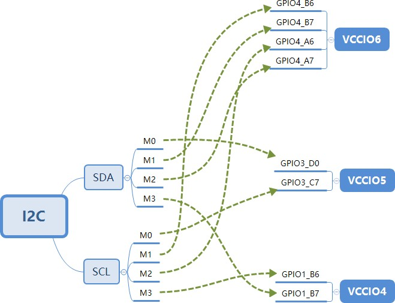

 # **Rockchip Pinctrl**开发⽂档

⽂件标识：RK-KF-YF-200

发布版本：V1.0.0

⽇期：2022-05-10

**前言**
本文介绍Rockchip PIN - CTRL驱动及DTS使用方法。

**产品版本**
| 芯片名称 | 内核版本 |
| ---- | ---- |
| RK3568/RK3399/RK3368/RK3288/PX30/RK3128/RK3126/RV1126 | Linux - 4.19 |
| RK3588/RV1106 | Linux - 5.10 |

**读者对象**

本文档（本指南）主要适用于以下工程师:
- 技术支持工程师
- 软件开发工程师


## 1. 引脚命名规则
Rockchip Pin的ID按照控制器(bank)+端口(port)+索引导号(pin)组成。

### 1.1 GPIO（通用输入输出）
- 控制器和GPIO控制器数量一致
- 端口固定A、B、C和D
- 索引导号固定0、1、2、3、4、5、6、7

举例RK3588，从RK3588 - TRM.pdf的Chapter 20 GPIO章节看到：
>
> There are five GPIOs (GPIO0 in PD\_PMU,GPIO1/GPIO2/GPIO3/GPIO4 in
> PD\_BUS)

有5个GPIO控制器，每个控制器可以控制32个IO，作为GPIO功能时，端口⾏为由GPIO控制器寄存器配置。

### 1.2 IOMUX（输入输出复用）
Rockchip Pin可以复用成多种功能，同一个控制器如果存在多种复用引脚，一般叫做m0、m1、m2等等，如I2C控制器有两组复用引脚，分别是i2cm0、i2cm1。
引脚复用配置的寄存器是在GRF/PMUGRF（RK3588叫做IOC）。

举例RK3588 BUS_IOC_GPIO1B_IOMUX_SEL_H Address: Operational Base + offset (0x002C)
```
gpio1b7_sel
4'h0: GPIO
4'h2: MIPI_CAMERA2_CLK_M0
4'h3: SFDIF1_TX_M0
4'h4: PCIE30X2_PERSTN_M3
4'h5: HDMI_RX_CEC_M2
4'h6: SATA2_ACT_LED_M1
4'h9: I2C5_SDA_M3
4'ha: UART1_RX_M1
4'hb: PWM13_M2
```
如下是RK3588 I2C5的IOMUX：


多通路复⽤⽀持硬件设计更为灵活，当外设⼯作电压是1.8V或3.3V，可以选择不同电压域VCCIO的引脚。

注意：多通路复⽤的寄存器配置，对TX类的引脚没有⽤，对RX类的引脚起作⽤。

### 1.3  **PULL**（端口上下拉）

Rockchip IO PAD的bias⼀般⽀持3种模式

- bias-disable 
- bias-pull-up
- bias-pull-down

上下拉配置是作⽤于IO PAD，配置对GPIO/IOMUX都起作⽤。

### 1.4  **DRIVE-STRENGTH**（端口驱动强度）
Rockchip IOPAD的驱动强度，根据不同⼯艺，⽀持不同强度配置；RK3399之前的芯⽚，驱动强度配置按mA为单位配置，RK1808之后芯⽚，⼀般按照Level为单位，档位的数值即为寄存器配置值。


例RK3588 TRM中GPIO0_C7的驱动强度等级如下： gpio0c7_ds

```
gpio0c7_ds
GPIO0C7 DS control Driver Strength Selection
3'b000: 100ohm
3'b100: 66ohm
3'b010: 50ohm
3'b110: 40ohm
3'b001: 33ohm
3'b101: 25ohm
```
软件驱动依然按照Level来处理，即上述寄存器描述对应：
```
3'b000: Level0
3'b100: Level4
3'b010: Level2
3'b110: Level6
3'b001: Level1
3'b101: Level5
```
DTS中`drive-strength=<5>`; 表⽰配置为Level5，即寄存器写 `3'b101`

### 1.5 SMT（端口斯密特触发器）
Rockchip IO PAD⼤多数芯⽚⽀持SMT功能，默认不使能；使能SMT可以消除边沿抖动，加⼤VIH VIL的电压区间，增强IO的信号稳定性。⼀般I2C的SCL/SDA会默认使能SMT功能。


## 2. 驱动介绍
Rockchip pinctrl驱动包括Pinctrl驱动（drivers/pinctrl/pinctrl - rockchip.c）和GPIO驱动（drivers/gpio/gpio - rockchip.c）。
Pinctrl驱动是主要驱动，提供IO的方法集，包括PINMUX、PINCONF和GPIO。
GPIO驱动是完成gpiolib的功能，包括GPIO和IRQ。

### 2.1 pinctrl - rockchip
//TO - DO

### 2.2 gpio - rockchip
//TO - DO

## 3. DTS介绍
Rockchip dts一般把pinctrl节点放在soc.dtsi，例如rk3588s.dtsi，一般位于最后一个节点。
pinctrl节点没有reg，它不是一个标准platform device，寄存器基地址是通过rockchip,grf=<&grf>传入；驱动内部根据这个基地址，加偏移地址，完成IOMUX、PINCONF的配置；GPIO是使用gpio节点的reg地址。
```c
{
    pinctrl: pinctrl {
        compatible = "rockchip,rk3588-pinctrl";
        rockchip,grf = <&ioc>;
        #address-cells = <2>;
        #size-cells = <2>;
        ranges;

        gpio0: gpio0@fda0000 {
            compatible = "rockchip,gpio-bank";
            reg = <0x0 0xfda0000 0x0 0x100>;
            interrupts = <GIC_SPI 278 IRQ_TYPE_LEVEL_HIGH>;
            clocks = <&cru PCLK_GPIO0>, <&cru DBCLK_GPIO0>;

            gpio-controller;
            #gpio-cells = <2>;
            interrupt-controller;
            #interrupt-cells = <2>;
        };

        gpio1: gpio1@fec20000 {
            compatible = "rockchip,gpio-bank";
            reg = <0x0 0xfec20000 0x0 0x100>;
            interrupts = <GIC_SPI 279 IRQ_TYPE_LEVEL_HIGH>;
            clocks = <&cru PCLK_GPIO1>, <&cru DBCLK_GPIO1>;

            gpio-controller;
            #gpio-cells = <2>;
            interrupt-controller;
            #interrupt-cells = <2>;
        };

        gpio2: gpio2@fec30000 {
            compatible = "rockchip,gpio-bank";
            reg = <0x0 0xfec30000 0x0 0x100>;
            interrupts = <GIC_SPI 280 IRQ_TYPE_LEVEL_HIGH>;
            clocks = <&cru PCLK_GPIO2>, <&cru DBCLK_GPIO2>;

            gpio-controller;
            #gpio-cells = <2>;
            interrupt-controller;
            #interrupt-cells = <2>;
        };

        gpio3: gpio3@fec40000 {
            compatible = "rockchip,gpio-bank";
            reg = <0x0 0xfec40000 0x0 0x100>;
            interrupts = <GIC_SPI 281 IRQ_TYPE_LEVEL_HIGH>;
            clocks = <&cru PCLK_GPIO3>, <&cru DBCLK_GPIO3>;

            gpio-controller;
            #gpio-cells = <2>;
            interrupt-controller;
            #interrupt-cells = <2>;
        };

        gpio4: gpio4@fec50000 {
            compatible = "rockchip,gpio-bank";
            reg = <0x0 0xfec50000 0x0 0x100>;
            interrupts = <GIC_SPI 282 IRQ_TYPE_LEVEL_HIGH>;
            clocks = <&cru PCLK_GPIO4>, <&cru DBCLK_GPIO4>;

            gpio-controller;
            #gpio-cells = <2>;
            interrupt-controller;
            #interrupt-cells = <2>;
        };
    };
}
```
还有 `arch/arm64/boot/dts/rockchip/rk3588s-pinctrl.dtsi` ⽂件通过include形式加到rk3588s.dtsi。

### 3.1.  新建**pinctrl**

rk3588s-pinctrl.dtsi⽂件已经枚举了rk3588s芯⽚所有iomux的实例，各模块⼀般不再需要创建iomux实例；创建iomux实例需要遵循如下规则：

1.  必须在pinctrl节点下

2.  必须以function+group的形式添加

3.  function+group的格式如下
```c
function {
    group {
        rockchip,pin = <bank gpio func &ref>;
    };
};

```

4.  遵循其他dts的基本规则

### 3.1  引⽤**pinctrl**

模块引⽤pinctrl是通过 和 pinctrl-0 连接模块和pinctrl驱动。

举例 rk3588 uart2：
```c
{
    uart2: serial@feb50000 {
        compatible = "rockchip,rk3588-uart", "snps,dw-apb-uart";
        reg = <0x0 0xfeb50000 0x0 0x100>;
        interrupts = <GIC_SPI 333 IRQ_TYPE_LEVEL_HIGH>;
        clocks = <&cru SCLK_UART2>, <&cru PCLK_UART2>;
        clock-names = "baudclk", "apb_pclk";
        reg-shift = <2>;
        reg-io-width = <4>;
        dmas = <&dmac0 10>, <&dmac0 11>;
        pinctrl-names = "default";
        pinctrl-0 = <&uart2m1_xfer>;
        status = "disabled";
    };
};
```
`uart2m1_xfer` 是⼀个pinctrl group；模块可以同时引⽤多组group.

举例 rk3588 pdm1：
```c
{
    pdm1: pdm@fec40000 {
        compatible = "rockchip,rk3588-pdm";
        reg = <0x0 0xfec40000 0x0 0x1000>;
        clocks = <&cru MCLK_PDM1>, <&cru HCLK_PDM1>;
        clock-names = "pdm_clk", "pdm_hclk";
        assigned-clocks = <&cru MCLK_PDM1>;
        assigned-clock-parents = <&cru PLL_AUPLL>;
        dmas = <&dmac1 4>;
        dma-names = "rx";
        power-domains = <&power RK3588_PD_AUDIO>;
        pinctrl-names = "default";
        pinctrl-0 = <&pdm1m0_clk
                    &pdm1m0_clk1
                    &pdm1m0_sdi0
                    &pdm1m0_sdi1
                    &pdm1m0_sdi2
                    &pdm1m0_sdi3>;
        /* 等同于如下写法 */
        /*
            pinctrl-0 = <&pdm1m0_clk>,
                        <&pdm1m0_clk1>,
                        <&pdm1m0_sdi0>,
                        <&pdm1m0_sdi1>,
                        <&pdm1m0_sdi2>,
                        <&pdm1m0_sdi3>;
        */
        #sound-dai-cells = <0>;
        status = "disabled";
    };
};
```
`pinctrl-names` 可以⽀持多个实例，pinctrl 默认的有4种实例（state）：
```c
#define PINCTRL_STATE_DEFAULT "default"
#define PINCTRL_STATE_INIT "init"
#define PINCTRL_STATE_IDLE "idle"
#define PINCTRL_STATE_SLEEP "sleep"
```
"init" 在driver probe期间⽣效，probe done之后可能会切换回
"default"（如果probe中切换到其他state，就不会切换回 "init"）。是可以⾃定义的，有driver去匹配解析。

举例 rk3588 pwm4：
```
{
    pwm4: pwm@febd0000 {
        compatible = "rockchip,rk3588-pwm", "rockchip,rk3328-pwm";
        reg = <0x0 0xfebd0000 0x0 0x10>;
        #pwm-cells = <3>;
        pinctrl-names = "active";
        pinctrl-0 = <&pwm4m0_pins>;
        clocks = <&cru CLK_PWM1>, <&cru PCLK_PWM1>;
        clock-names = "pwm", "pclk";
        status = "disabled";
    };
};
```
## 4.  **FAQ**

### 4.1  ⽤⼾层配置**IOMUX**

iomux是gcc编译的⼆进制⽂件，通过ioctl调⽤rockchip-pinctrl device，设置iomux，也可以获取iomux当前
值。

编译⽅法：
```bash
gcc tools/testing/selftests/rkpinctrl/iomux.c -o iomux
```
使⽤⽅法：

举例：设置 GPIO0_B7 为 func1
```bash
[root@RK3588:/]# iomux 0 15 1
```
举例：获取 GPIO0_B7 当前iomux值
```bash
[root@RK3588:/]# iomux 0 15
mux get (GPIO0-15) = 1
```

### 4.2  配置某个**GPIO**电平

有个别需求是某个GPIO不属于某个特定模块，更多是某个电源开关，希望在系统开机过错尽快输出⾼或
低电平，要怎么实现呢？

使⽤"regulator-fixed"

regulator-fixed通常⽤于定义电压固定的regulator，或由某个GPIO开关控制的regulator。

以GPIO2_A1需要配置为⾼电平为例
```c
/ {
    foo_name: foo - name {
        compatible = "regulator - fixed";
        pinctrl - names = "default";
        pinctrl - 0 = <&gpio_foo>;
        regulator - name = "vcc - foo";
        regulator - always - on;
    };
};

&pinctrl {
    gpio - foo {
        gpio_foo: gpio - foo {
            rockchip,pins = <2 RK_PA1 RK_FUNC_GPIO &pcfg_output_high>;
        };
    };
};
```

### 4.3 模块的pinctrl-0不⽣效
通常模块调⽤`pinctrl-names pinctrl-0`配置默认的IOMUX或在IOCONFIG，但不是所有的节点都可以加这两
个属性，如果模块被driver_probe_device调⽤，它就可以加这两个属性。

调试⽅法： `drivers/base/dd.c` 的`pinctrl_bind_pins`，在这⾥加打印看调⽤
