# Rockchip Linux 软件开发指南

**各芯⽚系统⽀持状态**

**Linux6.1 SDK**

| 芯片名称 | Buildroot版本 | Debian版本 | Yocto版本 | Kernel版本 | SDK版本         | TAG版本                   |
| -------- | ------------- | ---------- | --------- | ---------- | --------------- | ------------------------- |
| RK3588   | 2021.11       | 12         | 4.0       | 6.1        | V1.0.0_20231220 | linux - 6.1 - stan - rkr1 |

**Linux5.10 SDK**

| 芯片名称 | Buildroot版本 | Debian版本 | Yocto版本 | Kernel版本 | SDK版本         | TAG版本                    |
| -------- | ------------- | ---------- | --------- | ---------- | --------------- | -------------------------- |
| RK3588   | 2021.11       | 11         | 4.0       | 5.10       | V1.4.0_20231220 | linux - 5.10 - gen - rkr7  |
| RK3562   | 2021.11       | 11         | 4.0       | 5.10       | V1.1.0_20231220 | linux - 5.10 - stan - rkr2 |
| RK3566   | 2021.11       | 11         | 4.0       | 5.10       | V1.4.0_20231220 | linux - 5.10 - gen - rkr7  |
| RK3568   | 2021.11       | 11         | 4.0       | 5.10       | V1.4.0_20231220 | linux - 5.10 - gen - rkr7  |
| RK3399   | 2021.11       | 11         | 4.0       | 5.10       | V1.4.0_20231220 | linux - 5.10 - gen - rkr7  |
| RK3358   | 2021.11       | N/A        | N/A       | 5.10       | V1.3.0_20231220 | linux - 5.10 - gen - rkr7  |
| RK3328   | 2021.11       | N/A        | 4.0       | 5.10       | V1.0.0_20231220 | linux - 5.10 - gen - rkr7  |
| RK3326   | 2021.11       | N/A        | N/A       | 5.10       | V1.3.0_20231220 | linux - 5.10 - gen - rkr7  |
| PX30     | 2021.11       | 11         | 4.0       | 5.10       | V1.4.0_20231220 | linux - 5.10 - gen - rkr7  |
| RK3308   | 2021.11       | N/A        | N/A       | 5.10       | V1.3.0_20231220 | linux - 5.10 - gen - rkr7  |
| RK3288   | 2021.11       | 11         | 4.0       | 5.10       | V1.1.0_20231220 | linux - 5.10 - gen - rkr7  |
| RK312X   | 2021.11       | N/A        | N/A       | 5.10       | V1.3.0_20231220 | linux - 5.10 - gen - rkr7  |
| RK3036   | 2021.11       | N/A        | N/A       | 5.10       | V1.3.0_20231220 | linux - 5.10 - gen - rkr7  |

**Linux4.19 SDK**

| 芯片名称   | Buildroot版本 | Debian版本 | Yocto版本 | Kernel版本 | SDK版本         | TAG版本                     |
| ---------- | ------------- | ---------- | --------- | ---------- | --------------- | --------------------------- |
| RK3566     | 2021.11       | 11         | 4.0       | 4.19       | V1.4.0_20230720 | linux - 4.19 - gen - rkr4   |
| RK3568     | 2021.11       | 11         | 4.0       | 4.19       | V1.4.0_20230720 | linux - 4.19 - gen - rkr4   |
| RK3399     | 2021.11       | 11         | 4.0       | 4.19       | V1.3.0_20230720 | linux - 4.19 - gen - rkr4   |
| RK3326     | 2018.02 - rc3 | N/A        | N/A       | 4.19       | V1.2.2_20221220 | linux - 4.19 - gen - rkr3.2 |
| RK3358     | 2018.02 - rc3 | N/A        | N/A       | 4.19       | V1.1.1_20220915 | linux - 4.19 - M - rkr1     |
| RK3288     | 2018.02 - rc3 | 10         | 3.4       | 4.19       | V1.2.2_20221220 | linux - 4.19 - gen - rkr3.2 |
| PX30/PX30S | 2018.02 - rc3 | 10         | 3.4       | 4.19       | V1.2.2_20221220 | linux - 4.19 - gen - rkr3.2 |

**Linux4.4 SDK**

| 芯片名称  | Buildroot版本 | Debian版本 | Yocto版本 | Kernel版本 | SDK版本         | TAG版本                  |
| --------- | ------------- | ---------- | --------- | ---------- | --------------- | ------------------------ |
| RK3399PRO | 2018.02 - rc3 | 10         | 3.2       | 4.4        | V1.4.2_20210202 | N/A                      |
| RK1808    | 2018.02 - rc3 | N/A        | N/A       | 4.4        | V2.3.8_20210820 | N/A                      |
| RK3399    | 2018.02 - rc3 | 10         | 3.4       | 4.4        | V2.9.0_20220620 | linux - 4.4 - gen - rkr1 |
| RK3326    | 2018.02 - rc3 | N/A        | N/A       | 4.4        | V1.8.0_20220620 | linux - 4.4 - gen - rkr1 |
| RK3328    | 2018.02 - rc3 | N/A        | N/A       | 4.4        | V1.1.0_20200603 | N/A                      |
| RK3288    | 2018.02 - rc3 | 10         | 3.4       | 4.4        | V2.6.0_20220620 | linux - 4.4 - gen - rkr1 |
| PX30      | 2018.02 - rc3 | 10         | 3.4       | 4.4        | V1.8.0_20220620 | linux - 4.4 - gen - rkr1 |
| RK3308    | 2018.02 - rc3 | N/A        | N/A       | 4.4        | V1.5.2_20220124 | N/A                      |
| RK3358    | 2018.02 - rc3 | N/A        | N/A       | 4.4        | V1.8.0_20220620 | linux - 4.4 - gen - rkr1 |
| RK312X    | 2018.02 - rc3 | N/A        | N/A       | 4.4        | V1.3.0_20220620 | linux - 4.4 - gen - rkr1 |
| PX3SE     | 2018.02 - rc3 | N/A        | N/A       | 4.4        | V1.0.0_20190124 | N/A                      |

**2024 - 2025 Linux SDK升级计划**

| 芯片名称 | Buildroot版本 | Debian版本 | Yocto版本 | Kernel版本 | 预计发布时间 |
| -------- | ------------- | ---------- | --------- | ---------- | ------------ |
| RK3568   | 2021.11       | 12         | 4.0       | 6.1        | 2024.Q2      |
| RK3566   | 2021.11       | 12         | 4.0       | 6.1        | 2024.Q2      |
| RK3562   | 2021.11       | 12         | 4.0       | 6.1        | 2024.Q2      |
| RK3399   | 2021.11       | 12         | 4.0       | 6.1        | 2024.Q4      |
| RK3328   | 2021.11       | N/A        | 4.0       | 6.1        | 2024.Q4      |
| RK3288   | 2021.11       | 12         | 4.0       | 6.1        | 2024.Q4      |

[TOC]


## 1. Chapter-1 SDK 发展路线图

#### 1.1 SDK Roadmap

| Version   | SDK Released | Released Projected EOL                        |
| --------- | ------------ | --------------------------------------------- |
| Linux4.4  | 2018-06-20   | Jun, 2023                                     |
| Linux4.19 | 2020-12-11   | Dec, 2023                                     |
| Linux5.10 | 2022-01-15   | Future - Long Term Support (Dec, 2025)        |
| Linux6.1  | 2023-12-20   | Future - Long Term Support (until April 2028) |

#### 1.2 Kernel Roadmap

| Version | Kernel Released | SDK Released | Released Projected EOL |
| ------- | --------------- | ------------ | ---------------------- |
| 4.4     | 2017-11-12      | 2018-06-20   | Jan, 2024              |
| 4.19    | 2018-10-22      | 2020-12-11   | Dec, 2024              |
| 5.10    | 2020-12-13      | 2022-01-15   | Dec, 2026              |
| 6.1     | 2022-12-11      | 2023-12-20   | Dec, 2028              |

Linux Kernel是每年底发布的最后一个稳定版本作为LTS版本，但每年发布的版本是不定的，一般5 - 6个，所以无法预估下一个LTS的具体版本号。一般以年份来说明。LTS的维护时间也是不定的，是看使用的广泛程度来定。所以一般开始会是2年，然后延长到4年，最后一般都是延长到6年（不保证）。
具体Kernel EOL，以官方发布为主。

> [Kernel-Release](https://www.kernel.org/category/releases.html)

⽬前SDK发布的Kernel4.4、4.19、5.10、6.1是Rockchip⻓期⽀持的内核版本。

> 持续季度更新小版本(4.19.27-\>4.19.232)
> 持续2-3年更新⼤版本(4.4-\>4.19-\>5.10-\>6.1)

针对下⼀个内核LTS版本：Rockchip内核更新策略为每两年发布⼀个LTS（⻓期⽀持）版本，这与主线内核的每年发布⼀个LTS版本的策略相错⼀年。⽐如主线每年⼀个LTS版本，Rockchip是两年⼀个LTS版本。所以对Rockchip之后的LTS的版本是 2024 年发布的 LTS。再然后是 2026 年发布的 LTS，以此类推。

#### 1.3 Buildroot Roadmap

目前RK官方支持的Buildroot版本是2018.02和2021.11两个版本

| Version | Buildroot Released | SDK Released | Released Projected EOL                        |
| ------- | ------------------ | ------------ | --------------------------------------------- |
| 2018.02 | 2018-03-04         | 2018-06-20   | Jan, 2024                                     |
| 2021.11 | 2021-12-05         | 2022-05-20   | Dec, 2026                                     |
| 2024.02 | Mar, 2024          | 2024 Q4      | Future - Long Term Support (until April 2028) |

Buildroot社区每三个月发布一个新版本，每一年发布一个稳定版本。
具体参考Buildroot官方发布信息：
[buildroot-Release](https://buildroot.org/news.html)


#### 1.4 Yocto Roadmap

目前RK官方支持的Yocto版本从Dunfell (3.1)到Kirkstone (4.0)，主维护是Kirkstone (4.0)。

| Version         | Yocto Released | SDK Released | Support Level                                 |
| --------------- | -------------- | ------------ | --------------------------------------------- |
| Kirkstone (4.0) | May 2022       | 2022-12-20   | Long Term Support (Apr. 2026)                 |
| Scarthgap (5.0) | April 2024     | 2024-12-20   | Future - Long Term Support (until April 2028) |

Yocto社区通常每年发布两个主要版本。通常在每年的春季和秋季发布。
具体参考Yocto官方发布信息：
[Yocto-Release](https://wiki.yoctoproject.org/wiki/Releases\)


#### 1.5 Debian Roadmap

目前RK官方支持的Debian版本从stretch (9) 到bookworm (12)，主维护是bullseye (11) 。

| Version       | Debian Released | SDK Released | EOL LTS    |
| ------------- | --------------- | ------------ | ---------- |
| Stretch (9)   | 2017-06-17      | 2018-06-20   | 2022-07-01 |
| Buster (10)   | 2019-07-06      | 2020-12-11   | 2024-06-30 |
| Bullseye (11) | 2021-08-14      | 2022-01-15   | ~2026      |
| Bookworm (12) | 2023-06-10      | 2023 Q4      | ~2028      |

Debian LTS版本每两年更新一个版本。
具体参考Debian官方发布信息：
[Debian-Release](https://wiki.debian.org/DebianReleases)


## 2. Chapter-2 SDK软件包

#### 2.1 简介

Rockchip Linux SDK支持Buildroot、Yocto和Debian三个系统，内核基于Kernel 4.4、Kernel 4.19、Kernel5.10或Kernel6.1，引导基于U-boot v2017.09，适用于Rockchip EVB开发板及基于此开发板进行二次开发的所有Linux产品。开发包适用但不限于行业应用/智能家居/消费电子/工业/办公及会议等AIoT产品，提供灵活的数据通路组合接口，满足客户自由组合的客制化需求。具体功能调试和接口说明，请阅读工程目录docs/下文档。

#### 2.2 通用SDK软件包获取方法

###### 2.2.1 通过代码服务器下载

获取Rockchip Linux软件包，需要有一个帐户访问Rockchip提供的源代码仓库。客户向瑞芯微电子技术窗口申请SDK，同步提供SSH公钥进行服务器认证授权，获得授权后即可同步代码。关于瑞芯微代码服务器SSH公钥授权，请参考SSH公钥操作说明章节。

######## 2.2.1.1 Rockchip Linux6.1 SDK下载地址

| 芯片   | 版本     | 下载命令                                                     |
| ------ | -------- | ------------------------------------------------------------ |
| RK3588 | Linux6.1 | `repo init --repo - url https://gerrit.rock - chips.com:8443/repo - release/tools/repo - u - m \` <br> `https://gerrit.rock - chips.com:8443/linux/rockchip/platform/manifests - b rk3588 - m \` <br> `rk3588_linux6.1_release.xml` |

######## 2.2.1.2 Rockchip Linux5.10 SDK下载地址

| 芯片               | 版本      | 下载命令                                                     |
| ------------------ | --------- | ------------------------------------------------------------ |
| RK3562             | Linux5.10 | `repo init --repo - url https://gerrit.rock - chips.com:8443/repo - release/tools/repo - u \`<br>`https://gerrit.rock - chips.com:8443/linux/rockchip/platform/manifests - b rk3562 - m \`<br>`rk3562_linux_release.xml` |
| RK3588             | Linux5.10 | `repo init --repo - url ssh://git@www.rockchip.com.cn/repo/rk/tools/repo - u \`<br>`ssh://git@www.rockchip.com.cn/linux/rockchip/platform/manifests - b linux - m \`<br>`rk3588_linux_release.xml` |
| RK3566、<br>RK3568 | Linux5.10 | `repo init --repo - url ssh://git@www.rockchip.com.cn/repo/rk/tools/repo - u \`<br>`ssh://git@www.rockchip.com.cn/linux/rockchip/platform/manifests - b linux - m \`<br>`rk356x_linux5.10_release.xml` |
| RK3399             | Linux5.10 | `repo init --repo - url ssh://git@www.rockchip.com.cn/repo/rk/tools/repo - u \`<br>`ssh://git@www.rockchip.com.cn/linux/rockchip/platform/manifests - b linux - m \`<br>`rk3399_linux5.10_release.xml` |
| RK3328             | Linux5.10 | `repo init --repo - url ssh://git@www.rockchip.com.cn/repo/rk/tools/repo - u \`<br>`ssh://git@www.rockchip.com.cn/linux/rockchip/platform/manifests - b linux - m \`<br>`rk3328_linux5.10_release.xml` |
| RK3326             | Linux5.10 | `repo init --repo - url ssh://git@www.rockchip.com.cn/repo/rk/tools/repo - u \`<br>`ssh://git@www.rockchip.com.cn/linux/rockchip/platform/manifests - b linux - m \`<br>`rk3326_linux5.10_release.xml` |
| RK3358             | Linux5.10 | `repo init --repo - url ssh://git@www.rockchip.com.cn/repo/rk/tools/repo - u \`<br>`ssh://git@www.rockchip.com.cn/linux/rockchip/platform/manifests - b linux - m \`<br>`rk3358_linux5.10_release.xml` |
| PX30               | Linux5.10 | `repo init --repo - url ssh://git@www.rockchip.com.cn/repo/rk/tools/repo - u \`<br>`ssh://git@www.rockchip.com.cn/linux/rockchip/platform/manifests - b linux - m \`<br>`px30_linux5.10_release.xml` |
| RK3308             | Linux5.10 | `repo init --repo - url ssh://git@www.rockchip.com.cn/repo/rk/tools/repo - u \`<br>`ssh://git@www.rockchip.com.cn/linux/rockchip/platform/manifests - b linux - m \`<br>`rk3308_linux5.10_release.xml` |
| RK312X             | Linux5.10 | `repo init --repo - url ssh://git@www.rockchip.com.cn/repo/rk/tools/repo - u \`<br>`ssh://git@www.rockchip.com.cn/linux/rockchip/platform/manifests - b linux - m \`<br>`rk312x_linux5.10_release.xml` |
| RK3036             | Linux5.10 | `repo init --repo - url ssh://git@www.rockchip.com.cn/repo/rk/tools/repo - u \`<br>`ssh://git@www.rockchip.com.cn/linux/rockchip/platform/manifests - b linux - m \`<br>`rk3036_linux5.10_release.xml` |

repo是google用Python脚本写的调用git的一个脚本，主要是用来下载、管理项目的软件仓库，其下载地址如下：

`git clone ssh://git@www.rockchip.com.cn/repo/rk/tools/repo`

###### 2.2.2 通过本地压缩包解压获取

为方便客户快速获取SDK源码，瑞芯微技术窗口通常会提供对应版本的SDK初始压缩包，开发者可通过此方式获得SDK代码的初始压缩包，该压缩包解压得到的源码，经同步后与通过`repo`下载的源码一致。

以`RK3588_LINUX6.1_SDK_RELEASE_V1.0.0_20231220.tar.gz`为例，拷贝到初始化目录后，可通过以下命令检出源码：

```
mkdir rk3588
tar xvf RK3588_LINUX6.1_SDK_RELEASE_V1.0.0_20220520.tgz -C rk3588
cd rk3588
.repo/repo sync -l
.repo/repo sync -c
```

后续开发者可依据FAE窗口定期发布的更新说明，通过`.repo/repo sync -c`命令同步更新。

> 说明：
> 软件发布版本可通过工程xml查看，具体方法如下：

```
.repo/manifests$ realpath rk3588_linux_6.1_release.xml
例如：打印的版本号为v1.0.0，更新时间为20231220
<SDK>/.repo/manifests/release/rk3588_linux_6.1_release_v1.0.0_20231220.xml
```


 当前Linux5.10发布的SDK初始压缩包如下：

| 芯片名称        | 压缩包                                              | 版本   |
| --------------- | --------------------------------------------------- | ------ |
| RK3562          | RK3562_LINUX5.10_SDK_RELEASE_V1.0.0_20230620.tar.gz | v1.0.0 |
| RK3588          | RK3588_LINUX5.10_SDK_RELEASE_V1.0.0_20220520.tar.gz | v1.0.0 |
| RK3566、RK3568  | RK356X_LINUX5.10_SDK_RELEASE_V1.0.0_20220920.tar.gz | v1.0.0 |
| RK3399          | RK3399_LINUX5.10_SDK_RELEASE_V1.0.0_20220920.tar.gz | v1.0.0 |
| RK3326、RK3326S | RK3326_LINUX5.10_SDK_RELEASE_V1.0.0_20220920.tar.gz | v1.0.0 |
| RK3358          | RK3358_LINUX5.10_SDK_RELEASE_V1.0.0_20230420.tar.gz | v1.0.0 |
| PX30、PX30S     | PX30_LINUX5.10_SDK_RELEASE_V1.0.0_20220920.tar.gz   | v1.0.0 |
| RK3308          | RK3308_LINUX5.10_SDK_RELEASE_V1.0.0_20220920.tar.gz | v1.0.0 |
| RK312X          | RK312X_LINUX5.10_SDK_RELEASE_V1.0.0_20230420.tar.gz | v1.0.0 |
| RK3036          | RK3036_LINUX5.10_SDK_RELEASE_V1.0.0_20230420.tar.gz | v1.0.0 |

> 注意：
>
> 初始压缩包可能有新版本替换更新！

#### 2.3 SDK平台编译命令汇总

###### 2.3.1 一键编译

| 芯片   | 类型   | 参考机型                        | 一键编译                                                     | rootfs编译           | kernel编译                                                   | uboot编译                         |
| ------ | ------ | ------------------------------- | ------------------------------------------------------------ | -------------------- | ------------------------------------------------------------ | --------------------------------- |
| RK3588 | 开发板 | RK3588 EVB1                     | ./build.sh<br>lunchrockchip_rk3588_evb1_lp4_v10_defconfig<br>&&.build.sh | ./build.sh<br>rootfs | make ARCH=arm64<br>rockchip_linux_defconfig<br>rk3588_linux.config;<br>make ARCH=arm64 rk3588<br>evb-lp4-v10-linux.img -j24 | ./make.sh<br>rk3588 --<br>spl-new |
| RK3588 | 开发板 | RK3588 EVB1                     | ./build.sh<br>lunchrockchip_rk3588_evb1_lp4_v10_defconfig<br>&&.build.sh | ./build.sh<br>rootfs | make ARCH=arm64<br>rockchip_linux_defconfig<br>rk3588_linux.config;<br>make ARCH=arm64 rk3588<br>evb-lp4-v10-linux.img -j24 | ./make.sh<br>rk3588 --<br>spl-new |
| RK3588 | 开发板 | RK3588 EVB7                     | ./build.sh<br>lunchrockchip_rk3588_evb7_v11_defconfig<br>&&.build.sh | ./build.sh<br>rootfs | make ARCH=arm64<br>rockchip_linux_defconfig<br>rk3588_linux.config;<br>make ARCH=arm64 rk3588<br>ev7-v11-linux.img -j24 | ./make.sh<br>rk3588 --<br>spl-new |
| RK3568 | 开发板 | RK3568 EVB1                     | ./build.sh<br>lunchrockchip_rk3568_evb1_dk4_v10_defconfig<br>&&.build.sh | ./build.sh<br>rootfs | make ARCH=arm64<br>rockchip_linux_defconfig<br>rk3568_linux.config;<br>make ARCH=arm64 rk3568<br>evb-dk4-v10-linux.img -j24 | ./make.sh<br>rk3568 --<br>spl-new |
| RK3568 | 开发板 | RK3568 EVB3                     | ./build.sh<br>lunchrockchip_rk3568_evb3_lp4_v10_defconfig<br>&&.build.sh | ./build.sh<br>rootfs | make ARCH=arm64<br>rockchip_linux_defconfig<br>rk3568_linux.config;<br>make ARCH=arm64 rk3568<br>evb3-lp4-v10-linux.img -j24 | ./make.sh<br>rk3568 --<br>spl-new |
| RK3562 | 样机   | 词典笔                          | ./build.sh<br>lunchrockchip_rk3562_dicpen_szcl_v20_defconfig<br>&&.build.sh | ./build.sh<br>rootfs | make ARCH=arm64<br>rockchip_linux_defconfig;<br>make ARCH=arm64 rk3562<br>dicpen-szcl-v20.img -j24 | ./make.sh<br>rk3562 --<br>spl-new |
| RK3562 | 扫地机 | RK3562 EVB1                     | ./build.sh<br>lunchrockchip_rk3562_evb1_lp4_v10_defconfig<br>&&.build.sh | ./build.sh<br>rootfs | make ARCH=arm64<br>rockchip_linux_defconfig<br>rk3562_evb1.config;<br>make ARCH=arm64 rk3562<br>evb1-lp4-v10-linux.img -j24 | ./make.sh<br>rk3562 --<br>spl-new |
| RK3562 | 扫地机 | RK3562 EVB2                     | ./build.sh<br>lunchrockchip_rk3562_evb2_dk4_v10_defconfig<br>&&.build.sh | ./build.sh<br>rootfs | make ARCH=arm64<br>rockchip_linux_defconfig<br>rk3562_evb2.config;<br>make ARCH=arm64 rk3562<br>evb2-dk4-v10-linux.img -j24 | ./make.sh<br>rk3562 --<br>spl-new |
| RK3562 | 开发板 | RK3562 EVB1                     | ./build.sh<br>lunchrockchip_rk3562_evb1_lp4_v10_defconfig<br>&&.build.sh | ./build.sh<br>rootfs | make ARCH=arm64<br>rockchip_linux_defconfig<br>rk3562_evb1.config;<br>make ARCH=arm64 rk3562<br>evb1-lp4-v10-linux.img -j24 | ./make.sh<br>rk3562 --<br>spl-new |
| RK3562 | 开发板 | RK3562 EVB2                     | ./build.sh<br>lunchrockchip_rk3562_evb2_dk4_v10_defconfig<br>&&.build.sh | ./build.sh<br>rootfs | make ARCH=arm64<br>rockchip_linux_defconfig<br>rk3562_evb2.config;<br>make ARCH=arm64 rk3562<br>evb2-dk4-v10-linux.img -j24 | ./make.sh<br>rk3562 --<br>spl-new |
| RK3399 | 行业板 | RK3399 EVB IND                  | ./build.sh<br>lunchrockchip_rk3399_evb_ind_lpd4_defconfig<br>&&.build.sh | ./build.sh<br>rootfs | make ARCH=arm64<br>rockchip_linux_defconfig<br>make ARCH=arm64 rk3399<br>evb-ind-lpd4-linux.img -j24 | ./make.sh<br>rk3399               |
| RK3399 | 挖掘机 | RK3399<br>SAPPHIRE<br>EXCAVATOR | ./build.sh<br>lunchrockchip_rk3399_sapphire_excavator_defconfig<br>&&.build.sh | ./build.sh<br>rootfs | make ARCH=arm64<br>rockchip_linux_defconfig<br>make ARCH=arm64 rk3399<br>sapphire-excavator-linux.img -j24 | ./make.sh<br>rk3399               |
| RK3326 | 开发板 | RK3326 EVB                      | ./build.sh<br>lunchrockchip_rk3326_evb_jp3_v12_defconfig<br>&&.build.sh | ./build.sh<br>rootfs | make ARCH=arm64<br>rockchip_linux_defconfig<br>make ARCH=arm64 rk3399<br>sapphire-excavator-linux.img -j24 | ./make.sh<br>rk3399               |
| RK3288 | 开发板 | RK3288 EVB<br>RK808             | ./build.sh<br>lunchrockchip_rk3288w_evb_rk808_defconfig<br>&&.build.sh | ./build.sh<br>rootfs | make ARCH=arm<br>rockchip_linux_defconfig;<br>make ARCH=arm rk3288w-evb<br>rk808-linux.img -j24 | ./make.sh<br>rk3288               |

> 注意：
>
> - **Rootfs**编译：
>
> 默认是编译Buildroot系统，如果需要其他系统，设置相应的环境变量即可。⽐如编译buildroot系统:
> RK\_ROOTFS\_SYSTEM=buildroot ./build.sh
>
> 编译debian系统: RK\_ROOTFS\_SYSTEM=debian ./build.sh 编译yocto系统:
> RK\_ROOTFS\_SYSTEM=yocto ./build.sh
>
> - **Kernel**、**U-boot**编译：其中需要制指定⼯具链.
>
> ⽐如SDK内置32位⼯具链：
>
> export
> CROSS\_COMPILE=../prebuilts/gcc/linux-x86/arm/gcc-arm-10.3-2021.07-x86\_64-arm-none-
> linux-gnueabihf/bin/arm-none-linux-gnueabihf-
>
> ⽐如SDK内置64位⼯具链：
>
> export
> CROSS\_COMPILE=../prebuilts/gcc/linux-x86/aarch64/gcc-arm-10.3-2021.07-x86\_64-
> aarch64-none-linux-gnu/bin/aarch64-none-linux-gnu-


## 3. Chapter-3 文档说明


Rockchip Linux SDK中在docs目录分为中文（cn）和英文（en）。其中中文目录附带了Common（通用开发指导文档）、Socs（芯片平台相关文档）、Linux（Linux系统开发相关文档）、Others（其他参考文档）、docs_list_cn.txt（docs文件目录结构），其具体介绍如下：


#### 3.1 通用开发指导文档（Common）

详见`<SDK>/docs/cn/Common`各子目录下的文档。

###### 3.1.1 多核异构系统开发指南（AMP）

详见`<SDK>/docs/cn/Common/AMP`目录，多核异构系统是瑞芯微提供的一套通用多核异构系统解决方案，目前已经广泛应用于电力、工控等行业应用和扫地机等消费级产品中。

###### 3.1.2 外设支持列表（AVL）

详见`<SDK>/docs/cn/Common/AVL`目录，其包含DDR/eMMC/NAND FLASH/WIFI-BT/CAMERA等支持列表，其支持列表实时更新在redmine上，链接如下：

```
https://redmine.rockchip.com.cn/projects/fae/documents
```

###### 3.1.2.1 DDR支持列表

Rockchip平台DDR颗粒支持列表，详见<SDK>/docs/cn/Common/AVL目录下《Rockchip_Support_List_DDR_Ver2.56.pdf》，下表表示DDR的支持程度，只建议选用√、T/A标示的颗粒。

| Symbol | Description                      |
| ------ | -------------------------------- |
| √      | Fully Tested and Mass production |
| T/A    | Fully Tested and Applicable      |
| N/A    | Not Applicable                   |

###### 3.1.2.2 eMMC支持列表

Rockchip平台eMMC颗粒支持列表，详见<SDK>/docs/cn/Common/AVL目录下《RK_eMMCSupportList_Ver1.77_20230825.pdf》，下表中所标示的eMMC支持程度表，只建议选用√、T/A标示的颗粒。

| Symbol | Description                                            |
| ------ | ------------------------------------------------------ |
| √      | Fully Tested, Applicable and Mass Production           |
| T/A    | Fully Tested, Applicable and Ready for Mass Production |
| D/A    | Datasheet Applicable, Need Sample to Test              |
| N/A    | Not Applicable                                         |

-  **高性能eMMC颗粒的选取**

为了提高系统性能，需要选取高性能的eMMC颗粒。请在挑选eMMC颗粒前，参照Rockchip提供支持列表中的型号，重点关注厂商Datasheet中performance一章。

参照厂商大小以及eMMC颗粒读写的速率进行筛选。建议选取顺序读速率>200MB/s、顺序写速率>40MB/s。


> 图1‐1 eMMC Performance⽰例

######## 3.1.2.3 SPI Nor及SLC Nand支持列表

Rockchip平台SPI Nor及SLC Nand支持列表，详见<SDK>/docs/cn/Common/AVL目录下《RK_SpiNor_and_SLC_Nand_SupportList_V1.44_20230815.pdf》，文档中也有标注SPI Nor的型号，可供选型。下表中所标示的Nand支持程度表，只建议选用√、T/A标示的颗粒。

**表1-3 Rockchip SPI Nor and SLC Nand Support Symbol**

| Symbol | Description |
| ---- | ---- |
| √ | Fully Tested, Applicable and Mass Production |
| T/A | Fully Tested, Applicable and Ready for Mass Production |
| D/A | Datasheet Applicable, Need Sample to Test |
| N/A | Not Applicable |

###### 3.1.2.4 Nand Flash支持列表

Rockchip平台Nand Flash支持列表，详见<SDK>/docs/Common/AVL目录下《RKNandFlashSupportList.Ver2.73_20180615.pdf》，文档中有标注Nand Flash的型号，可供选型。下表中所标示的Nand Flash支持程度表，只建议选用√、T/A标示的颗粒。

**表1-4 Rockchip Nand Flash Support Symbol**

| Symbol | Description |
| ---- | ---- |
| √ | Fully Tested, Applicable and Mass Production |
| T/A | Fully Tested, Applicable and Ready for Mass Production |
| D/A | Datasheet Applicable, Need Sample to Test |
| N/A | Not Applicable |

######## 3.1.2.5 WIFI/BT支持列表

Rockchip平台WIFI/BT支持列表，详见<SDK>/docs/cn/Common/AVL目录下《Rockchip_Support_List_Linux_Wifi_BT_20230531.pdf》，文档列表中为目前Rockchip平台上大量测试过的WIFI/BT芯片列表，建议按照列表上的型号进行选型。如果有其他WIFI/BT芯片调试，需要WIFI/BT芯片原厂提供对应内核驱动程序。

######## 3.1.2.6 Camera支持列表

Rockchip平台Camera支持列表，详见[Camera模组⽀持列表](https://redmine.rock-chips.com/projects/rockchip_camera_module_support_list/camera)模组支持列表，在线列表中为目前Rockchip平台上大量测试过的Camera Module列表，建议按照列表上的型号进行选型。

###### 3.1.3 音频模块文档 (AUDIO)

包含麦克风的音频算法和音频/Pulseaudio模块的相关开发文档。具体文档如下：
```
docs/cn/Common/AUDIO/
├── Algorithms
├── Rockchip_Developer_Guide_Audio_CN.pdf
├── Rockchip_Developer_Guide_PulseAudio_CN.pdf
```

###### 3.1.4  CAN模块⽂档 (CAN)

CAN(Controller Area Network)总线，即控制器局域⽹总线，是⼀种有效分布式控制或实时控制的串⾏通信⽹络。以下⽂档主要介绍CAN驱动开发、通信测试⼯具、常⽤命令接口和常⻅问题等。
```
docs/cn/Common/CAN/
├── Rockchip_Developer_Gide_CAN_FD_CN.pdf
├── Rockchip_Developer_Guide_Can_CN.pdf
```

###### 3.1.5 时钟模块文档 (CLK)

本文档主要介绍Rockchip平台Clock、GPIO、PLL展频等时钟开发
```
docs/cn/Common/CLK/
├── Rockchip_Developer_Guide_Clock_CN.pdf
├── Rockchip_Developer_Guide_Gpio_Output_Clocks_CN.pdf
├── Rockchip_Developer_Guide_Pll_Ssmod_Clock_CN.pdf
```

###### 3.1.6 CRYPTO模块文档 (CRYPTO)

以下文档主要介绍Rockchip Crypto和HWRNG(TRNG)的开发，包括驱动开发与上层应用开发。
```
docs/cn/Common/CRYPTO/
├── Rockchip_Developer_Guide_Crypto_HWRNG_CN.pdf
```

###### 3.1.7 DDR模块文档 (DDR)

该模块文档主要包含Rockchip平台DDR开发指南、DDR问题排查、DDR颗粒验证流程、DDR布板说明、DDR带宽工具使用、DDR DQ眼图工具等。
```
docs/cn/Common/DDR/
├── Rockchip-Developer-Guide-DDR-CN.pdf
```


###### 3.1.8 调试模块文档 (DEBUG)

该模块文档主要包含Rockchip平台DSS、FT232H_USB2JTAG、GDB_ADB、Eclipse_OpenOCD等调试工具使用介绍。
```
docs/cn/Common/DEBUG/
├── Rockchip_Developer_Guide_DS5_CN.pdf
├── Rockchip_Developer_Guide_FT232H_USB2JTAG.pdf
├── Rockchip_Developer_Guide_GDB_Over_ADB_CN.pdf
└── Rockchip_Developer_Guide_GNU_MCU_Eclipse_OpenOCD_CN.pdf
```
###### 3.1.9 显示模块文档 (DISPLAY)

该模块文档主要包含Rockchip平台DRM、DP、HDMI、MIPI、RK628等显示模块的开发文档。
```
docs/cn/Common/DISPLAY/
├── DP
├── HDMI
├── MIPI
├── RK628
├── Rockchip_BT656_TX_AND_BT1120_TX_Developer_Guide_CN.pdf
├── Rockchip_Developer_Guide_Baseparameter_Format_Define_And_Use_CN.pdf
├── Rockchip_Developer_Guide_DRM_Display_Driver_CN.pdf
├── Rockchip_Developer_Guide_RGB_MCU_CN.pdf
├── Rockchip_Develop_Guide_DRM_Direct_Show_CN.pdf
├── Rockchip_DRM_Panel_Porting_Guide_V1_6_20190928.pdf
├── Rockchip_RK3588_Developer_Guide_MIPI_DSI2_CN.pdf
```

###### 3.1.10 动态调整频率和电压模块文档 (DVFS)

该模块文档主要包含Rockchip平台CPU/GPU/DDR等动态调整频率和电压模块文档。
Cpufreq和Devfreq是内核开发者定义的一套支持根据指定的governor动态调整频率和电压的框架模型，它能有效地降低的功耗，同时兼顾性能。
```
docs/cn/Common/DVFS/
├── Rockchip_Developer_Guide_CPUFreq_CN.pdf
├── Rockchip_Developer_Guide_DevFreq_CN.pdf
```

###### 3.1.11 文件系统模块文档 (FS)

该模块文档主要包含Rockchip平台文件系统的相关开发文档。
```
docs/cn/Common/FS/
├── Rockchip_Developer_FAQ_FileSystem_CN.pdf
```

###### 3.1.12 以太网模块文档 (GMAC)

该模块文档主要包含Rockchip平台以太网GMAC接口的相关开发文档。
```
docs/cn/Common/GMAC/
├── Rockchip_Developer_Guide_Linux_GMAC_CN.pdf
├── Rockchip_Developer_Guide_Linux_GMAC_DPDK_CN.pdf
├── Rockchip_Developer_Guide_Linux_GMAC_Mode_Configuration_CN.pdf
├── Rockchip_Developer_Guide_Linux_GMAC_RGMII_Delayline_CN.pdf
└── Rockchip_Developer_Guide_Linux_MAC_TO_MAC_CN.pdf
```
###### 3.1.13 HDMI-IN模块文档 (HDMI-IN)

该模块文档主要包含Rockchip平台HDMI-IN接口的相关开发文档。
```
docs/cn/Common/HDMI-IN/
├── Rockchip_Developer_Guide_HDMI_IN_Based_On_CameraHal3_CN.pdf
└── Rockchip_Developer_Guide_HDMI_RX_CN.pdf
```

###### 3.1.14 I2C模块文档 (I2C)

该模块文档主要包含Rockchip平台I2C接口的相关开发文档。
```
docs/cn/Common/I2C/
└── Rockchip_Developer_Guide_I2C_CN.pdf
```

###### 3.1.15 IO电源域模块文档 (IO-DOMAIN)

Rockchip平台一般IO电源的电压有1.8v, 3.3v, 2.5v, 5.0v等，有些IO同时支持多种电压，io-domain就是配置IO电源域的寄存器，依据真实的硬件电压范围来配置对应的电压寄存器，否则无法正常工作；
```
docs/cn/Common/IO-DOMAIN/
└── Rockchip_Developer_Guide_Linux_IO_DOMAIN_CN.pdf
```

###### 3.1.16 IOMMU模块文档 (IOMMU)

主要介绍Rockchip平台IOMMU用于32位虚拟地址和物理地址的转换，它带有读写控制位，能产生缺页异常以及总线异常中断。
```
docs/cn/Common/IOMMU/
└── Rockchip_Developer_Guide_Linux_IOMMU_CN.pdf
```
###### 3.1.17 图像模块文档 (ISP)

ISP1.X主要适用于RK3399/RK3288/PX30/RK3326/RK1808等
ISP21主要适用于RK3566、RK3568等
ISP30主要适用于RK3588等
ISP32-lite主要适用于RK3562等

包含ISP开发文档、VI驱动开发文档、IQ Tool开发文档、调试文档和颜色调试文档。具体文档如下：
```
docs/cn/Common/ISP/
├── ISP1.X
├── ISP21
├── ISP30
├── ISP32-lite
└── The-Latest-Camera-Documents-Link.txt
```
> 说明：
> RK3288/RK3399/RK3326/RK1808 Linux(kernel-4.4) rkisp1 driver、sensor driver、vcm driver > 参考⽂档:《RKISP\_Driver\_User\_Manual\_v1.3\_20190919》
> RK3288/RK3399/RK3326/RK1808 Linux(kernel-4.4) camera\_engine\_rkisp（3A库）参考⽂档：《camera\_engine\_rkisp\_user\_manual\_v2.0》
> RK3288/RK3399/RK3326/RK1808 Linux(kernel-4.4) camera\_engine\_rkisp v2.0.0版本及其以上> 版本IQ 效果⽂件参数参考⽂档：《RKISP1\_IQ\_Parameters\_User\_Guide\_v1.0\_20190606》

###### 3.1.18 MCU模块文档 (MCU)

主要介绍Rockchip平台上MCU开发指南。
```
docs/cn/Common/MCU/
├── Rockchip_RK3399_Developer_Guide_MCU_CN.pdf
```

###### 3.1.19 MMC模块文档 (MMC)

主要介绍Rockchip平台上SDIO、SDMMC、eMMC等接口开发指南。
```
docs/cn/Common/MMC/
├── Rockchip_Developer_Guide_SDMMC_SDIO_eMMC_CN.pdf
└── Rockchip_Developer_Guide_SD_Boot_CN.pdf
```
###### 3.1.20 内存模块⽂档 (MEMORY)

主要介绍Rockchip平台上CMA、DMABUF等内存模块机制处理。
```
docs/cn/Common/MEMORY/
├── Rockchip_Developer_Guide_Linux_CMA_CN.pdf
├── Rockchip_Developer_Guide_Linux_DMABUF_CN.pdf
├── Rockchip_Developer_Guide_Linux_Meminfo_CN.pdf
└── Rockchip_Developer_Guide_Linux_Memory_Allocator_CN.pdf
```
###### 3.1.21 MPP模块⽂档 (MPP)

主要介绍Rockchip平台上MPP开发说明。
```
docs/cn/Common/MPP/
└── Rockchip_Developer_Guide_MPP_CN.pdf
```
###### 3.1.22 看⻔狗模块⽂档 (WATCHDOG)

主要介绍Rockchip平台上Watchdog开发说明。
```
docs/cn/Common/WATCHDOG/
└── Rockchip_Developer_Guide_Linux_WDT_CN.pdf
```
###### 3.1.23 NPU模块文档 (NPU)

SDK提供了RKNNPU相关开发工具，具体如下：

**RKNN-TOOLKIT2：**

RKNN-Toolkit2是在PC上进行RKNN模型生成及评估的开发套件：

开发套件在`external/rknn-toolkit2`目录下，主要用来实现模型转换、优化、量化、推理、性能评估和精度分析等一系列功能。

| 功能 | 说明 |
| ---- | ---- |
| 模型转换 | 支持Pytorch / TensorFlow / TFLite / ONNX / Caffe / Darknet的浮点模型<br>支持Pytorch / TensorFlow / TFLite的量化感知模型（QAT）<br>支持动态输入模型（动态化/原生动态）<br>支持大模型 |
| 模型优化 | 常量折叠/ OP矫正/ OP Fuse&Convert/ 权重稀疏化/ 模型剪枝 |
| 模型量化 | 支持量化类型：非对称i8 / fp16<br>支持Layer / Channel量化方式；Normal / KL / MMSE量化算法<br>支持混合量化以平衡性能和精度 |
| 模型推理 | 支持在PC上通过模拟器进行模型推理<br>支持将模型传到NPU硬件平台上完成模型推理（连板推理）<br>支持批量推理，支持多输入模型 |
| 模型评估 | 支持模型在NPU硬件平台上的性能和内存评估 |
| 精度分析 | 支持量化精度分析功能（模拟器/ NPU） |
| 附加功能 | 支持版本/设备查询功能等 |

具体使用说明请参考当前`doc/`的目录文档： 
```
├── 01_Rockchip_RKNPU_Quick_Start_RKNN_SDK_V1.6.0_CN.pdf
├── 01_Rockchip_RKNPU_Quick_Start_RKNN_SDK_V1.6.0_EN.pdf
├── 02_Rockchip_RKNPU_User_Guide_RKNN_SDK_V1.6.0_CN.pdf
├── 02_Rockchip_RKNPU_User_Guide_RKNN_SDK_V1.6.0_EN.pdf
...
├── RKNN-Toolkit2_OP_Support-1.6.0.md
```
**RKNN API:**
RKNN API的开发说明在⼯程⽬录 external/rknpu2 下，⽤于推理RKNN-Toolkit2⽣成的rknn模型。
具体使⽤说明请参考当前 doc/ 的⽬录⽂档：
```
RKNN API：
RKNN API的开发说明在⼯程⽬录 external/rknpu2 下，⽤于推理RKNN-Toolkit2⽣成的rknn模型。
具体使⽤说明请参考当前 doc/ 的⽬录⽂档：
```
###### 3.1.24 NVM**模块⽂档 **(NVM)

主要介绍Rockchip平台上启动流程，对存储进⾏配置和调试、OTP OEM
区域烧写等安全接口⽅⾯。
```
docs/cn/Common/NVM/
├── Rockchip_Application_Notes_Storage_CN.pdf
├── Rockchip_Developer_FAQ_Storage_CN.pdf
├── Rockchip_Developer_Guide_Dual_Storage_CN.pdf
└── Rockchip_Developer_Guide_SATA_CN.pdf
```
###### 3.1.25 **PCIe**模块⽂档 **(PCIe)**

主要介绍Rockchip平台上PCIe的开发说明。
```
docs/cn/Common/PCIe/
├── Rockchip_Developer_Guide_PCIe_CN.pdf
├── Rockchip_Developer_Guide_PCIE_EP_Stardard_Card_CN.pdf
├── Rockchip_Developer_Guide_PCIe_Performance_CN.pdf
├── Rockchip_PCIe_Virtualization_Developer_Guide_CN.pdf
└── Rockchip_RK3399_Developer_Guide_PCIe_CN.pdf
```
###### 3.1.26  性能模块⽂档 **(PERF)**

主要介绍Rockchip平台上PERF性能相关分析说明。
```
docs/cn/Common/PERF/
├── Rockchip_Develop_Guide_Linux_RealTime_Performance_Test_Report_CN.pdf
├── Rockchip_Optimize_Tutorial_Linux_IO_CN.pdf
├── Rockchip_Quick_Start_Linux_Perf_CN.pdf
├── Rockchip_Quick_Start_Linux_Performance_Analyse_CN.pdf
├── Rockchip_Quick_Start_Linux_Streamline_CN.pdf
└── Rockchip_Quick_Start_Linux_Systrace_CN.pdf
```
###### 3.1.27 **GPIO**模块⽂档 **(PINCTRL)**

主要介绍Rockchip平台上PIN-CTRL驱动及DTS使⽤⽅法。
```
docs/cn/Common/PINCTRL/
└── Rockchip_Developer_Guide_Linux_Pinctrl_CN.pdf
```
###### 3.1.28 电源模块⽂档 **(PMIC)**

主要介绍Rockchip平台上RK805、RK806、RK808、RK809、RK817等PMIC的开发指南。
```
docs/cn/Common/PMIC/
├── Rockchip_RK805_Developer_Guide_CN.pdf
├── Rockchip_RK806_Developer_Guide_CN.pdf
├── Rockchip_RK808_Developer_Guide_CN.pdf
├── Rockchip_RK809_Developer_Guide_CN.pdf
├── Rockchip_RK816_Developer_Guide_CN.pdf
├── Rockchip_RK817_Developer_Guide_CN.pdf
├── Rockchip_RK818_Developer_Guide_CN.pdf
├── Rockchip_RK818_RK816_Developer_Guide_Fuel_Gauge_CN.pdf
└── Rockchip_RK818_RK816_Introduction_Fuel_Gauge_Log_CN.pdf
```
###### 3.1.29 功耗模块⽂档 **(POWER)**

> 主要介绍Rockchip平台上芯⽚功耗的⼀些基础概念和优化⽅法。
```
docs/cn/Common/POWER/
└── Rockchip_Developer_Guide_Power_Analysis_CN.pdf
```
###### 3.1.30 脉宽调制模块⽂档 **(PWM)**

主要介绍Rockchip平台上PWM开发指南。
```
docs/cn/Common/PWM
└── Rockchip_Developer_Guide_Linux_PWM_CN.pdf
```
###### 3.1.31 **RGA**模块⽂档 **(RGA)**

> 主要介绍Rockchip平台上RGA开发指南。
```
docs/cn/Common/RGA/
├── Rockchip_Developer_Guide_RGA_CN.pdf
└── Rockchip_FAQ_RGA_CN.pdf
```
###### 3.1.32 **SARADC**模块⽂档 **(SARADC)**

主要介绍Rockchip平台上SARADC开发指南。
```
docs/cn/Common/SPI/
└── Rockchip_Developer_Guide_Linux_SPI_CN.pdf
```
###### 3.1.33 **SPI**模块⽂档 **(SPI)**

主要介绍Rockchip平台上SPI开发指南。
```
docs/cn/Common/SPI/
└── Rockchip_Developer_Guide_Linux_SPI_CN.pdf
```
###### 3.1.34 温控模块⽂档 **(THERMAL)**

主要介绍Rockchip平台上Thermal开发指南。
```
docs/cn/Common/TOOL/
├── Production-Guide-For-Firmware-Download.pdf
├── RKUpgrade_Dll_UserManual.pdf
├── Rockchip-User-Guide-ProductionTool-CN.pdf
├── Rockchip_Introduction_Partition_CN.pdf
└── Rockchip_User_Guide_Production_For_Firmware_Download_CN.pdf
```
###### 3.1.35 ⼯具类模块⽂档 **(TOOL)**

主要介绍Rockchip平台上分区、量产烧⼊、⼚线烧⼊等⼯具的使⽤说明。
```
docs/cn/Common/TOOL/
├── Production-Guide-For-Firmware-Download.pdf
├── RKUpgrade_Dll_UserManual.pdf
├── Rockchip-User-Guide-ProductionTool-CN.pdf
├── Rockchip_Introduction_Partition_CN.pdf
└── Rockchip_User_Guide_Production_For_Firmware_Download_CN.pdf
```
###### 3.1.36 安全模块⽂档 **(TRUST)**

主要介绍Rockchip平台上TRUST、休眠唤醒等功能说明。
```
docs/cn/Common/UBOOT/
├── Rockchip_Developer_Guide_Linux_AB_System_CN.pdf
├── Rockchip_Developer_Guide_U-Boot_TFTP_Upgrade_CN.pdf
├── Rockchip_Developer_Guide_UBoot_MMC_Device_Analysis_CN.pdf
├── Rockchip_Developer_Guide_UBoot_MTD_Block_Device_Design_CN.pdf
├── Rockchip_Developer_Guide_UBoot_Nextdev_CN.pdf
└── Rockchip_Introduction_UBoot_rkdevelop_vs_nextdev_CN.pdf
```
###### 3.1.37 串口模块⽂档 **(UART)**

主要介绍Rockchip平台上串口功能和调试说明。
```
docs/cn/Common/UBOOT/
├── Rockchip_Developer_Guide_Linux_AB_System_CN.pdf
├── Rockchip_Developer_Guide_U-Boot_TFTP_Upgrade_CN.pdf
├── Rockchip_Developer_Guide_UBoot_MMC_Device_Analysis_CN.pdf
├── Rockchip_Developer_Guide_UBoot_MTD_Block_Device_Design_CN.pdf
├── Rockchip_Developer_Guide_UBoot_Nextdev_CN.pdf
└── Rockchip_Introduction_UBoot_rkdevelop_vs_nextdev_CN.pdf
```
###### 3.1.38 **UBOOT**模块⽂档 **(UBOOT)**

主要介绍Rockchip平台上U-Boot相关开发说明。
```
docs/cn/Common/UBOOT/
├── Rockchip_Developer_Guide_Linux_AB_System_CN.pdf
├── Rockchip_Developer_Guide_U-Boot_TFTP_Upgrade_CN.pdf
├── Rockchip_Developer_Guide_UBoot_MMC_Device_Analysis_CN.pdf
├── Rockchip_Developer_Guide_UBoot_MTD_Block_Device_Design_CN.pdf
├── Rockchip_Developer_Guide_UBoot_Nextdev_CN.pdf
└── Rockchip_Introduction_UBoot_rkdevelop_vs_nextdev_CN.pdf
```
###### 3.1.39 **USB**模块⽂档 **(USB)**

主要介绍Rockchip平台上USB开发指南、USB
信号测试和调试⼯具等相关开发说明。
```
docs/cn/Common/USB/
├── Rockchip_Developer_Guide_Linux_USB_Initialization_Log_Analysis_CN.pdf
├── Rockchip_Developer_Guide_Linux_USB_PHY_CN.pdf
├── Rockchip_Developer_Guide_Linux_USB_Performance_Analysis_CN.pdf
├── Rockchip_Developer_Guide_USB2_Compliance_Test_CN.pdf
├── Rockchip_Developer_Guide_USB_CN.pdf
├── Rockchip_Developer_Guide_USB_FFS_Test_Demo_CN.pdf
├── Rockchip_Developer_Guide_USB_Gadget_UAC_CN.pdf
├── Rockchip_Developer_Guide_USB_SQ_Test_CN.pdf
├── Rockchip_Introduction_USB_SQ_Tool_CN.pdf
├── Rockchip_RK3399_Developer_Guide_USB_CN.pdf
├── Rockchip_RK3399_Developer_Guide_USB_DTS_CN.pdf
├── Rockchip_RK356x_Developer_Guide_USB_CN.pdf
├── Rockchip_RK3588_Developer_Guide_USB_CN.pdf
├── Rockchip_Trouble_Shooting_Linux4.19_USB_Gadget_UVC_CN.pdf
└── Rockchip_Trouble_Shooting_Linux_USB_Host_UVC_CN.pdf
```
#### 3.2  **Linux**系统开发⽂档 **(Linux)**


详⻅`<SDK\>/docs/cn/Linux`⽬录下的⽂档。
```
├── ApplicationNote
├── Audio
├── Camera
├── Docker
├── Graphics
├── Multimedia
├── Profile
├── Recovery
├── Security
├── System
├── Uefi
└── Wifibt
```
###### 3.2.1  应⽤指南（**ApplicationNote**）

主要介绍Rockchip平台上应⽤相关开发说明， ⽐如ROS、RetroArch、USB等
```
docs/cn/Linux/ApplicationNote/
├── Rockchip_Developer_Guide_Linux_Flash_Open_Source_Solution_CN.pdf
├── Rockchip_Instruction_Linux_ROS2_CN.pdf
├── Rockchip_Instruction_Linux_ROS_CN.pdf
├── Rockchip_Quick_Start_Linux_USB_Gadget_CN.pdf
└── Rockchip_Use_Guide_Linux_RetroArch_CN.pdf
```
###### 3.2.2  ⾳频相关开发（**Audio**）

主要介绍Rockchip平台上⾃研⾳频算法。
```
docs/cn/Linux/Audio/
├── Rockchip_Developer_Guide_Microphone_Array_TEST_CN.pdf
├── Rockchip_Developer_Guide_Microphone_Array_Tuning.pdf
└── Rockchip_Introduction_Linux_Audio_3A_Algorithm_CN.pdf
```
###### 3.2.3  摄像头相关开发（**Camera**）

主要介绍Rockchip平台上MIPI/CSI Camera和结构光开发指南。
```
docs/cn/Linux/Camera/
├── Rockchip_Developer_Guide_Linux4.4_Camera_CN.pdf
├── Rockchip_Developer_Guide_Linux_RMSL_CN.pdf
└── Rockchip_Trouble_Shooting_Linux4.4_Camera_CN.pdf
```
###### 3.2.4  容器相关开发（**Docker**）
```
docs/cn/Linux/Docker/
├── Rockchip_Developer_Guide_Debian_Docker_CN.pdf
├── Rockchip_Developer_Guide_Linux_Docker_Deploy_CN.pdf
└── Rockchip_User_Guide_SDK_Docker_CN.pdf
```
主要介绍Rockchip平台上Debian/Buildroot等第三⽅系统的Docker搭建和开发。

###### 3.2.5  显⽰相关开发（**Graphics**）
```
docs/cn/Linux/Graphics/
├── Rockchip_Developer_Guide_Buildroot_Weston_CN.pdf
└── Rockchip_Developer_Guide_Linux_Graphics_CN.pdf
```
主要介绍Rockchip平台上 Linux显⽰相关开发。

###### 3.2.6  多媒体（**Multimedia**）

Rockchip Linux平台上视频编解码⼤概的流程
```
vpu_service --> mpp --> gstreamer/rockit --> app
vpu_service: 驱动
mpp: rockchip平台的视频编解码中间件,相关说明参考mpp⽂档
gstreamer/rockit: 对接app等组件
```
⽬前Debian/buildroot系统默认⽤gstreamer来对接app和编解码组件。
⽬前主要开发⽂档如下：
```
docs/cn/Linux/Multimedia/
├── Rockchip_Developer_Guide_Linux_RKADK_CN.pdf
├── Rockchip_User_Guide_Linux_Gstreamer_CN.pdf
└── Rockchip_User_Guide_Linux_Rockit_CN.pdf
```
编解码功能，也可以直接通过mpp提供测试接口进行测试（比如`mpi_dec_test/mpi_enc_test`...）

mpp源码参考：`<SDK>/external/mpp/`
测试demo参考：`<SDK>/external/mpp/test`
具体参考SDK文档：
- `Rockchip_Developer_Guide_MPP_CN.pdf`
- `Rockchip_Developer_Guide_RK3588_MPP_CN.pdf`

Rockchip芯片比如RK3588支持强大的多媒体功能：
- 支持H.265/H.264/AV1/VP9/AVS2视频解码，最高8K60FPS，同时支持1080P多格式视频解码（H.263、MPEG1/2/4、VP8、JPEG）
- 支持8K H264/H265视频编码和1080P VP8、JPEG视频编码
- 视频后期处理器：反交错、去噪、边缘/细节/色彩优化。

以下列举平台常见芯片编解码能力的标定规格。

> **说明：**
> 测试最大规格与众多因素相关，因此可能出现不同芯片相同解码IP规格能力不同。
> 芯片的支持情况，实际搭配不同系统可能支持格式和性能会有所不同。际搭配不同系统可能⽀持格> 式和性能会有所不同。

- 解码能力规格表

| 芯片名称 | H264 | H265 | VP9 | JPEG |
| ---- | ---- | ---- | ---- | ---- |
| RK3588 | 7680X4320@30f | 7680X4320@60f | 7680X4320@60f | 1920x1088@200f |
| RK3566/RK3568 | 4096x2304@60f | 4096x2304@60f | 4096x2304@60f | 1920x1080@60f |
| RK3562 | 1920x1088@60f | 2304x1440@30f | 4096x2304@30f | 1920x1088@120f |
| RK3399 | 4096x2304@30f | 4096x2304@60f | 4096x2304@60f | 1920x1088@30f |
| RK3328 | 4096x2304@30f | 4096x2304@60f | 4096x2304@60f | 1920x1088@30f |
| RK3288 | 3840x2160@30f | 4096x2304@60f | N/A | 1920x1088@30f |
| RK3326 | 1920x1088@60f | 1920x1088@60f | N/A | 1920x1088@30f |
| PX30 | 1920x1088@60f | 1920x1088@60f | N/A | 1920x1088@30f |
| RK312X | 1920x1088@30f | 1920x1088@30f | N/A | 1920x1088@30f |

- 编码能力规格表

| 芯片名称 | H264 | H265 | VP8 |
| ---- | ---- | ---- | ---- |
| RK3588 | 7680x4320@30f | 7680x4320@30f | 1920x1088@20f |
| RK3566/RK3568 | 1920x1088@60f | 1920x1088@60f | N/A |
| RK3562 | 1920x1088@60f | N/A | N/A |
| RK3399 | 1920x1088@30f | N/A | 1920x1088@30f |
| RK3328 | 1920x1088@30f | 1920x1088@30f | 1920x1088@30f |
| RK3288 | 1920x1088@30f | N/A | 1920x1088@30f |
| RK3326 | 1920x1088@30f | N/A | 1920x1088@30f |
| PX30 | 1920x1088@30f | N/A | 1920x1088@30f |
| RK312X | 1920x1088@30f | N/A | 1920x1088@30f |

###### 3.2.7  **SDK**附件内容简介（**Profile**）

主要介绍Rockchip Linux平台上软件测试，benchmark等介绍。
```
docs/cn/Linux/Profile/
├── Rockchip_Developer_Guide_Linux_PCBA_CN.pdf
├── Rockchip_Introduction_Linux_Benchmark_KPI_CN.pdf
├── Rockchip_Introduction_Linux_PLT_CN.pdf
└── Rockchip_User_Guide_Linux_Software_Test_CN.pdf
```
###### 3.2.8  **OTA**升级（**Recovery**）

> 主要介绍Rockchip Linux平台 OTA 升级时的 recovery 开发流程和升级介绍。
```
docs/cn/Linux/Recovery/
├── Rockchip_Developer_Guide_Linux_DFU_Upgrade_CN.pdf
├── Rockchip_Developer_Guide_Linux_Recovery_CN.pdf
├── Rockchip_Developer_Guide_Linux_Upgrade_CN.pdf
└── Rockchip_Introduction_Smart_Screen_OTA_CN.pdf
```
###### 3.2.9  安全⽅案（**Security**）

主要介绍Rockchip Linux平台上Securbeoot和TEE的安全启动⽅案。
```
docs/cn/Linux/Security/
├── Rockchip_Developer_Guide_Linux_Secure_Boot_CN.pdf
└── Rockchip_Developer_Guide_TEE_SDK_CN.pdf
```
###### 3.2.10 系统开发（**System**）

主要介绍Rockchip Linux平台上Debian等第三⽅系统的移植和开发指南。
```
docs/cn/Linux/System/
├── Rockchip_Developer_Guide_Buildroot_CN.pdf
├── Rockchip_Developer_Guide_Debian_CN.pdf
└── Rockchip_Developer_Guide_Third_Party_System_Adaptation_CN.pdf
```
###### 3.2.11 **UEFI**启动（**UEFI**）

主要介绍Rockchip Linux平台上的UEFI启动⽅案。
```
docs/cn/Linux/Uefi/
└── Rockchip_Developer_Guide_UEFI_CN.pdf
```
###### 3.2.12 ⽹络模块（**RKWIFIBT**）

主要介绍Rockchip Linux平台上WIFI、BT等开发。
```
docs/cn/Linux/Wifibt/
├── AP模组RF测试⽂档
├── REALTEK模组RF测试⽂档
├── Rockchip_Developer_Guide_Linux_WIFI_BT_CN.pdf
├── WIFIBT编程接口
└── WIFI性能测试PC⼯具
```
###### 3.2.13 **DPDK**模块（**DPDK**）

主要介绍Rockchip Linux平台上DPDK开发指南。
```
docs/cn/Linux/DPDK/
└── Rockchip_Developer_Guide_Linux_DPDK_CN.pdf
```


#### 3.3 芯片平台相关文档 (Socs)

详见 `<SDK>/docs/cn/<chipset_name>` 目录下的文档。正常会包含该芯片的发布说明、芯片快速入门、软件开发指南、硬件开发指南、Datasheet等。

###### 3.3.1 发布说明

里面包含芯片概述、支持的主要功能、SDK获取说明等。

详见 `<SDK>/docs/cn/<chipset_name>` 目录下的文档
`Rockchip_<chipset_name>_Linux_SDK_Release_<version>_CN.pdf`

###### 3.3.2 快速入门

正常会包含软硬件开发指南、SDK编译、SDK预编译固件、SDK烧写等内容。

详见 `<SDK>/docs/cn/<chipset_name>/Quick-start` 目录下的文档。

###### 3.3.3 软件开发指南

为帮助开发工程师更快上手熟悉SDK的开发调试工作，随SDK发布
《Rockchip_Developer_Guide_Linux_Software_CN.pdf》，可在 `/docs/cn/<chip_name>/` 下获取，并会不断完善更新。

###### 3.4 芯片资料

为帮助开发工程师更快上手熟悉芯片的开发调试工作，随SDK发布芯片手册。

详见 `<SDK>/docs/cn/<chipset_name>/Datasheet` 目录下的文档。
###### 3.4.1 硬件开发指南

Rockchip平台会有对应的硬件参考文档随SDK软件包一起发布。硬件用户使用指南主要介绍参考硬件板基本功能特点、硬件接口和使用方法。旨在帮助相关开发人员更快、更准确地使用该EVB，进行相关产品的应用开发，详见 `<SDK>/docs/cn/<chip_name>/Hardware` 目录下相关文档。

#### 3.5 其他参考文档 (Others)

其他参考文档，比如Repo mirror环境搭建、Rockchip SDK申请及同步指南、Rockchip Bug系统使用指南等，详见 `<SDK>/docs/cn/Others` 目录下的文档。
```
docs/cn/Others/
├── Rockchip_Developer_Guide_Repo_Mirror_Server_Deploy_CN.pdf
├── Rockchip_Trouble_Shooting_Linux_Real-Time_Performance_CN.pdf
├── Rockchip_User_Guide_Bug_System_CN.pdf
├── Rockchip_User_Guide_SDK_Application_And_Synchronization_CN.pdf
```

###### 3.6 文件目录结构 (docs_list_cn.txt)

详见 `<SDK>/docs/cn/docs_list_cn.txt` 文档。
```
├── Common
├── Linux
├── Others
├── Rockchip_Developer_Guide_Linux_Software_CN.pdf
├── <chipset_name>
├── docs_list_cn.txt
```


## 4.  Chapter-4 ⼯具说明

Rockchip Linux SDK中在tools目录下附带了linux（Linux操作系统环境下使用工具）、mac（MAC操作系统环境下使用工具）、windows（Windows操作系统环境下使用工具）。

- Windows工具

工具说明文档：`<SDK>/tools/windows/ToolsRelease.txt`

| 工具名称 | 工具用途 |
| ---- | ---- |
| boot_merger | 打包或解包loader工具 |
| DDR_UserTool | DDR用户测试工具 |
| DriverAssistant | 驱动安装工具 |
| EfuseTool | efuse烧写工具 |
| FactoryTool | 量产升级工具 |
| ParameterTool | 分区表修改工具 |
| pin_debug_tool | GPIO调试工具 |
| programmer_image_tool | 烧录器升级工具 |
| rk_ddrbintool | rk的ddrbintool调试工具 |
| RKDevInfoWriteTool | 写号工具 |
| RKDevTool | 分立升级固件及整个update升级固件工具 |
| RKDevTool_Release | 固件烧录工具 |
| RKPCBATool | PCBA板测试工具 |
| rk_sign_tool | Secureboot签名工具 |
| Rockchip_HdcpKey_Writer | HDCP key烧写工具 |
| Rockchip_USB_SQ_Tool | USB PHY信号质量的调试工作 |
| SDDiskTool | SD卡启动或升级的镜像制作 |
| SecureBootTool | 固件签名工具 |
| upgrade_tool | 命令行升级工具 |
| RKImageMaker | 命令行打包工具 |

- Linux工具

工具说明文档：`<SDK>/tools/Linux/ToolsRelease.txt`

| 工具名称 | 工具用途 |
| ---- | ---- |
| boot_merger | 打包或解包loader工具 |
| Firmware_Merger | SPI NOR固件打包工具(生成的固件可以用于烧录器) |
| Linux_DDR_Bandwidth_Tool | DDR带宽统计工具 |
| Linux_Diff_Firmware | OTA差分包工具 |
| Linux_Pack_Firmware | 固件打包工具(打包成updata.img) |
| Linux_SecureBoot | 固件签名工具 |
| Linux_SecurityAVB | AVB签名工具 |
| Linux_SecurityDM | DM签名工具 |
| Linux_Upgrade_Tool | 烧录固件工具 |
| pin_debug_tool | GPIO调试工具 |
| programming_image_tool | 打包SPI NOR/SPI NAND/SLC NAND/eMMC的烧录器固件 |
| rk_ddrbin_tool | rk的ddrbin调试工具 |
| rk_sign_tool | Secureboot签名工具 |

- Mac工具

工具说明文档：`<SDK>/tools/mac/ToolsRelease.txt`

| 工具名称 | 工具用途 |
| ---- | ---- |
| boot_merger | 打包或解包loader工具 |
| upgrade_tool | 命令行升级工具 |
| rk_sign_tool | Secureboot签名工具 |

#### 4.1 驱动安装工具

Rockchip USB驱动安装助手存放在 `<SDK>/tools/windows/DriverAssitant_v5.12.zip`。支持xp,win7_32,win7_64,win10_32,win10_64等操作系统。

安装步骤如下：
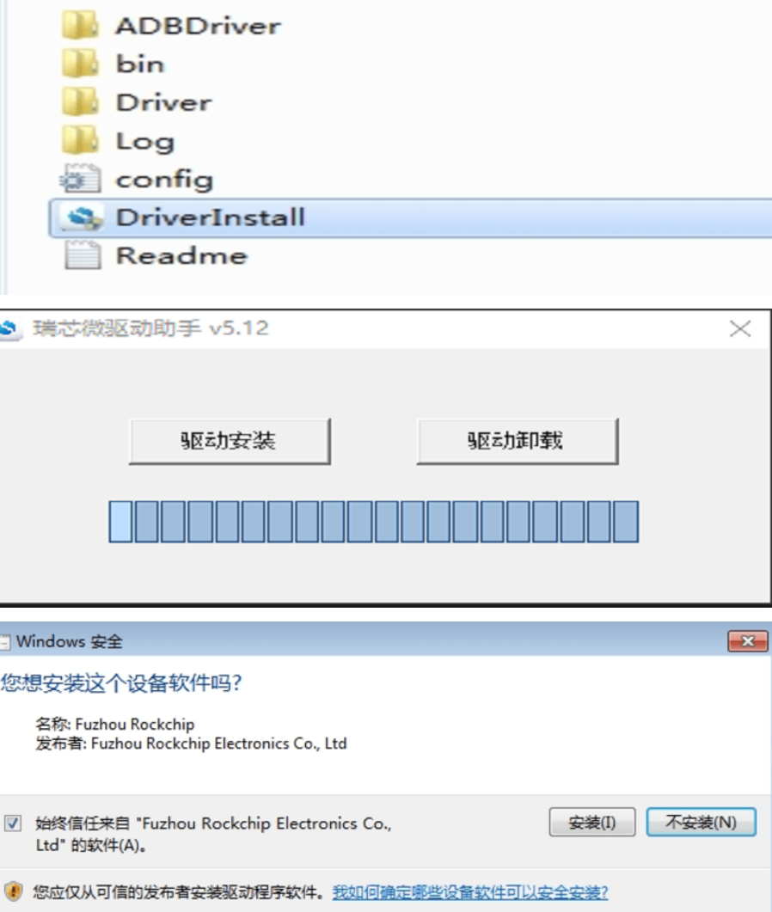


#### 4.2 开发烧写⼯具

- SDK 提供 Windows 烧写⼯具(⼯具版本需要 V3.15或以上)，⼯具位于⼯程根⽬录：
```
<SDK>/tools/windows/RKDevTool/
```

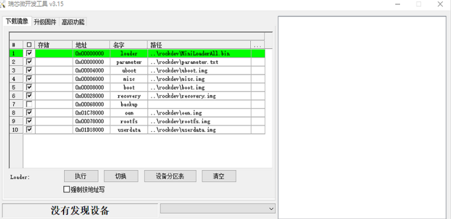


- SDK提供Linux烧写工具(Linux_Upgrade_Tool工具版本需要V2.17或以上)，工具位于工程根目录：
```
<SDK>/tools/linux/Linux_Upgrade_Tool/Linux_Upgrade_Tool
```
```
Linux_Upgrade_Tool$ sudo./upgrade_tool -h
------------------Tool Usage ------------------
Help: H
Version: V
Log: LG
----------------Upgrade Command ----------------
ChooseDevice: CD
ListDevice: LD
SwitchDevice: SD
UpgradeFirmware: UF <Firmware> [-noreset] [FLASH|EMMC|SPINOR|SPINAND]
UpgradeLoader: UL <Loader> [-noreset] [FLASH|EMMC|SPINOR|SPINAND]
DownloadImage: DI <-p|-b|-k|-s|-r|-m|-u|-t|-re image>
DownloadBoot: DB <Loader>
EraseFlash: EF <Loader|firmware>
PartitionList: PL
WriteSN: SN <serial number>
ReadSN: RSN
ReadComLog: RCL <File>
CreateGPT: GPT <Input Parameter> <Output Gpt>
SwitchStorage: SSD
----------------Professional Command --------------
TestDevice: TD
ResetDevice: RD [subcode]
ResetPipe: RP [pipe]
ReadCapability: RCB
ReadFlashID: RID
ReadFlashInfo: RFI
ReadChipInfo: RCI
ReadSecureMode: RSM
WriteSector: WS <BeginSec> <PageSizeK> <PageSpareB> <File>
ReadLBA: RL <BeginSec> <SectorLen> [File]
WriteLBA: WL <BeginSec> <SizeSec> <File>
EraseLBA: EL <BeginSec> <EraseCount>
EraseBlock: EB <CS> <BeginBlock> <BlokLen> [--Force]
RunSystem: RUN <uboot_addr> <trust_addr> <boot_addr> <uboot> <trust> <boot>
```
#### 4.3  打包⼯具

主要⽤于各分⽴固件打包成⼀个完整的update.img固件⽅便升级。
- Windows 环境下打包update.img固件⽅法，运⾏如下命令⽣成update.img
```
<SDK>/tools/windows/RKDevTool/rockdev/mkupdate.bat
```
- Linux 环境下打包update.img固件⽅法，运⾏如下命令⽣成update.img
```
<SDK>/tools/linux/Linux_Pack_Firmware/rockdev/mkupdate.sh
```
#### 4.4  SD升级启动制作⼯具
⽤于制作SD卡升级、SD卡启动、SD卡PCBA测试.
```
<SDK>/tools/windows/SDDiskTool_v1.74.zip
```
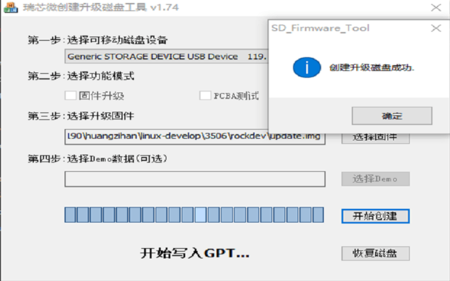


#### 4.5 写号工具

`<SDK>/tools/windows/RKDevInfowriteTool*`

解压RKDevInfowriteTool-1.3.0.7z后安装，以管理员权限打开软件，工具使用参考当前目录
Rockchip_User_Guide_RKDevInfowriteTool_CN.pdf。

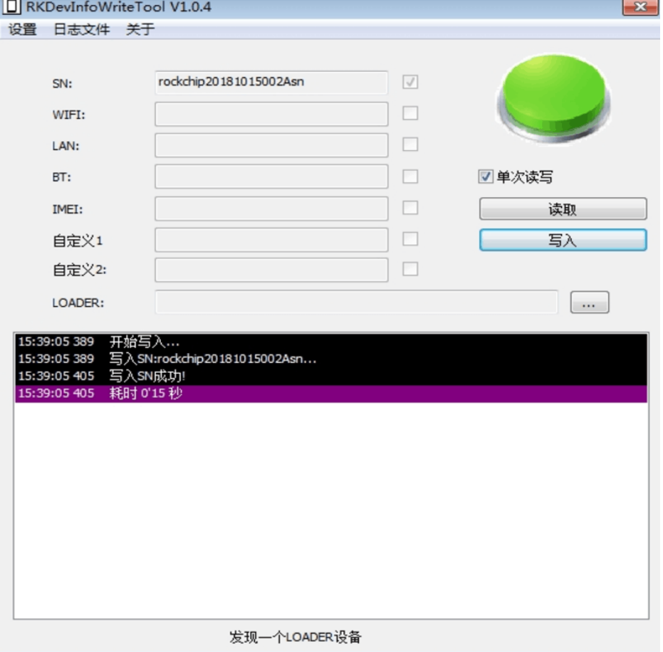


#### 4.6 固件签名工具

用于固件的efuse/op签名。

- SDK提供Windows签名工具位于工程根目录：
```
<SDK>/tools/windows/SecureBootTool_v2.2
```
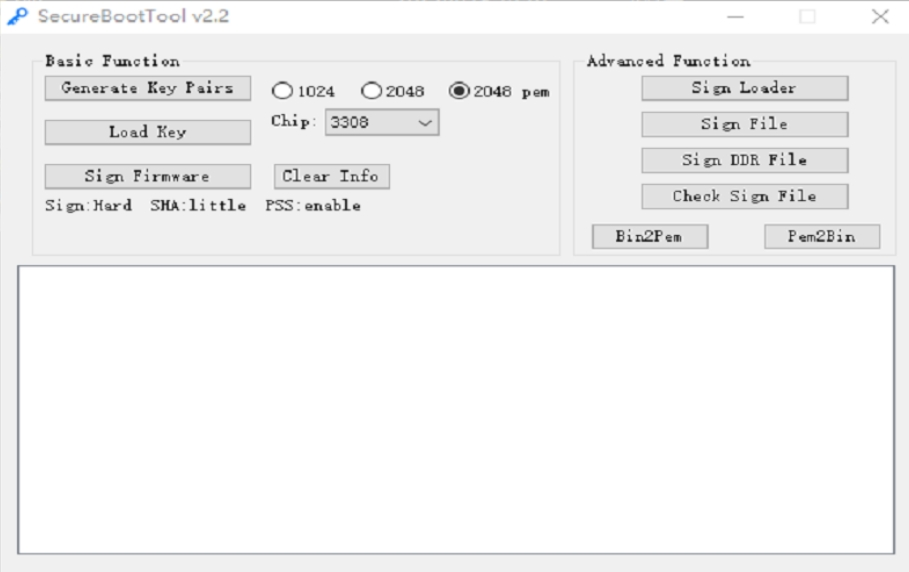

- SDK提供Linux签名工具位于工程根目录：
```
<SDK>/tools/linux/rk_sign_tool_v1.31_linux.zip
rk_sign_tool_v1.3_linux$./rk_sign_tool
rk_sign_tool is a tool signing firmware and loader for secureboot
usage of rk_sign_tool v1.3:
CC <--chip_id> //select sign options by chip
KK [--bits default=2048] [--out] //generating rsa key pairs
LK [--key] [--pubkey] //loading rsa key pairs
SI [--key] [--pubkey] [--pss] //signing image like boot uboot trust
SL [--key] [--pubkey] [--loader] [--little] [--pss] //signing loader like
RKXX_loader.bin
SF [--key] [--pubkey] [--firmware] [--little] [--pss] //signing firmware like
update.img
SB [--key] [--bin] [--pss] //signing binary file
GH [--bin] [--sha 160|256] [--little] //computing sha of binary file
rk_sign_tool XX -h to get more help
```
工具使用参考目录`/docs/cn/Linux/Security/Rockchip_Developer_Guide_Linux4.4_SecureBoot_CN.pdf`中签名工具使用说明。

#### 4.7 烧录器升级⼯具
⽤于量产烧录器镜像制作⼯具，该⼯具位于：
```
<SDK>/tools/windows/programmer_image_tool 或
<SDK>/tools/linux/programmer_image_tool
```


烧录器镜像制作步骤:
- 烧录镜像到 emmc
```
./programmer_image_tool -i update.img -t emmc
```
- 烧录镜像到 spi nor
```
./programmer_image_tool -i update.img -t spinor
```
更多使⽤说明参考⼯具⽬录 user\_manual.pdf ⽂档。

#### 4.8  PCBA测试⼯具
PCBA测试⼯具⽤于帮助在量产的过程中快速地甄别产品功能的好坏,提⾼⽣产效率。⽬前包括屏幕(LCD)、⽆线(Wi-Fi)、蓝⽛(bluetooth)、DDR/EMMC 存储、SD 卡(sdcard)、USB HOST、按键(KEY),喇叭耳机(Codec)等测试项⽬。
这些测试项⽬包括⾃动测试项和⼿动测试项,⽆线⽹络、DDR/EMMC、以太⽹为⾃动测试项,按键,SD卡、USB HOST、Codec、为⼿动测试项⽬。
PCBA⼯具位于：
```
<SDK>/tools/windows/RKPCBATool_V1.0.9.zip
```
具体PCBA功能配置及使⽤说明,请参考:
/tools/windows/RKPCBATool\_V1.0.9/Rockchip PCBA测试开发指南\_1.10.pdf
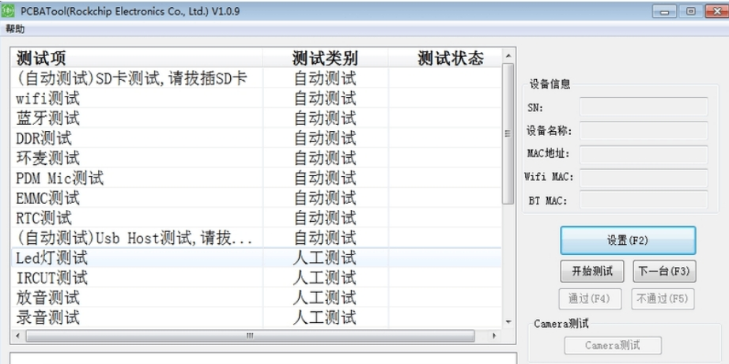


#### 4.9 DDR焊接测试⼯具
⽤于测试DDR的硬件连接,排查虚焊等硬件问题：
```
<SDK>/tools/windows/DDR_UserTool_v1.41.zip
```
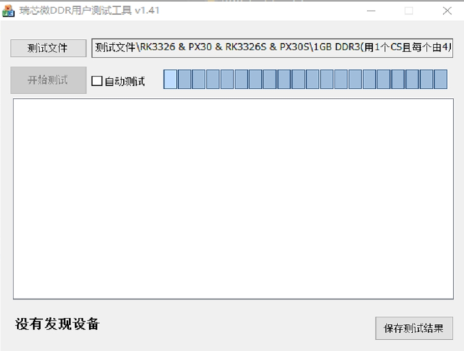

#### 4.10 **eFuse**烧写⼯具
⽤于eFuse的烧写,适⽤于RK3288/RK3368/RK3399/RK3399Pro等平台。
```
<SDK>/tools/windows/EfuseTool_v1.42zip
```
如果芯⽚使⽤ eFuse 启⽤ SecureBoot 功能,请保证硬件连接没有问题,因为eFuse 烧写时,Kernel 尚未启动,所以请保证 VCC\_EFUSE 在 MaskRom状态下有电才能使⽤。

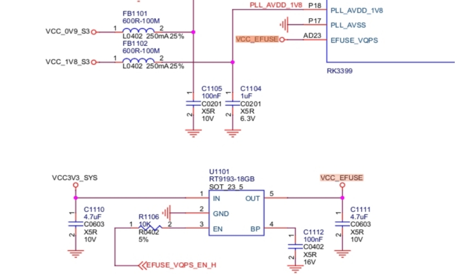


使⽤ /Tools/windows/EfuseTool\_v1.4.zip,板⼦进⼊ MaskRom 状态。点击"固件",选择签名的 update.img,或者Miniloader.bin,点击运⾏"启动",开始烧写 eFuse。

#### 4.11 量产升级⼯具
⽤于⼯⼚批量烧写固件：
```
<SDK>/tools/windows/FactoryTool_v1.76.zip
```
#### 4.12 分区修改⼯具

⽤于Paramter.txt中的分区修改⼯具：
```
<SDK>/tools/windows/ParameterTool_v1.2.zip
```

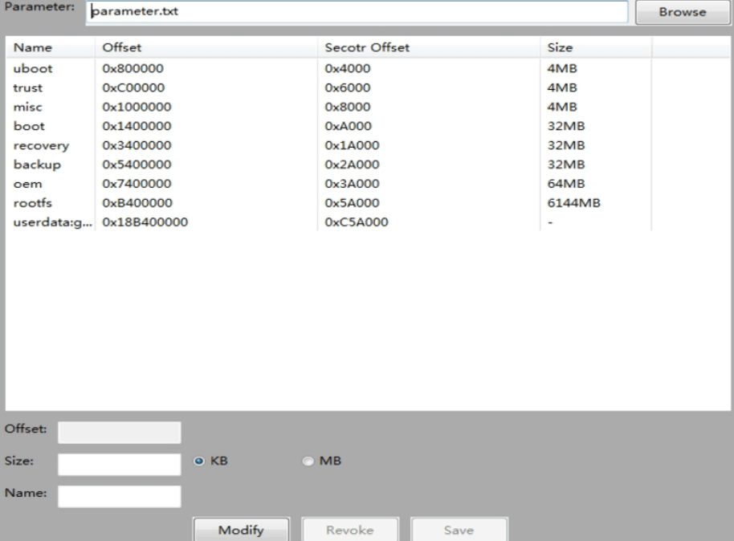


## 5. Chapter-5 SDK软件架构

#### 5.1 SDK工程目录介绍

一个通用Linux SDK工程目录包含有buildroot、debian、app、kernel、u-boot、device、docs、external等目录。采用manifest来管理仓库，用repo工具来管理每个目录或其子目录会对应的git工程。

- app：存放上层应用APP，主要是一些应用Demo。
- buildroot：存放Buildroot开发的根文件系统。
- debian：存放Debian开发的根文件系统。
- device/rockchip：存放芯片板级配置以及一些编译和打包固件的脚本和文件。
- docs：存放通用开发指导文档、Linux系统开发指南、芯片平台相关文档等。
- external：存放第三方相关仓库，包括显示、音视频、摄像头、网络、安全等。
- kernel：存放Kernel开发的代码。
- output：存放每次生成的固件信息、编译信息、XML、主机环境等。
- prebuilts：存放交叉编译工具链。
- rkbin：存放Rockchip相关二进制和工具。
- rockdev：存放编译输出固件，实际软链接到output/firmware。
- tools：存放Linux和Window操作系统下常用工具。
- u-boot：存放基于v2017.09版本进行开发的U-Boot代码。
- yocto：存放Yocto开发的根文件系统。

#### 5.2 SDK概述

通用Linux SDK目前已集成主流的几个Linux发行版(Distribution)，发行版就是我们日常在Linux主机上使用的那些系统，为用户预先集成好的Linux操作系统及各种应用软件。Linux发行版的形式多种多样，有从功能齐全的桌面系统到服务器版本到小型系统。比如支持桌面版本的Debian系统，可定制化的Buildroot/Yocto轻量级系统。

至于产品中系统的选型可按具体产品需求情况来定。具体系统情况介绍如下：

###### 5.2.1 Buildroot系统

Rockchip Linux SDK的Buildroot系统，其包含了基于Linux系统开发用到的各种系统源码，驱动，工具，应用软件包。Buildroot是Linux平台上一个开源的嵌入式Linux系统自动构建框架。整个Buildroot是由Makefile脚本和Kconfig配置文件构成的。可通过Buildroot配置，编译出一个完整的可以直接烧写到机器上运行的Linux系统软件。


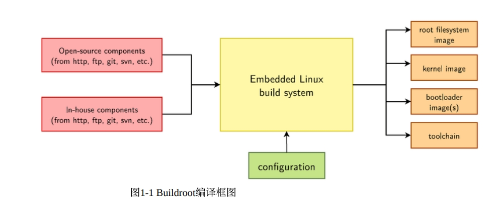


Buildroot有以下几点优势：
- 通过源码构建，有很大的灵活性；
- 方便的交叉编译环境，可以进行快速构建，容易上手；
- 提供系统各组件的配置，方便定制开发。

使用Buildroot的project最出名的就是Openwrt。可以看到，由它制作出的镜像可以跑在搭载16 Mb SPI NOR的路由器上，系统基本没包含多余的东西。这就是得益于Buildroot的简单化。整个Buildroot工程在一个git维护。

Buildroot使用kconfig和make，一个defconfig配置代表一种BSP支持。

Buildroot本身不具备扩展能力，用户需要自己通过脚本来完成工作。这些列出来的特点，都是和Yocto不同的地方。

> Buildroot是我们内部主要开发和维护的系统。

###### 5.2.2 Yocto

Yocto和Buildroot一样，是一套构建嵌入式系统的工具，但是两者的风格完全不同。
Yocto工程是通过一个个单独的包（meta）来维护，比如有的包负责核心，有的包负责外围。有的包用于跑Rockchip的芯片，有的包用于安装上weston，有的包是则是用于跑debian，同样采用类似机制的nodes，社区膨胀非常厉害，活跃度很高，每个人都可分享自己的成果到github上，这样的机制保证了我们可以从互联网复用别人的工作成果，相当有价值。相比Buildroot系统，Yocto有其更强的编译机制，比如第三方包的依赖和重编，都会自动处理。缺点相对复杂、需VPN网络。

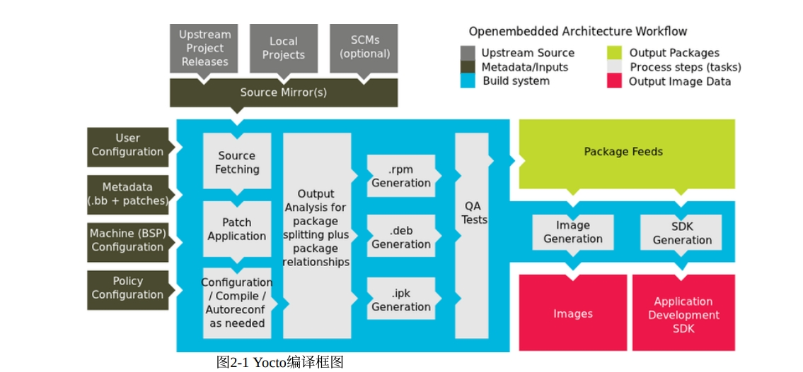


Yocto是⼀个⾮常灵活的构建系统，允许⽤⼾使⽤shell和Python来处理各种特殊情况。⽬前，该系统主要针对国外客⼾。如果您需要更多关于Yocto的信息，请查看以下参考资料：
[Yocto](https://www.yoctoproject.org/)
[RockchipYocto](http://opensource.rock-chips.com/wiki_Yocto)
[Yocto stable branch](https://wiki.yoctoproject.org/wiki/Stable_branch_maintenance)
> ⽬前该系统主要针对海外、爱好者或具备⼆次开发能⼒的客⼾使⽤。

###### 5.2.3 Debian

###### 5.2.3 Debian

Debian是一种完全自由开放并广泛用于各种设备的Linux操作系统选择Debian原因如下：
- Debian是自由软件
Debian是由自由和开放源代码的软件组成，并将始终保持100%自由。每个人都能自由使用、修改，以及发布。大家可以基于Rockchip构建Debian系统进行二次开发。
- Debian是一个基于Linux稳定且安全的的操作系统。
Debian是一个广泛用于各种设备的操作系统，其使用范围包括笔记本计算机，台式机和服务器。自1993年以来，它的稳定性和可靠性就深受用户的喜爱。我们为每个软件包提供合理的默认配置。
Debian开发人员会尽可能在其生命周期内为所有软件包提供安全更新。
- Debian具有广泛的硬件支持。
大多数硬件已获得Linux内核的支持。当自由软件无法提供足够的支持时，也可使用专用的硬件驱动程序。目前Rockchip RK3588/RK3568/RK3566/RK3399/RK3288等芯片已经适配并支持。
- Debian提供平滑的更新。
Debian在其发行周期内轻松流畅地进行更新而闻名，不仅如此，还包括轻松升级到下一个大版本。Rockchip目前已从Debian Stretch(9)升级到Debian Buster(10)和Bullseye(11)版本。
- Debian是许多其他发行版的种子和基础。
许多非常受欢迎的Linux发行版，例如Ubuntu、Knoppix、PureOS、SteamOS以及Tails，都选择了Debian作为它们的软件基础。Debian提供了所有工具，因此每个人都可以用能满足自己需求的软件包来扩展Debian档案库中的软件包。
- Debian项目是一个社区。

Debian不只是一个Linux操作系统。该软件由来自世界各地的数百名志愿者共同制作。即使您不是一个程序员或系统管理员，也可以成为Debian社区的一员。

Rockchip定制版的Debian系统是通过Shell脚本来达到获取构建Linux Debian发行版源码，编译和安装适配Rockchip硬件加速包的操作系统。

目前该系统主要针对客户前期评估、第三方系统移植参考、和产品有复杂桌面需求等。


#### 5.3 SDK软件框图


SDK软件框图-3.4所示，从下至上分为启动层、内核层、库、应用层四个层次，各层次内容如下：
- 启动层主要提供系统启动，如BootROM、U-Boot、ATF等相关支持。
- 内核层主要提供Linux Kernel的标准实现，Linux也是一个开放的操作系统，Rockchip平台的Linux核心为标准的Linux-4.4/4.19/5.10内核，提供安全性，内存管理，进程管理，网络协议栈等基础支持；主要是通过Linux内核管理设备硬件资源，如CPU调度、缓存、内存、I/O等。
- 库层对应一般嵌入式系统，相当于中间件层次。包含了各种系统基础库，及第三方开源程序库支持，对应用层提供API接口，系统定制者和应用开发者可以基于Libraries的API开发新的应用。
- 应用层主要实现具体的产品功能及交互逻辑，需要一些系统基础库及第三方程序库支持，开发者可以开发是自己的应用程序，提供系统各种能力给到最终用户。


SDK 系统启动流程是指系统上电到系统启动完成的⼀个软件流程，下⾯是 linux系统启动流程：


>
> 说明:
> AP 和 MCU 内部都有集成⼀个 BOOTROM，系统上电时先会运⾏ BOOTROM代码，然后
> BOOTROM 代码会探测外设存储器并加载 Loader 代码。
> Pre Loader ⽬前有 3 个： miniloader（⾮开源）， uboot spl 和 loader。

#### 5.4  **SDK**开发流程

Rockchip Linux系统是基于Buildroot/Yocto/Debian 系统, 内核基于 kernel4.4/4.19/5.10开发，针对多种不同产品形态开发的SDK。可以基于本SDK，有效地实现系统定制和应⽤移植开发。


如图4-1所示，开发者可以遵循上述开发流程，在本地快速构建Rockchip Linux系统的开发环境和编译代码。下面将简单介绍下该流程：
- 检查系统需求：在下载代码和编译前，需确保本地的开发设备能够满足需求，包括机器的硬件能力，软件系统，工具链等。目前SDK支持Linux操作系统环境下编译，并且提供Linux环境下的工具支持，其他如MacOS、Windows等系统暂不支持。
- 搭建编译环境：介绍开发机器需要安装的各种软件包和工具，详见SDK开发环境搭建。
- 选择设备：在开发过程中，需要开发者根据自己的需求，选择对应的硬件设备，详见SDK适配硬件全自动编译工具。
- 下载代码：选定设备类型后，需要安装repo工具用于批量下载源代码，详见SDK软件包。
- 系统定制：开发者可以根据硬件的硬件板子、产品定义，定制U-Boot、Kernel及Rootfs，详见SDK系统定制与打包。
- 编译与打包：介绍备资源代码后，选择产品及初始化相关的编译环境，而后执行编译命令，包括整体或模块编译以及编译清理等工作，进一步内容详见SDK编译使用。
- 烧录并运行：继生成镜像文件后，将介绍如何烧录镜像并运行在硬件设备，进一步内容详见SDK固件开发。

## 6. Chapter-6 SDK开发环境搭建

#### 6.1 概述

本节主要介绍了如何在本地搭建编译环境来编译Rockchip Linux SDK源代码。当前SDK只支持在Linux环境下编译和进行二次开发。

一个典型的嵌入式开发环境通常包括Linux服务器、PC和目标硬件板，典型开发环境如下图所示。

- Linux服务器上建立交叉编译环境，为软件开发提供代码、更新下载和进行编译等服务。
- PC和Linux服务器共享程序，并安装PuTTy或Minicom，通过网络远程登录到Linux服务器，进行交叉编译，及代码的开发调试。
- PC通过串口和USB与目标硬件板连接，可将编译后的镜像文件烧写到目标硬件板，并调试系统或应用程序。

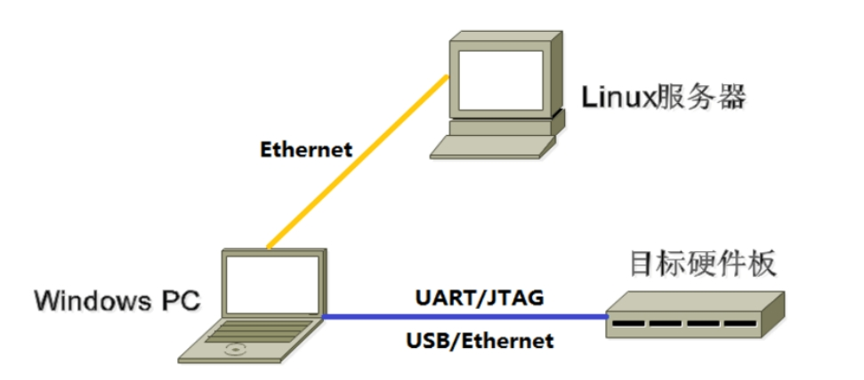


[注]：开发环境中使用了Windows PC，实际上很多工作也可以在Linux PC上完成，如使用Minicom代替Putty等，用户可自行选择。

#### 6.2 SDK开发前准备工作

Rockchip Linux SDK的代码和相关文档被划分为了若干git仓库分别进行版本管理，开发者可以使用repo对这些git仓库进行统一的下载、提交、切换分支等操作。

###### 6.2.1 安装和配置git工具

在使用repo之前请配置一下自己的git信息，否则后面的操作可能会遇到hook检查的障碍：
- 更新源并安装git
```
sudo apt update && sudo apt-get install git
```
- 配置⽤⼾信息
```
git config --global user.name "your name"
git config --global user.email "your mail"
```

###### 6.2.2  安装和配置**repo**⼯具

repo 是 google ⽤ Python 脚本写的调⽤ git的⼀个脚本，主要是⽤来下载、管理项⽬的软件仓库。下述命令中的安装路径以\"\~/bin\"为例，请⽤⼾⾃⾏创建所需⽬录。
```
mkdir ~/bin
cd ~/bin
git clone ssh://git@www.rockchip.com.cn/repo/rk/tools/repo
chmod a+x ~/bin/repo/repo
export PATH=~/bin/repo:$PATH
```
除以上⽅式外，也可以使⽤如下命令获取 repo
- 国外地区，可从Google镜像站点来下载repo⼯具：
```
mkdir ~/bin
curl https://storage.googleapis.com/git-repo-downloads/repo -o ~/bin/repo
chmod a+x ~/bin/repo
export PATH=~/bin:$PATH
```
- 国内地区， 可从清华源镜像站点来下载repo⼯具：
```
mkdir ~/bin
curl https://mirrors.tuna.tsinghua.edu.cn/git/git-repo -o ~/bin/repo
chmod a+x ~/bin/repo
export PATH=~/bin:$PATH
```

###### 6.2.3  SDK 获取

SDK 通过瑞芯微代码服务器对外发布。客⼾向瑞芯微技术窗口申请SDK，需同步提供 SSH公钥进⾏服务器认证授权，获得授权后即可同步代码。关于瑞芯微代码服务器SSH 公钥授权，请参考 本⽂章节SSH 公钥操作说明。

###### 6.2.3.1 SDK下载命令

Rockchip Linux SDK可以适配到不同的芯片平台上，比如RK3588、RK3562、RK3566、RK3568、RK3308、RK3288、RK3326PX30、RK3399、RK3399Pro、RK1808等，对于不同芯片平台的源代码会有一定程度的不同。开发者下载源代码的时候声明自己想要的芯片平台，从而不必下载自己不需要的代码。

SDK使用不同XML来声明自己想要下载的对应芯片平台。

请参考本文章节通过代码服务器下载。

代码将开始自动下载，后面只需耐心等待。源代码文件将位于工作目录中对应的项目名称下。初始同步操作将需要1个小时或更长时间才能完成。

######## 6.2.3.2 SDK代码压缩包

为方便客户快速获取SDK源码，瑞芯微技术窗口通常会提供对应版本的SDK初始压缩包，开发者可以通过这种方式，获得SDK代码的初始压缩包，该压缩包解压得到的源码，与通过repo下载的源码是一致的。

请参考本文章节通过本地压缩包解压获取。

######## 6.2.3.3 软件更新记录

软件发布版本升级通过工程xml进行查看，比如RK3588芯片具体方法如下：

```.repo/manifests$ realpath rk3588_Linux_release.xml
例如：打印的版本号为v1.3.0，更新时间为20230920
<SDK>/.repo/manifests/rk3588_Linux_release_v1.3.0_20230920.xml
```
软件发布版本升级更新内容通过工程文本可以查看，参考工程目录，比如RK3588查看方法如下：
```
<SDK>/.repo/manifests/rk3588_Linux/RK3588_Linux_5.10_SDK_Note.md
<SDK>/docs/cn/RK3588/RK3588_Linux_5.10_SDK_Note.md
```

######## 6.2.3.4 SDK更新

后续开发者可根据FAE窗口定期发布的更新说明，通过命令同步更新。
```
.repo/repo/repo sync -c
```


######## 6.2.3.5 SDK问题反馈

Rockchip bug系统（Redmine）为了更好的帮助客户开发，记录了用户问题处理过程及状态，方便双方同时跟踪，使问题处理更及时更高效。后续SDK问题、具体技术问题、技术咨询等都可以提交到此Bug系统上，Rockchip技术服务会及时将问题进行分发、处理和跟踪。更多详细说明，可参考文档
`<SDK>/docs/cn/Others/Rockchip_User_Guide_SDK_Application_And_Synchronization_CN.pdf`

#### 6.3 开发环境搭建

###### 6.3.1 准备开发环境

我们推荐使用Ubuntu 22.04或更高版本的系统进行编译。其他的Linux版本可能需要对软件包做相应调整。除了系统要求外，还有其他软硬件方面的要求。
硬件要求：64位系统，硬盘空间大于40G。如果您进行多个构建，将需要更大的硬盘空间。
软件要求：Ubuntu 22.04或更高版本系统。

###### 6.3.2 安装库和工具集

使用命令行进行设备开发时，可以通过以下步骤安装编译SDK需要的库和工具。
使用如下apt-get命令安装后续操作所需的库和工具：
```
sudo apt-get update && sudo apt-get install git ssh make gcc libssl-dev \
liblz4-tool expect expect-dev g++ patchelf chrpath gawk texinfo chrpath \
diffstat binfmt-support qemu-user-static live-build bison flex fakeroot \
cmake gcc-multilib g++-multilib unzip device-tree-compiler ncurses-dev \
libgucharmap-2-90-dev bzip2 expat gpgv2 cpp-aarch64-linux-gnu libgmp-dev \
libmpc-dev bc python-is-python3 python2
```
说明：
安装命令适用于Ubuntu22.04，其他版本请根据安装包名称应用对应的安装命令，若编译遇到报错，可以视报错信息，安装对应的软件包。其中：
- python要求安装python 3.6及以上版本，此处以python 3.6为例。
- make要求安装make 4.0及以上版本，此处以make 4.2为例。
- lz4要求安装lz4 1.7.3及以上版本。
- 编译Yocto需要VPN网络，git没有CVE-2022-39253安全检测补丁。

######## 6.3.2.1 检查和升级主机的python版本

检查和升级主机的python版本方法如下：
- 检查主机`python`版本
```
$ python3 --version
Python 3.10.6
```
如果不满⾜python>=3.6版本的要求， 可通过如下⽅式升级：
- 升级`python 3.6.15`新版本
```
PYTHON3_VER=3.6.15
echo "wget
https://www.python.org/ftp/python/${PYTHON3_VER}/Python-${PYTHON3_VER}.tgz"
echo "tar xf Python-${PYTHON3_VER}.tgz"
echo "cd Python-${PYTHON3_VER}"
echo "sudo apt-get install libsqlite3-dev"
echo "./configure --enable-optimizations"
echo "sudo make install -j8"
```
######## 6.3.2.2 检查和升级主机的 **make** 版本

检查和升级主机的`make`版本⽅法如下：
- 检查主机make 版本
```
$ make -v
GNU Make 4.2
Built for x86_64-pc-linux-gnu
```
- 升级`make 4.2`新版本
```
$ sudo apt update && sudo apt install -y autoconf autopoint
git clone https://gitee.com/mirrors/make.git
cd make
git checkout 4.2
git am $BUILDROOT_DIR/package/make/*.patch
autoreconf -f -i
./configure
make make -j8
sudo install -m 0755 make /usr/bin/make
```
######## 6.3.2.3 检查和升级主机的 lz4 版本

检查和升级主机的lz4 版本⽅法如下：
- 检查主机lz4 版本
```
$ lz4 -v
*** LZ4 command line interface 64-bits v1.9.3, by Yann Collet ***
```
- 升级lz4 新版本
```
git clone https://gitee.com/mirrors/LZ4_old1.git
cd LZ4_old1
make
sudo make install
sudo install -m 0755 lz4 /usr/bin/lz4
```
######## 6.3.2.4 检查和升级主机的 git 版本

- 检查主机git 版本
```
$ git -v
git version 2.38.0
```
- 升级git 新版本
```
$ sudo apt update && sudo apt install -y libcurl4-gnutls-dev
git clone https://gitee.com/mirrors/git.git --depth 1 -b v2.38.0
cd git
make git -j8
make install
sudo install -m 0755 git /usr/bin/git
```

####6.4 Docker环境搭建

为帮助开发者快速完成上⾯复杂的开发环境准备⼯作，我们也提供了交叉编译器Docker镜像，以便客⼾可以快速验证，从而缩短编译环境的构建时间。

使⽤Docker环境前，可参考如下⽂档进⾏操作`<SDK>/docs/cn/Linux/Docker/Rockchip_Developer_Guide_Linux_Docker_Deploy_CN.pdf` 。
已验证的系统如下：

| 发行版本 | Docker版本 | 镜像加载 | 固件编译 |
| ---- | ---- | ---- | ---- |
| ubuntu 22.04 | 24.0.5 | pass | pass |
| ubuntu 21.10 | 20.10.12 | pass | pass |
| ubuntu 21.04 | 20.10.7 | pass | pass |
| ubuntu 18.04 | 20.10.7 | pass | pass |
| fedora35 | 20.10.12 | pass | NR (not run) |

Docker镜像可从网址[Docker镜像](具体网址)获取。


#### 6.5 交叉编译工具链介绍


鉴于Rockchip Linux SDK目前只在Linux PC环境下编译，我们也仅提供了Linux下的交叉编译工具链。
prebuilt目录下的工具链是U-Boot和Kernel使用。
具体Rootfs需要用各自对应的工具链，或者使用第三方工具链进行编译。


###### 6.5.1 U-Boot及Kernel编译工具链
```
Linux4.4/4.19 SDK:
prebuilts/gcc/linux-x86/aarch64/gcc-linaro-6.3.1-2017.05-x86_64_aarch64-linuxgnu/bin/aarch64-linux-gnuLinux5.10 SDK:
prebuilts/gcc/linux-x86/aarch64/gcc-arm-10.3-2021.07-x86_64-aarch64-none-linuxgnu/bin/aarch64-none-linux-gnu
```
对应版本
```
Linux4.4/4.19 SDK:
gcc version 6.3.1 20170404 (Linaro GCC 6.3-2017.05)
Linux5.10 SDK:
gcc version 10.3.1 20210621 (GNU Toolchain for the A-profile Architecture 10.3-
2021.07 (arm-10.29))
```

###### 6.5.2 Buildroot⼯具链

若需要编译单个模块或者第三⽅应⽤，需对交叉编译环境进⾏配置。⽐如RK3588，其交叉编译⼯具位于`buildroot/output/rockchip\_rk3588/host/usr`⽬录下，需要将⼯具的bin/⽬录和`aarch64-buildroot-linux-gnu/bin/`⽬录设为环境变量，在顶层⽬录执⾏⾃动配置环境变量的脚本：
```
source buildroot/envsetup.sh
```
输⼊命令查看：
```
cd buildroot/output/rockchip_rk3588/host/usr/bin
./aarch64-linux-gcc --version
```
此时会打印如下信息：
```
aarch64-linux-gcc.br_real (Buildroot linux-5.10-gen-rkr6) 12.3.0
```
如果需要其他平台或版本的⼯具链，需⾃⾏编译。
上述环境准备好后，Linux服务器开发环境搭建已完成，可以下载编译源代码了。
具体可参考
```
buildroot/docs/manual/using-buildroot-toolchain.txt
buildroot/docs/manual/adding-packages.txt
```

###### 6.5.3 Debian⼯具链

使⽤docker机器端，gcc或者 dpkg-buildpackage 进⾏相关编译。

###### 6.5.4.  **Yocto**⼯具链

参考如下:
```
https://wiki.yoctoproject.org/wiki/Building_your_own_recipes_from_first_principle
s##Adding_new_recipes_to_the_build_system
https://docs.yoctoproject.org/dev/dev-manual/new-recipe.html
```
#### 6.6 **Window PC** 开发坏境搭建

###### 6.6.1  开发⼯具安装

- 请⽤⼾⾃⾏安装 Vim，Notepad++等编辑软件。
- 下载[Virtual-Box](https://www.virtualbox.org/wiki/Downloads)(提供虚拟开发环境的软件)
- 下载[XShell6](https://www.onlinedown.net/soft/36383.htm)(⽤来和Linux系统建⽴交互)

###### 6.6.2  **Rockchip USB** 驱动安装

开发调试阶段，需要将设备切换⾄ Loader 模式或是 Maskrom 模式，需要安装Rockusb 驱动才能正常识别设备。
Rockchip USB 驱动安装助⼿存放在`tools/windows/DriverAssitant\_v5.x.zip`。⽀持xp，win7\_32，win7\_64，win10\_32，win10\_64等操作系统。
安装步骤如下：
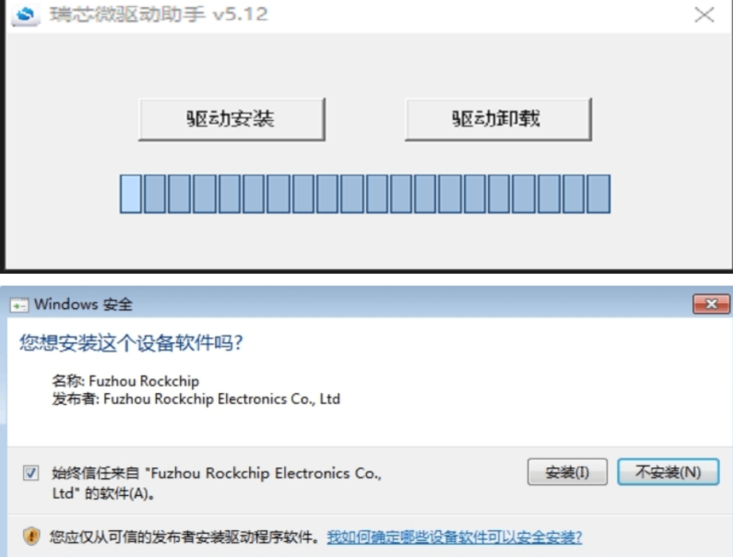


###### 6.6.3  **Windows** 烧录⼯具使⽤

Windows 系统上的的烧录⼯具发布在` \<SDK\>/tools/windows/RKDevTool/RKDevTool\_Release `，可⽤于 Windows 环境下开发调试，固件的烧写。具体的使⽤说明⻅
开发烧写⼯具 。

###### 6.6.4.  ⽬标硬件板准备

请参考SDK 软件包适⽤硬件列表《SDK软件包适⽤硬件列表》，选择对应硬件板⼦，进⾏后续的开发调试。对应的硬件使⽤说明⽂档，会介绍硬件接口，使⽤说明，及烧录操作⽅法。

## 7.  **Chapter-7 SDK**版本及更新说明

Linux SDK目前对外有Linux4.4、Linux4.19、Linux5.10等不同版本，使用repo来管理SDK并使用tag来管理版本。SDK的各个组件和模块分别存储在不同的Git仓库中，并通过repo工具来协调它们之间的版本和代码同步。每个组件的Git仓库都有自己的分支和提交历史。

#### 7.1 SDK命名规则

###### 7.1.1 SDK tag命名规范

系统 - 系统版本 - 形态 - rkr发布版本

比如Linux5.10 SDK tag为l1inux-5.10-gen-rkr1

其中：
- 系统：linux、android、rtos等
- 系统版本：Linux有4.4、4.19、5.10等
- 形态：比如lgen、common、standard、ipc、芯片名称等
- 发布版本：对外有alpha、beta、release的版本，对应是rka1、rkb1、rkr1

###### 7.1.2 SDK发布文档命名规范

Rockchip[1]RK3399[2]Linux5.10[3]SDK[4]Release[5]V1.0.0[6]20220920[7]_CN[8]

说明：
> [1]：Rockchip，必须项。RK内部输出的文档必须以Rockchip开头。
[2]：芯片名称。芯片开头字母统一大写，但后缀视芯片不同保持与公司芯片型号定义保持一致。如果有两颗芯片，用下划线连接比如（RK3566_RK3568）。
[3]：Linux、Android、FreeRTOS等，第一个字母大写。
[4]：可选项，表示目标市场，如果是通用SDK,此项略。
[5]和[6]：发布类型(Alpha/Beta/Release)和版本号。版本号的样式定义如下：“Vn.n.n”。其中字母“V”保持大写，n表示整数。可以看出版本号由三个数字组成，中间2个点。
    - Alpha版本从V0.0.1开始，即前两位保持数字0，最后一位数字根据测试发布实际情况数字递增；
    - Beta版本从V0.1.1开始，即保持第一位数字为0，第二位数字的递增表示添加功能模块或者功能的较大更新，第三位数字的递增表示Bug修正；
    - Release版本从V1.0.0开始，第一位数字表示重大更新，第二位与第三位数字参考Beta版本。
[7]：发布日期。统一用20220920这种格式。
[8]：文档语言版本信息。CN:中文，EN:英文

###### 7.1.3 SDK压缩包命名规范

芯片平台 - 软件版本 - [目标市场]+ SDK + 版本号 + 发布日期

举例：
RK3399_LINUX5.10_SDK_RELEASE_V1.0.0_20220920

说明：
1. 英文字母全部大写
2. 软件平台：LINUX5.10
3. 目标市场用中括号，表示可选项，如果是通用SDK，此项略
4. SDK压缩包的版本号继续保留3位数，中间两个点

#### 7.2 SDK更新机制

###### 7.2.1 SDK对外更新

如果SDK有更新，大概是每个月20日左右更新，月底发信息简报。更新机制是一个月小更新(比如V1.0.x)，经过QA完整测试(比如V1.x.0)。

###### 7.2.2 SDK发布补丁

如果发布SDK有遇到重要问题，会以如下补丁的形式推送给客户：
[rockchip-patch](https://redmine.rock-chips.com/login?back_url=https%3A%2F%2Fredmine.rock-chips.com%2Fprojects%2Frockchip_patch%2Fissues)

#### 7.3 如何搭建服务器同步SDK

如何搭建Gitolite服务器，并用于SDK代码的管理与维护。具体参考如下文档
```
<SDK>/docs/cn/Others/Rockchip_Developer_Guide_Repo_Mirror_Server_Deploy.pdf
```

## 8. Chapter-8 SDK编译说明

SDK可通过make或./build.sh加目标参数进行相关功能的配置和编译。
具体参考`device/rockchip/common/README.md`编译说明。

为了确保SDK每次更新都能顺利进行，建议在更新前清理之前的编译产物。这样做可以避免潜在的兼容性问题或编译错误，因为旧的编译产物可能不适用于新版本的SDK。要清理这些编译产物，可以直接运行命令`./build.sh cleanall`。

#### 8.1 SDK编译命令查看

`make help`, 例如:
```
$ make help
menuconfig - interactive curses-based configurator
oldconfig - resolve any unresolved symbols in .config
syncconfig - Same as oldconfig, but quietly, additionally update
deps
olddefconfig - Same as syncconfig but sets new symbols to their
default value
savedefconfig - Save current config to RK_DEFCONFIG (minimal config)
...
```
make实际运⾏是./build.sh
即也可运⾏`./build.sh \<target\>`来编译相关功能，具体可通过`./build.sh -help`查看具体编译命。
```
$ ./build.sh -h
############################## Rockchip Linux SDK ##############################
Manifest: rk3562_linux_release_v1.1.0_20231220.xml
Log colors: message notice warning error fatal
Usage: build.sh [OPTIONS]
Available options:
chip[:<chip>[:<config>]] choose chip
defconfig[:<config>] choose defconfig
config modify SDK defconfig
...
updateimg build update image
otapackage build A/B OTA update image
all build images
release release images and build info
save alias of release
all-release build and release images
allsave alias of all-release
shell setup a shell for developing
cleanall cleanup
clean[:module[:module]]... cleanup modules
post-rootfs <rootfs dir> trigger post-rootfs hook scripts
help usage
Default option is 'all'.
```
#### 8.2 SDK板级配置
`make rockchip_defconfig`具体板级配置说明如下:

进入工程`<SDK>/device/rockchip/<chipset_name>`目录:

| 板级配置 | 说明 |
| ---- | ---- |
| rockchip_rk3588_evb1_lp4_v10_defconfig | 适用于RK3588 EVB1搭配LPDDR4开发板 |
| rockchip_rk3588_evb3_lp5_v10_defconfig | 适用于RK3588 EVB3搭配LPDDR5开发板 |
| rockchip_rk3588_evb7_lp4_v10_defconfig | 适用于RK3588 EVB7搭配LPDDR4开发板 |
| rockchip_rk3588s_evb1_lp4x_v10_defconfig | 适用于RK3588S EVB1搭配LPDDR4开发板 |
| rockchip_rk3562_evb1_lp4x_v10_defconfig | 适用于RK3562 EVB1搭配LPDDR4开发板 |
| rockchip_rk3562_evb2_ddr4_v10_defconfig | 适用于RK3562 EVB2搭配DDR4开发板 |
| rockchip_defconfig | 默认配置,具体会软链接到默认一个板级配置，可通过`make lunch`或者`./build.sh lunch`进行配置 |

比如RK3562芯片

```$./build.sh lunch
You're building on Linux
Lunch menu...pick a combo:

1. rockchip_defconfig
2. rockchip_rk3562_evb1_lp4x_v10_defconfig
3. rockchip_rk3562_evb2_ddr4_v10_defconfig
Which would you like? [1]:
```
其他功能的配置可通过`make menuconfig`来配置相关属性。

#### 8.3 SDK定制化配置

SDK可通过make menuconfig 进⾏相关配置，⽬前可配组件主要如下:
```
(rk3562) SoC
Rootfs --->
Loader (u-boot) --->
RTOS --->
Kernel --->
Boot --->
Recovery (based on buildroot) --->
PCBA test (based on buildroot) --->
Security --->
Extra partitions --->
Firmware --->
Update (Rockchip update image) --->
Others configurations --->
```
- Rootfs: 这里的Rootfs代表“根文件系统”，在这里可选择Buildroot、Yocto、Debian等不同的根文件系统配置。
- Loader (u-boot): 这是引导加载器的配置，通常是u-boot，用于初始化硬件并加载主操作系统。
- RTOS: 实时操作系统（RTOS）的配置选项，适用于需要实时性能的应用。
- Kernel: 这里配置内核选项，定制适合自己的硬件和应用需求的Linux内核。
- Boot: 这里配置Boot分区支持格式。
- Recovery (based on buildroot): 这是基于buildroot的recovery环境的配置，用于系统恢复和升级。
- PCBA test (based on buildroot): 这是一个基于buildroot的PCBA（印刷电路板组装）测试环境的配置。
- Security: 安全功能开启，包含Secureboot开启方式、Optee存储方式、烧写Key等。
- Extra partitions: 用于配置额外的分区。
- Firmware: 在这里配置固件相关选项。
- Update (Rockchip update image): 用于配置Rockchip完整固件的选项。
- Others configurations: 其他额外的配置选项。

通过`make menuconfig`配置界面提供了一个基于文本的用户界面来选择和配置各种选项。
配置完成后，使用`make savedefconfig`命令保存这些配置，这样定制化编译就会根据这些设置来进行。

通过以上config，可选择不同Rootfs/Loader/Kernel等配置，进行各种定制化编译，这样就可以灵活地选择和配置系统组件以满足特定的需求。

#### 8.4 SDK环境变量配置

可通过`source envsetup.sh`来设置不同芯片和目标功能的配置。

```
$ source envsetup.sh
Top of tree: /home/wxt/linux-develop/rk3562
You're building on Linux
Pick a board:
1. rockchip_px30_32
2. rockchip_px30_64
3. rockchip_px30_recovery
4. rockchip_rk3036
5. rockchip_rk3036_recovery
6. rockchip_rk3126c
7. rockchip_rk312x
8. rockchip_rk312x_recovery
9. rockchip_rk3288
10. rockchip_rk3288_recovery
11. rockchip_rk3308_32_release
12. rockchip_rk3308_b_32_release
13. rockchip_rk3308_b_release
14. rockchip_rk3308_bs_32_release
15. rockchip_rk3308_bs_release
16. rockchip_rk3308_h_32_release
17. rockchip_rk3308_recovery
18. rockchip_rk3308_release
19. rockchip_rk3326_64
20. rockchip_rk3326_recovery
21. rockchip_rk3358_32
22. rockchip_rk3358_64
23. rockchip_rk3358_recovery
24. rockchip_rk3399
25. rockchip_rk3399_base
26. rockchip_rk3399_recovery
27. rockchip_rk3399pro
28. rockchip_rk3399pro-multi-cam
29. rockchip_rk3399pro-npu
30. rockchip_rk3399pro-npu-multi-cam
31. rockchip_rk3399pro_combine
32. rockchip_rk3399pro_recovery
33. rockchip_rk3528
34. rockchip_rk3528_recovery
35. rockchip_rk3562
36. rockchip_rk3562_32
37. rockchip_rk3562_recovery
38. rockchip_rk3566
39. rockchip_rk3566_32
40. rockchip_rk3566_recovery
41. rockchip_rk3566_rk3568_base
42. rockchip_rk3566_rk3568_ramboot
43. rockchip_rk3568
44. rockchip_rk3568_32
45. rockchip_rk3568_recovery
46. rockchip_rk3588
47. rockchip_rk3588_base
48. rockchip_rk3588_ramboot
49. rockchip_rk3588_recovery
Which would you like? [1]:
```

⽐如选择35
然后进⾏RK3562的Buildroot⽬录,开始相关模块的编译。

#### 8.5 全⾃动编译

为了确保软件开发套件（SDK）的每次更新都能顺利进⾏，建议在更新前清理之前的编译产物。这样做
可以避免潜在的兼容性问题或编译错误，因为旧的编译产物可能不适⽤于新版本的SDK。要清理这些编
译产物，可以直接运⾏命令`./build.sh cleanall`。

进⼊⼯程根⽬录执⾏以下命令⾃动完成所有的编译：
```bash
./build.sh all ## 只编译模块代码（u-Boot，kernel，Rootfs，Recovery）
## 需要再执⾏`./build.sh ./mkfirmware.sh 进⾏固件打包
./build.sh ## 编译模块代码（u-Boot，kernel，Rootfs，Recovery）
## 打包成update.img完整升级包
## 所有编译信息复制和⽣成到out⽬录下
```

默认是 Buildroot，可以通过设置坏境变量 RK_ROOTFS_SYSTEM 指定不同 rootfs。 RK_ROOTFS_SYSTEM ⽬
前可设定三种系统：buildroot、debian、 yocto 。
⽐如需要 debain 可以通过以下命令进⾏⽣成：
```
export RK_ROOTFS_SYSTEM=debian
./build.sh
或
RK_ROOTFS_SYSTEM=debian ./build.sh
```
#### 8.6 模块编译

###### 8.6.1 U-Boot编译

进入SDK工程。运行如下命令进行编译：

`<SDK>##./build.sh uboot`

具体板级编译参考SDK发布文档中编译说明。

###### 8.6.2 Kernel编译

进入工程目录根目录执行以下命令自动完成kernel的编译及打包。

`<SDK>##./build.sh kernel`

具体板级编译参考发布说明或者Quick Start中编译说明。

###### 8.6.3 Recovery编译

进入工程根目录执行以下命令自动完成Recovery的编译及打包。

`<SDK>##./build.sh recovery`

编译后在 Buildroot ⽬录 `output/rockchip_rk3562_recovery/images ⽣成 recovery.img。

>注： recovery.img 是包含内核，所以每次 Kernel 更改，Recovery 是需要重新打包⽣成。Recovery重
新打包的⽅法如下：

```
<SDK>##source buildroot/envsetup.sh
<SDK>##cd buildroot
<SDK>##make recovery-reconfigure
<SDK>##cd -
<SDK>##./build.sh recovery
```
> 注：Recovery是⾮必需的功能，有些板级配置不会设置
###### 8.6.4 Buildroot编译

进入工程目录根目录执行以下命令自动完成Rootfs的编译及打包：

`./build.sh rootfs`

编译后在Buildroot目录output/rockchip_rk3562/images下生成不同格式的镜像，默认使用rootfs.ext4格式。

具体可参考Buildroot开发文档参考：
`<SDK>/docs/cn/Linux/ApplicationNote/Rockchip_Developer_Guide_Buildroot_CN.pdf`

###### 8.6.5 Debian编译

`./build.sh debian`

编译后在debian目录下生成linaro-rootfs.img。

说明：需要预先安装相关依赖包
`sudo apt-get install binfmt-support qemu-user-static live-build
sudo dpkg -i ubuntu-build-service/packages/*
sudo apt-get install -f`

具体可参考Debian开发文档参考：
`<SDK>/docs/cn/Linux/ApplicationNote/Rockchip_Developer_Guide_Debian_CN.pdf`

###### 8.6.6 Yocto编译

进入工程目录根目录执行以下命令自动完成Rootfs的编译及打包：

`./build.sh yocto`

编译后在yocto目录build/lastest下生成rootfs.img。

默认用户名登录是root。Yocto更多信息请参考`Rockchip Wiki`。

FAQ:
- 上面编译如果遇到如下问题情况：

```
Please use a locale setting which supports UTF-8 (such as LANG=en_US.UTF-8).
Python can't change the filesystem locale after loading so we need a UTF-8
when Python starts or things won't work.
```
解决⽅法:
```
locale-gen en_US.UTF-8
export LANG=en_US.UTF-8 LANGUAGE=en_US.en LC_ALL=en_US.UTF-8
```
或者参考[setup-locale-python3](https://webkul.com/blog/setup-locale-python3)
###### 8.6.7 交叉编译

######## 8.6.7.1 SDK目录内置交叉编译

SDK prebuilds目录预置交叉编译，如下：

| 目录 | 说明 |
| ---- | ---- |
| prebuilds/gcc/linux-x86/aarch64/gcc-arm-10.3-2021.07-x86_64-aarch64-none-linux-gnu | gcc arm 10.3.1 64位工具链 |
| prebuilds/gcc/linux-x86/arm/gcc-arm-10.3-2021.07-x86_64-arm-none-linux-gnueabihf | gcc arm 10.3.1 32位工具链 |

可从以下地址下载工具链：
[点击这里](https://meta.zbox.filez.com/v/link/view/583256c6a5d341928a9ea1ff4c41a76c)

######## 8.6.7.2 Buildroot内置交叉编译

可通过`source buildroot/envsetup.sh`来设置不同芯片和目标功能的配置
```
$ source buildroot/envsetup.sh
Top of tree: rk3562
You're building on Linux
Lunch menu...pick a combo:
44. rockchip_rk3562
45. rockchip_rk3562_32
46. rockchip_rk3562_dictpen
47. rockchip_rk3562_ramboot
48. rockchip_rk3562_recovery
49. rockchip_rk3562_robot
...
Which would you like? [1]:
```
默认选择44 , rockchip_rk3562 。然后进⼊RK3562的Buildroot⽬录，开始相关模块的编译。
其中 rockchip_rk3562_32 是32位Buildroot系统编译， rockchip_rk3562_recovery 是⽤来编译
Recovery模块。
⽐如编译 rockchip-test 模块，常⽤相关编译命令如下：
进⼊ buildroot⽬录
```
SDK##cd buildroot
```
- 删除并重新编译 rockchip-test
```
buildroot##make rockchip-test-recreate
```
- 重编 rockchip-test
```
buildroot##make rockchip-testt-rebuild
```
- 删除 rockchip-test
```
buildroot##make rockchip-test-dirclean
或者
buildroot##rm -rf output/rockchip_rk3562/build/rockchip-test-master/
```
若需要编译单个模块或者第三⽅应⽤，需交叉编译环境进⾏配置。⽐如RK3562其交叉编译⼯具位于`buildroot/output/rockchip_rk3562/host/usr`⽬录下，需要将⼯具的bin/⽬录和`
aarch64-buildroot-linux-gnu/bin/`⽬录设为环境变量，在顶层⽬录执⾏⾃动配置环境变量的脚本：
```
source buildroot/envsetup.sh rockchip_rk3562
```
输⼊命令查看：
```
cd buildroot/output/rockchip_rk3562/host/usr/bin
./aarch64-linux-gcc --version
```
此时会打印如下信息：
```
aarch64-linux-gcc.br_real (Buildroot) 12.3.0
```
> 保存到rootfs配置⽂件
> buildroot\$ make update-defconfig

## 9. Chapter-9 SDK固件升级

本章节主要介绍如何将构建完整的镜像文件（image）烧写并运行在硬件设备上的流程。
Rockchip平台提供的几种镜像烧写工具介绍如下所示，可以选择合适的烧写方式进行烧写。烧写前，需安装最新的USB驱动，详见`Rockchip USB驱动安装`。

| 工具 | 运行系统 | 描述 |
| ---- | ---- | ---- |
| RKDevTool | Windows | 瑞芯微开发工具，分立升级固件及整个update升级固件工具 |
| FactoryTool | Windows | 量产升级工具，支持USB一拖多烧录 |
| Linux_Upgrade_Tool | Linux | Linux下开发的工具，支持固件的升级 |

#### 9.1 烧写模式介绍

Rockchip平台硬件运行的几种模式如表所示，只有当设备处于Maskrom，及Loader模式下，才能够烧写固件，或对板上固件进行更新操作。

| 模式 | 工具烧录 | 描述 |
| ---- | ---- | ---- |
| Maskrom | 支持 | Flash在未烧录固件时，芯片会引导进入Maskrom模式，可以进行初次固件的烧写；开发调试过程中若遇到Loader无法正常启动的情况，也可进入Maskrom模式烧写固件。 |
| Loader | 支持 | Loader模式下，可以进行固件的烧写、升级。可以通过工具单独烧写某一个分区镜像文件，方便调试。 |
| Recovery | 不支持 | 系统引导recovery启动，主要作用是升级、恢复出厂设置类操作。 |
| Normal Boot | 不支持 | 系统引导rootfs启动，加载rootfs，大多数的开发都是在这个模式下调试的。 |

进入烧写模式方式以下几种方法：
- 未烧录过固件，上电，进入Maskrom模式。
- 烧录过固件，按住recovery按键上电或复位，系统将进入Loader固件烧写模式。
- 烧录过固件，按住Maskrom按键上电或复位，系统将进入MaskRom固件烧写模式。
- 烧录过固件，上电或复位后开发板正常进入系统后，瑞芯微开发工具上显示“发现一个ADB设备”或“发现一个MSC设备”，然后点击工具上的按钮“切换”，进入Loader模式。
- 烧录过固件，可在串口或ADB命令行模式下，输入reboot loader命令，进入Loader模式。

###### 9.1.1 Windows刷机说明

SDK提供Windows烧写工具(工具版本需要V3.15或以上)，工具位于工程根目录：
```
tools/
└── windows/RKDevTool
```

如下图，编译生成相应的固件后，设备烧写需要进入MASKROM或BootROM烧写模式，连接好USB下载线后，按住按键“MASKROM”不放并按下复位键“RST”后松手，就能进入MASKROM模式，加载编译生成固件的相应路径后，点击“执行”进行烧写，也可以按“recovery”按键不放并按下复位键“RST”后松手进入loader模式进行烧写，下面是MASKROM模式的分区偏移及烧写文件。(注意：Windows PC需要在管理员权限运行工具才可执行)

注：烧写前，需安装最新USB驱动，驱动详见：`<SDK>/tools/windows/DriverAssistant_v5.12.zip
`


###### 9.1.2 Linux刷机说明

Linux下的烧写工具位于tools/linux目录下(Linux_Upgrade_Tool工具版本需要V2.17或以上)，请确认你的板子连接到MASKROM/loader rockusb。比如编译生成的固件在rockdev目录下，升级命令如下：
```
sudo./upgrade_tool ul rockdev/MiniLoaderAll.bin -noreset
sudo./upgrade_tool di -p rockdev/parameter.txt
sudo./upgrade_tool di -u rockdev/uboot.img
sudo./upgrade_tool di -trust rockdev/trust.img #### 新芯片已把 trust, 合并到 uboot 分区
sudo./upgrade_tool di -misc rockdev/misc.img
sudo./upgrade_tool di -b rockdev/boot.img
sudo./upgrade_tool di -recovery rockdev/recovery.img
sudo./upgrade_tool di -oem rockdev/oem.img
sudo./upgrade_tool di -rootfs rockdev/rootfs.img
sudo./upgrade_tool di -userdata rockdev/userdata.img
sudo./upgrade_tool rd
```
或升级打包后的完整固件：
`sudo./upgrade_tool uf rockdev/update.img`
或在根⽬录，机器在 MASKROM 状态运⾏如下升级：
`./rkflash.sh`

###### 9.1.3 系统分区说明

默认分区说明（下面是RK3562 EVB分区参考）

| Number | Start (sector) | End (sector) | Size | Name |
| ---- | ---- | ---- | ---- | ---- |
| 1 | 16384 | 24575 | 4M | uboot |
| 2 | 24576 | 32767 | 4M | misc |
| 3 | 32768 | 163839 | 64M | boot |
| 4 | 163840 | 294911 | 32M | recovery |
| 5 | 294912 | 360447 | 32M | bakcup |
| 6 | 360448 | 12943359 | 6144M | rootfs |
| 7 | 12943360 | 12943359 | 128M | oem |
| 8 | 13205504 | 61120478 | 22.8G | userdata |

- uboot分区：供uboot编译出来的uboot.img。
- misc分区：供misc.img，给recovery使用。
- boot分区：供kernel编译出来的boot.img。
- recovery分区：供recovery编译出的recovery.img。
- backup分区：预留，暂时没有用。
- rootfs分区：供buildroot、debian或yocto编出来的rootfs.img。
- oem分区：给厂家使用，存放厂家的APP或数据。挂载在/oem目录。
- userdata分区：供APP临时生成文件或给最终用户使用，挂载在/userdata目录下。


## 10. Chapter-10 SDK开发

SDK开发中的一些核心组件的开发，比如U-Boot、Kernel、Recovery、Buildroot、Debian、Yocto、Multivideo、Graphics等核心组件开发。

#### 10.1 U-Boot开发

本节简单介绍U-Boot基本概念和编译的注意事项，帮助客户了解RK平台U-Boot框架，具体U-Boot开发细节可参考`<SDK>/docs/cn/Common/U-Boot`目录下`Rockchip-Developer-Guide-uBoot-*.pdf`。

###### 10.1.1 U-Boot简介

v2017(next-dev)是RK从U-Boot官方的v2017.09正式版本中切出来进行开发的版本，目前已经支持RK所有主流在售芯片。支持的功能主要有：
- 支持RK Android固件启动；
- 支持Android AOSP固件启动；
- 支持Linux Distro固件启动；
- 支持Rockchip miniloader和SPL/TPL两种Pre-Loader引导；
- 支持LVDS、EDP、MIPI、HDMI、CVBS、RGB等显示设备；
- 支持eMMC、Nand Flash、SPI Nand Flash、SPI NOR Flash、SD卡、U盘等存储设备启动；
- 支持FAT、EXT2、EXT4文件系统；
- 支持GPT、RK parameter分区表；
- 支持开机LOGO、低电管理、电源管理；
- 支持I2C、PMIC、CHARGE、FUEL GUAGE、USB、GPIO、PWM、GMAC、eMMC、NAND、Interrupt等；
- 支持Vendor storage保存用户的数据和配置；
- 支持RockUSB和Google Fastboot两种USB gadget烧写eMMC；
- 支持Mass storage、ethernet、HID等USB设备；
- 支持通过硬件状态动态选择kernel DTB；

###### 10.1.2 版本

RK的U-Boot一共有两个版本：v2014旧版本和v2017新版本，内部名称分别为rkdevelop和next-dev。用户有两个方式确认当前U-Boot是否为v2017版本。
方式1：确认根目录Makefile的版本号是否为2017。
```
##
###### Chapter-1 SPDX-License-Identifier: GPL-2.0+
##
VERSION = 2017
PATCHLEVEL = 09
SUBLEVEL =
EXTRAVERSION =
NAME =
......
```
⽅式2：确认开机第⼀⾏正式打印是否为 U-Boot 2017.09。
```
U-Boot 2017.09-01818-g11818ff-dirty (Nov 14 2019 - 11:11:47 +0800)
......
```
> 项⽬开源：v2017已开源且定期更新到Github：[[https://github.com/rockchip-linux/u-boot]{.underline}](https://github.com/rockchip-linux/u-boot)
> 内核版本：v2017要求RK内核版本 \>= 4.4

###### 10.1.3 前期准备

- **下载rkbin**
    - 这是一个工具包仓库，用于存放RK不开源的bin、脚本、打包工具。U-Boot编译时会从该仓库索引相关文件，打包生成loader、trust、uboot固件。rkbin和U-Boot工程必须保持同级目录关系。
    > 仓库下载：请参考附录章节。

- **下载GCC**
    - GCC编译器使用gcc-linaro-6.3.1，放置于prebuilds目录之内。prebuilds和U-Boot保持同级目录关系。如下：
    ```
    // 32 位
    :prebuilds/gcc/linux-x86/arm/gcc-linaro-6.3.1-2017.05-x86_64_arm-linux-gnueabihf// 
    64 位:
    prebuilds/gcc/linux-x86/aarch64/gcc-linaro-6.3.1-2017.05-x86_64_aarch64-linux-gnu/
    ```
    > GCC下载：请参考附录章节

- **选择defconfig**
- 各平台的defconfig支持情况（以SDK发布为准）：
> `"[芯片]_defconfig"或"[芯片].config"通常都是全功能版本，其余为特定feature版本。`

| 芯片 | defconfig | 支持kernel dtb | 说明 |
| ---- | ---- | ---- | ---- |
| RK1808 | rk1808_defconfig | Y | 通用版本 |
| RK1806 | rk1806_defconfig | Y | 通用版本 |
| RK3036 | rk3036_defconfig | Y | 通用版本 |
| RK3128x | rk3128x_defconfig | Y | 通用版本 |
| RK3126 | rk3126_defconfig | Y | 通用版本 |
| RK322x | rk322x_defconfig | Y | 通用版本 |
| RK3288 | rk3288_defconfig | Y | 通用版本 |
| RK3368 | rk3368_defconfig | Y | 通用版本 |
| RK3328 | rk3328_defconfig | Y | 通用版本 |
| RK3399 | rk3399_defconfig | Y | 通用版本 |
| RK3399Pro | rk3399pro_defconfig | Y | 通用版本 |
| RK3399Pro-npu | rknpu-lion_defconfig | Y | 通用版本 |
| RK3308 | rk3308_defconfig<br>rk3308-aarch32_defconfig | Y | 通用版本<br>支持aarch32模式 |
| PX30 | px30_defconfig | Y | 通用版本 |
| RK3326 | rk3326_defconfig<br>rk3326-aarch32_defconfig | Y | 通用版本<br>支持aarch32模式 |
| RK3568 | rk3568_defconfig<br>rk3568-dfu.config<br>rk3568-nand.config<br>rk3568-spl-spi-nand_defconfig<br>rk3568-aarch32.config<br>rk3568-usbplug.config | Y | 通用版本<br>支持dfu<br>支持MLC/TLC/eMMC<br>SPI-nand专用SPL<br>支持aarch32模式<br>支持usbplug模式 |
| RK3566 | rk3566.config<br>rk3566-eink.config | Y | 通用版本<br>电子书版本 |
| RK3588 | rk3588_defconfig<br>rk3588-ramboot.config<br>rk3588-sata.config<br>rk3588-aarch32.config<br>rk3588-ipc.config | Y | 通用版本<br>无存储器件(内存启动)<br>双存储支持sata启动<br>支持aarch32模式<br>ipc sdk上使用 |
| RK3528 | rk3528_defconfig | Y | 通用版本 |
| RK3562 | rk3562_defconfig | Y | 通用版本 |

> 注意：如果表格和SDK发布的defconfig不同，请以SDK为准。

###### 10.1.4 启动流程

RK平台的U-Boot启动流程如下，仅列出一些重要步骤：

```
start.s
// 汇编环境
=> IRQ/FIQ/lowlevel/vbar/errata/cp15/gic // ARM 架构相关的 lowlevel 初始化
=> _main
=> stack // 准备好 C 环境需要的栈
// 【第一阶段】C 环境初始化，发起一系列的函数调用
=> board_init_f: init_sequence_f []
initf_malloc
arch_cpu_init // 【SoC 的 lowlevel 初始化】
serial_init // 串口初始化
dram_init // 获取 ddr 容量信息
reserve_mmu // 从 ddr 末尾开始往低地址 reserve 内存
reserve_video
reserve_uboot
reserve_malloc
reserve_global_data
reserve_fdt
reserve_stacks
dram_init_banksize
sysmem_init
setup_reloc // 确定 U-Boot 自身要 reloc 的地址
// 汇编环境
=> relocate_code // 汇编实现 U-Boot 代码的 relocation
// 【第二阶段】C 环境初始化，发起一系列的函数调用
=> board_init_r: init_sequence_r []
initr_caches // 使能 MMU 和 I/Dcache
initr_malloc
bidram_initr
sysmem_initr
initr_of_live // 初始化 of_live
initr_dm // 初始化 dm 框架
board_init // 【平台初始化，最核心部分】
board_debug_uart_init // 串口 iomux、clk 配置
init_kernel_dtb // 【切到 kernel dtb】!
clks_probe // 初始化系统频率
regulators_enable_boot_on // 初始化电源系统
io_domain_init //io-domain 初始化
set_armclk_rate //__weak, ARM 提到 (平台有需求才实现)
dvfs_init // 宽温芯片的调频调压
rk_board_init //__weak, 由各个具体平台进行实现
console_init_r
board_late_init // 【平台 late 初始化】
rockchip_set_ethaddr // 设置 Mac 地址
rockchip_set_serialno // 设置 Serialno
setup_boot_mode // 解析 "reboot xxx" 命令、
// 识别按键和 loader 烧写模式、recovery
charge_display // U-Boot 充电
rockchip_show_logo // 显示开机 logo
soc_clk_dump // 打印 clk tree
rk_board_late_init //__weak, 由各个具体平台进行实现
run_main_loop // 【进入命令行模式，或执行启动命令】
```

###### 10.1.5 快捷键

RK平台提供串口组合键触发一些事件用于调试、烧写（如果无法触发，请多尝试几次；启用secure-boot时无效）。开机时长按：
- `ctrl+c`：进入U-Boot命令行模式；
- `ctrl+d`：进入loader烧写模式；
- `ctrl+b`：进入maskrom烧写模式；
- `ctrl+f`：进入fastboot模式；
- `ctrl+m`：打印bidram/system信息；
- `ctrl+i`：使能内核initcall_debug；
- `ctrl+p`：打印cmdline信息；
- `ctrl+s`："Starting kernel..."之后进入U-Boot命令行；

#### 10.2 Kernel开发

本节简单介绍内核一些常见配置的修改，主要是DTS的配置，帮助客户更快更方便的进行一些简单的修改。Kernel版本以4.4作为基准，做相应的介绍。

###### 10.2.1 DTS介绍

######## 10.2.1.1 DTS概述

设备树源文件（Device Tree Source，简称DTS）是一种描述硬件设备的数据结构，用于在Linux内核中定义和配置硬件设备。设备树源文件使用一种类似于文本的格式，通过层次结构和属性描述来表示硬件设备及其之间的关系。

设备树源文件被编译成设备树二进制文件（Device Tree Blob，简称DTB），内核在启动时加载并解析该文件，从中提取硬件设备的信息以进行初始化和配置。

设备树的引入解决了传统的“硬编码”方式在处理不同硬件配置时的不灵活性和可维护性问题。使用设备树，硬件描述和配置信息被抽象出来，使得内核能够适应不同的硬件平台而无需修改内核代码。这样，同一个内核可以在多个不同的硬件设备上运行，只需加载相应的设备树即可。

本文旨在介绍如何新增一个的板子DTS配置以及一些常见的语法说明，关于更详细DTS的详见：[devicetree-specifications](具体链接)和[devicetree-bindings](具体链接)。

######## 10.2.1.2 新增一个产品DTS

- **创建dts文件**

Linux Kernel目前支持多平台使用dts，RK平台的dts文件存放于：
```
ARM: arch/arm/boot/dts/
ARM64: arch/arm64/boot/dts/rockchip
```
一般dts文件的命名规则为“soc-board-name.dts”，如rk3399-evb-ind-lpddr4-linux.dts。
soc指的是芯片型号，board_name一般是根据板子丝印来命名。
如果你的板子是一体板，则只需要一个dts文件来描述即可。

如果硬件设计上是核心板和底板的结构，或者产品有多个产品形态，可以把公用的硬件描述放在dtsi文件，而dts文件则描述不同的硬件模块，并且通过`include "xxx.dtsi"`将公用的硬件描述包含进来。
```
├── rk3399-evb-ind-lpddr4-linux.dts
│ ├── rk3399-evb-ind.dtsi
│ └── rk3399-linux.dtsi
```
- 修改 dts 所在⽬录的 Makefile
```
--- a/arch/arm64/boot/dts/rockchip/Makefile
+++ b/arch/arm64/boot/dts/rockchip/Makefile
@@ -50,6 +50,7 @@ dtb-$(CONFIG_ARCH_ROCKCHIP) += rk3368-tablet.dtb
dtb-$(CONFIG_ARCH_ROCKCHIP) += rk3399-evb.dtb
dtb-$(CONFIG_ARCH_ROCKCHIP) += rk3399-evb-ind-lpddr4-android.dtb
dtb-$(CONFIG_ARCH_ROCKCHIP) += rk3399-evb-ind-lpddr4-android-avb.dtb
+dtb-$(CONFIG_ARCH_ROCKCHIP) += rk3399-evb-ind-lpddr4-linux.dtb
```

编译Kernel的时候直接make dts-name.img（如rk3399-evb-ind-lpddr4-linux.img），即可生成对应的boot.img（包含dtb数据）。
    - dts语法的几个说明
dts语法可以像c++一样，通过`##include xxx.dtsi`来包含其他公用的dts数据。dts文件将继承包含的dtsi文件的所有设备节点的属性和值。如Property在多个dts/dtsi文件被定义，它的值最终为dts的定义。所有和芯片相关的控制器节点都会被定义在soc.dtsi，如需使能该设备功能，需要在dts文件中设置其status为"okay"。关闭该设备，需要在dts文件中设置其status为"disabled"。
```
/dts-v1/;
##include "rk3399-evb-ind.dtsi"
##include "rk3399-linux.dtsi"
&i2s2 {
##sound-dai-cells = <0>;
status = "okay";
};
&hdmi_sound {
status = "okay";
};
```
###### 10.2.2 内核模块开发文档

`<SDK>/docs/cn/Common/`目录下分功能模块发布了对应的开发文档，本节主要对这些开发文档进行一个归纳索引，大家结合实际开发遇到的问题，参照以下表格阅读学习对应的开发指南，可在`docs/cn/Common`下获取，并会不断完善更新，具体详见[文档说明](具体链接)。

###### 10.2.3 GPIO

比如RK3399/RK3399Pro提供5组GPIO(GPIO0~GPIO4)共122个，所有的GPIO都可以用作中断，GPIO0/GPIO1可以作为系统唤醒脚，所有GPIO都可以软件配置为上拉或者下拉，所有GPIO默认为输入，GPIO的驱动能力软件可以配置。关于原理图上的GPIO跟dts里面的GPIO的对应关系，例如GPIO4C0，那么对应的dts里面应该是“gpio4 16”。因为GPIO4A有8个pin，GPIO4B也有8个pin，以此计算可得c0口就是16，c1口就是17，以此类推；GPIO的使用请参考`<SDK>/docs/cn/Common/PinCtrl/Rockchip_Developer_Guide_Linux_Pinctrl_CN.pdf`。

###### 10.2.4 CPU、GPU、DDR频率修改

DVFS（Dynamic Voltage and Frequency Scaling）动态电压频率调节，是一种实时的电压和频率调节技术。目前4.4内核中支持DVFS的模块有CPU、GPU、DDR。CPUFreq是内核开发者定义的一套支持动态调整CPU频率和电压的框架模型。它能有效的降低CPU的功耗，同时兼顾CPU的性能。CPUFreq通过不同的变频策略，选择一个合适的频率供CPU使用，目前的内核版本提供了以下几种策略：
- interactive：根据CPU负载动态调频调压；
- conservative：保守策略，逐级调整频率和电压；
- ondemand：根据CPU负载动态调频调压，比interactive策略反应快；
- userspace：用户自己设置电压和频率，系统不会自动调整；
- powersave：功耗优先，始终将频率设置在最低值；
- performance：性能优先，始终将频率设置为最高值；

详细的模块功能及配置，请参考`<SDK>/docs/cn/Common/DVFS/`目录下文档。ARM/GPU/DDR分别有对应的调试接口，可以通过ADB命令进行操作，对应的接口目录如下：
- CPU小核：`/sys/devices/system/cpu/cpu0/cpufreq/`
- CPU大核：`/sys/devices/system/cpu/cpu4/cpufreq/`
- GPU：`/sys/class/devfreq/ff9a0000.gpu/`
- DDR：`/sys/class/devfreq/dmc/`

这些目录下有如下类似节点：
- available_frequencies：显示支持的频率
- available_governors：显示支持的变频策略
- cur_freq：显示当前频率
- governor：显示当前的变频策略
- max_freq：显示当前最高能跑的频率
- min_freq：显示当前最低能跑的频率

以RK3399/RK3399pro GPU为例进行定频操作，流程如下：
查看支持哪些频率：
`cat /sys/class/devfreq/ff9a0000.gpu/available_frequencies`
切换变频策略：
`echo userspace > /sys/class/devfreq/ff9a0000.gpu/governor`
定频：
```
echo 400000000 > /sys/class/devfreq/ff9a0000.gpu/userspace/set_freq
cat /sys/class/devfreq/ff9a0000.gpu/cur_freq0
```

###### 10.2.5 温控配置

RK3399/RK3399Pro芯片的ARM核和GPU核分别带有温控传感器，可以实时监控CPU和GPU的温度，并通过算法来控制CPU和GPU的频率从而控制CPU和GPU的温度。每个产品的硬件设计和模具不同对应的散热情况也不同，可以通过dts中的如下配置进行适当的调整温控参数来适配产品：

设置温控开启的温度：
```
&threshold {
    temperature = ; /* millicelsius */
};
```
设置温控上限温度：
```
&target {
    temperature = ; /* millicelsius */
};
```
设置软件关机温度：
```
&soc_crit {
    temperature = ; /* millicelsius */
};
```
配置硬件关机温度：
```
&tsadc {
    rockchip,hw-tshut-mode = ; /* tshut mode 0:CRU 1:GPIO /
    rockchip,hw-tshut-polarity = ; / tshut polarity 0:LOW 1:HIGH */
    rockchip,hw-tshut-temp = ;
    status = "okay";
};
```
温控的具体说明可以参考`\<SDK\>/docs/cn/Common/THERMAL`⽬录下相关⽂档。

###### 10.2.6 LPDDR4 配置

DDR的配置说明可参考 \<SDK\>/docs/cn/Common/DDR ⽬录下相关⽂档。RK3399Pro 使⽤ LPDDR4 的 dts配置请参考⽂件：arch/arm64/boot/dts/rockchip/rk3399pro-evb-lp4-v11-avb.dts，将该⽂件中的下述 3 个节点拷⻉到对应的产品 dts 中即可：

```
&dfi {
    status = "okay";
};
&dmc {
    status = "okay";
    center-supply = <&vdd_center>;//这⾥需要客⼾根据实际硬件电路来配置
    upthreshold = <40>;
    downdifferential = <20>;
    system-status-freq = <
        /*system status freq(KHz)*/
        SYS_STATUS_NORMAL 856000
        SYS_STATUS_REBOOT 416000
        SYS_STATUS_SUSPEND 416000
        SYS_STATUS_VIDEO_1080P 416000
        SYS_STATUS_VIDEO_4K 856000
        SYS_STATUS_VIDEO_4K_10B 856000
        SYS_STATUS_PERFORMANCE 856000
        SYS_STATUS_BOOST 856000
        SYS_STATUS_DUALVIEW 856000
        SYS_STATUS_ISP 856000
    >;
    vop-pn-msch-readlatency = <
        /* plane_number readlatency */
        0 0
        4 0x20
    >;
    vop-bw-dmc-freq = <
        /* min_bw(MB/s) max_bw(MB/s) freq(KHz) */
        763 1893 416000
        3013 99999 856000 \
    >;
    auto-min-freq = <0>;
};
&dmc_opp_table {
    compatible = "operating-points-v2";
    opp-200000000 {
        opp-hz = /bits/ 64 ;
        opp-microvolt = <900000> ;
        status = "disabled";
    };
    opp-300000000 {
        opp-hz = /bits/ 64 ;
        opp-microvolt = <900000> ;
        status = "disabled";
    };
    opp-400000000 {
        opp-hz = /bits/ 64 ;
        opp-microvolt = <900000> ;
        status = "disabled";
    };
    opp-416000000 {
        opp-hz = /bits/ 64 ;
        opp-microvolt = <900000> ;
    };
    opp-528000000 {
        opp-hz = /bits/ 64 ;
        opp-microvolt = <900000> ;
        status = "disabled";
    };
    opp-600000000 {
        opp-hz = /bits/ 64 ;
        opp-microvolt = <900000>;
        status = "disabled";
    };
    opp-800000000 {
        opp-hz = /bits/ 64 ;
        opp-microvolt = <900000>;
        status = "disabled";
    };
    opp-856000000 {
        opp-hz = /bits/ 64 ;
        opp-microvolt = <900000>;
    };
    opp-928000000 {
        opp-hz = /bits/ 64 ;
        opp-microvolt = <900000>;
        status = "disabled";
    };
    opp-1056000000 {
        opp-hz = /bits/ 64 ;
        opp-microvolt = <900000>;
        status = "disabled";
    };
};

```
这里需要注意的是：

- LPDDR4我们只支持416M和856M两档频率，其他频率已经被disabled，所以如果客户要使用同一个dts来支持LPDDR4和其他类型的DDR，则其他类型的DDR也将只有416M和856M的频率，此时请务必注意配置默认开启DDR变频功能。LPDDR4的变频功能对声卡的数量有所限制，原因如下：
    - 如果LPDDR4需要变频功能，则需要将音频buffer移到sram中，RK3399Pro的sram空间有限，可用空间128k。目前预分配给单个音频流的空间为32k，所以系统支持的上限声卡数最多只能2个（32k*2，每个声卡包含播放和录制），更多的声卡无法创建成功，除非减小单个流的预分配大小，但这也相对的减小了底下支持的最大buffer大小，如果用户层使用声卡想设置更大buffer时将受限。需注意USB声卡由于未使用dma，所以不在限制范围内。也就是说，可以有2个声卡（包含hdmi、spdif、i2s等接口的声卡）和多个usb声卡。
    - 如果需要LPDDR4变频，则需要将音频buffer移到sram中，此时系统最多只能支持2个声卡。

请按照如下方法进行配置：

- dts中添加sram节点
```
/* first 64k(0xff8c0000-0xff8d0000) for ddr and suspend /
iram: sram@ff8d0000 {
    compatible = "mmio-sram";
    reg = ; / 128k */
};
```

- 相对应的产品 dts 中引⽤ iram 节点。
```
&dmac_bus {
    iram = <&iram>;
    rockchip,force-iram;
};
```
- 如果不需要 LPDDR4 的变频, 由于 LPDDR4 变频有2个声卡的限制，因此如果需要 3 个以上声卡， 需要关闭 LPDDR4的变频，即在对应产品的 dts 中将 dmc 节点 disable，如下所⽰：
```
&dmc {
    status = "disabled";
    ........
};
```
另外，需要确保在内核中删除掉 如下2个配置： 删除 dts 中的如下配置：
```
/* first 64k(0xff8c0000~0xff8d0000) for ddr and suspend */
iram: sram@ff8d0000 {
    compatible = "mmio-sram";
    reg = ; /* 128k */
};
&dmac_bus {
    iram = <&iram>;
    rockchip,force-iram;
};

```

###### 10.2.7 SD卡配置

关于SD卡配置具体说明可以参考 `<SDK>/docs/cn/Common/MMC` 目录下相关文档。

有些芯片比如RK3326/RK3399PRO的UART的debug与sdcard复用，默认配置是打开debug，如果要使用sdcard需要如下配置：
```
&fiq_debugger {
    status = "disabled";
    pinctrl-0 = <&uart2a_xfer>;
};
&sdmmc {
...
    sd-uhs-sdr104;
    status = "okay";
};
```

#### 10.3 Recovery开发

###### 10.3.1 简介

Recovery机制的开发，类似Android的Recovery功能开发。主要作用是擦除用户数据和系统升级。

Linux中Recovery模式是在设备上多一个Recovery分区，该分区由kernel+resource+ramdisk组成，主要用于升级操作。u-boot会根据misc分区存放的字段来判断将要引导的系统是Normal系统还是Recovery系统。由于系统的独立性，所以Recovery模式能保证升级的完整性，即升级过程被中断，如异常掉电，升级仍然能继续执行。

###### 10.3.2 调试

常用调试手段是开启debug，在`buildroot/output/rockchip_xxx_recovery/target`目录下创建一个隐藏文件`.rkdebug`
'touch.rkdebug'

Recovery模式中升级的log在串口中打印出来。另外一种是通过查看`userdata/recovery/Log`文件。
更多Recovery开发资料，参考文档 `<SDK>/docs/cn/Linux/Recovery/Rockchip_Developer_Guide_Linux_Recovery_CN.pdf`

#### 10.4 Buildroot开发

Buildroot是使用交叉编译，为嵌入式系统搭建一个完整的linux系统的工具，操作简单，自动。

基于原生的Buildroot上Rockchip已集成相关芯片的BSP配置、各硬件模块加速功能的配置、和第三方包深度定制开发，方便客户对产品进行深度定制和二次开发。

具体Buildroot开发文档参考 `<SDK>/docs/cn/Linux/System/Rockchip_Developer_Guide_Buildroot_CN.pdf`

#### 10.5 Debian开发

Rockchip提供了对基于X11显示架构的Debian 10/11的支持，并基于Linaro版本。该支持还包括图形和视频加速功能。相关的软件包包括libmali、xserver和gststreamer rockchip等。这些软件包可以通过在Docker中搭建环境来编译，并将生成的deb包存放在`<SDK>/debian/packages/*`目录。

关于如何使用Docker搭建编译deb包的详细步骤，请参考文档：
`<SDK>/docs/cn/Docker/Rockchip_Developer_Guide_Debian_docker_CN.pdf`

Debian开发文档参考 `<SDK>/docs/cn/Linux/System/Rockchip_Developer_Guide_Debian_CN.pdf`

#### 10.6 Yocto开发

更多资料参考: http://opensource.rock-chips.com/wiki_Yocto

#### 10.7 音频开发

###### 10.7.1 内核音频驱动开发

内核驱动使用soc/rockchip/rockchip_multicodecs.c来替代soc/generic/simple-card.c，毕竟内核驱动的simple card只是为了simple，并不能满足复杂的一些产品需求。

rockchip_multicodecs驱动区别simple-card只要如下：
- 主要是兼容一个声卡一个或多个codec的支持。
- 耳机等检测有支持adc，目前simple-card常用的是gpio。
- i2sdm这个控制器有分tx/rx，multicodecs有支持各自独立，simple-card加上会影响第三方。

###### 10.7.2 音频Pulseaudio通路适配

默认音频使用pulseaudio，正常只要配置`/etc/pulse/default.pa`

比如RK3588中适配ES8388和RK809的两款Codec
```
+set-default-source alsa_input.platform-es8388-
sound.HiFi__hw_rockchipes8388__source
+set-default-sink alsa_output.platform-es8388-sound.HiFi__hw_rockchipes8388__sink
+set-default-source alsa_input.platform-rk809-
sound.HiFi__hw_rockchiprk809__source
+set-default-sink alsa_output.platform-rk809-sound.HiFi__hw_rockchiprk809__sink
```
如果需要添加更多Codec⽀持，通过以下命令获取相关信息
```
pactl list sinks short
pactl list sources short
```
具体参考Debian官⽅[Pulseaduio](https://wiki.debian.org/PulseAudio/)和
`<SDK>/docs/Common/AUDIO/Rockchip_Developer_Guide_PulseAudio_CN.pdf`

#### 10.8 多媒体开发

通过gstreamer/rockit来在rockchip平台上做multimedia的开发

```
vpu_service --> mpp --> gstreamer/rockit --> app
vpu_service: 驱动
mpp: rockchip平台的视频编解码中间件,相关说明参考mpp⽂档
gstreamer/rockit: 对接app的组件
```

⽬前rockchip linux通⽤SDK提供的完整solution是基于gstreamer的，使⽤gstreamer的好处就是可以⽐较⽅
便的基于pipeline的⽅式完整播放器， 编码器这些应⽤。如需基于rockit定制开发可参考rockit的相关发布
⽂档。
具体资料参考：
```
<SDK>/docs/cn/Linux/Multimedia
├── Rockchip_Developer_Guide_Linux_RKADK_CN.pdf
├── Rockchip_User_Guide_Linux_Gstreamer_CN.pdf
└── Rockchip_User_Guide_Linux_Rockit_CN.pdf
```

#### 10.9 Grahpics 开发

RockchipLinux平台的Graphics，是运⽤DRM和DMA-BUF的ARM Linux平台。优势是，通⽤的架构，在基于此架构进⾏客制化开发较容易，可以利⽤很多现有组件，现有很多基础开源项⽬的开发，都开始基于Rockchip平台来作为ARM端的适配平台。但缺点是，很多⼈不是很理解这些内容，实际应⽤起来需要⼀个学习过程。更多资料可以参考[Rockchipwiki](http://opensource.rock-chips.com/wiki_Graphics)和下⾯⽂档。
```
<SDK>/docs/cn/Linux/Graphics/
├── Rockchip_Developer_Guide_Buildroot_Weston_CN.pdf
├── Rockchip_Developer_Guide_Linux_Graphics_CN.pdf
```
#### 10.10 应⽤开发

SDK常⽤应⽤有Weston、EFL、ROS等应⽤开发，参考/docs/cn/Linux/Graphics/ApplicationNote⽬录下⽂档

#### 10.11 安全机制开发

参考 `\<SDK\>/docs/cn/Linux/Security` ⽬录下⽂档

#### 10.12 Secureboot安全启动

默认Secureboot安全启动没有开启，若需验证， 操作步骤如下：

###### 10.12.1 SDK开启安全配置
```
$make menuconfig
开 启 Security \-\--\> \[\*\] security feature
```
###### 10.12.2  SDK保存安全配置

`\$ make savedefconfig`
⽐如RK3568为例：
```
--- a/.chips/rk3566_rk3568/rockchip_rk3568_evb1_ddr4_v10_defconfig
+++ b/.chips/rk3566_rk3568/rockchip_rk3568_evb1_ddr4_v10_defconfig
@@ -3,3 +3,4 @@ RK_KERNEL_DTS_NAME="rk3568-evb1-ddr4-v10-linux"
RK_USE_FIT_IMG=y
RK_WIFIBT_TTY="ttyS8"
RK_PARAMETER="parameter-buildroot-fit.txt"
+RK_SECURITY=y
```
###### 10.12.3 编译Secureboot

- 直接./build.sh 按编译报错说明，逐步操作
```
ERROR: No root keys(u-boot/keys) found in u-boot
Create it by ./build.sh createkeys or move your key to it
$ ./build.sh createkeys
$ ./build.sh
============================================
ERROR: No root passwd(u-boot/keys/root_passwd) found in u-boot
echo your root key for sudo to u-boot/keys/root_passwd

把你PC root的密码写⼊到 `u-boot/keys/root_passwd`

$ ./build.sh
Security: No found config CONFIG_BLK_DEV_DM in
kernel/arch/arm64/configs/rockchip_linux_defconfig
make sure your config include this list
---------------------------------------

CONFIG_BLK_DEV_DM
CONFIG_DM_CRYPT
CONFIG_BLK_DEV_CRYPTOLOOP
CONFIG_DM_VERITY
CONFIG_TEE
CONFIG_OPTEE

内核添加相关配置


kernel$ git diff
diff --git a/arch/arm64/configs/rockchip_linux_defconfig
b/arch/arm64/configs/rockchip_linux_defconfig
index d8757f713ec4..7beca18172e0 100644
--- a/arch/arm64/configs/rockchip_linux_defconfig
+++ b/arch/arm64/configs/rockchip_linux_defconfig
@@ -590,3 +590,9 @@ CONFIG_RCU_CPU_STALL_TIMEOUT=60
CONFIG_FUNCTION_TRACER=y
CONFIG_BLK_DEV_IO_TRACE=y
CONFIG_LKDTM=y
+CONFIG_BLK_DEV_DM=y
+CONFIG_DM_CRYPT=y
+CONFIG_BLK_DEV_CRYPTOLOOP=y
+CONFIG_DM_VERITY=y
+CONFIG_TEE=y
+CONFIG_OPTEE=y

Security: No found config CONFIG_FIT_SIGNATURE in u-boot/configs/rk3568_defconfig
make sure your config include this list
---------------------------------------
CONFIG_FIT_SIGNATURE
CONFIG_SPL_FIT_SIGNATURE

u-boot添加相关配置:

u-boot$ git diff
diff --git a/configs/rk3568_defconfig b/configs/rk3568_defconfig
index fbd9820acc..6efdaac1d6 100644
--- a/configs/rk3568_defconfig
+++ b/configs/rk3568_defconfig
@@ -220,3 +220,5 @@ CONFIG_RK_AVB_LIBAVB_USER=y
CONFIG_OPTEE_CLIENT=y
CONFIG_OPTEE_V2=y
CONFIG_OPTEE_ALWAYS_USE_SECURITY_PARTITION=y
+CONFIG_FIT_SIGNATURE=y
+CONFIG_SPL_FIT_SIGNATURE=y
Security: No found config BR2_PACKAGE_RECOVERY in
buildroot/configsrockchip_rk3566_rk3568_ramboot_defconfig
Security: No found config BR2_PACKAGE_RECOVERY_UPDATEENGINEBIN in
buildroot/configs/rockchip_rk3566_rk3568_ramboot_defconfig

buildroot添加相关配置:

--- a/configs/rockchip_rk3566_rk3568_ramboot_defconfig
+++ b/configs/rockchip_rk3566_rk3568_ramboot_defconfig
@@ -4,6 +4,8 @@
BR2_PACKAGE_LUKSMETA=y
+BR2_PACKAGE_RECOVERY=y
+BR2_PACKAGE_RECOVERY_UPDATEENGINEBIN=y
Security: No found string BR2_ROOTFS_OVERLAY=".*board/rockchip/common/securitysystem-overlay.* in buildroot/configs/rockchip_rk3568_defconfig
ERROR: Running check_security_condition failed!
ERROR: exit code 255 from line 982:

buildroot添加相关配置:

buildroot$ git diff
diff --git a/configs/rockchip_rk3568_defconfig
b/configs/rockchip_rk3568_defconfig
index 6cdd795c64..5244694c7d 100644
--- a/configs/rockchip_rk3568_defconfig
+++ b/configs/rockchip_rk3568_defconfig
@@ -23,3 +23,4 @@
BR2_PACKAGE_RKWIFIBT_AP6398S=y
BR2_PACKAGE_RKWIFIBT_BTUART="ttyS8"
BR2_PACKAGE_RKNPU2=y
+BR2_ROOTFS_OVERLAY="board/rockchip/common/security-system-overlay"

环境安装:

若编译报错 No module named Crypto.Signature ，这是开发电脑没有安装python的算法库导致
的，执⾏如下命令即可：
pip uninstall Crypto
pip uninstall pycrypto
pip install pycrypto
2. 若出现如下错误： ModuleNotFoundError: No module named 'Cryptodome'
开发主机上请安装python包： pip3 install [--user] pycryptodomex

```

- 验证的时候，要找⼀个没烧过rpmb的机器。如果机器⾥⾯有加密key，先⽤机器⾥⾯的加密key，如果机器加密key和我们编译加密key不同，就会启动失败
- 加密key是放rpmb区域，可重复擦写。如果碰到key不⼀样，导致系统加载不起来的，可以将
`buildroot/board/rockchip/common/security-ramdisk-overlay/init.in`中的
`FORCE_KEY_WRITE=true`打开，强制更新key
具体可参考
- Linux secureboot软件开发指南
    `<SDK>/docs/cn/Linux/Security/Rockchip_Developer_Guide_Linux_Secure_Boot_CN.pdf`
- TEE 开发指南 `<SDK>/docs/cn/Linux/Security/Rockchip_Developer_Guide_TEE_SDK_CN`

#### 10.13 WIFI/BT开发

参考`\<SDK\>/docs/cn/Linux/Wifibt`⽬录下⽂档

#### 10.14 SDK启动⽅式

⽬前Linux SDK中提供启动⽅式有三种， Sysv、Busybox、Systemd init三种启动⽅式。
其中Yocto系统默认使⽤Sysv init⽅式管理开机启动，⽤`update-rc.d.bbclass`来管理服务的开机启动配置。
Buildroot系统默认使⽤Busybox init⽅式管理开机启动，Busybox init 会在启动后读取 /etc/ ⽬录下的 `inittab`⽂件。
Debian系统默认使⽤Systemd⽅式管理开机启动。Systemd init 会在启动后读取 `/etc/systemd/system/`⽬录下的相关服务。
SDK针对不同启动服务有⼀些不同的处理。 ⽐如下:
```
<SDK>/device/rockchip/common/scripts/post-disk.sh
if [ "$POST_INIT_BUSYBOX" ]; then
    mkdir -p "$TARGET_DIR/etc/init.d"
    install -m 0755 external/rkscript/$SCRIPT "$TARGET_DIR/etc/init.d/"
fi

if [ "$POST_INIT_SYSTEMD" ]; then
    mkdir -p "$TARGET_DIR/lib/systemd/system"
    install -m 0755 external/rkscript/$DISK_HELPER_TYPE-all.service \
        "$TARGET_DIR/lib/systemd/system/"
    mkdir -p "$TARGET_DIR/etc/systemd/system/sysinit.target.wants"
    ln -sf /lib/systemd/system/$DISK_HELPER_TYPE-all.service \
    "$TARGET_DIR/etc/systemd/system/sysinit.target.wants/"
fi

if [ "$POST_INIT_SYSV" ]; then
    mkdir -p "$TARGET_DIR/etc/init.d"
    install -m 0755 external/rkscript/$SCRIPT \
        "$TARGET_DIR/etc/init.d/${DISK_HELPER_TYPE}all.sh"
    mkdir -p "$TARGET_DIR/etc/rcS.d"
    ln -sf ../init.d/${DISK_HELPER_TYPE}all.sh \
        "$TARGET_DIR/etc/rcS.d/$SCRIPT"
fi
```
#### 10.15 SDK测试

###### 10.15.1 集成Rockchip压⼒测试脚本

`rockchip_test`集成功能、压⼒、和性能相关测试

```
    ROCKCHIPS TEST TOOLS

ddr test: 1 (ddr stress test)
cpu test: 2 (cpu stress test)
gpu test: 3 (gpu stress test)
npu test: 4 (npu stress test)
suspend_resume test: 5 (suspend resume)
reboot test: 6 (auto reboot test)
power lost test: 7 (power lost test)
flash stress test: 8 (flash stress test)
recovery test: 9 (recovery wipe all test)
audio test: 10 (audio test)
camera test: 11 (camera test)
video test: 12 (video test)
bluetooth test: 13 (bluetooth on off test)
wifi test: 14 (wifi on off test)
chromium test: 15 (chromium with video test)
*****************************************************

please input your test moudle:
```
###### 10.15.2 Benchmark 测试

以下是⼀些常⽤基准测试的参考数据，你可以在以下测试⽂档中找到更多信息：
`<SDK>/docs/cn/Linux/Profile/Rockchip_Introduction_Linux_Benchmark_KPI_CN.pdf`
###### 10.15.3 Rockchip 模块和压⼒测试

下⾯提供了⼀些常⻅模块功能和压⼒测试的⽅法，你可以在以下⽂档中找到更详细的信息：
`<SDK>/docs/cn/Linux/Profile/Rockchip_User_Guide_Linux_Software_Test_CN.pdf`

## 11. Chapter-11 SDK系统调试⼯具介绍

SDK预置静态编译的⼀些常⽤调试⼯具，具体如下：
```
device/rockchip/common/tools/
├── adbd
├── busybox
├── gdb
├── io
├── kmsgrab
├── modetest
├── perf-4.19
├── perf-4.4
├── perf-5.10
├── pmap
├── procrank
├── ps
├── slabtop
├── strace
├── top
├── update
├── vendor_storage
├── vmstat
└── watch
```

只要在SDK⽬录中`make menuconfig`，选中相关配置。
```
│ Symbol: RK_ROOTFS_PREBUILT_TOOLS [=y]
                                            │
│ Type : bool
                                            │
│ Prompt: prebuilt tools
                                            │
│ Location:
                                            │
│ -> Rootfs
                                            │
│ -> Post rootfs installs
                                            │
│ Defined at Config.in.post-rootfs:263
```
保存配置，⽐如RK3588 EVB1具体修改如下：
```
device/rockchip/rk3588/rockchip_rk3588_evb1_lp4_v10_defconfig
@@ -1,4 +1,7 @@
RK_YOCTO_CFG="rockchip-rk3588-evb"
RK_WIFIBT_TTY="ttyS8"
+RK_ROOTFS_PREBUILT_TOOLS=y
```
#### 11.1  ADB⼯具

可在Buildroot中打开以下宏进⾏编译获取：
```
BR2_PACKAGE_ANDROID_TOOLS=y
BR2_PACKAGE_ANDROID_TOOLS_STATIC=y
```
ADB⼯具使⽤具体可参考[ADB官⽅指导⽂档](https://developer.android.google.cn/studio/command-line/adb?hl=zh-cn)。

###### 11.1.1 概述

- 运行设备的shell（命令行）
- 管理模拟器或设备的端口映射
- 计算机和设备之间上传/下载文件
- 将本地软件安装至Debian、Buildroot等Linux设备
- ADB是一个“客户端-服务器端”程序，其中客户端主要是指PC，服务器端是Debian设备的实体机器或者虚拟机。根据PC连接Debian设备的方式不同，ADB可以分为两类：
    - 网络ADB：主机通过有线/无线网络（同一局域网）连接到STB设备
    - USB ADB：主机通过USB线连接到STB设备

###### 11.1.2 USB adb使用说明

USB adb使用有以下限制：
- 只支持USB OTG口
- 不支持多个客户端同时使用
- 只支持主机连接一个设备，不支持连接多个设备

连接步骤如下：
测试是否连接成功，运行“adb devices”命令，如果显示机器的序列号，表示连接成功。

#### 11.2 Busybox工具

可在Buildroot中打开以下宏进行编译获取：
```
BR2_PACKAGE_BUSYBOX=y
BR2_PACKAGE_BUSYBOX_STATIC=y
```
Busybox类似Linux⼀个⼯具箱，它集成压缩了 Linux 的许多⼯具和命令。
```
###### Chapter-11./busybox

BusyBox v1.36.0 (2023-05-20 11:25:39 CST) multi-call binary.
BusyBox is copyrighted by many authors between 1998-2015.
Licensed under GPLv2. See source distribution for detailed copyright notices.

Usage: busybox [function [arguments]...]
    or: busybox --list[-full]
    or: busybox --show SCRIPT
    or: busybox --install [-s] [DIR]
    or: function [arguments]...

    BusyBox is a multi-call binary that combines many common Unix utilities into a single executable. Most people will create a link to busybox for each function they wish to use and BusyBox will act like whatever it was invoked as.

Currently defined functions:
    [, [, addgroup, adduser, ar, arch, arp, arping, ascii, ash, awk, base32, base64, basename, bc, blkid, bunzip2p, bzcat, cat, chattr, chgrp, chmod, chown, chroot, chrt, chw,cksum, clear, cmp, cp, cpio, crc32, crond, conntab, cut, date, dc, dd, deallocvt, delgroup, deluser, devmem, df, diff, dirname, dmesg, dnsd, dnsdomainname, dos2unix, du, dumpkmap, echo, egrep, eject, env, ether-wake, factor, fallocate, false, fbset, fdflush, fdisk, fdisk, fgrep, find, flock, fold, free, freeramdisk, fsck, fsfreeze, fstrim, fuser, getopt, getty, grep, groups, gunzip, gzip, halt, hdparm, head, hexdump, hexedit, hostid, hostname, hwclock, i2cdetect, i2cdump, i2cget, i2cset, i2ctransfer, id, ifconfig, ifdown, ifup, inetd, init, insmod, install, ip, ipaddr, ipcrm, ipcs, iplink, ipneigh, iproute, iprule, iptunnel, kill, killall, killall5, klogd, last, less, link, linux32, linux64, linuxrc, ln, loadfont, loadkmap, logger, login, logname, losetup, ls, lsattr, lsmode, lsof, lspci, lsscsi, lsusb, lzcat, lzma, lzopcat, makedevs, md5sum, mdev, mesg, microcom, mii, mkdir, mkdosfs, mkfs, mkfifo, mknod, mkpasswd, mkswap, mktemp, modprobe, more, mount, mountpoint, mt, mv, nameif, netstat, nice, nl, nohup, nproc, nprocs, nslookup, od, openvt, partprobe, passwd, paste, patch, pidof, ping, pipe_progress, pivot_root, pmap, poweroff, printenv, printf, ps, pwd, readlink, readprofile, realpath, reboot, renice, reset, resize, resume, rm, rmdir, rmmod, route, run-init, run-parts, runlevel, sed, sedreing, seq, setarch, setconsole, setfattr, setkeycodes, setlogcons, setpriv, setserial, setsid, sh, sha1sum, sha256sum, sha3sum, sha512sum, shred, sleep, sort, start-stop-daemon, strings, stty, su, sulogin, svok, swapoff, swapon, switch_root, sync, sysctl, syslogd, tail, tar, taskset, tc, tee, telnet, test, tftp, time, timeout, top, touch, tr, traceroute, tree, true, truncate, ts, tsort, tty, ubrename, udhcpc, uevent, umount, uname, uniq, unix2dos, unlink, unlzma, unzip, unxz, unzip, uptime, usleep, uudecode, uuencode, vconfig, vi, vlock, w, watch, watchdog, wc, wget, which, who, whoami, xargs, xxd, xz, xzcat, yes, zcat
```
#### 11.3 GDB⼯具

可在Buildroot中打开以下宏进⾏编译获取：
```
BR2_PACKAGE_GDB=y
BR2_PACKAGE_GDB_STATIC=y
BR2_PACKAGE_GDB_DEBUGGER=y
```
Linux常⽤调试⼯具gdb，是⼀个功能强⼤的程序调试器。具体使⽤参考[GDB](https://sourceware.org/gdb/current/onlinedocs/gdb)

使⽤gdb -p调试进程，复现崩溃后通过bt查询调⽤栈，以及具体的代码，然后通过加log等⽅式调试。定位到具体代码后⾃⾏对⽐最新官⽅模块相应代码，或在官⽅模块issue系统咨询：

其他⽤法：
`gdb \--args`
```
root@rk3588-buildroot:/## gdb --args ./waylandTest
GNU gdb (GDB) 11.2
...
(gdb) r
    Starting program: /waylandTest
warning: Loadable section "" outside of ELF segments
    in /lib/libmali.so.1
....

(gdb) bt f
##0 0x0000007ff66988dc in get_next_argument () from /lib/libwayland-client.so.0
No symbol table info available.
##1 0x0000007ff6698f68 in wl_argument_from_va_list ()
    from /lib/libwayland-client.so.0
No symbol table info available.
##2 0x0000007ff6696f00 in wl_proxy_marshal () from /lib/libwayland-client.so.0
No symbol table info available.
##3 0x0000007ff0109d18 in ?? () from /lib/libmali.so.1
No symbol table info available.
##4 0x000000000052bd20 in ?? ()
No symbol table info available.
```
由于Buildroot打包去掉符号表。可以通过更新buildroot编译的⽣成更新⽅便调试。⽐如替换`\~/buildroot/output/rockchip\_rk3588/build/wayland-1.22.0/wayland-1.22.0.tar`
⾄于怎么查看库对应的Buildroot包可以通过`output/rockchip\_rk3588/build/packages-file-
list.txt`查看。
```
file test/usr/lib/libwayland-client.so.0.22.0
test/usr/lib/libwayland-client.so.0.22.0: ELF 64-bit LSB shared object, ARM
aarch64, version 1 (SYSV), dynamically linked, not stripped ==》not stripped 表明有符号表
```
⼀般buildroot打包都会被 stripped
```
target/usr/lib$ file libwayland-client.so.0.22.0
libwayland-client.so.0.22.0: ELF 64-bit LSB shared object, ARM aarch64, version 1
(SYSV), dynamically linked, stripped
```
#### 11.4 IO⼯具

可在Buildroot中打开以下宏进⾏编译获取：
```
BR2_PACKAGE_RKTOOLKIT=y
BR2_PACKAGE_RKTOOLKIT_STATIC=y
```
⼀个可通过/dev/mem进⾏内存访问，都对芯⽚寄存器进⾏读写操作。

#### 11.5 kmsgrab⼯具

在SDK⼯程中， 可进⾏如下进⾏编译获取。
```
For building kmsgrab:
1/ ./build.sh shell
2/ source ./buildroot/output/$RK_BUILDROOT_CFG/host/environment-setup
3/ $CC $RK_DATA_DIR/kmsgrab.c $(pkg-config --cflags --libs libdrm) -static -o
kmsgrab
```
捕获与指定CRTC或屏幕相关联的KMS扫描输出帧缓冲区，作为可以传递给其他硬件功能的DRM对象。

#### 11.6 modetest⼯具

modetest是libdrm源码⾃带的调试⼯具, 可以对drm进⾏⼀些基础的调试。
modetest帮助信息:
```
(shell)## modetest -h
usage: modetest [-cDdefMPpsCvw]
Query options:
    -c list connectors
    -e list encoders
    -f list framebuffers
    -p list CRTCs and planes (pipes)

Test options:
    -P <crtc_id>:<w>x<h>[+<x>+<y>][*<scale>][@<format>] set a plane
    -s <connector_id>[,<connector_id>][@<crtc_id>]:<mode>[-<vrefresh>][@<format>]

    set a mode
    -C test hw cursor
    -v test vsynced page flipping
    -w <obj_id>:<prop_name>:<value> set property

Generic options:
    -d drop master after mode set
    -M module use the given driver
    -D device use the given device
Default is to dump all info.

```
###### 11.7 perf工具

可在Buildroot中打开以下宏进行编译获取：
```
For building perf:
1/ Build dynamic version firstly
2/ Enable BR2_PACKAGE_LINUX_TOOLS_PERF_STATIC
3/ Run: make linux-tools-reconfigure
```

perf是一款Linux性能分析工具。

###### 11.8 pmap工具

查看进程用了多少内存，Pmap提供了进程的内存映射，pmap命令用于显示一个或多个进程的内存状态。其报告进程的地址空间和内存状态信息。

`## pmap PID`

###### 11.9 procrank工具

可在Buildroot中打开以下宏进行编译获取：
```
BR2_PACKAGE_PROCRANK_LINUX=y
BR2_PACKAGE_PROCRANK_LINUX_STATIC=y
```

使用procrank分析内存利用及分析源代码。procrank是一个统计内存使用的工具，包括VSS，PSS，PSS和USS的详细参数。作为内存常用的一个分析工具。

比如Buildroot用procrank分析内存使用情况：
```

  PID    Vss       Rss      Pss         Uss         cmdline

------ --------- -------- -------- -- -------- -- ---------------------------------------

  690    452188K   37124K   24503K      15496K      /usr/bin/weston
  853    62012K    32468K   17955K      7496K       /usr/libexec/weston-desktop-shell
  850    46376K    16612K   8517K       4444K       /usr/libexec/weston-keyboard
  701    221584K   6104K    4208K       3596K       /usr/bin/pulseaudio
  778    84068K    5584K    2868K       1792K       /usr/libexec/pulse/gsettings-helper
  641    4784K     3500K    1667K       1224K       /usr/libexec/bluetooth/bluetoothd
  686    72824K    2836K    1645K       1468K       /usr/sbin/ntpd
  917    3620K     3116K    1493K       1188K       -/bin/sh
  435    13928K    2356K    1493K       1444K       /sbin/udevd
  883    234456K   2396K    1175K       1024K       /usr/bin/adbd
  487    10784K    1068K    1064K       1060K       /usr/sbin/irqbalance
  882    3752K     1904K    893K        648K        /bin/sh
  632    3488K     1712K    594K        348K        /bin/sh
  515    2492K     1488K    514K        392K        dbus-daemon
  669    2504K     1712K    503K        376K        dhcpcd: \[manager\] \[ip4\] \[ip6\]
  910    2464K     1372K    497K        448K        /usr/sbin/dnsmasq
  919    760K      472K     472K        472K        brcm\_patchram\_plus1
  698    2324K     1096K    390K        356K        /usr/sbin/dropbear
  408    2876K     1704K    367K        148K        /sbin/syslogd
  670    2536K     1912K    352K        104K        dhcpcd: \[privileged proxy\]
  412    2876K     1712K    350K        136K        /sbin/klogd
  1244   2044K     1248K    341K        292K        procrank
  1      2876K     1552K    321K        124K        init
  1216   2536K     1416K    272K        96K         dhcpcd: \[BPF ARP\] eth0 172.16.15.72
  671    2172K     1148K    202K        64K         dhcpcd: \[network proxy\]
  672    2172K     1084K    186K        64K         dhcpcd: \[control proxy\]
  915    1896K     452K     151K        136K        input-event-daemon
                            73007K      44436K      TOTAL
```

cache回收可以这么操作：
```

+------------------------------+---------+-------+-------------------+-----------+
| > root\@rk3399-buildroot:/\## | free -h | free  | shared buff/cache | available |
| >                            |         |       |                   |           |
| > total                      | used    |       |                   |           |
+==============================+=========+=======+===================+===========+
| > Mem: 3.7Gi                 | 131Mi   | 3.5Gi | 49Mi 153Mi        | 3.5Gi     |
+------------------------------+---------+-------+-------------------+-----------+
| > Swap: 0B                   | 0B      | 0B    |                   |           |
+------------------------------+---------+-------+-------------------+-----------+
```

#### 11.10 ps工具

Linux ps（英文全拼：process status）命令用于显示当前进程的状态，类似于windows的任务管理器。

ps的参数非常多，在此仅列出几个常用的参数并大略介绍含义：
- -A 列出所有的进程
- -w 显示加宽可以显示较多的资讯
- -au 显示较详细的资讯
- -aux 显示所有包含其他使用者的进程
```
au(x) 输出格式：
USER PID %CPU %MEM VSZ RSS TTY STAT START TIME COMMAND

USER：行程拥有者
PID：pid
%CPU：占用的 CPU 使用率
%MEM：占用的记忆体使用率
VSZ：占用的虚拟记忆体大小
RSS：占用的记忆体大小
TTY：终端的次要装置号码（minor device number of tty）
STAT：该行程的状态：
D：无法中断的休眠状态（通常 IO 的进程）
R：正在执行中
S：静止状态
T：暂停执行
Z：不存在但暂时无法消除
W：没有足够的记忆体分页可分配
<：高优先序的行程
N：低优先序的行程
L：有记忆体分页分配并锁在记忆体内
START：行程开始时间
TIME：执行的时间
COMMAND：所执行的指令
```
#### 11.11 slabtop工具

实时显示内核slab缓冲信息。

每隔十秒钟刷新显示slab缓冲区信息：
```
slabtop -d 10
```
#### 11.12 strace工具

strace是一个可用于诊断、调试的Linux用户空间跟踪器。

测试时候新开一个终端执行：
`strace -ttTf -e ioctl -p`
这里过滤ioctl抓log

#### 11.13 top工具

top命令是linux下常用的性能分析工具，能够实时的显示系统中各个进程的资源占用情况，常用于服务端性能分析。

#### 11.14 update工具

进入recovery程序更新并格式化，然后重启进入正常系统。

#### 11.15 vendor_storage工具

对Vendor分区进行读写操作。
```
root@rk3588-buildroot:/armhf##./vendor_storage --help
vendor storage tool - Revision: 2.0
./vendor_storage [-r/w <vendor_id> -t <pr_type> -i <input>] [-R]
-r Read specify vendor_id
-R Read common vendor_id
-w Write specify vendor_id
-t print type
-i input string
<vendor_id> There are 16 types
        "VENDOR_SN_ID"
        "VENDOR_WIFI_MAC_ID"
        "VENDOR_LAN_MAC_ID"
        "VENDOR_BT_MAC_ID"
        "VENDOR_HDCP_14_HDMI_ID"
        "VENDOR_HDCP_14_DP_ID"
        "VENDOR_HDCP_2x_ID"
        "VENDOR_DRM_KEY_ID"
        "VENDOR_PLAYREADY_Cert_ID"
        "VENDOR_ATTENTION_KEY_ID"
        "VENDOR_PLAYREADY_ROOT_KEY_0_ID"
        "VENDOR_PLAYREADY_ROOT_KEY_1_ID"
        "VENDOR_SENSOR_CALIBRATION_ID"
        "VENDOR_RESERVE_ID_14"
        "VENDOR_IMEI_ID"
        "VENDOR_CUSTOM_ID"
        And custom can define other id like
        VENDOR_CUSTOM_ID_1A (define ID = 26)
<pr_type> In write case, used with -i <input>
        There are 3 types
        "hex": <input> must be hex form like 0123
        "string": <input> must be ASCII string
        "file": <input> must be file
        Note: If use "file" and -i with read, it means save storage to file
Examples:
./vendor_storage -w VENDOR_CUSTOM_ID_1A -t file -i /userdata/test.bin
        write userdata/test.bin to storage
        Or -t string -i test_storage
        write string "test_storage" to storage
        ID = 26
./vendor_storage -r VENDOR_CUSTOM_ID_1A -t file -i /userdata/read.bin
        read storage(ID=26) to userdata/read.bin
        Or -t string
        print storage(ID=26) with ASCII string
```

#### 11.16 vmstat工具

vmstat命令会报告有关内核线程、虚拟内存、磁盘、管理程序页面、陷阱和处理器活动的统计信息。

#### 11.17 watch工具

watch可以帮助监测一个命令的运行结果。
```
Chapter-11 watch
Usage:
watch [options] command
Options:
    -b, --beep beep if command has a non-zero exit
    -c, --color interpret ANSI color and style sequences
    -d, --differences[=<permanent>] highlight changes between updates
    -e, --errexit exit if command has a non-zero exit
    -g, --chgexit exit when output from command changes
    -n, --interval <secs> seconds to wait between updates
    -p, --precise attempt run command in precise intervals
    -t, --no-title turn off header
    -w, --no-wrap turn off line wrapping
    -x, --exec pass command to exec instead of "sh -c"
    -h, --help display this help and exit
    -v, --version output version information and exit
```

#### 11.18 weston调试方式

root@rk3288-buildroot:## WAYLAND_DEBUG=1 weston --debug

Weston相关参数如下：
```
root@rk3288-buildroot:## weston --help
Usage: weston [OPTIONS]

This is weston version 12.0.1, the Wayland reference compositor.
Weston supports multiple backends, and depending on which backend is in use
different options will be accepted.

Core options:

    --version Print weston version
    -B, --backend=BACKEND Backend module, one of drm
--renderer=NAME Renderer to use, one of auto Automatic selection of one of the below renderers
                                    gl OpenGL ES
                                    noop No-op renderer for testing only
                                    pixman Pixman software renderer

--shell=NAME Shell to load, defaults to desktop
-S,                             --socket=NAME Name of socket to listen on
-i, --idle-time=SECS            Idle time in seconds
--modules                       Load the comma-separated list of modules
--log=FILE                      Log to the given file
-c, --config=FILE               Config file to load, defaults to weston.ini
--no-config                     Do not read weston.ini
--wait-for-debugger Raise SIGSTOP on start-up
--debug                         Enable debug extension
-l, --logger-scopes=SCOPE
                                Specify log scopes to subscribe to.
                                Can specify multiple scopes, each followed by comma
-f, --flight-rec-scopes=SCOPE
                                Specify log scopes to subscribe to.
                                Can specify multiple scopes, each followed by comma
-w, --warm-up                   Hold display for the first app
-h, --help                      This help message
Options for drm:

--seat=SEAT                     The seat that weston should run on, instead of the seat
defined in XDG_SEAT
--drm-device=CARD               The DRM device to use, e.g. "card0".
--use-pixman                    Use the pixman (CPU) renderer (deprecated alias for --
renderer=pixman)
--current-mode                  Prefer current KMS mode over EDID preferred mode
--continue-without-input        Allow the compositor to start without input devices
```

###### 11.19 fiq

1、打开CONFIG_DEBUG_SPINLOCK

2、irqchip.gicv3_pseudo_nmi=1
linux下/proc/sysrq-trigger详解
```
diff --git a/arch/arm64/boot/dts/rockchip/rk3588-linux.dtsi
b/arch/arm64/boot/dts/rockchip/rk3588-linux.dtsi
index 12b815850b57..7cda66903ed6 100644
--- a/arch/arm64/boot/dts/rockchip/rk3588-linux.dtsi
+++ b/arch/arm64/boot/dts/rockchip/rk3588-linux.dtsi
@ -12,7 +12,7 @
};
chosen: chosen {
-                  bootargs = "earlycon=uart8250,mmio32,0xfeb50000 console=ttyFIQ0
irqchip.gicv3_pseudo_nmi=0 root=PARTUUID=614e0000-0000 rw rootwait";
+                  bootargs = "earlycon=uart8250,mmio32,0xfeb50000 console=ttyFIQ0
irqchip.gicv3_pseudo_nmi=1 root=PARTUUID=614e0000-0000 rw rootwait";
};
```

3、Kernel hacking -->
Debug Oops, Lockups and Hangs -->
(0) panic timeout 这个要配成0

请打上上面3个修改，复现死机，输入fiq，进入debugger模式，输入pcsr，确认是哪个cpu死锁了，用cpu x命令切到该cpu，输入bt查看cpu的调用栈。


#### 11.20 linux下/proc/sysrq-trigger详解

如果系统出现挂起的情况或在诊断一些和内核相关，比较怪异，比较难重现的问题的时候，使用SysRq键是个比较好的方式。

怎么打开和关闭SysRq组合键?默认SysRq组合键是关闭的。

打开功能：
```
echo 1 > /proc/sys/kernel/sysrq
```
关闭功能：
```
echo 0 > /proc/sys/kernel/sysrq
```

sysrq功能被打开后，有几种sysrq事件能被触发，`echo "m" > /proc/sysrq-trigger`
```
- m - 导出关于内存分配的信息，
- t - 导出线程状态信息，

- p - 导出当前CPU寄存器信息和标志位的信息，
- c - 故意让系统崩溃(在使用netdump或diskdump的时候有用)，
- s - 即时同步所有挂载的文件系统，
- u - 即时重新挂载所有的文件系统为只读，
- b - 即时重新启动系统，
- o - 即时关机(如果机器设置并支持此项功能)。
```

#### 11.21 generate_logs自动抓取logs

运行generate_logs可以抓取系统相关log信息
```
buildroot## generate_logs
Log files zipped to /tmp/log-110223-090017.tar.gz
```
log信息都会⾃动获取到/info⽬录下, 主要log信息如下:
```

log信息都会自动获取到/info目录下，主要log信息如下：

- clk_summary
- cmdline
- config-5.10
- cpuinfo
- device-tree
- df.txt
- diskstats
- dma_buf
- dmesg.txt
- dri
- fstab
- gpio
- interrupts
- iomem
- kallsyms
- log
- lsof.txt
- manifest.xml
- meminfo
- modetest.txt
- os-release
- partitions
- pinctrl
- plane_58.raw
- plane_58.txt
- ps.txt
- rk_dmabuf
- rockchip_config
- slabinfo
- softirqs
- sysrq.txt
- System.map-5.10

- timestamp.txt
- top.txt
- version
- wakeup_sources
- wifibt-info.txt
...
```
## 12. Chapter-12 SDK 软件及许可说明

客⼾在取得SDK之前，需要签署SDK开放协议。该协议约定了具体的权利义务，这就是具体的SDK License。

#### 12.1 版权检测⼯具

###### 12.1.1 Buildroot

```
make legal-info
```
SDK⼯程可以通过运⾏`make legal-info`命令⾃动⽣成相关License信息，⽐如RK3566⼯程上：
```
$ source buildroot/envsetup.sh rockchip_rk3566
buildroot$ make legal-info
```
执⾏如上命令会⽣成如下⼀些信息：
```
buildroot$ tree -L 1 output/rockchip_rk3566/legal-info/
output/rockchip_rk3566/legal-info/
├── buildroot.config
├── host-licenses
├── host-manifest.csv
├── host-sources
├── legal-info.sha256
├── licenses
├── manifest.csv
├── README
└── sources
```
其中`manifest.csv`是RK3566工程使用相关仓库的License信息，`host-manifest.csv`是RK3566工程使用PC端相关第三方工具的License信息。

###### 12.1.2 Debian

检测可参考[官⽅⼯具](https://wiki.debian.org/CopyrightReviewTools)
```
licensecheck --check '.*' --recursive --copyright --deb-fmt \
    --lines 0 * | /usr/lib/cdbs/licensecheck2dep5
```
各源码包相关版权说明位于 `/usr/share/doc/*/copyright`


###### 12.1.3 Yocto

各源码包相关版权说明位于 `/usr/share/doc/*/copyright`

#### 12.2 License许可证表

⽬前主流的License列表，可参考以下链接
[license-list](https://compliance.openeuler.org/license-list)

## 13. Chapter-13 Rockchip开源信息

#### 13.1 github
Rockchip代码仓库开源[rockchip-github](https://github.com/rockchip-linux)。

#### 13.2 wiki
Rockchip资料开源[rockchip-wiki](http://opensource.rock-chips.com/wiki_Main_Page)

#### 13.3upstream

- Rockchip upstream uboot:
```
git clone https://gitlab.denx.de/u-boot/custodians/u-boot-rockchip.git
```
- Upstream U-Boot support Rockchip SoCs:
`RK3036, RK3188, RK3288, RK3328, RK3399, RK3566, RK3568`
- Rockchip upstream kernel
```
git clone git://git.kernel.org/pub/scm/linux/kernel/git/mmind/linux-rockchip.git
```
Mainline kernel supports:
`RV1108, RK3036, RK3066, RK3188, RK3228, RK3288, RK3368, RK3399, RK3566, RK3568`

## 14. Chapter-14 SDK常见问题

#### 14.1 如何确认当前SDK版本和系统/内核版本？

可以通过/info目录或 /etc/os-release 获取相关信息，比如
```
root@rk3588:// cat /etc/os-release
NAME=buildroot
VERSION=linux-5.10-gen-rkr3.4-48-gb8d2bfa6
ID=buildroot
VERSION_ID=2821.11
PRETTY_NAME="Buildroot 2021.11"
BUILD_INFO="wxt@ubuntu-191 Wed Nov 23 09:17:44 CST 2022 -
/home/wxt/rk3588/buildroot/configs/rockchip_rk3588_defconfig"
KERNEL="5.10 - rockchip_linux_defconfig"
```

#### 14.2 SDK编译相关问题

以下提供了对SDK各个方面的常见问题的回答和澄清。以下是SDK FAQ可能包含的相关问题。

###### 14.2.1 repo导致同步问题

repo sync -c更新的时候提示 No module named formatter 这个由于您得主机使用新版本的python，比如python3.8+完全移除了formatter，对外SDK的repo版本太旧导致，这类问题，只能通过更新repo版本解决，示例如下：
```
$ cd .repo/repo/
$ git checkout origin/stable
这个分⽀repo是2022版本, 默认master分⽀是2020的版本. 或者repo init⼯程时候增加`--reporev=stable`来切换到新版本repo.

repo init --repo-url ssh://git@www.rockchip.com.cn/repo/rk/tools/repo --reporev=stable \
-u ssh://git@www.rockchip.com.cn/linux/rockchip/platform/manifests -b linux -m \
rk3588_linux_release.xml
```
###### 14.2.2./build.sh编译时候repo导致异常问题

会提示如下错误:
```
Adding information to /etc/os-release...
Traceback (most recent call last):
file "rk356x/.repo/repo/main.py", line 56, in <module>
from subcmds.version import Version
File "rk356x/.repo/repo/subcmds/init.py", line 35, in <module>
ModuleNotFoundError: No module named 'formatter'
```
这个由于buildroot中python3和工程repo版本匹配问题，`device/rockchip`可做如下修改:
```
--- a/common/post-build.sh
+++ b/common/post-build.sh
@@ -171,8 +171,6 @@ function add_build_info()
    mkdir -p "$INFO_DIR"
-   yes | python3.repo/repo/repo manifest -r -o "$INFO_DIR/manifest.xml"
```
###### 14.2.3 Buildroot编译问题

如果一些网络原因，导致buildroot编译失败的。可以使用以下方法来解决：

预置dl目录，dl是预编的包可以提前集成到buildroot中。减少下载时间，提高编译效率。

比如rk3588 linux sdk可以这么修改增加dl目录：
```
$ cd .repo/manifests
$ rk3588_linux_release.xml⽂件做如下修改：

diff --git a/rk3588_linux_release.xml
b/rrk3588_linux_release.xml
index 5082dea..626f094 100644
--- a/rk3588_linux/rk3588_linux_release.xml
+++ b/rk3588_linux/rk3588_linux_release.xml
@@ -14,6 +14,7 @@

+ <project name="linux/buildroot/dl" path="buildroot/dl" revision="next"/>

$ cd -
$.repo/repo sync -c
```
其他芯⽚SDK修改⽅法类似。

#### 14.3 Buildroot FAQ

###### 14.3.1 双屏异显时钟时间不同步

`/etc/xdg/weston/weston.ini`可以配置时钟格式为秒进行对比：

clock-format=seconds

默认配置是分别每分钟更新一次时间，在具体屏幕使能时候启动更新，第一次会按照当前时间去对齐到整分。

从之前的现象描述可能是屏幕没有起使能，然后系统时间又发生过变化（网络同步或者手动设置），导致两边错开。

如果一定要分钟级别并且考虑这个场景，可以修改weston。不然的话直接用秒钟级别即可。
```
diff --git a/clients/desktop-shell.c b/clients/desktop-shell.c
index bf75927..67289e2 109644
--- a/clients/desktop-shell.c
+++ b/clients/desktop-shell.c
@@ -531,12 +531,16 @@ panel_launcher_tablet_tool_button_handler(struct widget *widget,
    launcher_activate(launcher->argp, launcher->envp);
}
+static int clock_timer_reset(struct panel_clock *clock);
+
static void
clock_func(struct toytimer *tt)
{
    struct panel_clock *clock = container_of(tt, struct panel_clock, timer);
    widget_schedule_redraw(clock->widget);
+
    clock_timer_reset(clock);
}
static void
    @@ -589,7 +593,7 @@ clock_timer_reset(struct panel_clock *clock)
    clock_gettime(CLOCK_REALTIME, &ts);
    tm = localtime(&ts.tv_sec);
    its.it_interval.tv_sec = clock->refresh_timer;
    its.it_interval.tv_sec = 0;
    its.it_interval.tv_nsec = 0;
    its.it_value.tv_sec = clock->refresh_timer - tm->tm_sec % clock->refresh_timer;
    its.it_value.tv_nsec = 10000000; /* 10 ms late to ensure the clock digit has actually changed */
```

###### 14.3.2 buildroot系统如何设置开机启动进入命令行模式

buildroot中关闭weston（对应板级defconfig里面去掉include的weston.config），然后：

kernel端defconfig开启`CONFIG_VT CONFIG_VT_CONSOLE CONFIG_FRAMEBUFFER_CONSOLE CONFIG_DRM_FBDEV_EMULATION`或者buildroot中开启`BR2_PACKAGE_FRECON BR2_PACKAGE_FRECON_VT1`

区别是frecon可以支持旋转和缩放和中文，但是只能单显

#### 14.4Debian FAQ

本章节主要解答基于Rockchip平台⼀些关于 Debian GNU/Linux的常⻅问题，其他可参考官⽅[DebianFAQ](https://www.debian.org/doc/manuals/debian-faq/index.zh-cn.html)

###### 14.4.1 遇到\" noexec or nodev\"问题

```
noexec or nodev issue /usr/share/debootstrap/functions: line 1450:
..../rootfs/ubuntu-build-service/buster-desktop-arm64/chroot/test-dev-null:
Permission denied E: Cannot install into target '/rootfs/ubuntu-buildservice/buster-desktop-arm64/chroot' mounted with noexec or nodev
```
解决⽅法：
```
mount -o remount,exec,dev xxx
(其中xxx 是⼯程⽬录路径，然后重新编译)
```
另外如果还有遇到其他编译异常，先排除使⽤的编译系统是`ext2/ext4`的系统类型。

###### 14.4.2 下载"Base Debian"失败问题

- 由于编译Base Debian需要访问国外网站，而国内网络访问国外网站时，经常出现下载失败的情况：
Debian使用live build镜像源改为国内可以这样配置：
```
32位系统：
+++ b/ubuntu-build-service/{buster/bullseye}-desktop-armhf/configure
@@ -11,6 +11,11 @@ set -e
echo "I: create configuration"
export LB_BOOTSTRAP_INCLUDE="apt-transport-https gnupg"
lb config \
--mirror-bootstrap "http://mirrors.ustc.edu.cn/debian" \
--mirror-chroot "http://mirrors.ustc.edu.cn/debian" \
--mirror-chroot-security "http://mirrors.ustc.edu.cn/debian-security" \
--mirror-binary "http://mirrors.ustc.edu.cn/debian" \
--mirror-binary-security "http://mirrors.ustc.edu.cn/debian-security"
--apt-indices false
--apt-recommends false
--apt-secure false \
plaintext

64位系统：
--- a/ubuntu-build-service/{buster/bullseye}-desktop-arm64/configure
+++ b/ubuntu-build-service/{buster/bullseye}-desktop-arm64/configure
@@ -11,6 +11,11 @@ set -e
echo "I: create configuration"
export LB_BOOTSTRAP_INCLUDE="apt-transport-https gnupg"
lb config \
--mirror-bootstrap "http://mirrors.ustc.edu.cn/debian" \
--mirror-chroot "http://mirrors.ustc.edu.cn/debian" \
--mirror-chroot-security "http://mirrors.ustc.edu.cn/debian-security" \
--mirror-binary "http://mirrors.ustc.edu.cn/debian" \
--mirror-binary-security "http://mirrors.ustc.edu.cn/debian-security"
--apt-indices false
--apt-recommends false
--apt-secure false \
```
如果其他网络原因不能下载包，有预编生成的包分享在百度云网盘，放在当前目录直接执行下一步操作。

###### 14.4.3 异常操作导致挂载/dev出错问题

比如出现这种 askpass command or cannot use one
引起原因可能是编译过程频繁异常操作（CTRL+C），导致上面出错的，可以通过如下方式修复：
```
sudo -S umount /dev
```
###### 14.4.4 多次挂载导致/dev出错问题

比如出现这种 sudo: unable to allocate pty: No such device
引起原因可能是编译过程多次挂载，导致上面出错的，可以通过如下方式修复：
```
sudo -S umount /dev
```
###### 14.4.5 怎么查看系统相关信息

######## 14.4.5.1 如何查看系统Debian版本？
```
root@linaro-alip:~## cat /etc/debian_version
11.1
```
######## 14.4.5.2 如何查看Debian显示用X11还是Wayland？

在X11系统上：
```
$ echo $XDG_SESSION_TYPE
x11
```
在Wayland系统上：
```
$ echo $XDG_SESSION_TYPE
wayland
```
######## 14.4.5.3  如何查看系统分区情况
```
root@linaro-alip:~## parted -l
Model: MMC BJTD4R (sd/mmc)
Disk /dev/mmcblk0: 31.3GB
Sector size (logical/physical): 512B/512B
Partition Table: gpt
Disk Flags:
+----------+----------+----------+----------+------+----------+------------+---------+
| > Number | > Start  | > End    | > Size   | File | > system | > Name     | > Flags |
+==========+==========+==========+==========+======+==========+============+=========+
| > 1      | > 8389kB | > 12.6MB | > 4194kB |      |          | > uboot    |         |
+----------+----------+----------+----------+------+----------+------------+---------+
| > 2      | > 12.6MB | > 16.8MB | > 4194kB |      |          | > misc     |         |
+----------+----------+----------+----------+------+----------+------------+---------+
| > 3      | > 16.8MB | > 83.9MB | > 67.1MB |      |          | > boot     |         |
+----------+----------+----------+----------+------+----------+------------+---------+
| > 4      | > 83.9MB | > 218MB  | > 134MB  |      |          | > recovery |         |
+----------+----------+----------+----------+------+----------+------------+---------+
| > 5      | > 218MB  | > 252MB  | > 33.6MB |      |          | > backup   |         |
+----------+----------+----------+----------+------+----------+------------+---------+
| > 6      | > 252MB  | > 15.3GB | > 15.0GB | ext4 |          | > rootfs   |         |
+----------+----------+----------+----------+------+----------+------------+---------+
| > 7      | > 15.3GB | > 15.4GB | > 134MB  | ext2 |          | > oem      |         |
+----------+----------+----------+----------+------+----------+------------+---------+
| > 8      | > 15.6GB | > 31.3GB | > 15.6GB | ext2 |          | > userdata |         |
+----------+----------+----------+----------+------+----------+------------+---------+
```

######## 14.4.5.4 系统出现 ssh.service 服务异常
这是 Debian10 或早期存在的问题，在 /etc/rc.local 添加如下：
```
##!/bin/sh -e
##
#### Chapter-14 rc.local
##
#### Chapter-14 This script is executed at the end of each multiuser runlevel.
#### Chapter-14 Make sure that the script will "exit 0" on success or any other
#### Chapter-14 value on error.
##
#### Chapter-14 In order to enable or disable this script just change the execution
#### Chapter-14 bits.
##
#### Chapter-14 By default this script does nothing.
#### Chapter-14 Generate the SSH keys if non-existent
if [! -f /etc/ssh/ssh_host_rsa_key ]
then
    ## else ssh service start in dpkg-reconfigure will fail
    systemctl stop ssh.socket||true
    dpkg-reconfigure openssh-server
fi

exit 0
```
###### 14.4.6 Debian11 base 包编译不过
会遇到类似如下报错：
```
W: Failure trying to run: /sbin/ldconfig
W: See //debootstrap/debootstrap.log for details
```
主要要求 PC 的 kernel 版本是 5.10+，这是旧的 QEMU 存在的 bug。解决方法主要两种：
- PC 自带的内核版本需满足 5.10 + 的需求。
- 检查 PC 内核版本
```
cat /proc/version
Linux version 5.13.0-39-generic
```
- 更新系统的qemu 参考
[qemu](https://launchpad.net/~canonical-server/%2Barchive/ubuntu/server-backports)。

###### 14.4.7 Debian deb包的解压、修改、重新打包方法

如果很多想在原先deb上修改重新打包,方法如下:
```
##解压出包中的文件到 extract 目录下
dpkg -X xxx.deb extract/

##解压出包的控制信息 extract/DEBIAN/ 下:
dpkg -e xxx.deb extract/DEBIAN/

##修改文件 XXX
## Chapter-14 对修改后的内容重新进行打包生成 deb 包
dpkg-deb -b extract/.
```

###### 14.4.8 Debian 如何增加 swap 分区
当系统的物理内存不够用的时候，就可以增加 Debian 的 swap 虚拟内存分区，以供当前运行的程序使用。比如创建一个 2G 的虚拟内存
- 创建一个 swap 文件
```
cd /opt
mkdir swap
dd if=/dev/zero of=swapfile bs=1024 count=2000000
#### Chapter-14 count代表的是⼤小，这⾥是2G
```
-把⽂件转换为swap⽂件
```
sudo mkswap swapfile
```
- 激活swap⽂件
```
swapon /opt/swapfile
卸载:
swapoff /opt/swapfile
```
- 开机启动后⾃动挂载的话，可以把它添加到/etc/fstab⽂件中
eg : `/opt/swapfile swap swap defaults 0 0`

> eg : /opt/swapfile swap swap defaults 0 0
- 验证是否⽣效
```
root@linaro-alip:/opt## free -h
        total   used    free    shared  buff/cache  available
内存： 1.9Gi    390Mi   91Mi    75Mi    1.5Gi       1.4Gi
交换： 1.9Gi    0B      1.9Gi
e =h
```
###### 14.4.9 Debian第一次更新系统会重启显示服务

通用Debian为了兼容不同芯片, /etc/init.d/rockchip.sh第一次启动的时候,会根据芯片安装各种差异包,比如libmali isp等packages. 安装完后会重启显示服务. 如果是独立项目可以放到制作镜像的时候处理这部分差异即可。

###### 14.4.10 Debian中libGL相关dri.so调用出错问题

解释主要如下:
- EGL是用ARM平台上OpenGL针对x window system的扩展，功能等效于x86下的glx库。
- 由于Xorg使用的Driver modesettings默认会加载libglx.so (禁用glx会导致某些通过检测glx环境的应用启动失败), libglx.so会搜索系统中的dri实现库。但是Xorg 2D加速是直接基于DRM实现，并未实现dri库，所以启动过程中，libglx.so会报告如下的错误。
```
AIGLX error: dlopen of /usr/lib/aarch64-linux-gnu/dri/rockchip_dri.so failed
```
这个对系统运行没有任何影响，不需要处理。
基于同样的道理，某些应用启动过程中，也会报告如下错误，不用处理，对应用的运行不会造成影响。
```
libGL error: unable to load driver: rockchip_dri.so
libGL error: driver pointer missing
libGL error: failed to load driver: rockchip
```
######## 14.4.11 Debian中怎么确认硬件鼠标图层有用起来
- **内核ds配置起来**
    - 类似如下log：
```
root@linaro-alip:~## dmesg |grep cursor
[ 2.062561] rockchip-vop2 fe040000.vop: [drm:vop2_bind] Cluster1-win0 as cursor plane for vp0
[ 2.066269] rockchip-vop2 fe040000.vop: [drm:vop2_bind] Cluster0-win0 as cursor plane for vp1
```
- modetest测试图层是否有上报
```
102 0 0 0,0 0,0 0 0x00000002
formats: XR30 AR30 XB30 AB30 XR24 AR24 XB24 AB24 RG24 BG24 RG16 BG16 YU08 YU10 YUVV Y210
    props:
        8 type:
            flags: immutable enum
            enums: Overlay=0 Primary=1 Cursor=2
            value: 2
```
- 看下summary是否有调用硬鼠标图层
```
root@linaro-alip:~## cat /sys/kernel/debug/dri/0/summary |grep 64 x 64
```
如果步骤1/2都有, 如果还有问题的话, 再检查下 `/var/log/drm-cursor.log` 是否有异常。

###### 14.4.12 Debian中日志太大问题

Debian有提供logrotate专门管理日志文件。logrotate是为了给将生成许多日志文件的系统简化日志文件的管理。logrotate支持自动rotation压缩，删除和发送日志相关邮件。logrotate可以按每天，每周，每月或者当日志文件的大小达到某个数值之后再运行。一般地，logrotate是作为每天运行的cron任务。
```
apt install -fy logrotate cron
```

###### 14.4.13 Debian设置多用户模式问题

系统启动时，systemd进程会尝试启动`/lib/systemd/system/default.target`（通常图形界面系统是到`"graphical.target"`的符号链接）可通过如下获取状态
```
systemctl get-default
graphical.target
```
设置多用户模式（命令行系统）
```
systemctl set-default multi-user.target
```

重启后发现界面卡在logo，进不了系统

系统正常启动顺序是`sysinit->multi-user->graphic`如果设置到`multi-user.target`等于图形界面没有启动，这时候需要VT2（终端交互需要开启）即内核需要开启以下两个宏
```
CONFIG_FRAMEBUFFER_CONSOLE=y
CONFIG_VT=y
```

###### 14.4.14 Debian用户名和密码

系统默认的用户名和密码是`linaro`和`linaro`，
`root`无需密码即可登陆，可通过命令行切入`sudo su`

###### 14.4.15 Debian XFCE桌面图标双击异常

XFCE桌面原生Bug，可以通过`设置-->桌面-->图标`勾选上`单击激活项目`来绕过去这个问题。

###### 14.4.16 Chromium浏览器会有命令行标记: --no-sandbox

除非用非硬件加速，官方原生的浏览器版本。不然定制的浏览器版本，都需要带`-no-sandbox`参数启动，因为`sandbox`是权限管理，控制文件访问，不带`sandbox`才能允许访问硬件节点，实现硬加速。

###### 14.4.17 Debian系统X11里面设置支持DRI2扩展

SDK中的`glmark2-es2`，Mali GPU库通过`dri2`接口送显。

具体可以参考`xserver`的相关实现代码：
`./hw/xfree86/drivers/modesetting/dri2.c`
`ms_dri2_get_msc`
`ms_dri2_schedule_wait_msc`

Xserver可通过如下log来确认是否支持DRI2
```
root@linaro-alip:/## grep -i dri2 /var/log/Xorg.0.log
[ 47.696] (II) modeset(0): [DRI2] Setup complete
[ 47.699] (II) modeset(0): [DRI2] DRI driver: rockchip
[ 47.712] (II) modeset(0): [DRI2] VDPAU driver: rockchip
[ 48.502] (II) Initializing extension DRI2
```
下⾯是⼀段DRI2的⼀段dri2-test.c的测试代码
```
##include <stdlib.h>
##include <stdio.h>
##include <xcb/xcb.h>
##include <xcb/dri2.h>
##include <X11/Xlib.h>
##include <X11/Xlib-xcb.h>

int main(void)
{
    xcb_connection_t *c;
    xcb_dri2_connect_cookie_t cookie;
    xcb_dri2_connect_reply_t *reply;
    Display *display = XOpenDisplay(NULL);
    Window window = DefaultRootWindow(display);
    c = XGetXCBConnection(display);
    cookie = xcb_dri2_connect(c, window, XCB_DRI2_DRIVER_TYPE_DRI);
    reply = xcb_dri2_connect_reply(c, cookie, 0);
    printf("%s[%d] device(%s)\n", __func__, __LINE__,
xcb_dri2_connect_device_name (reply));
    c = xcb_connect(NULL, NULL);
    xcb_screen_t *screen = xcb_setup_roots_iterator(xcb_get_setup(c)).data;
    cookie = xcb_dri2_connect(c, screen->root, XCB_DRI2_DRIVER_TYPE_DRI);
    reply = xcb_dri2_connect_reply(c, cookie, 0);

    printf("%s[%d] device(%s)\n", __func__, __LINE__,
xcb_dri2_connect_device_name (reply));
    return 0;
}
编译进⾏测试：
#### Chapter-14 gcc dri2-test.c -lxcb -lxcb-dri2 -lX11 -lX11-xcb -o dri2-test
#### Chapter-14 ./dri2-test
main[21] device(/dev/dri/card0)
main[27] device(/dev/dri/card0)
```

###### 14.4.18 Debian上安装GCC工具链

运行如下命令进行安装：
```
apt update && apt install -y build-essential manpages-dev
```
安装完确认GCC版本：
```
root@linaro-alip:/## gcc -v
Using built-in specs.
COLLECT_GCC=gcc
COLLECT_LTO_WRAPPER=/usr/lib/gcc/aarch64-linux-gnu/10/lto-wrapper
Target: aarch64-linux-gnu
Configured with:../src/configure -v --with-pkgversion='Debian 10.2.1-6' --with-bugurl=file:///usr/share/doc/gcc-10/README.Bugs --enable-languages=c,ada,c++,go,d,fortranx --with-gmp=/usr --with-mpfr=/usr --with-mpc=/usr --with-isl=/usr --prefix=/usr --with-build-sysroot=/ --with-sysroot=/ --enable-shared --enable-linker-build-id --libexecdir=/usr/lib --without-included-gettext --enable-threads=posix --libdir=/usr/lib --enable-nls --with-sysroot=/ --enable-clocale=gnu --enable-libstdcxx-debug --enable-libstdcxx-time=yes --with-default-libstdcxx-abi=new --enable-gnu-unique-object --disable-vtable-verify --enable-plugin --enable-default-pie --with-system-zlib --enable-libphobos-checking=release --with-target-system-zlib=auto --enable-objc-gc=auto --enable-multiarch --disable-werror --enable-cet=auto --enable-checking=release --build=aarch64-linux-gnu --host=aarch64-linux-gnu --target=aarch64-linux-gnu
Thread model: posix
Supported LTO compression algorithms: zlib zstd
gcc version 10.2.1 20210110 (Debian 10.2.1-6)
```

###### 14.4.19 Debian安装package时无法自动补全

属于linux系统通用操作，正常Linux发行版均需要自行安装bash-completion软件包。

具体操作请自行百度搜索一下，大致为
```
sudo apt-get install bash-completion
source /etc/bash_completion
```

###### 14.4.20 在Debian X11系统中支持DRI3扩展

DRI3扩展是X11的一部分，它为直接渲染提供了改进的支持。在Debian系统中，DRI3通常是默认启用的。由于它是一个底层协议，没有外部调用通常不会被直接执行。

要在应用程序中使用DRI3扩展，您需要参考DRI3的相关文档，并编写代码来调用相应的接口。例如，您可以使用XCB（X protocol C-language Binding）库提供的DRI3接口。下面是如何在Debian系统中安装和查看这些接口的步骤：

- 安装XCB DRI3开发库

使用以下命令安装libxcb-dri3开发库：
```
sudo apt-get install libxcb-dri3-dev
```

这将安装必要的库和头文件，以便您能够在应用程序中使用DRI3相关的功能。

- 查看DRI3接口

要查看DRI3接口的定义和可用函数，可以查看dri3.h头文件：
```
vi /usr/include/xcb/dri3.h
```

这个文件包含了DRI3接口的具体实现，可以帮助您了解如何在您的应用程序中使用DRI3扩展。

通过遵循这些步骤，您可以开始在Debian系统中利用DRI3扩展来开发或改进您的图形应用程序。记得在编写应用程序时参考XCB和DRI3的官方文档，以确保正确且高效地使用这些接口。

###### 14.4.21 系统如何设置开机启动进入命令行模式

大致方式为：

- 卸载xserver
- kernel开启`CONFIG_FRAMEBUFFER_CONSOLE`、`CONFIG_DRM_FBDEV_EMULATION`、`CONFIG_VT`、`CONFIG_VT_CONSOLE`

###### 14.4.22 如何配置屏幕旋转

参考`/etc/X11/xorg.conf.d/20-modesetting.conf`
```
Section "Screen"
    Identifier "Default Screen"
    Device "Rockchip Graphics"
    Monitor "Default Monitor"
    DefaultDepth 24
    SubSection "Display"
        Depth 24
        Modes "1024x600"
    EndSubSection
EndSection

########Valid values for rotation are "normal", "left", "right"
Section "Monitor"
    Identifier "HDMI-A-1"
    Option "Rotate" "inverted"
    Option "Position" "0x0"
EndSection
Section "Monitor"
    Identifier "DSI-1"
    Option "Rotate" "left"
    Option "Position" "0x0"
EndSection
```

###### 14.4.23 Debian无黑屏功能实现

黑屏是X服务启动到桌面应用开始显示（耗时在桌面应用自身）。

如果是希望这个耗时保持logo，可以如下方式添加

`/usr/bin/X`里执行`Xorg.wrap`前添加：
```
export XSERVER_FREEZE_DISPLAY=/.freeze_xserver
touch $XSERVER_FREEZE_DISPLAY
$(sleep 6; rm $XSERVER_FREEZE_DISPLAY)&
```
冻结6秒，然后显示桌面。冻结时间多少合理可根据具体产品需求更改。
```
{
    export XSERVER_FREEZE_DISPLAY=/.freeze_xserver
    touch $XSERVER_FREEZE_DISPLAY
    while sleep.5; do
    pgrep panel && break ## 等待状态栏服务
    done
    sleep 2 ## 等待状态栏绘制
    rm $XSERVER_FREEZE_DISPLAY
}&
```
24. **Debian**系统如何删除桌⾯⿏标指针显⽰

> 原⽣机制就是这样，⼤致是为了兼容⼀些不⽀持触摸的应⽤，Xserver会强制将第⼀指触摸事件同时转成
>
> ⿏标事件发出。
>
> 如需绕过的话可以尝试如下三种⽅法：
>
> 使⽤透明⿏标主题（具体请⾃⾏⽹上搜索）
>
> 修改hw/xfree86/drivers/modesetting/drmmode\_display.c源码，去掉drmModeSetCursor、
>
> drmModeMoveCursor调⽤
>
> 如果SDK带有drm-cursor库，修改/etc/drm-cursor.conf，添加hide=1

###### 14.4.24 Debian系统如何删除桌面鼠标指针显示

原生机制就是这样，大致是为了兼容一些不支持触摸的应用，Xserver会强制将第一指触摸事件同时转成鼠标事件发出。

如需绕过的话可以尝试如下三种方法：
- 使用透明鼠标主题（具体请自行网上搜索）
- 修改`hw/xfree86/drivers/modeseting/drmode_display.c`源码，去掉`drmModeSetCursor`、`drmModeMoveCursor`调用
- 如果SDK带有`drm-cursor`库，修改`/etc/drm-cursor.conf`，添加`hide=1`

###### 14.4.25 Debian中编译和移植rkaiq/rkisp仓库的步骤

在Buildroot中rkaiq/rkisp功能调试正常，如何正确移植到Debian中？

######## 14.4.25.1 步骤概览

比如RK3588芯片，可以切换使用低版本的GCC和GLIBC来生成移植到第三方系统。

步骤一：修改Buildroot配置以支持GCC 8
```
diff --git a/configs/rockchip/chips/rk3588.config b/configs/rockchip/chips/rk3588.config
index f8b6313ae6..aff5b71ad 109644
--- a/configs/rockchip/chips/rk3588.config
+++ b/configs/rockchip/chips/rk3588.config
@@ -4,1,4 @@
    -BR2_cortex_a72_a53=y
    +BR2_cortex_a72_a53=y
    BR2_PACKAGE_RK3588=y
    BR2_ROOTFS_OVERLAY+="board/rockchip/rk3588/fs-overlay/"
    BR2_TARGET_GENERIC_HOSTNAME="rk3588"
diff --git a/package/gcc/Config.in.host b/package/gcc/Config.in.host
index 75561eece6..917823f57 109644
--- a/package/gcc/Config.in.host
+++ b/package/gcc/Config.in.host
@@ -17,7 +17,7 @@ config BR2_GCC_VERSION_ARC
config BR2_GCC_VERSION_8_X
    bool "gcc 8.x"
    depends on!BR2_ARCH_NEEDS_GCC_AT_LEAST_9
    ARC HS48 rel 31 only supported by gcc arc fork.
    depends on!BR2_arch_s4x_rel31
    select BR2_TOOLCHAIN_GCC_AT_LEAST_8
```
步骤二：设置Buildroot配置，默认使用GCC 8和GLIBC 2.28进行编译。
```
buildroot##cat configs/rockchip_rk3588_glibc2.28_defconfig
##include "../rockchip_rk3588_defconfig"
BR2_GCC_VERSION_8_X=y
BR2_PACKAGE_GLIBC_2_28=y
```

步骤三：使用Buildroot进行相应配置的编译。

设置Buildroot环境，并编译`camera-engine-rkaiq`模块。
```
<SDK>##source buildroot/envsetup.sh rockchip_rk3588_glibc2.28
<SDK>#### cd buildroot
buildroot## make camera-engine-rkaiq
```

编译完成后，将生成的文件（例如`output/rockchip_rk3588_glibc2.28/build/camera-engine-rkaiq-1.0/camera-engine-rkaiq-1.0.tar`）移植到Debian系统中。
###### 14.4.26 Debian怎么下载离线deb包
```
root@linaro-alip:/## apt-get download <package name>
```
###### 14.4.27 Debian怎么查看glibc版本
```
root@linaro-alip:/## ldd --version
ldd (Debian GLIBC 2.31-13+deb11u7) 2.31
或者
###### Chapter-14 /lib/libc.so.6
GNU C Library (GNU libc) stable release version 2.35.
```

###### 14.4.28 Debian系统切割屏支持问题

客户的屏幕是物理切割屏，分辨率是3840x2160切割成3840x720，
底层上输出的分辨率是3840x2160才能点亮屏幕，但是点亮的屏幕只显示720部分，还有1440的分辨率在底部鼠标可以划进去，但是不显示。

最新xserver添加了padding支持

设置方式：
```
+++ b/overlay/etc/X11/xorg.conf.d/20-modesetting.conf
@ -2,6 +2,9 @ Section "Device"
Identifier "Rockchip Graphics"
Driver "modesetting"
Option "VirtualSize" "LVDS-1:3840x720"
Option "Padding" "LVDS-1:0,1440,0,0"
```

`/etc/X11/xorg.conf.d/20-modesetting.conf`按照上面方法修改

VirtualSize配置为应用希望看到的分辨率，Padding按照上下左右顺序切割掉的像素配置，顺序是top bottom left right

如果遇到屏幕字迹不清晰。可以Padding顺序改为：left right top bottom

Option "VirtualSize" "DSI-1:1920x316"
Option "Padding" "DSI-1:0,0,0,764"

鼠标是相对移动，正常不需要特殊修改。如出现比例或者位置偏移，可以尝试改成软件鼠标（kernel dts配置去掉鼠标图层，或者上层modesetting conf里面配置SWcursor）

kernel dts搜索cursor删除，类似：
```
kernel/arch/arm64/boot/dts/rockchip ## ag cursor
rk3566-evb2-lp4x-v10-linux.dts
12:     cursor-win-id = <&ROCKCHIP_VOP2_CLUSTER0>;
```
或者：
```
--- a/overlay/etc/X11/xorg.conf.d/20-modesetting.conf
+++ b/overlay/etc/X11/xorg.conf.d/20-modesetting.conf
@@ -2,6 +2,8 @@ Section "Device"
Identifier "Rockchip Graphics"
Driver "modesetting"
+ Option "SWcursor" "TRUE"
+
```

#### 14.5 Linux视频相关问题

###### 14.5.1 播放视频卡顿，日志出现丢帧错误，要怎么解决

可以使用fpsdisplaysink确认最高帧率，如果最高帧率接近期望帧率，可以通过指定sync=false解决，部分平台可以开启AFBC。卡顿也可以通过如下命令确认硬件运行时间，`echo 0x189 > /sys/module/rk_vcodec/parameters/mpp_dev_debug`

###### 14.5.2 gst-launch-1.0进行摄像头视频预览命令

可以使用v4l2src插件，如`gst-launch-1.0 v4l2src! autovideosink`

###### 14.5.3 开启AFBC后播放画面出现抖动，要怎么解决

画面抖动一般是ddr带宽不足，可以尝试固定性能模式。另外由于显示硬件实现方式，垂直方向上如果有缩放，需要的性能和带宽会比较高，容易不足，需要使用其他方式缩放(如nga/gpu)

###### 14.5.4 Gstreamer框架buffer是零拷贝吗

使用dmabuf相关接口进行数据处理实现零拷贝

###### 14.5.5 gst-launch-1.0怎么测试解码最高的性能？

设置性能模式，用官方的fpsdisplaysink查看帧率，以及驱动的调试接口查看驱动帧率

###### 14.5.6 播放时如果画面出现抖动，水波纹，要怎么解决

抖动一般都是显示硬件的性能不足，大部分是ddr带宽不够，可以用ddr性能模式，固定最高频

###### 14.5.7 Gstreamer怎么快速接入opengles

一般是合成上有gl插件支持，送显上由第三方显示服务支持，显示服务内部可以进行opengles合成(如weston)

#### 14.6 第三方OS移植问题

###### 14.6.1 有没有介绍麒麟系统移植的，即下载标准的iso镜像提取rootfs.squafs来移植

可以参考SDK中移植文档介绍，也适用于麒麟os，但麒麟os相对比较封闭，如果要效果比较好，可以找到麒麟拿对接RK平台的镜像。

###### 14.6.2 适配过哪些国产OS

统信、麒麟有适配过。另外鸿蒙社区目前正在做RK3588、RK356X、RK3399的适配。具体进展也可以咨询我司业务，或者关注鸿蒙开源社区。

###### 14.6.3 是否支持UEFI的引导启动

RK3588会优先支持UEFI

#### 14.7 显示相关问题

###### 14.7.1 如何使视频送显到视频层

drm有接口，可以查询到plane的type。具体可以参考gstreamer的kmsink方式。

###### 14.7.2 wayland多屏异显模式如何配置每个屏幕的位置，比如左右或者上下位置的

weston异显只支持左右排列，按照屏幕加载顺序，具体可以参考
`<SDK>/docs/cn/linux/*/Rockchip_Developer_Guide_Buildroot_Weston_CN.pdf` 2.9多屏配置

###### 14.7.3 Debian xserver版本是多少

Debian10使用xserver1.20.4，Debian11使用xserver1.20.11
## 15. **Chapter-15 SSH** 公钥操作说明

请根据《Rockchip\_User\_Guide\_SDK\_Application\_And\_Synchronization\_CN》⽂档说明操作，⽣成
SSH公钥，发邮件⾄[fae@rock-chips.com](mailto:fae@rock-chips.com)，申请开通 SDK 代码。
该⽂档会在申请开通权限流程中，释放给客⼾使⽤。

#### 15.1 多台机器使⽤相同 SSH 公钥

在不同机器使⽤，可以将你的 SSH 私钥⽂件 id\_rsa 拷⻉到要使⽤的机器的`\~/.ssh/id\_rsa` 即可。
在使⽤错误的私钥会出现如下提⽰，请注意替换成正确的私钥

添加正确的私钥后，就可以使⽤ git 克隆代码，如下图。


添加 ssh 私钥可能出现如下提⽰错误。
```
Agent admitted failture to sign using the key
```
在 console 输⼊如下命令即可解决。
```
ssh-add ~/.ssh/id_rsa
```

#### 15.2 ⼀台机器切换不同 SSH 公钥

可以参考 ssh\_config ⽂档配置 SSH。
```
~$ man ssh_config
```
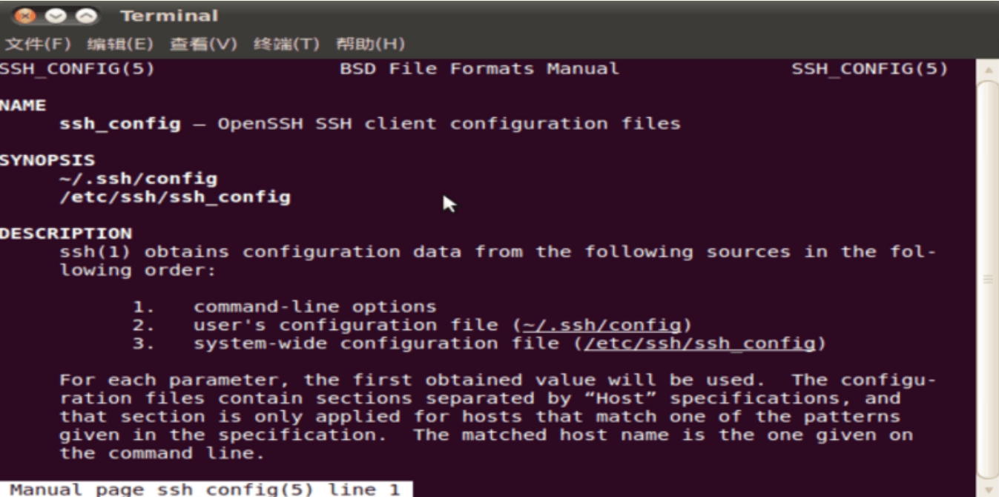
通过如下命令，配置当前⽤⼾的 SSH 配置。
```
~$ cp /etc/ssh/ssh_config ~/.ssh/config
~$ vi .ssh/config
```
如图，将 SSH 使⽤另⼀个⽬录的⽂件 "\~/.ssh1/id\_rsa"作为认证私钥。通过这种⽅法，可以切换不同的的密钥。

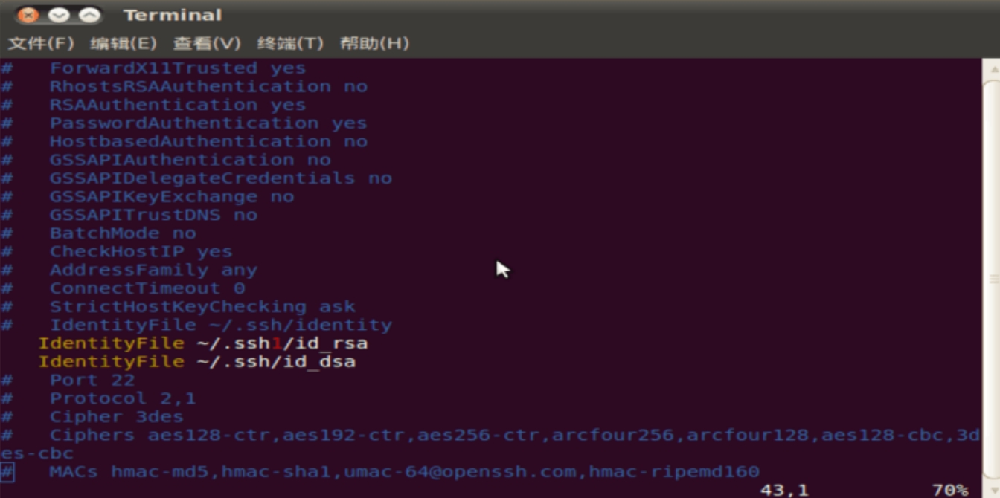


#### 15.3. 密钥权限管理

服务器可以实时监控某个 key 的下载次数、IP等信息，如果发现异常将禁⽤相应的 key 的下载权限。
请妥善保管私钥⽂件。并不要⼆次授权与第三⽅使⽤。

#### 15.4  参考⽂档
更多详细说明，可参考⽂档
`<SDK>/docs/cn/Others/Rockchip_User_Guide_SDK_Application_And_Synchronization_CN.pdf`
