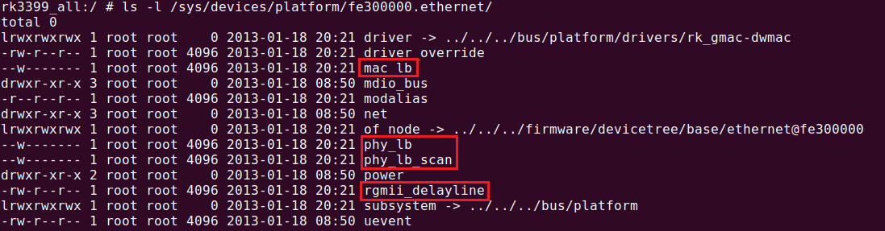
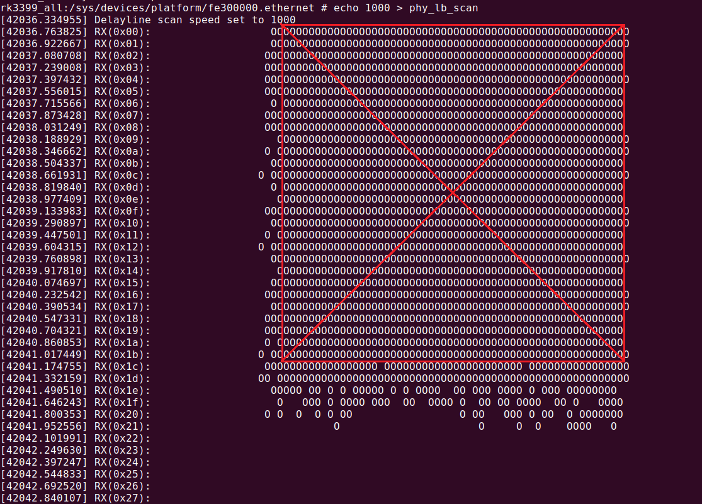
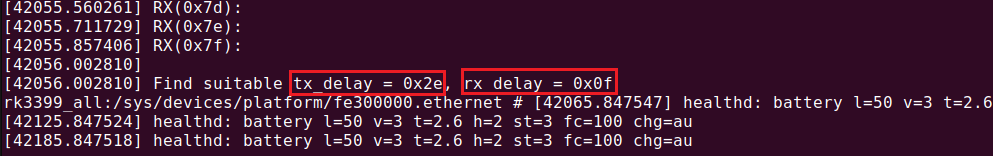
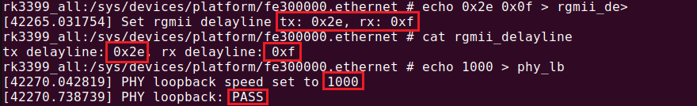
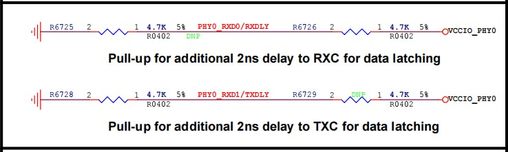
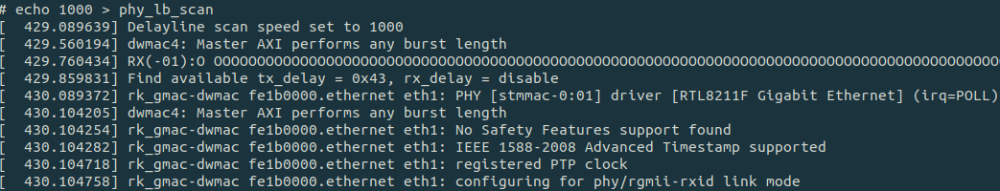
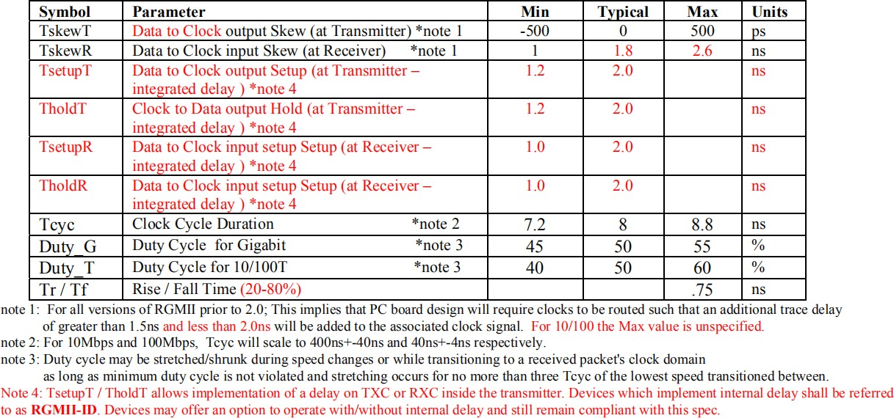
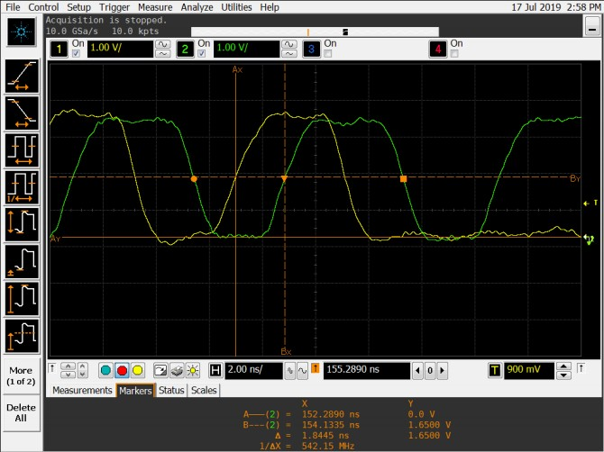

# **Rockchip GMAC RGMII Delayline Guide**


 前言概述

 Rockchip 芯片具有千兆以太网的功能，使用 RGMII
 接口，为了兼容各种不同硬件所带来的信号差异，芯

 片增加了调整 (TX/RX) RGMII delayline
 功能。本文档介绍的是如何得到一组合适的 delayline
 以达到千兆以太网性能最优，和如何改善硬件以得到最大的 delayline 窗口。

 产品版本
| 芯片名称 | 内核版本 |
| ---- | ---- |
| 所有芯片 | 所有版本 |

 读者对象

 本文档（本指南）主要适用于以下工程师： 技术支持工程师


 
## 1. RGMII Delayline 获取步骤

如果你的项目具有千兆以太网功能，使用的是RGMII接口，只要有硬件差别，都需要重新做一次
delayline的配置。因为如果配置的delayline值与你项目的硬件不匹配，将会影响你千兆以太网的性能，
甚至正常的网络功能。

### 1.1 代码确认

代码实现部分都在 `drivers/net/ethernet/stmicro/stmmac/dwmac-rk-tool.c` 文件，所以也比较方
便移植。如果你手头上的工程没有这部分代码，请在Redmine上索要补丁，有Kernel-4.4和Kernel-3.10
版本，Kernel-4.19和之后的版本本身已经包含这部分代码，无需补丁。

- Kernel-4.4补丁：Rockchip_RGMII_Delayline_Kernel4.4.tar.gz
    4.4内核有优化过性能，补丁代码是基于当前代码生成的，如果有编译不过的问题，先打上
    `kernel4.4_stmmac_optimize_output_performances_20191119.zip`。
- Kernel-3.10补丁：Rockchip_RGMII_Delayline_Kernel3.10.tar.gz
### 1.2 节点确认

上一步的代码确认并编译后，新的固件会生成几个sysfs节点，如果没有生成则说明补打的有问题。以RK3399为例，在`/sys/devices/platform/fe300000.ethernet`目录下可以看到这几个节点：


### 1.3 使用方法

注意，如果您使用的是 `RTL8211E phy`，测试前需要拔掉网线。

#### 1.3.1 扫描delayline窗口

通过 `phy_lb_scan` 节点扫描到一个窗口，会得到一个中间坐标，需要使用千兆速度1000来扫描。
```bash
echo 1000 > phy_lb_scan
```
横轴表示 TX 方向的 delayline(坐标范围 <0x00, 0x7f>)， 纵轴表示 RX 方向的 delayline， (坐标范围也是
<0x00, 0x7f>)。其中的 "O" 表示该点的坐标是可以 pass， 空白处都是 failed。以 RK3399 为例，通过千兆
扫描命令，丢弃掉有空缺的行或列，可以得到一个矩形窗口，并得到其中间点坐标，纵轴的 RX 坐标已
经有打印，横轴坐标因为打印的关系，没有显示出来，需要手动找下，从 RX(0xXX): 的 : 开始算起。

中心点坐标在扫描窗口的最后也会打印出来：

这里测试 RK3399 板子硬件信号并不是很好，所以窗口不是很大。同样百兆也可以得到一个窗口， `echo 100 > phy_lb_scan` 可以看到的是百兆窗口很大，几乎占据所有的坐标，因为百兆对信号要求不如千兆的高。
#### 1.3.2 测试扫描出来的中间值

将扫描得到的值通过命令配置到 `rgmii_delayline` 节点，然后测试该配置下TX/RX数据传输是否正常，通过 `phy_lb` 节点测试，至少这个测试需要先 pass。
```bash
echo (tx delayline) (rx delayline) > rgmii_delayline
cat rgmii_delayline
echo 1000 > phy_lb
```

测试 pass 后，将 delayline 分别填到 dts： tx_delay = <0x2e>; 和 rx_delay = <0x0f>; ，重新烧入固件，接着继续测试 ping 或者 iperf 性能测试，一般情况下到这一步就可以了。
```dts
&gmac {
    phy-supply = <&vcc_lan>;
    clock_in_out = "output";
    assigned-clocks = <&cru SCLK_MAC>, <&cru SCLK_RMII_SRC>;
    assigned-clock-parents = <&cru PLL_NPLL>, <&cru SCLK_MAC>;
    assigned-clock-rates = <0>, <125000000>;
    phy-mode = "rgmii";
    pinctrl-names = "default";
    pinctrl-0 = <&rgmii_pins>;
    snps,reset-gpio = <&gpio3 RK_PB7 GPIO_ACTIVE_LOW>;
    snps,reset-active-low;
    snps,reset-delays-us = <0 10000 50000>;
    tx_delay = <0x2e>;
    rx_delay = <0x0f>;
    status = "okay";
}
```
#### 1.3.3 自动扫描

如果遇到一组delayline的值无法适配所有硬件板子的时候，原因可能是硬件比较差，窗口很小冗余度
差；可以打开自动扫描功能，menuconfig上打开 `CONFIG_DWMAC_RK_AUTO_DELAYLINE`。这边需要注意
的是窗口很小的问题没有解决的话，打开这个宏也不能完全解决问题，一般来说不需要打开这个宏。
```bash
Device Drivers →
    Network device support →
        Ethernet driver support →
            [*] Auto search rgmiidelayline
```

该功能只会在第一次开机的时候做一次探测，做完后会将delayline值存储到vendor storage，之后的每次
开机都是直接从vendor storage出来并覆盖dts的配置。只有在vendor storage被擦除后，才会在下次开机
后执行该操作一次。

第一次开机的日志打印：
`[ 23.532138] Find suitable tx_delay = 0x2f, rx_delay = 0x10`
之后开机的日志打印：
`[ 23.092358] damac rk read rgmii dl from vendor tx: 0x2f, rx: 0x10`
### 1.4 rgmii-rxid 模式
当硬件启用 PHY 的 RX delay，比如 RTL8211F:

就需要关闭主控的 RX delay， dts 配置的模式变成 “rgmii-rxid”, 例如。
```dts
&gmac0 {
    /* Use rgmii-rxid mode to disable rx delay inside Soc */
    phy-mode = "rgmii-rxid";
    clock_in_out = "output";
    ......
};
```
通过上面方法扫描可得

此时因为 RX delay 为 PHY 硬件固定，一般是 2ns，不会扫描 RX 的 delay，TX delay 被扫描后得到最合适的 delay，填入 dts gmac 节点中的 tx_delay 属性，同时注释关闭 rx_delay.
```dts
&gmac0 {
/* Use rgmii-rxid mode to disable rx delay inside Soc */
phy-mode = "rgmii-rxid";
clock_in_out = "output";
......
tx_delay = <0x43>;
/* rx_delay = <0x42>; */
phy-handle = <&rgmii_phy>;
status = "okay";
};
```

## 2. 硬件

### 2.1 测试RGMII接口的指标

按照最新的RGMII协议，需要满足以下时序要求，请测试你的板子是否符合，如果不会测试或者没有能
测试的示波器进行测试，请在Redmine上提出需求。

比如确认千兆时 CLK 的信号质量，分别在靠近接收端的位置（不要在发送端量取，发送端信号反射严
重，波形不能反应实际信号质量），测量 MAC_CLK、TX_CLK、RX_CLK 信号的波形，重点看占空
比、幅度、以及上升下降时间，测量示波器及探头带宽需大于 125M 的 5 倍，如是单端探头注意接地回路要尽可能的短，最好是用差分探头测度，占空比控制在 45% ~ 55% 之间。在测试环境没问题时测出的信号应为方波，而非正弦波，一般客户自测是正玄波，且占空比 为50%，基本都是测量不正确。
### 2.1.1 RX_CLK / MAC_CLK

MAC_CLK或RXCLK由PHY提供，如果接收的CLK测量信号完整性有问题，因为一般PHY端没有寄
存器可调，可能只能通过硬件手段调整，可以在发送端串高频电感来改善边沿过缓（不能用普通电感，
带宽要满足才可用），通过发送端电阻分压，降低幅值调整占空比。

### 2.1.2 TX_CLK

TX_CLK有问题，出现边沿过缓，可以通过IO读取相应寄存器，看IO驱动强度是否有调整到最大，可
以接上示波器看；同时，直接通过IO命令来调整驱动强度观察波形的变化，驱动调整改善不明显也可偿
试串高频电感，或将串接220ohm电阻改大；如出现占空比不在规范内，可以通过分压MAC_CLK的幅度
来调整TX_CLK占空比，分压值为串接100ohm，下地电阻值因布板而异，不同的板子值不一样，可以
从100向上调，直到示波器观察到占空比符合要求为止。如果以上收效都不大，并且现在使用的IO是
3.3V，在PHY与RK平台端都支持1.8V IO的情况下，可以将IO电源改为1.8V再看信号完整性，1.8V
IO信号指标强于3.3V，推荐使用1.8V IO。

## 3.FAQ

### 3.1.  窗口大小
我们希望能 pass 的窗口越大越好，表明硬件信号好，冗余度大。如果扫描不到窗口或者扫到的窗口太小，一般是硬件问题，请参考硬件部分章节。

### 3.2  PHY 的选型

 - 这里对 PHY 的选择没有特别的要求，只要符合 RGMII。但有以下两点需要注意下:
如果你项目计划使用的是 RTL8211E 千兆 PHY，建议你改成 RTL8211F 或者其他的PHY，原因上文2.1 章节有阐明。
 - 如果你所使用的 PHY 没有 loopback 功能，请参照下面的方法获取 delayline:
可以基于示波器测信号来调试，用大于 125M 5倍带宽的示波器，在靠近 PHY 端测量 TXC 与 TXD
之间的相位差，通过 IO 命令将相位调整在 1.5ns ~ 2ns 区间内（规范为 1 ~ 2.6ns 要留一定量），TX问题就不大；RX 由于是在主控内部做延时，在 loopback 没用起来的情况下，只能借助于吞吐量来判 断，在 tx_delay 寄存器确定的情况下，先将 rx_delay 设为 0x10, 改完后用 iperf 跑下行吞吐量，刚开始结果可能是不理想的，继续用 IO 命令去改 rxdelay寄存器，以 5 为步进向上加（0x10 ~ 0x7f的区间），IO 写完寄存器后，当测到吞吐量大于 900M 以后，再缩小以 2 为步进，找出能上 900M的寄存器区间,然后取中间值设定到 dts。
TXC&TXD 相位测试波形如下图：
