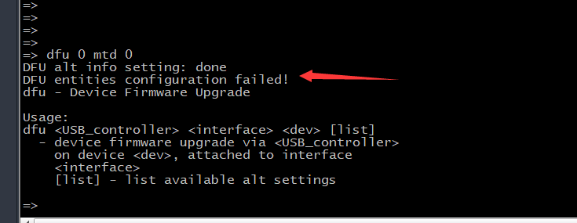

#  **Rockchip DFU** 升级方案介绍

 

 前言概述

 本文档旨在指导工程师如何快速使用 Rockchip Linux 平台 DFU 升级方案。

 产品版本

  芯片名称   |   内核版本
  -------------| ------------
  RV1126/1109  | Linux 4.19

 读者对象

 本文档（本指南）主要适用于以下工程师： 技术支持工程师

 软件开发工程师


## 1. 简介

 DFU (Device Firmware Upgrade) 是一种通过 USB对设备进行强制升降级的方案。Rockchip 的 DFU
 升级方案主要由两个部分组成：kernel 的 DFU 模式切换和 uboot 的 DFU固件下载上传。

## 2. 配置与编译


### 2.1  分区配置

 u-boot 升级分区定义，在 u-boot/include/configs 目录下。如：include\configs\evb\rv1126.h
```bash
#define CONFIG_SET_DFU_ALT_INFO
#define DFU_ALT_BOOT_EMMC \
"gpt raw 0x0 0x20000;" \
"loader raw 0x20000 0xE0000;"\
"uboot part uboot;" \
"boot part boot;" \
"rootfs partubi rootfs;" \
"userdata partubi userdata\0"
#define DFU_ALT_BOOT_MTD \
"gpt raw 0x0 0x20000;" \
"loader raw 0x20000 0xE0000;"\
"vnvm part vnvm;" \
"uboot part uboot;" \
"boot part boot;" \
"rootfs partubi rootfs;" \
"userdata partubi userdata\0"
```
 分区定义说明:

 参数1：dfu 分区名

 参数2：分区类型，目前支持 raw，rawubi，part 和 partubi（ubi
 文件系统分区选择） 
 参数3：GPT分区名（dfu初始化时会从gpt里面获取分区信息）或者 raw起始地址
 参数4：raw 分区大小

 注意：

 - 上述升级分区定义的分区必须和 parameter.txt 所定义的保持一致。如果
 parameter .txt 里没有的分区，升级分区里也不能定义(除了 gpt 和 loader
 )。

-  使用 A/B 分区的部分请使用 raw 或 rawubi 的分区类型。

-  **dfu** 模式与 **adb** 模式不兼容， 因为在 PC
 端，他们使用的驱动都是一样的，容易出现打不开 dfu 设备。

### 2.2 编译配置

 u-boot 配置

 确认 u-boot 下对应产品的 defconfig（如: rv1126\_defconfig）
 已经添加了如下配置：
 ```dts
 +CONFIG_CMD_DFU=y
+CONFIG_DFU_MMC=y
+CONFIG_DFU_MTD=y
+# CONFIG_DFU_NAND is not set
+# CONFIG_DFU_RAM is not set
+# CONFIG_DFU_SF is not set
+# CONFIG_DFU_TFTP is not set
+CONFIG_USB_FUNCTION_DFU=y
+CONFIG_AVB_LIBAVB_AB=y
+CONFIG_AVB_LIBAVB_USER=y
+CONFIG_ANDROID_AB=y
 ```

 - kernel 配置

 确认 kernel 下对应产品的 defconfig（如: rv1126\_defconfig）
 已经添加了如下配置：
 ```dts
 CONFIG_USB_CONFIGFS_F_DFU=y
 ```

 同时，请确认kernel包含以下提交记录：
 ```bash
 commit 655bdb3710223ec4b6609a6d77cea27d59cf7636
Author: William Wu <william.wu@rock-chips.com>
Date: Mon Feb 22 20:22:16 2021 +0800
usb: gadget: support dfu driver
Signed-off-by: William Wu <william.wu@rock-chips.com>
Change-Id: I557bceaf94a95b8ac4ddde0b89ea4c491f05c671
commit c8efaf8641dbd7d900bd7c3a29b27e799633a335
Author: Tony Xu <tony.xu@rock-chips.com>
Date: Wed Mar 10 14:52:20 2021 +0800
ARM: dtsi: rv1126: add dfu boot mode
Signed-off-by: Tony Xu <tony.xu@rock-chips.com>
Change-Id: Ic0ae7c344d57eec1c50bdee4a5f65ffbb949baa7
 ```

 以上提交主要是支持 PC 端通过第三方 DFU 工具将设备切换到 DFU 模式。

-  usb 配置脚本

 请确保产品对应的 usb 配置脚本（一般在 usb\_config.sh 或 S50usbdevice
 脚本）包含以下补丁。DFU模式在SDK的发布版本默认是关闭的，如果需要打开，请确保 usb 配置脚本的DFU_EN=on。
```bash
--- a/oem/oem_uvcc/usb_config.sh
+++ b/oem/oem_uvcc/usb_config.sh
@@ -1,6 +1,7 @@
#!/bin/sh
ADB_EN=on
+DFU_EN=on
if ( echo $2 |grep -q "off" ); then
ADB_EN=off
fi
@@ -247,6 +248,19 @@ esac
ln -s ${USB_FUNCTIONS_DIR}/uvc.gs6 ${USB_CONFIGS_DIR}/f1
+if [ $DFU_EN = on ];then
+ mkdir /sys/kernel/config/usb_gadget/rockchip/functions/dfu.gs0
+ CONFIG_STR=`cat
/sys/kernel/config/usb_gadget/rockchip/configs/b.1/strings/0x409/configuration`
+ STR=${CONFIG_STR}_dfu
+ echo $STR > ${USB_CONFIGS_DIR}/strings/0x409/configuration
+ USB_CNT=`echo $STR | awk -F"_" '{print NF-1}'`
+ let USB_CNT=USB_CNT+1
+ echo "dfu on++++++ ${USB_CNT}"
+ ln -s ${USB_FUNCTIONS_DIR}/dfu.gs0 ${USB_CONFIGS_DIR}/f${USB_CNT}
+ ADB_EN=off
+ sleep .5
+fi
+
if [ $ADB_EN = on ];then
mkdir ${USB_FUNCTIONS_DIR}/ffs.adb
CONFIG_STR=`cat
/sys/kernel/config/usb_gadget/rockchip/configs/b.1/strings/0x409/configuration`
```

 编译命令：
 ```bash
 ./build.sh \\全编工程, 编译完成后会在IMAGE目录下生成相应的固件
 ```

## 3.进入 **DFU** 升级模式

- uboot 命令行模式下输入
  ```bash
  => dfu 0 mtd 0
  ```

 - 在系统正常运行模式下，通过串口或 adb 执行 reboot dfu 可进入 dfu 模式
    ```bash
    [root@RV1126_RV1109:/]# reboot dfu
    ```
 - dfu-util.exe 工具切换( PC 端命令行终端执行)
```bash
.\dfu-util.exe -e
```
 注意:

 首次使用 DFU 模式，PC 需要安装驱动，建议可以使用 Zadig，找到设备 USB
 download gadget，然后安装 WinUSB 驱动。 安装完驱动后，使用 dfu
 工具可以查看板端的 dfu 列表：
```bash
.\dfu-util.exe -l
dfu-util 0.9
Copyright 2005-2009 Weston Schmidt, Harald Welte and OpenMoko Inc.
Copyright 2010-2016 Tormod Volden and Stefan Schmidt
This program is Free Software and has ABSOLUTELY NO WARRANTY
Please report bugs to http://sourceforge.net/p/dfu-util/tickets/
Found DFU: [2207:0107] ver=0223, devnum=3, cfg=1, intf=0, path="1-1.3", alt=5,
name="rootfs", serial="5b4b8a3e80121814"
Found DFU: [2207:0107] ver=0223, devnum=3, cfg=1, intf=0, path="1-1.3", alt=4,
name="boot", serial="5b4b8a3e80121814"
Found DFU: [2207:0107] ver=0223, devnum=3, cfg=1, intf=0, path="1-1.3", alt=3,
name="uboot", serial="5b4b8a3e80121814"
Found DFU: [2207:0107] ver=0223, devnum=3, cfg=1, intf=0, path="1-1.3", alt=2,
name="vnvm", serial="5b4b8a3e80121814"
Found DFU: [2207:0107] ver=0223, devnum=3, cfg=1, intf=0, path="1-1.3", alt=1,
name="loader", serial="5b4b8a3e80121814"
Found DFU: [2207:0107] ver=0223, devnum=3, cfg=1, intf=0, path="1-1.3", alt=0,
name="gpt", serial="5b4b8a3e80121814"
```
## 4.升级固件

 升级命令
 ```bash
 dfu-util.exe 2207:0107 -a uboot -D uboot.img
 ```

 说明： -a： 表示要烧写的分区名，该分区名必须是在 "dfu-util.exe -l"
 命令中获取到的列表中；-D：表示下载固件， -D 之后带上的要烧写的 img
 的地址。

 注意：

 首次使用 PC 需要装驱动，驱动安装使用 Zadig，找到设备 Device Firmware
 Upgrade，然后安装 WinUSB驱动。

## 5. 导出固件

 导出命令
```bash
dfu-util.exe 2207:0107 -a uboot -U uboot.img
```
 说明： -a： 表示要导出的分区名；-U：表示导出固件-U之后带上导出的固件保存的地址与名称。

## 6 升级 **GPT** 分区

 GPT
 需要先转好二进制格式(即：预烧录镜像)，并且末尾的备份区域也要定义好分区才可以升级。

### 6.1  转换为预烧录镜像**(**烧录器烧录的镜像**)**

 工具： rkbin/tools/burner\_image\_kits

 文档：

 docs/Linux/ApplicationNote/Rockchip\_Developer\_Guide\_Linux\_Nand\_Flash\_Open\_Source\_Solution\_CN.pdf

## 7  **A/B** 分区固件升级

    1.  固件烧写
        --------

 A/B 分区的固件必须使用 raw 或者 rawubi 格式，即在配置
 include/configs/evb\_rv1126.h 分区表时必须使用 raw 格式或 rawubi
 格式：
```dts
--- a/include/configs/evb_rv1126.h
+++ b/include/configs/evb_rv1126.h
@@ -52,11 +52,11 @@
"loader raw 0x20000 0xE0000;"\
"vnvm part vnvm;" \
"uboot part uboot;" \
- "boot_a part boot_a;" \
- "boot_b part boot_b;" \
+ "boot_a raw 0x600000 0x400000;" \
+ "boot_b raw 0xA00000 0x400000;" \
"misc part misc;" \
- "system_a partubi system_a;" \
- "system_b partubi system_b;" \
+ "system_a rawubi 0xE80000 0x3580000;" \
+ "system_b rawubi 0x4400000 0x3580000;" \
"userdata partubi userdata\0"
#endif /* !CONFIG_SPL_BUILD */
```
 raw 格式的分区表必须指明分区的起始地址和大小，该地址和大小需要和
 paramert.txt 相匹配。

 parameter.txt 中的地址单位是 sector，1个 sector 为512
 Bytes。所以转化为补丁中的地址时需要乘上512。

### 7.2 **A/B** 固件切换

#### 7.2.1 **host** 端控制升级逻辑

 早期的 sdk 版本，device 端采用的是标准的 DFU 升级标准，没有 A/B
 升级的逻辑控制，所以整套 A/B 升级的业务逻辑需要 host 端来控制：host
 端可以通过 UVC 的 XU 指令或者 adb 等方式获知 device
 端当前启动的是哪一套系统, 在升级分区下载完成后，通过烧写不同的
 misc.img 来启动新升级的系统。

 misc.img 可以从 sdk\\device\\rockchip\\rockimg 目录获取

 - dfu\_misc\_a.img 启动 A 系统

 - dfu\_misc\_b.img 启动 B 系统

 在 devices 端，可以通过 /proc/cmdline 中的 androidboot.slot\_suffix
 参数来获知当前启动的是哪一套系统。
 ```bash
 # cat proc/cmdline
user_debug=31 storagemedia=mtd androidboot.storagemedia=mtd
androidboot.mode=normal root=ubi0:rootfs skip_initramfs
androidboot.slot_suffix=_a androidboot.serialno=e5b27a79e5fb95b0
earlycon=uart8250,mmio32,0xff570000 console=ttyFIQ0 ubi.mtd=5 rootfstype=ubifs
snd_aloop.index=7 mtdparts=spinand0:0x100000@0x200000(vnvm),0x300000@0x300000(uboot),0x600000@0x600000(boot_a),
0x600000@0xc00000(boot_b),0x80000@0x1200000(misc),0x30c0000@0x1280000(system_a),0
x30c0000@0x4340000(system_b),0xb60000@0x7400000(userdata)
 ```

#### 7.2.2 **device** 端自主选择升级 **A** 分区 或 **B** 分区

 为支持 device 端自主控制升级 A 分区或者 B 分区， u-boot
 需要更新到如下节点：
```bash
commit deef35d91e8041575863d1d0dfc24ac703d09935
Author: Nico Cheng <nico.cheng@rock-chips.com>
Date: Wed Sep 8 15:09:51 2021 +0800
common: dfu: After the upgrade, switch the boot slot priority
If the device current boot from slot A,then increase the boot priority of
slot B.
Signed-off-by: Nico Cheng <nico.cheng@rock-chips.com>
Change-Id: Ie481f815d8a3b72b91fcf1acaf9524c19b8a71e8
```
 如果当前处于 A 分区，则升级 B 分区，重启后将从 B 分区启动。

## 8.第三方工具
### 8.1 **dfu-util** 工具

 通过 DFU 下载和上传固件主要是通过 dfu-util
 工具来完成的。验证过的版本是 **dfu-util -0.9**
 的版本，建议使用该版本。

 工具下载和使用相关可以参考：[http://dfu-util.sourceforge.net/](http://dfu-util.sourceforge.net/)
 。

### 8.2 驱动安装工具


 USB 驱动安装工具建议使用 Zadig。

 Zadig工具的下载和使用可以参考：[https://zadig.akeo.ie/](https://zadig.akeo.ie/)。

##9. 常见问题

 - DFU entities configuration failed


 出现这种情况，一般是 parameter.txt 定义的分区和
 include\\configs\\evb\_rv1126.h 所定义的不一致导致的。

 烧写完成后不会自动启动烧写命令之后加上 -R 即可。
 ```bash
 ./dfu-util.exe -d 2207:0107 -a system_b -D rootfs.img -R \\烧写完固件重新启动
 ```
