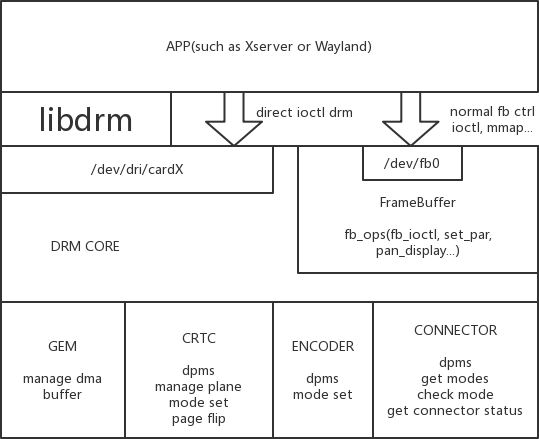

# Rockchip Debian Developer Guide

文件标识：RK-KF-YF-913

发布版本：V1.7.0

日期：2023-12-20

**前言概述**

本文档介绍基于Rockchip的arm平台，如何使用官方Debian发行版来构建和适配相关硬件功能的开发文档。

[TOC]

**芯片支持情况**
| Debian版本 | 适用平台 | 已验芯片 |
| ---- | ---- | ---- |
| 12 | ARM | RK3588 |
| 11 | ARM | RK3588、RK3568、RK3566、RK3562、RK3399、RK3288 |
| 10 | ARM | RK3399PRO、PX30、RK3326、RK3288、RK3328、RK3126C |

**读者对象**
本文档（本指南）主要适用于以下工程师：
- 技术支持工程师
- 软件开发工程师

**修订记录**
| 日期 | 版本 | 作者 | 修改说明 |
| ---- | ---- | ---- | ---- |
| 2021-12-30 | V1.0.0 | Caesar Wang | 初始版本 |
| 2022-03-10 | V1.0.1 | Ruby Zhang | 文档格式更新 |
| 2022-04-12 | V1.1.0 | Caesar Wang | 更新live - build和FAQ等相关内容 |
| 2022-05-20 | V1.2.0 | Caesar Wang | 更新Debian11 |
| 2022-09-20 | V1.3.0 | Caesar Wang | Linux5.10的支持 |
| 2022-11-20 | V1.4.0 | Caesar Wang | 更新mpp/chromium <br> 更新开机动画支持 <br> 更新分区管理说明 <br> 更新FAQ |
| 2023-04-20 | V1.5.0 | Caesar Wang | 增加blueman/rktoolkit仓库 <br> 更新摄像头/NPU升级等方案介绍 <br> 删除一些TODO列表 |
| 2023-05-20 | V1.5.1 | Caesar Wang | 增加Cheese说明 <br> 增加电源管理说明 |
| 2023-09-20 | V1.6.0 | Caesar Wang | 更新Cheese说明 <br> 增加Debian12支持 <br> Debian安全和Roadmap更新 |
| 2023-12-20 | V1.7.0 | Caesar Wang | 更新Cheese、rkaiq相关说明 <br> 增加Debian FAQ章节 <br> 优化Debian一些章节内容 |


## 1. Debian介绍

### 1.1 什么是Debian

Debian是一种完全自由开放并广泛用于各种设备的Linux操作系统。选择Debian原因如下：
- **Debian是自由软件**：Debian是由自由和开放源代码的软件组成，并将始终保持100%自由。每个人都能自由使用、修改，以及发布。大家可以基于Rockchip构建的Debian系统进行二次开发。
- **Debian具有广泛的硬件支持**：Debian是一个广泛用于各种设备的操作系统，其使用范围包括笔记本计算机，台式机和服务器。自1993年以来，它的稳定性和可靠性就深受用户的喜爱。我们为每个软件包提供合理的默认配置。Debian开发人员会尽可能在其生命周期内为所有软件包提供安全更新。
- **Debian具有广泛的硬件支持（补充说明）**：大多数硬件已获得Linux内核的支持。当自由软件无法提供足够的支持时，也可使用专用的硬件驱动程序。目前Rockchip RK3588/RK3568/RK3566/RK3399/RK3288等芯片已经适配并支持。
- **Debian提供平滑的更新**：Debian以在其发行周期内轻松流畅地进行更新而闻名，不仅如此，还包括轻松升级到下一个大版本。Rockchip目前已从Debian Stretch(9)升级到Debian Buster(10)、Bullseye(11)和Bookworm(12)版本。
- **Debian是许多其他发行版的种子和基础**：许多非常受欢迎的Linux发行版，例如Ubuntu、Knoppix、PureOS、SteamOS以及Tails，都选择了Debian作为它们的软件基础。Debian提供了所有工具，因此每个人都可以用能满足自己需求的软件包来扩展Debian档案库中的软件包。
- **Debian项目是一个社区**：Debian不只是一个Linux操作系统。该软件由来自世界各地的数百名志愿者共同制作。即使您不是一个程序员或系统管理员，也可以成为Debian社区的一员。

### 1.2 Debian支持的版本

| 版本 | 支持架构 | （预计）终止时间 | 目前状态 |
| ---- | ---- | ---- | ---- |
| Debian 9 “Stretch” | armhf and arm64 | 2022-06 | 停止维护 |
| Debian 10 “Buster” | armhf and arm64 | 2024-06 | 维护中 |
| Debian 11 “Bullseye” | armhf and arm64 | 2026-06 | 维护中 |
| Debian 12 “Bookworm” | armhf and arm64 | 2028-06 | 开发中 |

更多[Debian⻓期⽀持版本](https://wiki.debian.org/LTS)时间以官⽹为主。

## 2. Debian快速⼊⻔

### 2.1 环境搭建
我们推荐使用 Ubuntu 22.04 的系统进行编译。其他的 Linux 版本可能需要对软件包做相应调整。除了系统要求外，还有其他软硬件方面的要求。
硬件要求：64 位系统，硬盘空间大于 40G。如果您进行多个构建，将需要更大的硬盘空间。
软件要求：Ubuntu 22.04 系统
编译 SDK 环境搭建所依赖的软件包安装命令如下：
```
sudo apt-get update && sudo apt-get install git ssh make gcc libssl-dev \
liblz4-tool expect expect-dev g++ patchelf chrpath gawk texinfo chrpath \
diffstat binfmt-support qemu-user-static live-build bison flex fakeroot \
cmake gcc-multilib g++-multilib unzip device-tree-compiler ncurses-dev \
libuchardet-2.00-dev bzip2 expat gppc-64-linux-gnu libmpc-dev \
libmpc-dev bc python-is-python3 python2
```
建议使用 Ubuntu22.04 系统或更高版本开发，若编译遇到报错，可以视报错信息，安装对应的软件包。
### 2.2 获取源码
从瑞芯微代码服务器对外发布 SDK 中获取源码，位于`<SDK>/debian`目录下。

### 2.3 编译
- 编译 Debian 所需的安装包
```
sudo dpkg -i debian/ubuntu-build-service/packages/*
sudo apt-get install -f
备注:其中
live-build_*.deb来源https://mirrors.ustc.edu.cn/debian/pool/main/l/live-build/
debootstrap_*.deb来源https://mirrors.ustc.edu.cn/debian/pool/main/d/debootstrap/
或者通过如下⽅式, 安装依赖环境:
sudo apt-get remove live-build
git clone https://salsa.debian.org/live-team/live-build.git --depth 1 -b
debian/1%20230131
cd live-build
rm -rf manpages/po/
sudo make install -j8
```
- 编译Debian
进入 SDK 工程中，直接编译
```
./build.sh debian
```
或进⼊ Debian/ ⽬录：
```
cd debian/
```
参考当前⽬录 readme.md。

## 3. Debian⽬录结构
```
debian
├── mk-base-debian.sh ##获取Debian基础包和编译
├── mk-image.sh ##打包⽣成ext4的固件
├── mk-rootfs-buster/bullseye.sh ##适配Rockchip相关硬件加速包
├── mk-rootfs.sh ##指向具体Rootfs版本，⽬前有Buster、Bullseye两个版本。
├── overlay ##适配Rockchip平台共性配置⽂件
├── overlay-debug ##系统常使⽤的调试⼯具
├── overlay-firmware ##⼀些设备firmware的存放，⽐如npu/dp等
├── packages ## 包含armhf arm64系统适配硬加速使⽤的预编译的包
├── packages-patches ##预编包，基于官⽅打上的补丁
├── readme.md ## ⽂档指引
└── ubuntu-build-service ##从官⽅获取Debian发⾏版，可依赖包和定制安装相关包
```
整个⽬录结构内容是通过Shell脚本来达到获取构建Linux
Debian发⾏版源码，编译和安装适配Rockchip硬加速包的操作系统。

## 4. Debian live-build使⽤指南

[live build](https://salsa.debian.org/live-team/live-build)是一组用于构建实时系统映像的脚本。live build背后的思想是一个工具套件，它使用一个配置目录来完全自动化和定制构建live映像的所有方面。更多使用说明参考官网[Live manual](https://live-team.pages.debian.net/live-manual/)。

Debian软件包源码仓库（VCS：[Git](https://packages.debian.org/buster/git-core)）：[live-build - git](https://salsa.debian.org/live-team/live-build.git)

Debian软件包源码仓库（可在线浏览）：[live-build](https://salsa.debian.org/live-team/live-build)

### 4.1 相关命令
- lb config
在当前目录下建立.auto 和 config 目录和相关配置文件，运行 `auto/config` 脚本。
- lb clean
运行 `auto/clean` 脚本
- lb build
按照 config 目录下的各种配置脚本构建系统镜像

### 4.2 软件源设定
- 方法一
```
$ lb config --mirror-bootstrap http://mirrors.ustc.edu.cn/debian \
--mirror-chroot-security http://mirrors.ustc.edu.cn/debian-security/ \
--mirror-chroot-backports http://mirrors.ustc.edu.cn/debian-backports/
```
chroot mirror: --mirror-chroot，默认使用 --mirror-bootstrap 的值或者创建 config/archives/your-repository.list.chroot 文件，内容为源地址。源会被加入到 live 系统的 /etc/apt/sources.list.d/ 目录
- 方法二
```
$ lb config --mirror-binary http://mirrors.ustc.edu.cn/debian \
--mirror-binary-security http://mirrors.ustc.edu.cn/debian-security/
```
或者创建config/archives/your-repository.list.binary⽂件，内容为源地址。

### 4.3 对系统的软件包进⾏定制

- ⽅法⼀

将所需的包列表放在customization/package-lists⽬录下，并命名为XXX.list.chroot或XXX.list.binary即可。

- ⽅法⼆

使⽤\--package-lists "XXX",将使⽤/usr/share/live/build/package-lists/下的指定包列表。
在执⾏lbconfig后会按此脚本中的参数⽣成config⽬录下的binary、bootstrap、chroot、 common四个配置
⽂件。lb build读取这四个配置⽂件，所以也可以在lbconfig后可以对这四个⽂件内的参数做具体修改。auto/config中为配置参数，例如：
```
set -e
echo "I: create configuration"
export LB_BOOTSTRAP_INCLUDE="apt-transport-https gnupg"
lb config \
--mirror-bootstrap "http://mirrors.ustc.edu.cn/debian" \
--mirror-chroot "http://mirrors.ustc.edu.cn/debian" \
--mirror-chroot-security "http://mirrors.ustc.edu.cn/debian-security" \
--mirror-binary "http://mirrors.ustc.edu.cn/debian" \
--mirror-binary-security "http://mirrors.ustc.edu.cn/debian-security" \
--apt-indices false \
--apt-recommends false \
--apt-secure false \
--architectures arm64 \
--archive-areas 'main contrib non-free' \
--backports false \
--binary-filesystem ext4 \
--binary-images tar \
--bootappend-live "hostname=linaro-alip username=linaro" \
--bootloader "syslinux" \
--bootstrap-qemu-arch arm64 \
-bootstrap-qemu-static /usr/bin/qemu-aarch64-static \
--cache false \
--chroot-filesystem none \
--compression gzip \
--debootstrap-options "--variant=minbase --include=apt-transport-https,gnupg" \
--distribution bullseye \
--gzip-options '-9 --rsyncable' \
--iso-publisher 'Linaro; http://www.linaro.org/; linaro-dev@lists.linaro.org' \
--iso-volume 'Linaro Bullseye $(date +%Y%m%d-%H:%M)' \
--linux-flavours none \
--linux-packages none \
--mode debian \
--security true \
--system normal \
--updates true
```

#### 4.3.1 ⾃定义⽬录
⾃定义的⽬录和其中的⽂件放在config/相应的include⽬录下即可
config/binary_local-includes（以⽣成镜像的根⽬录为根⽬录）
config/chroot_local-includes（以⽬标系统的根⽬录为根⽬录）

#### 4.3.2 HOOKS
在live-build完成每个阶段的⼯作后都会运⾏config/相应hooks中的脚本。
config/binary_local-hooks
config/chroot_local-hooks
live-build新版本会从live/normal两个⽬录中获取补丁。
```
customization/hooks/live/
├── 0001-setup_user_linaro.binary
├── 0002-add_linaro_to_groups.binary
├── 0003-check_sudoers_for_admin.binary
├── 0021-silence-systemd.binary
├── 0022-disable-systemd-services.binary
├── 0023-lightdm-autologin.binary
└── 0098-resolvconf.binary
```

## 5. Debian预编包介绍
```
packages/
├── arm64/armhf
│ ├── blueman
│ ├── cheese
│ ├── chromium
│ ├── glmark2
│ ├── gst-plugins-bad1.0
│ ├── gst-plugins-base1.0
│ ├── gst-plugins-good1.0
│ ├── gst-plugins-ugly1.0
│ ├── gstreamer
│ ├── gst-rkmpp
│ ├── libdrm
│ ├── libdrm-cursor
│ ├── libmali
│ ├── libv4l
│ ├── mpp
│ ├── openbox
│ ├── pcmanfm
│ ├── rga
│ ├── rga2
│ ├── rkaiq
│ ├── rkisp
│ ├── rknpu2
│ ├── rktoolkit
│ ├── rkwifibt
│ └── xserver
```
### 5.1 blueman
Blueman是⼀个GTK+的蓝⽛管理器。Blueman能够简单、⾼效管理BlueZ API并能简化如下⼀些蓝⽛管理
任务, ⽐如:
- 拨号连接3G/EDGE/GPRSp
- 连接/创建蓝⽛⽹络
- 连接输⼊设备
- 连接⾳频设备
- 通过OBEX(Object Exchange)发送、接收、浏览⽂件
- 配对
预编译包如下：
```
blueman/
├── blueman_2.3.5-2_arm64.deb
└── blueman-dbgsym_2.3.5-2_arm64.deb
packages-patches/blueman/
├── 0001-Blueman-Fix-DisplayPasskey-for-Keyboard.patch
└── 0002-Don-t-turn-off-the-bt-power.patch
```
Rockchip更改Blueman包主要解决蓝⽛⼀些⽐如键盘/⾳箱、休眠唤醒的⼀些问题等。

### 5.2 mpp

Rockchip提供的媒体处理软件平台(Media Process Platform,简称 MPP)是适⽤于瑞芯微芯⽚系列的通⽤媒体
处理软件平台。该平台对应⽤软件屏蔽了芯⽚相关的复杂底层处理,其⽬的是为了屏蔽不同芯⽚的差异,为
使⽤者提供统⼀的视频媒体处理接口(Media Process Interface,缩写 MPI)。
MPP提供的功能包括：


- 视频解码
H.265 / H.264 / H.263 / VP9 / VP8 / MPEG-4 / MPEG-2 / MPEG-1 / MJPEG

- 视频编码
H.264 / VP8 / MJPEG

- 视频处理
视频拷⻉,缩放,⾊彩空间转换,场视频解交织(Deinterlace)

如果遇到⼀些问题，开启如下开关获得更多log进⾏调试。
```
export mpi_debug=1
export mpp_debug=1
export h264d_debug=1
export mpp_buffer_debug=2
```

默认mpp log没输出到终端，若需按如下⽅式打开即可。
`export mpp_syslog_perror=1`
各个内核版本的调试⽇志开关:
```
4.19/5.10 内核（Linux4.19及以上版本）
$ echo 0x100 > /sys/module/rk_vcodec/parameters/mpp_dev_debug
$ cat /proc/kmsg
4.4 内核（Linux4.4）
$ echo 0x100 > /sys/module/rk_vcodec/parameters/debug
$ cat /proc/kmsg
```
该命令输出内核单帧编解码的执⾏时间，常⽤于性能评估或卡顿、流畅性问题的分析。⽐如RK3568 kernel5.10中输出的log信息
```
rk_vcodec: fdf80200.rkvdec:0 session 2269:34 time: 14870 us hw 5430 us
rk_vcodec: fdf80200.rkvdec:0 session 2269:34 time: 13157 us hw 4132 us
rk_vcodec: fdf80200.rkvdec:0 session 2269:34 time: 12976 us hw 4098 us
rk_vcodec: fdf80200.rkvdec:0 session 2269:34 time: 11295 us hw 4070 us
...
```


更多信息参考位于SDK中`\<SDK\>/docs/Linux/Multimedia`⽬录下的MPP开发⽂档。
Debian中集成的预编译包如下：
```
mpp/
├── librockchip-mpp-dev_1.5.0-1_arm64.deb
├── librockchip-mpp1-dbgsym_1.5.0-1_arm64.deb
├── librockchip-mpp1_1.5.0-1_arm64.deb
├── librockchip-vpu0-dbgsym_1.5.0-1_arm64.deb
├── librockchip-vpu0_1.5.0-1_arm64.deb
├── rockchip-mpp-demos-dbgsym_1.5.0-1_arm64.deb
└── rockchip-mpp-demos_1.5.0-1_arm64.deb
```
Debian中MPP可以通过GStreamer等第三⽅多媒体框架或我们⾃研的rockit多媒体⽅案。
**其中特别注意: 由于商业版权原因, LinuxSDK官⽅不⽀持ffmpeg**。

### 5.3 libv4l

对接Chromium浏览器和mpp实现硬解的v4l2 plugin。预编译包：
```
libv4l/
...
├── libv4l-0_1.22.1-5_arm64.deb
├── libv4l-0-dbgsym_1.22.1-5_arm64.deb
├── libv4l2rds0_1.22.1-5_arm64.deb
├── libv4l2rds0-dbgsym_1.22.1-5_arm64.deb
├── libv4lconvert0_1.22.1-5_arm64.deb
├── libv4lconvert0-dbgsym_1.22.1-5_arm64.deb
├── libv4l-dev_1.22.1-5_arm64.deb
├── libv4l-rkmpp_1.5.1-1.1_arm64.deb
├── libv4l-rkmpp-dbgsym_1.5.1-1.1_arm64.deb
├── v4l-utils_1.22.1-5_arm64.deb
└── v4l-utils-dbgsym_1.22.1-5_arm64.deb
```
其中v4l-utils第三⽅包需要以下补丁
```
|── 0001-libv4l2-Support-mmap-to-libv4l-plugin.patch
├── 0002-libv4l-mplane-Filter-out-multiplane-formats.patch
├── 0003-libv4l-add-V4L2_MEMORY_DMABUF-memory-support.patch
├── 0004-libv4l-mplane-plugin-add-exbuf_ioctl-for-dmabuf.patch
├── 0005-video-max-frame-change-from-32-to-64.patch
├── 0006-Support-builtin-v4l-plugins.patch
├── 0007-libv4l-Disallow-conversion-by-default.patch

```
然后编译libv4l-rkmpp, libv4l对接mpp的插件
```
├── libv4l-rkmpp_1.5.1-1.1_arm64.deb
├── libv4l-rkmpp-dbgsym_1.5.1-1.1_arm64.deb
```
### 5.4 chromium
Debian中集成的chromium浏览器是基于Yocto编译.
```
chromium/
└── chromium-x11_114.0.5735.198_arm64/armhf.deb
```
Chromium 浏览器支持多种视频格式，包括 H264、VP8、VP9、AV1 等。从 Chromium 105 版本开始，它增加了对 H265 视频格式的支持。目前在 Debian 系统中，已经集成了对 Chromium 视频硬解的支持，通过定制的 Chromium 版本、V4L2 插件以及 MPP 高效硬解实现。

定制 Chromium 主要修改如下：
- 修改 chromium 开启 v4l2 vda 支持，以及相关补丁
- 添加 v4l2 mpp plugin

缺点是：

a、解码只支持 vp8、h264、h265、vp9、av1

b、编码只支持 vp8 和 h264

c、需要修改编译 chromium（调通 yocto 完整编译流程）

目前我们提供 chromium wayland 补丁，在 yocto、buildroot 等系统上支持
- Chromium版本
```
root@linaro-alip:~# chromium --version
Chromium 114.0.5735.198 stable
```
### 5.5 glmark2

```
glmark2/
├── glmark2-data_2021.02+ds-1_all.deb
├── glmark2-es2-x11-dbgsym_2021.02+ds-1_arm64.deb
└── glmark2-es2-x11_2021.02+ds-1_arm64.deb
```
Glmark2 是开源的对 OpenGL 2.0 和 ES 2.0 的基准测试程序，一般用来对 GPU 进行基准测试。
开源代码 [Glmark2](https://github.com/glmark2/glmark2) 具体测试已集成到 Debian 中
```
usr/local/bin/test_glmark2_*.sh
├── test_glmark2_fullscreen.sh ### 全屏测试
├── test_glmark2_normal.sh ### 默认显示800x600分辨率测试
└── test_glmark2_offscreen.sh ### 不显示屏幕测试
```
```
root@linaro-alip:~# test_glmark2_normal.sh
/usr/local/bin/test_glmark2_normal.sh: line 36: warning: command substitution:
ignored null byte in input
performance
arm_release_ver of this libmali is 'g2p0-01eac0', rk_so_ver is '4'.
======================================================
 glmark2 2021.02
======================================================
 OpenGL Information
 GL_VENDOR:    ARM
 GL_RENDERER:  Mali-G52
 GL_VERSION:   OpenGL ES 3.2 v1.g2p0-01eac0.327c41db9c10a33ae6f67b4cc0581c7
======================================================
[build] use-vbo=false:
```
更多使用方法 help 查看
```
root@linaro-alip:~# glmark2-es2 --help
A benchmark for Open GL (ES) 2.0

Options:
 -b, --benchmark BENCH  A benchmark or options to run: '(scene)?(:opt1=val1)*'
                        (the option can be used multiple times)
 -f, --benchmark-file F Load benchmarks to run from a file containing a
                        list of benchmark descriptions (one per line)
                        (the option can be used multiple times)

  --validate            Run a quick output validation test instead of
                        running the benchmarks
  --data-path PATH      Path to glmark2 models, shaders and textures
                        Default: /usr/share/glmark2
  --frame-end METHOD    How to end a frame [default:none,swap,finish,readpixels]
  --off-screen          Render to an off-screen surface for the rendering
  --visual-config C     The visual configuration to use
                        target: 'red=R:green=G:blue=B:alpha=A:buffer=BUF'.
                        The parameters may be defined in any order, and any
                        omitted parameters assume a default value of '1'
  --reuse-context       Use a single context for all scenes
                        (by default, each scene gets its own context)
 -s, --size WxH         Size of the output window (default: 800x600)
  --fullscreen          Run in fullscreen mode (equivalent to --size -1x-1)
 -l, --list-scenes      Display information about the available scenes
                        and their options
  --show-all-options    Show all scene option values used for benchmarks
                        (only explicitly set options are shown by default)
  --run-forever         Run indefinitely, looping from the last benchmark
                        back to the first
  --annotate            Annotate the benchmarks with on-screen information
                        (same as -b show-fps=true:title=#info#)
 -d, --debug           Display debug messages
 -h, --help            Display help
```
### 5.6 gst-rkmpp
gstreamer-rockchip 是基于 GStreamer 适配 Rockchip 平台的音视频编解码中间件，主要对接 mpp 接口。
gstreamer-rockchip 预编译包如下：
```
gst-rkmpp/
├── gstreamer1.0-rockchip1-dbgsym_1.14-4_arm64.deb
└── gstreamer1.0-rockchip1_1.14-4_arm64.deb
```
### 5.7 GStreamer
GStreamer 包含 core framework 及 core 组件。
GStreamer 1.22.0 补丁如下：
```
├── 0001-filesrc-Fix-stopping-race-in-pull-mode.patch
├── 0002-HACK-gstpad-Add-1-sec-timeout-for-activation.patch
├── 0003-HACK-caps-Consider-dmabuf-subset-of-system-memory.patch
└── 0004-gst-launch-Fix-random-hang-when-EOS.patch
```

### 5.8 gst-plugins-base1.0
gst-plugins-base 是 GStreamer 应用所需的必要插件。
基于 GStreamer 官方的 gst-plugins-base 版本，增加 dma buffer 和 rga/g2u 图形加速适配的支持。gst-plugins-base1.0-1.22.0 补丁如下：
```
gst1-plugins-base
├── 0001-Revert-decodebin-only-emit-drained-signal-when-top-c.patch
├── 0002-playbin2-send-one-about-to-finish-per-group.patch
├── 0003-playbin-do-not-drain-on-first-EOS.patch
├── 0004-playbin2-Fix-deadlock-when-hooking-about-to-finish-s.patch
├── 0005-playbin3-Fix-Qt-Videoplayer-cannot-change-video-stat.patch
├── 0006-playbin2-Add-preferred-audio-video-sink.patch
├── 0007-HACK-ximagesink-Support-dma-buffer-rendering.patch
├── 0008-video-converter-Support-rockchip-RGA-2D-accel.patch
├── 0009-HACK-gl-egl-allow-direct-dmabuf-import-when-unable-t.patch
├── 0010-glupload-Dmabuf-prefer-DirectDmabufExternal-uploader.patch
├── 0011-video-convert-Support-preferred-formats.patch
├── 0012-glupload-Support-NV12_10LE40-and-NV12_NV12_10LE40-NV.patch
├── 0013-xvimagesink-Defer-prepare-window-when-getting-zero-w.patch
├── 0014-riiff-Fix-bits-caculation-error-for-ADPCM.patch
├── 0015-xvimagesink-Allow-disabling-decorations.patch
├── 0016-xvimagesink-Apply-toplevel-window-s-position.patch
├── 0017-xvimagesink-Ignore-expose-redraw-when-video-not-read.patch
├── 0018-gl-x11-Honor-render-rectangle-for-toplevel-window.patch
├── 0019-gl-wayland-Honor-render-rectangle-for-toplevel-window.patch
├── 0020-gl-x11-Allow-disabling-decorations-for-toplevel-wind.patch
└── 0021-gst-libs-Support-NV16_10LE40.patch
```

### 5.9 gst-plugins-bad1.0
Gstreamer 是质量有待提高的插件，成熟后可以移到 good 插件列表中。
基于 GStreamer 官方的 gst-plugins-bad 版本，增加 kmsink、waylandsink 等插件来适配 Rockchip 平台一些特性和问题修复。
gst-plugins-bad1.0-1.22.0 补丁如下：
```
gst1-plugins-bad
├── 0001-h265parser-Fix-read-vui-error.patch
├── 0002-interlam-fix-vci-stream-may-memory-leak-when-pending.patch
├── 0003-waylandsink-release-frame-callback-when-finalizing.patch
├── 0004-kmsink-Support-render-rectangle-for-plane.patch
├── 0005-kmsink-Request-window-handle.patch
├── 0006-waylandsink-Support-place-window-above.patch
├── 0007-waylandsink-Enable-changing-window-handle.patch
├── 0008-kmsink-Set-title-and-zpos.patch
├── 0009-waylandsink-Support-setting-toplevel-window-position.patch
├── 0010-HACK-gstkpegvideosrc-Split-every-picture.patch
├── 0011-mpegsdemux-Create-new-PCR-group-for-big-gap.patch
├── 0012-gstjpegarse-Allow-parsebin-to-use-it-for-autopluggi.patch
├── 0013-waylandsink-Drop-seen-when-window-not-ready.patch
├── 0014-waylandsink-Fix-random-crash.patch
├── 0015-camerabin2-Support-setting-default-filters.patch
├── 0016-waylandsink-Defer-prepare-window-when-getting-zero-w.patch
├── 0017-mpegs-Support-ignoring-broken-PCR-streams-by-default.patch
├── 0018-waylandsink-Fix-crash-when-setting-fullscreen-property.patch
├── 0019-waylandsink-Support-window-layer-property.patch
├── 0020-waylandsink-Support-window-alpha-property.patch
├── 0021-waylandsink-Support-window-fill-mode-property.patch
├── 0022-HACK-kmsink-Open-drm-devnode-directly.patch
├── 0023-waylandsink-Use-create-imed-sync-to-create-dmabuf.patch
├── 0024-waylandsink-Support-frame-sync-mode.patch
├── 0025-kmsink-Support-NV12_10LE40-and-NV12-NV12_10LE40-NV1.patch
├── 0026-waylandsink-Support-NV12_10LE40-and-NV12-NV12_10LE40.patch
├── 0027-waylandsink-Use-the-correct-video-info-to-access-all.patch
├── 0028-waylandsink-Prefer-to-use-waylandsink.patch
├── 0029-kmsink-Avoid-double-closing-shared-gem-handle.patch
├── 0030-kmsink-Support-ignoring-aspect-ratio.patch
├── 0031-kmsink-Support-setting-preferred-frame-syncing-mode.patch
├── 0032-waylandsink-Support-pointer-and-touch.patch
├── 0033-waylandsink-Parse-video-size-to-propose-allocation.patch
├── 0034-waylandsink-Wait-10s-for-toplevel-window-s-configure.patch
├── 0035-waylandsink-Fix-buffer-size-error-when-video-cropped.patch
├── 0036-HACK-waylandsink-Set-size-in-elf-subsurface_set_posit.patch
├── 0037-waylandsink-Support-transparent-video.patch
├── 0038-kmsink-Improve-monitor-and-plane-selection.patch
├── 0039-kmsink-Support-scaling-in-modesetting.patch
├── 0040-kmsink-Support-fullscreen-props.patch
├── 0041-av1parser-Don-t-consider-unknown-metadata-OBSUs-a-bit.patch
├── 0042-kmsink-Avoid-src-size-overflow.patch
├── 0043-waylandsink-Support-freeing-trying-dmabuf.patch
└── 0044-kmsink-Support-NV16_10LE40.patch
```

### 5.10 gst-plugins-good0.0
Gstreamer 高质量的采用 LGPL 授权的插件。
基于 GStreamer 官方的 gst-plugins-good 版本，增加 v4l2、rga 等插件来适配 Rockchip 平台一些特性和问题修复。
gst-plugins-good0.0-1.22.0 补丁如下：
```
gst1-plugins-good/
├── 0001-qtdemux-don-t-skip-the-stream-duration-longer-than-3.patch
├── 0002-HACK-flacparse-Handle-metadata-127.patch
├── 0003-autodetect-Add-preferred-for-autovideosink-autoaudio.patch
├── 0004-v4l2-Support-preferred-formats.patch
├── 0005-video-flip-Support-rockchip-RGA-2D-accel.patch
├── 0006-v4l2src-Support-setting-default-device.patch
├── 0007-v4l2src-Filter-out-unavailable-RK-sources.patch
├── 0008-v4l2src-Support-setting-max-resolution.patch
├── 0009-matroska-demux-parse-Disable-QoS-lace-skipping-by-de.patch
├── 0010-v4l2-Increase-VIDEO_MAX_FRAME-to-64.patch
├── 0011-v4l2src-Support-v4l2-min-buffers.patch
└── 0012-v4l2-Support-disabling-buffer-sharing.patch
```

### 5.11 libdrm
基于官方 LIBDRM 版本开启 kmsink 的支持。
LIBDRM 是一个跨驱动的中间件，它允许用户空间应用 (例如作为 Mesa 和 2D 驱动程序) 通过 DRI 与内核通信协议。参考如下 DRM 结构图:



libdrm 预编译包如下：
```
libdrm
├── libdrm2_2.4.114-1_arm64.deb
├── libdrm2-dbgsym_2.4.114-1_arm64.deb
├── libdrm-common_2.4.114-1_all.deb
├── libdrm-dev_2.4.114-1_arm64.deb
├── libdrm-tests_2.4.114-1_arm64.deb
└── libdrm-tests-dbgsym_2.4.114-1_arm64.deb
```
补丁如下:
```
├── 0001-tests-meson.build-disable-nouveau-tests-for-static-b.patch
├── 0002-modetest-Speed-up-dumping-info.patch
├── 0003-modetest-Fix-set-property-error-when-using-atomic.patch
├── 0004-HACK-Open-rockchip-drm-device-by-default.patch
└── 0005-HACK-Bypass-drm-GetBusid-drmAuthMagic-SetInterfaceV.patch
```
### 5.12 libdrm-cursor
-------------

这个包主要三个功能:
vop 没有鼠标层，支持把 overlay 当鼠标层使用
支持 overlay 层 AFBC 格式的显示
限制鼠标超出边界异常的处理
drm-cursor 配置功能如下:
```

```
默认 log 在 /var/log/drm-cursor.log libdrm-cursor 预编译包如下：
```
libdrm-cursor/
├── libdrm-cursor_1.3.0-1_arm64.deb
├── libdrm-cursor-dbgsym_1.3.0-1_arm64.deb
└── libdrm-cursor-dev_1.3.0-1_arm64.deb
```
### 5.13 libmali
ARM提供的userspace GPU驱动，GPU是提供opengl es,egl,opencl API.
Rockchip提供一系列的Mali预编译的deb包的。

命名规则：GPU型号-软件版本-硬件版本(如果有的话,比如说r1p0区分RK3288和RK3288w)-编译选项。

要注意编译选项:
不帶后缀是x11-gbm,注意GBM是配置DRM使用的memory机制,如果不是3.10的kernel,不要fbdev。GBM是带给QT EGLFS程序用的,不依赖X11Wayland。Wayland/ Wayland - gbm给Wayland使用。
```
libmali/
├── libmali-valhall-g610-g6p0-dummy_1.9-1_arm64.deb
├── libmali-valhall-g610-g6p0-dummy-dbgsym_1.9-1_arm64.deb
├── libmali-valhall-g610-g6p0-dummy-gbm_1.9-1_arm64.deb
├── libmali-valhall-g610-g6p0-dummy-gbm-dbgsym_1.9-1_arm64.deb
├── libmali-valhall-g610-g6p0-gbm_1.9-1_arm64.deb
├── libmali-valhall-g610-g6p0-gbm-dbgsym_1.9-1_arm64.deb
├── libmali-valhall-g610-g6p0-wayland_1.9-1_arm64.deb
├── libmali-valhall-g610-g6p0-wayland-dbgsym_1.9-1_arm64.deb
├── libmali-valhall-g610-g6p0-without-cl-dummy-gbm_1.9-1_arm64.deb
├── libmali-valhall-g610-g6p0-without-cl-dummy-gbm-dbgsym_1.9-1_arm64.deb
├── libmali-valhall-g610-g6p0-x11_1.9-1_arm64.deb
└── libmali-valhall-g610-g6p0-x11-dbgsym_1.9-1_arm64.deb
```
### 5.14 rga
Rockchip RGA是一个独立的二维光栅图形加速单元。它加速了二维图形操作,例如点/线绘制、图像缩放、旋转、位图、图像合成等。

预编包如下 其中rga2是给RK3588等新芯片的支持:
```
rga/
├── librga-dev_2.1.0-1_arm64.deb
├── librga2-deb
└── librga2_2.1.0-1_arm64.deb

rga2
├── librga2_2.2.0-1_arm64.deb
├── librga2-dbgsym_2.2.0-1_arm64.deb
└── librga-dev_2.2.0-1_arm64.deb
```

### 5.15 openbox
Openbox是窗口管理器，而不是桌⾯环境。Openbox只负责维护屏幕上打开的窗口。基于官⽅v3.6.1版本
增加窗口轮廓移动的⽀持。
```
修改 /home/linaro/.config/openbox/lxde-rc.xml 把
<drawContents>yes</drawContents> 改为 <drawContents>no</drawContents>
```

具体可参考 [Openbox](http://openbox.org/wiki/Help:Configuration#Resize_.28and_move.29)
预编包如下：
```
openbox/
└── openbox_3.6.1-9+deb11u1_arm64.deb
```

### 5.16 pcmanfm
是⼀款轻量级的⽂件管理器。基于官⽅版本1.3.1版本增加轮廓的⽀持。
预编包如下：
```
pcmanfm/
├── pcmanfm_1.3.2-1_arm64.deb
└── pcmanfm-dbgsym_1.3.2-1_arm64.deb
```

### 5.17 rkaiq
全称Rockchip Automatic Image Quality, ⾃动调整图像信号处理器。主要实现Camera 3A效果,适⽤于ISP2.x
的芯⽚，⽐如RK3566、RK3568、RK3588...等。
预编译包如下：
```
rkaiq/
├── camera_engine_rkaiq_rk3568_arm64.deb ##适⽤RK3566/RK3568系列芯⽚
└── camera_engine_rkaiq_rk3588_arm64.deb ##适⽤RK3588系列芯⽚
```

### 5.18 rkisp
全称Rockchip Image Signal Processor， 图像信号处理器。主要实现Camera 3A效果，适⽤于ISP1.X的芯
⽚，⽐如RK3288、RK33999...等。
预编译包如下：
```
rkisp/
└── rkisp-engine-2.2.0_arm64.deb
```

### 5.19 rkwifibt
基于Rockchip平台调试过WIFI-BT相关模块，⾥⾯包含Firmware、⼯具、配置⽂件等。
预编译包如下：
```
rkwifibt/
├── rkwifibt-broadcom-firmware_1.0.0-1_arm64.deb
├── rkwifibt-dev-tools-dbgsym_1.0.0-1_arm64.deb
└── rkwifibt-dev-tools_1.0.0-1_arm64.deb
```
### 5.20 rktoolkit
rktoolkit是Rockchip⼀些专⽤toolkit, ⽐如 io/update/vendor_storage 等：
预编译包如下：
```
rktoolkit/
├── rktoolkit_1.0.0-1_arm64.deb
└── rktoolkit-dbgsym_1.0.0-1_arm64.deb
```

### 5.21 xserver
X server是Linux系统里面图形接口服务器的简称, 常见的Linux界面操作环境有KDE和GNOME，为它们提供系统支持的就是X server。目前Debian使用轻量级的LXDE/XFCE桌面环境。Linux目前很多款桌面环境和窗口管理器对比如下:

| 桌面环境/窗口管理器 | 内存使用 | CPU使用率 | 类型 |
| ---- | ---- | ---- | ---- |
| KDE 4.6 | 363MB | 4% | 桌面环境 |
| Unity | 271MB | 14% | 桌面环境 |
| GNOME 3 | 193MB | 10% | 桌面环境 |
| GNOME 2.x | 191MB | 1% | 桌面环境 |
| XFCE 4.8 | 144MB | 10% | 桌面环境 |
| LXDE | 85MB | 10% | 桌面环境 |
| IceWM | 85MB | 2% | 桌面环境 |
| Enlightenment (E17 Standard) | 72MB | 1% | 窗口管理器 |
| Fluxbox | 69MB | 1% | 窗口管理器 |
| OpenBox | 60MB | 1% | 窗口管理器 |
| JWM | 58MB | 1% | 窗口管理器 |

Rockchip提供的Xserver有glamor和exa两种加速模式的支持。主要通过 /etc/X11/xorg.conf.d/20-modesetting.conf 这个文件进行配置, 其中glamor是用GPU进行渲染合成, exa是用RGA进行渲染合成。
具体配置⽂件说明如下：
```
root@linaro-alip:~# cat /etc/X11/xorg.conf.d/20-modesetting.conf 
Section "Device"
    Identifier  "Rockchip Graphics"
    Driver      "modesetting"

### Use Rockchip RGA 2D Hw accel
#   Option      "AccelMethod"    "exa"

### Use GPU Hw accel
    Option      "AccelMethod"    "glamor"

    Option      "DRI"            "2"

### Set to "always" to avoid tearing, could lead to up 50% performance loss
    Option      "FlipFB"         "always"

### Limit flip rate and drop frames for "FlipFB" to reduce performance lost
#   Option      "MaxFlipRate"    "60"

    Option      "NoEDID"         "true"
    Option "UseGammaLUT"        "true"

EndSection

Section "Screen"
    Identifier "Default Screen"
    Device "Rockchip Graphics"
    Monitor "Default Monitor"
EndSection

### Valid values for rotation are "normal", "left", "right"
Section "Monitor"
    Identifier "Default Monitor"
    Option "Rotate" "normal"
EndSection
```

预编译包如下：
```
Debian10 xserver/
├── xserver-common_1.20.4-1+deb10u3_all.deb
├── xserver-xorg-core_1.20.4-1+deb10u3_arm64.deb
├── xserver-xorg-legacy_1.20.4-1+deb10u3_arm64.deb
└── xserver-xorg-dev_1.20.4-1+deb10u3_arm64.deb
Debian11 xserver/
├── xserver-common_1.20.11-1_all.deb
├── xserver-xorg-core_1.20.11-1_arm64.deb
├── xserver-xorg-dev_1.20.11-1_arm64.deb
└── xserver-xorg-legacy_1.20.11-1_arm64.deb
```
启动log在 Xserver具体版本，可以通过如下⽅式确认：
```
root@linaro-alip:~# cat /var/log/Xorg.0.log |grep "X.Org X Server"
X.Org X Server 1.20.11
```
Rockchip修改对应的提交可以通过如下⽅式确认：
```
root@linaro-alip:~# cat /var/log/Xorg.0.log |grep xorg-server
[ 26.786] xorg-server f805fe554 modesetting: Filter out invalid format
modifiers (https://www.debian.org/support)
```

## 6.  Debian开发基础能⼒

### 6.1.  Debian软件包重构

[Debian第三⽅软件包](https://salsa.debian.org/public)修改并重新打包步骤如下：
- `apt-get build-dep <pkg>` ##安装编译依赖包
- `apt source <pkg>` ##下载 `<pkg>` 包的源码
- 创建git，打补丁
- `dpkg-buildpackage -b -uc -us -d` ## 重新打包编译

⽐如: 更改Xserver软件包,修改并重新打包deb,⽅法如下
```
# 注意确认`/etc/apt/sources.list`中deb-src开启, 另外更新源 apt update
# 安装依赖包
`apt-get build-dep xorg-server-source`
# 下载Xorg-xserver源码
- `apt source xorg-server-source`
# 创建git，打补丁
$ cd xorg-server_*
$ git init && git add .
$ git commit -s "xxxxx"
# 开始编译打包deb
dpkg-buildpackage -b -uc -us
```
### 6.2 Debian docker构建
支持通过PC环境来构建Docker编译相关源码，并打包成deb便于集成到系统中。
具体参考文档 `<SDK>/docs/cn/Linux/Docker/Rockchip_Developer_Guide_Debian_Docker_CN.pdf`

### 6.3 Debian分区管理
Debian系统支持开机check和resize rootfs/oem/userdata等分区处理。
系统中增加`resize-all.service`相关服务，支持各格式分区的resize等功能。
系统服务在 `/lib/systemd/system/resize-all.service` 和主要执行文件是 `/usr/bin/resize-helper`
其中调试log在 `/tmp/resize-all.log`，比如下:
```bash
root@linaro-alip:~# cat /tmp/resize-all.log
will now resize all partitions in /proc/mounts
Handling /dev/root / ext4 rw,relatime
Resizing /dev/mmcblk2p6(ext4)
resize2fs 1.46.2 (28-Feb-2021)
Filesystem at /dev/mmcblk2p6 is mounted on /; on - line resizing required
old_desc_blocks = 1, new_desc_blocks = 1
The filesystem on /dev/mmcblk2p6 is now 1572864 (4k) blocks long.

Handling devtmpfs /dev devtmpfs
rw,relatime,size=1993072k,nr_inodes=498268,mode=755
Handling proc /proc proc rw,relatime
Handling sysfs /sys sysfs rw,relatime
Handling securityfs /sys/kernel/security securityfs
rw,nosuid,nodev,noexec,relatime
Handling tmpfs /dev/shm tmpfs rw,nosuid,nodev
Handling devpts /dev/pts devpts rw,relatime,gid=5,mode=620,ptmxmode=666

Handling tmpfs /run tmpfs rw,nosuid,nodev,size=801828k,nr_inodes=819200,mode=755
Handling tmpfs /run/lock tmpfs rw,nosuid,nodev,noexec,relatime,size=5120k
Handling cgroup2 /sys/fs/cgroup cgroup2
rw,nosuid,nodev,noexec,relatime,nsdelegate,memory_recursiveprot
Handling pstore /sys/fs/pstore pstore rw,relatime
Handling configfs /sys/kernel/config configfs rw,relatime
Handling debugfs /sys/kernel/debug debugfs rw,relatime
Handling tracefs /sys/kernel/tracing tracefs rw,nosuid,nodev,noexec,relatime
Handling fusectl /sys/fs/fuse/connections fusectl rw,nosuid,nodev,noexec,relatime
Handling tmpfs /tmp tmpfs rw,relatime
Handling /dev/mmcblk2p8 /userdata ext4 rw,relatime
Handling adb /dev/usb-ffs/adb functionfs rw,relatime
```
### 6.4 Debian图形适配⽅案
⽬前主要⽀持X11和Wayland的显⽰架构，主要使⽤组合如下：
X11系统默认适配组合：
```
xfce4/lxde + xserver + lightdm
```
WAYLAND系统默认适配组合：
```
gnome + Wayland + gdm3
```
#### 6.4.1 显示架构适配方案
- X11/Xserver目前搭配是LXDE/ XFCE轻量级桌面环境, 桌面管理器使用lightdm
- WAYLAND目前搭配是GNOME主流桌面环境, 桌面管理器使用gdm3

#### 6.4.2 窗口管理适配方案
- Openbox

Openbox项目是一套完全遵循标准的快速、轻型、可扩展性强的窗口管理器。Openbox 3系列是一套全新的窗口管理器, 没有继承以前任何一款同类软件的代码, 尽管外观上还是很像Blackbox（Openbox 2系列的代码是基于Blackbox 0.65.0）。Openbox可以作为一个独立的运行环境, 同时也可以仅仅作为窗口管理器来替代像KDE、Gnome等桌面环境的默认窗口管理器。

- KWin

KWin是[XWindow](https://baike.baidu.com/item/X%20Window)系统中的⼀个[窗口管理器](https://baike.baidu.com/item/%E7%AA%97%E5%8F%A3%E7%AE%A1%E7%90%86%E5%99%A8)。构成K[桌⾯环境](https://baike.baidu.com/item/%E6%A1%8C%E9%9D%A2%E7%8E%AF%E5%A2%83)（[KDE](https://baike.baidu.com/item/KDE)）的⼀部分,虽然它可以单独使⽤或⽤于其他的桌⾯环境。在KDE4中，KWin加⼊了组合模式和[OpenGL](https://baike.baidu.com/item/OpenGL)的⽀持。

- Xfwm

Xfwm4是Xfce4的原生的窗口管理器, 它使用一种简单而灵活基于像素图的主题引擎, 使用.xpm格式的图像。Xfwm4还使用一个文本文件, 配置其他选项。此外, 你还可以选用gtk主题颜色。

#### 6.4.3 桌面环境适配方案
- GNOME

GNOME 3作为GNOME新版本, 较GNOME 2.x变革明显。GNOME 3相对直观, 可在左上角点击“活动”或划动查看应用、工作分区等。
目前, Debian等发行版本采用GNOME 3作为默认桌面环境。

- KDE

KDE有类windows的“开始菜单”界面华丽。许多发行版本如OpenSUSE, PCLinuxOS和Mandriva等皆采用KDE作为默认桌面环境。

- XFCE

占用资源较GNOME, KDE较少。适合轻量级桌面。与windows界面环境类似。

- LXDE

LXDE也位列四大桌面环境之一, 轻量级桌面, 占用资源较少。

#### 6.4.4 Chromium适配方案
Chromium浏览器支持多种视频格式, 包括H264、VP8、VP9、AV1等。从Chromium 105版本开始, 它增加了对H265视频格式的支持。目前在Debian系统中, 已经集成了对Chromium视频硬解的支持, 通过定制的Chromium版本、V4L2插件以及MPP高效硬解实现。

定制Chromium主要修改如下:
- 修改chromium开启v4l2 vda支持, 以及相关补丁
- 添加v4l2 mpp plugin

缺点是:
a、编码只支持vp8、h264、h265、vp9、avi
b、解码只支持vp8和h264
c、需要修改编译chromium（调通yocto完整编译流程）

目前我们提供chromium wayland补丁, 在yocto、buildroot等系统上支持
大致流程是chromium使能V4L2 VDA/VEA, 开机创建虚拟v4l2节点, chromium对虚拟设备操作会被v4l-utils拦截到v4l-tkmpp插件, 转换为对mpp接口的调用。

##### 6.4.4.1 版本
```
root@linaro-alip:~# chromium --version
Chromium 91.0.4472.164 stable
```
##### 6.4.4.2 如何测试
⽤如下命令可进⾏测试：
```
chromium --no-sandbox file:///usr/local/test.mp4
```
具体测试脚本在 `/usr/local/bin/test_dec-chromium.sh`
```
root@linaro-alip:~# /rockchip-test/chromium/test_chromium_with_video.sh
[2588:2588:0214/104846.535688:ERROR:gpu_init.cc(440)] Passthrough is not
supported, GL is egl
...
```
Linux4.19/5.10可以通过如下命令check是否调⽤硬解
```
export mpp_syslog_perror=1
echo 0x100 > /sys/module/rk_vcodec/parameters/mpp_dev_debug
```
Linux4.4可以通过如下命令check是否调⽤硬解
```
export mpp_syslog_perror=1
echo 0x4 > /sys/module/rk_vcodec/parameters/debug

```
##### 6.4.4.3 如何调试
如果遇到⼀些问题，开启如下开关获得更多log进⾏调试。
```
export mpi_debug=1
export mpp_debug=1
export h264d_debug=1
```
可以实际看下GPU使⽤率来确定硬加速是否有⽤起来：
```
cat /sys/devices/platform/*gpu/utilisation
```
如果加速或硬解没⽤起来,需具体分析下原因, ⽐如是GPU相关问题, libv4l适配的问题或⼀些权限的其他问
题。
⽐如在 `/etc/init.d/rockchip.sh` 中创建相关设备节点
```
# Create dummy video node for chromium V4L2 VDA/VEA with rkmpp plugin
echo dec > /dev/video-dec0
echo enc > /dev/video-enc0
chmod 660 /dev/video-*
chown root.video /dev/video-*
# The chromium using fixed pathes for libv4l2.so
ln -rsf /usr/lib/*/libv4l2.so /usr/lib/
[ -e /usr/lib/aarch64-linux-gnu/ ] && ln -Tsf lib /usr/lib64
```

还有`/etc/udev/rules.d/99-rockchip-permissions.rules`相关内核节点权限的处理， ⽐如下：
```
ACTION=="remove", GOTO="permissions_end"
# VPU devices
KERNEL=="avsd", MODE="0660", GROUP="video"
KERNEL=="vepu", MODE="0660", GROUP="video"
KERNEL=="h265e", MODE="0660", GROUP="video"
KERNEL=="rkvdec", MODE="0660", GROUP="video"
KERNEL=="rkvenc", MODE="0660", GROUP="video"
KERNEL=="mpp_service", MODE="0660", GROUP="video"
KERNEL=="vpu[_-]service", MODE="0660", GROUP="video"
KERNEL=="hevc[_-]service", MODE="0660", GROUP="video"
# RGA device
KERNEL=="rga", MODE="0660", GROUP="video"
# MALI devices (/dev/mali for mali400)
KERNEL=="mali*", MODE="0660", GROUP="video"
```
##### 6.4.4.4 性能测试
默认显⽰使⽤GPU加速模式, 视频硬解⼤致流程是chromium使能V4L2 VDA/VEA，开机创建虚拟v4l2节
点，chromium对虚拟设备操作会被v4l-utils拦截到v4l-rkmpp插件，转换为对mpp接口的调⽤ 。常⽤⽹⻚
测试浏览器有如下:

- [ARES-6](https://browserbench.org/ARES-6/)

ARES-6 测量 JavaScript最新特性的执⾏时间，快速启动和流畅运⾏的浏览器更具有优势。

- [Basemark Web 3.0](https://web.basemark.com/)

Basemark Web 3.0是⼀个全⾯的⽹络浏览器性能基准测试，⽤于测试您的浏览器运⾏Web应⽤程序的能⼒，测量真实世界的客⼾端性能以检测浏览器瓶颈。

- [JetStream 2](https://browserbench.org/JetStream/)

JetStream 2 是⼀个 JavaScript 和 WebAssembly基准测试套件，专注于最先进的 Web应⽤程序。那些快速启动、快速执⾏代码和流畅运⾏的浏览器得分更⾼。

- [MotionMark1.2](https://browserbench.org/MotionMark1.2/)

MotionMark是⼀种图形基准测试，⽤于衡量浏览器以⽬标帧速率为复杂场景制作动画的能⼒。

- [Octane](https://chromium.github.io/octane/)

Octane是早期通⽤的 JavaScript 性能基准测试，已被淘汰。的确能衡量JS引擎性能，但并不能真实反映JS
引擎对于现代⽹⻚应⽤的优化。针对 Octane 进⾏的优化通常对现实世界的⽹⻚缺乏影响，并且在某些情
况下，这些优化会使现实世界的⽹站变慢。


- [Speedometer2.1](https://browserbench.org/Speedometer2.1/)

Speedometer 是⼀个浏览器基准测试，⽤于测量 Web 应⽤程序的响应能⼒。它使⽤演⽰ Web 应⽤程序来
模拟⽤⼾操作，例如添加待办事项。相⽐Octane，Speedometer更能真实的反映JS引擎对于现代⽹⻚应⽤
的优化。

###### 6.4.4.5 其他信息获取
需要更多chromium信息，可以在⽹址中输⼊chrome://about获取。
```plaintext
List of Chrome URLs
chrome://about
...
chrome://flags
chrome://gcm-internals
chrome://gpu

chrome://help
chrome://histograms
chrome://history
chrome://indexeddb - internals
chrome://inspect
chrome://interstitials
chrome://invalidation
chrome://settings
chrome://version
chrome://webrtc - internals
chrome://webrtc - logs
List of chrome://internals pages
chrome://internals/web - app

For Debug
The following pages are for debugging purposes only. Because they crash or hang the renderer, they're not linked directly; you can type them into the address bar if you need them.

chrome://badcastcrash/
chrome://memory - exhaust/
chrome://memory - pressure - critical/
chrome://memory - pressure - moderate/
...
chrome://quit
chrome://restart
```

#### 6.4.5 Debian开机logo/动画适配
⽬前Xserver/Weston已添加开机动画的⽀持。
系统服务在 `/lib/systemd/system/bootanim.service` ， 主要执⾏⽂件是 `/usr/bin/bootanim`
⽐如在 `/etc/bootanim.d/` 创建⼀个需要播放的⽂件， 调试log在 `/tmp/bootanim.log`
```
/etc/bootanim.d/gst-bootanim.sh

#!/bin/sh
gst-play-1.0 /etc/bootanim.d/bootanim.mp4 -q --no-interactive

commit 90103840728382ae5e950650ffdf1197e4985974
Author: Caesar Wang <wxt@rock-chips.com>
Date: Thu Oct 20 15:37:38 2022 +0800

    overlay: add bootanim

    Create /etc/bootanim.d/gst-test.sh
        gst-launch-1.0 videotestsrc ! kmssink &>/dev/null

    Signed-off-by: Caesar Wang <wxt@rock-chips.com>
    Change-Id: I90761eb5ba4b90c04793a4cc959165f6b70c01b0
```

#### 6.4.6 Debian Panfrost适配⽅案

参考Debian官⽅[Panfrost适配](https://wiki.debian.org/PanfrostLima)

### 6.5 Debian⾳视频适配⽅案
先介绍rockchip平台上视频编解码⼤概的流程
```
vpu_service --> mpp --> GStreamer/rockit --> app
vpu_service: 驱动
mpp: rockchip平台的视频编解码中间件,相关说明参考mpp⽂档
GStreamer/rockit: 对接app等组件
```
目前Debian系统上主要用GStreamer来对接app和编解码组件。
编解码功能, 也可以直接通过mpp提供测试接口进行测试 (比如mpi_dec_test\mpi_enc_test...)
mpp源码参考 `<SDK>/external/mpp/`
测试demo参考: `<SDK>/external/mpp/test`
具体参考SDK文档`Rockchip_Developer_Guide_MPP_CN.pdf`

#### 6.5.1 音频Pulseaudio通路适配
默认音频使用pulseaudio, 正常只要配置 `/etc/pulse/default.pa`
目前SDK中适配 ES8388和RK809两款Codec
```
+set-default-source alsa_input.platform-es8388-
sound.HiFi__hw_rockchipes8388__source
+set-default-sink alsa_output.platform-es8388-sound.HiFi__hw_rockchipes8388__sink
+set-default-source alsa_input.platform-rk809-
sound.HiFi__hw_rockchiprk809__source
+set-default-sink alsa_output.platform-rk809-sound.HiFi__hw_rockchiprk809__sink
```
如果需要添加更多Codec⽀持，通过以下命令获取相关信息
```
pactl list sinks short
pactl list sources short
```
具体参考Debian官⽅[Pulseaduio](https://wiki.debian.org/PulseAudio/)和`<SDK>/docs/Common/AUDIO/Rockchip_Developer_Guide_PulseAudio_CN.pdf`

#### 6.5.2 MPP、VPU适配
默认MPP预编成deb集成在
```
/usr/lib/aarch64-linux-gnu/librockchip_mpp.so
/usr/lib/aarch64-linux-gnu/librockchip_mpp.so.0
/usr/lib/aarch64-linux-gnu/librockchip_mpp.so.1
```
同时确保内核有`/dev/mpp_service` 相关节点。具体参考` <SDK>/docs/Linux/Multimedia/Rockchip_Developer_Guide_MPP_CN.pdf`

#### 6.5.3 Gstreamer适配
具体参考 `<SDK>/docs/Linux/Multimedia/Rockchip_User_Guide_Linux_Gstreamer_CN.pdf`
#### 6.5.4 Rockit适配
具体参考 `<SDK>/docs/Linux/Multimedia/Rockchip_User_Guide_Linux_Rockit_CN.pdf`
### 6.6 Debian⽹络适配⽅案
#### 6.6.1 RKWIFIBT适配
具体参考 `<SDK>/docs/Linux/Wifibt/Rockchip_Developer_Guide_Linux_WIFI_BT_CN.pdf`


### 6.7 Debian摄像头适配⽅案
默认系统使⽤的webcam应⽤程序是cheese, 调⽤ GStreamer->mpp->vpu 从而实现Rockchip平台的编解码的
实现。如果不需要cheese, 也集成Gstreamer直接调⽤usb camera和适配Rockchip的3A效果的mipi/csi
camera。 ⽐如测试脚本如下:
```
/rockchip-test$ tree -L 1 camera/
camera/
├── camera_rkaiq_test.sh
├── camera_rkisp_test.sh
├── camera_stresstest.sh
├── camera_test.sh
└── camera_usb_test.sh
```
#### 6.7.1 Cheese适配
Cheese是一款在Debian系统下使用的摄像头应用程序, 它提供了一些有趣的特性, 例如应用实时特效、拍照和录制视频。Cheese支持几乎所有常见的摄像头类型, 包括内置摄像头和USB摄像头。

以下是Cheese的一些特点:
- 实时特效: Cheese允许你在拍摄照片或录制视频时应用实时特效。这些特效包括黑白、漫画、鱼眼、油画等。
- 拍照和录制视频: Cheese允许你使用摄像头拍照和录制视频, 并且支持多种不同的分辨率和视频格式。
- 自动保存: Cheese可以自动保存你拍摄的照片和录制的视频。你也可以手动选择保存位置和文件名。
- 视频预览: Cheese提供实时的视频预览, 方便你在拍摄前预览效果。
- 兼容性: Cheese支持几乎所有常见的摄像头类型, 包括内置摄像头和USB摄像头。

为了适配cheese app, 处理以下遇到的相关问题。

##### 6.7.1.1 Cheese无法获取有效的设备节点
Cheese默认优先会从video*相关名字寻找有效设备, Rockchip ISP实际设备名信息如下 (有rkisp_mainpath, rkisp_selfpath等)。
```
root@rk3568:~# grep '' /sys/class/video4linux/video*/name
/sys/class/video4linux/video0/name:rkisp_mainpath
/sys/class/video4linux/video1/name:rkisp_selfpath
/sys/class/video4linux/video2/name:rkisp_rawwr0
/sys/class/video4linux/video3/name:rkisp_rawwr2
/sys/class/video4linux/video4/name:rkisp_rawwr3
/sys/class/video4linux/video5/name:rkisp_rawrd0_m
/sys/class/video4linux/video6/name:rkisp_rawrd2_s
/sys/class/video4linux/video7/name:rkisp-statistics
/sys/class/video4linux/video8/name:rkisp-input-param
```
⽬前通过Gstreamer v4l2插件过滤解决。在 `/etc/profile.d/gst.sh` 中设置相关环境变量：
```
# Default device for v4l2src
export GST_V4L2SRC_DEFAULT_DEVICE=/dev/video-camera0
# Available RK devices for v4l2src
export GST_V4L2SRC_RK_DEVICES=_mainpath_selfpath:_bypass:_scale
```

##### 6.7.1.2 Cheese打开⾼分辨率摄像头会丢帧问题
Cheese打开imx415时候，mipi sensor会丢帧，有如下现象
```
root@linaro-alip:/# cheese -d rkisp_mainpath
[ 488.510646] rkisp0-vir0: MIPI drop frame
[ 488.544222] rkisp0-vir0: MIPI drop frame
[ 488.577718] rkisp0-vir0: MIPI drop frame
[ 488.611408] rkisp0-vir0: MIPI drop frame
[ 488.644975] rkisp0-vir0: MIPI drop frame
[ 488.678581] rkisp0-vir0: MIPI drop frame
Output rkisp_mainpath Format:UYVY Size:4672x3504
```
看设备获取的Size是4672x3504超过我们硬件⽀持范围。
⽬前通过Gstreamer v4l2插件限制ISP的mp最⼤输出是3840x2160
在` /etc/profile.d/gst.sh `中设置相关环境变量：
```
# Max resolution for v4l2src
export GST_V4L2SRC_MAX_RESOLUTION=3840x2160
```

####6.7.1.3 Cheese获取相关格式异常
有些格式可能在ISP驱动中存在不⽀持的情况，例如，尽管内核ISP驱动报告⽀持某些格式，但实际上，
其中很可能还有⼀部分格式是不⽀持的。
⽐如：
```bash
root@linaro-alip:~# v4l2-ctl --list-formats-ext -d /dev/video8
ioctl: VIDIOC_ENUM_FMT
    Type: Video Capture Multiplanar

    [0]: 'UYVY' (UYVY 4:2:2)
        Size: Stepwise 32x16 - 4672x3504 with step 8/8
    [1]: '422P' (Planar YUV 4:2:2)
        Size: Stepwise 32x16 - 4672x3504 with step 8/8
    [2]: 'NV16' (Y/CbCr 4:2:2)
        Size: Stepwise 32x16 - 4672x3504 with step 8/8
...
```

⽬前测试NV12和N16等格式正常，但I420格式显⽰内容异常，可能会存在很多格式不⽀持的情况。早期
Windows应⽤程序通常优先选择RGB格式，如果ISP驱动程序上报⽀持RGB格式但实际上不⽀持，会导致
许多应⽤程序出现异常。
解决⽅案： ⽬前通过Gstreamer v4l2环境变量优先选择⽀持的格式
在 `/etc/profile.d/gst.sh` 中设置相关环境变量：
```bash
#Preferred formats for videoconvert
export GST_VIDEO_CONVERT_PREFERRED_FORMAT=NV12:NV16:I420:YUY2
```

##### 6.7.1.4 Cheese录像卡死问题
在Cheese中，硬编码使⽤的是软件vp8enc，但是它会导致原⽣pulseaudio出现问题并卡死。
解决⽅案：⽬前通过GStreamer增加软件vp8enc编码的⽀持和更新pulseaudio
在 `/etc/profile.d/gst.sh` 中设置相关环境变量：
```bash
export GST_MPP_VP8ENC_FAKE_VP8ENC=1
```
##### 6.7.1.5 Cheese录像使⽤mpp编码
Cheese默认会使⽤vvp8enc软件编码，性能⽐较差, 默认修改如下代码:
强制使⽤rockchip mpp中的mppvp8enc的硬编码
```
--- a/libcheese/cheese-camera.c
+++ b/libcheese/cheese-camera.c
@@ -442,7 +442,7 @@ cheese_camera_set_video_recording (CheeseCamera *camera,
 GError **error)
     gboolean res;
     /* Check if we can use global preset for vp8enc. */
-    video_enc = gst_element_factory_make ("vp8enc", "vp8enc");
+    video_enc = gst_element_factory_make ("mppvp8enc", "vp8enc");
     video_preset = (gchar *) &CHEESE_VIDEO_ENC_PRESET;
     res = gst_preset_load_preset (GST_PRESET (video_enc), video_preset);
```
可以这么确认:
```
root@linaro-alip:/# gst-inspect-1.0 |grep vp8
vpx: vp8dec: On2 VP8 Decoder
vpx: vp8enc: On2 VP8 Encoder
rtp: rtpvp8depay: RTP VP8 depayloader
rtp: rtpvp8pay: RTP VP8 payloader
rockchipmpp: mppvp8enc: Rockchip Mpp VP8 Encoder
```

下面是Rockchip芯片编码的支持情况.
- 编码能力规格表

| 芯片名称 | H264 | H265 | VP8 |
| ---- | ---- | ---- | ---- |
| RK3588 | 7680x4320@30f | 7680x4320@30f | 1920x1088@30f |
| RK3566/RK3568 | 1920x1088@60f | 1920x1088@60f | N/A |
| RK3562 | 1920x1088@60f | N/A | N/A |
| RK3399 | 1920x1088@30f | N/A | 1920x1088@30f |
| RK3328 | 1920x1088@30f | 1920x1088@30f | 1920x1088@30f |
| RK3288 | 1920x1088@30f | N/A | 1920x1088@30f |
| RK3326 | 1920x1088@30f | N/A | 1920x1088@30f |
| PX30 | 1920x1088@30f | N/A | 1920x1088@30f |
| RK312X | 1920x1088@30f | N/A | 1920x1088@30f |

##### 6.7.1.6 如何更改Cheese图片和视频存储路径
默认图像或视频存储路径在 ~/.gnome2/cheese 目录下。如果需要更改路径, 按如下方式更改:
```bash
cat << EOF >~/.config/user-dirs.dirs
> #!/bin/bash
> XDG_DESKTOP_DIR="$HOME/Desktop"
> XDG_DOWNLOAD_DIR="$HOME/Downloads"
> XDG_TEMPLATES_DIR="$HOME/Templates"
> XDG_PUBLICSHARE_DIR="$HOME/Public"
> XDG_DOCUMENTS_DIR="$HOME/Documents"
> XDG_MUSIC_DIR="$HOME/Music"
> XDG_PICTURES_DIR="$HOME/Pictures"
> XDG_VIDEOS_DIR="$HOME/Videos"
> EOF
```
其中 XDG_VIDEOS_DIR 是视频路径， XDG_PICTURES_DIR 是图⽚路径。
#### 6.7.2 rkisp适配
⽀持ISP1.X主要适⽤于RK3399/RK3288/PX30/RK3326等芯⽚
```
rkisp/
└── camera_engine_rkisp-v2.2.0_arm64.deb
```

#### 6.7.3 rkaiq适配
⽀持ISP21/30/32-Lite等不同版本ISP,主要适⽤于RK3566/RK3568/RK3588/RK3562等芯⽚
```
rkaiq/
├── camera_engine_rkaiq_rk3562_arm64.deb
├── camera_engine_rkaiq_rk3568_arm64.deb
└── camera_engine_rkaiq_rk3588_arm64.deb
```
##### 6.7.3.1 RKAIQ调试
- 确认rkaiq版本以及相关log
```bash
root@linaro-alip:/# cat /var/log/syslog |grep rkaiq
...
Jun 18 17:37:50 linaro-alip rkaiq: *************************** VERSION INFOS ***************************
Jun 18 17:37:50 linaro-alip rkaiq: version release date: 2023-10-07
Jun 18 17:37:50 linaro-alip rkaiq:       AIQ:       AIQ v5.0x4.0
Jun 18 17:37:50 linaro-alip rkaiq:       IQ PARSER:       Calib v1.4.8,magicCode:1170944
Jun 18 17:37:50 linaro-alip rkaiq: *************************** VERSION INFOS END ***************************
```
- rkaiq服务有没有起来
```bash
root@linaro-alip:~# ps aux |grep rkaiq
root    2339 0.0 0.4 163020 8076 ?       S1  17:37   0:00 /usr/bin/rkaiq_3A_server
root    2340 0.0 0.0  8508 1240 ?       S   17:37   0:00 logger -t rkaiq
root    2699 0.0 0.0  6264  604 ttyFIQ0 S+  17:42   0:00 grep rkaiq
```

- 内核ISP调试debug log
```
echo 3 > /sys/module/video_rkcif/parameters/debug
echo 3 > /sys/module/rkisp/parameters/debug
```
- rkaiq debug log

AE模块log:

` echo 0x1ff4 \> /tmp/.rkaiq\_log`

AWB模块log:

`echo 0x2ff4 \> /tmp/.rkaiq\_log`

AF模块log:

`echo 0x4ff4 \> /tmp/.rkaiq\_log`

HDR模块log:

`echo 0x20ff3 \> /tmp/.rkaiq\_log`

NR模块log:

`echo 0x40ff4 \> /tmp/.rkaiq\_log`

Dehaze log:

`echo 0x2000ff3 \> /tmp/.rkaiq\_log`

Sharp log:

`echo 0x80000ff4 \> /tmp/.rkaiq\_log`

CAMHW log:

`echo 0x4000000ff4 \> /tmp/.rkaiq\_log`

- 检查设备节点信息
```bash
root@linaro-alip:/# grep '' /sys/class/video4linux/video*/name
/sys/class/video4linux/video0/name:stream_cif_mipi_id0
/sys/class/video4linux/video1/name:stream_cif_mipi_id1
/sys/class/video4linux/video2/name:stream_cif_mipi_id2
/sys/class/video4linux/video3/name:stream_cif_mipi_id3
/sys/class/video4linux/video4/name:rkcif_scale_ch0
/sys/class/video4linux/video5/name:rkcif_scale_ch1
/sys/class/video4linux/video6/name:rkcif_scale_ch2
/sys/class/video4linux/video7/name:rkcif_scale_ch3
/sys/class/video4linux/video8/name:rkcif_tools_id0
/sys/class/video4linux/video9/name:rkcif_tools_id1
/sys/class/video4linux/video10/name:rkcif_tools_id2
...
```

### 6.8 Debian电源管理适配⽅案
#### 6.8.1 电源管理适配
Debian上电源管理⽐较复杂，不同系统存在多个待机路径，如：我们添加的power_key.sh按键待机（pmutils或者直接写节点）, pm-utils命令待机（执⾏hook脚本后写节点）。
xfce4、mate、gnome等桌⾯系统的电源管理中⾃动待机、UI或按键待机，⼀般是优先systemd，然后
consolekit或pm-utils systemd（直接写节点），这边统⼀优先让systemd默认使⽤pm-utils来实现待机唤醒的
流程。
Debian的 `overlay/etc/Powermanager` 默认有集成相关配置⽂件
```
├── 01npu
├── 02npu
├── 03wifibt
├── 04wifibt
├── power-key.conf
├── power-key.sh
├── triggerhappy
└── triggerhappy.service
```
可查看 `etc/init.d/rockchip.sh `电源管理有⼀些特别处理。特别是NPU和RKWIFIBT的部分，同时增
加电源按键得处理。
```bash
# support power management
if [ -e "/usr/sbin/pm-suspend" -a -e /etc/Powermanager ];
then
    mv /etc/Powermanager/power-key.sh /usr/bin/
    mv /etc/Powermanager/power-key.conf /etc/triggerhappy/triggers.d/
    if [[ "$CHIPNAME" == "rk3399pro" ]];
    then
        mv /etc/Powermanager/01npu /usr/lib/pm-utils/sleep.d/
        mv /etc/Powermanager/02npu /lib/systemd/system-sleep/
    fi
    mv /etc/Powermanager/03wifibt /usr/lib/pm-utils/sleep.d/
    mv /etc/Powermanager/04wifibt /lib/systemd/system-sleep/
    mv /etc/Powermanager/triggerhappy /etc/init.d/triggerhappy

    rm /etc/Powermanager -rf
    service triggerhappy restart
fi
```
如果有其他特别模块需要唤醒处理， 可以放在以下两个配置⽬录⾥
```
/usr/lib/pm-utils/sleep.d/ 和 /lib/systemd/system-sleep/
```
待机唤醒测试参考 `/rockchip-test/suspend_resume/suspend_resume.sh`
其他芯⽚相关休眠唤醒的处理可具体参考
`<SDK>/docs/cn/Common/TRUST/Rockchip_RK3588_Developer_Guide_System_Suspend_CN.pdf` 开
发⽂档。

#### 6.8.2 电源管理配置
这边主要介绍xfce4的电源管理配置，主要涉及DPMS和待机休眠相关配置。j具体配置说名如下：
```xml
#/etc/xdg/xfce4/xfconf/xfce-perchannel-xml/xfce4-power-manager.xml
<channel name="xfce4-power-manager" version="1.0">
  <property name="xfce4-power-manager" type="empty">
    <!-- Let other power manager(e.g. trigger-happy) handle power key -->
    <property name="power-button-action" type="uint" value="0"/>

    <!-- Disable DPMS(auto screen-off) by default -->
    <property name="dpms-enabled" type="bool" value="false"/>
    <property name="blank-on-ac" type="int" value="0"/>

    <!-- Disable Screen lock by default -->
    <property name="lock-screen-suspend-hibernate" type="bool" value="false"/>
  </property>
</channel>
```
### 6.9 Debian AI适配⽅案
Rockchip平台上NPU相关适配，RKNPU 主要⽤来实现模型转换，模型推理，模型性能评估功能等
#### 6.9.1 RKNPU适配
主要⽤于RK3568/RK3566/RK3588等芯⽚
```
rknpu2/
└── rknpu2.tar
```

#### 6.9.2 RKNN测试
主要包含NPU变频/压⼒/demo相关测试
```
/rockchip-test/npu2/
├── npu_freq_scaling.sh
├── npu_stress_test.sh
├── npu_test.sh
├── rknn_demo.sh
└── rknn_stress_test
```
### 6.10 Debian固件升级方案
Debian固件升级方式主要如下:
- USB升级
- SD卡或U盘启动升级
- 烧入器升级
- OTA升级

其中OTA升级分Recovery升级(包括Loader、Parameter、其他分区、客户自定义分区)、A/B分区升级、差分升级
具体参考 `<SDK>/docs/cn/Linux/Recovery/Rockchip_Developer_Guide_Linux_Upgrade_CN.pdf`

### 6.11 Debian安全启动方案
#### 6.11.1 Secureboot安全启动
安全启动主要分AVB和FIT方式, 各芯片的支持情况如下:

| 芯片名称 | Kernel检验方式 | 内核版本 | 存储介质 |
| ---- | ---- | ---- | ---- |
| RK3399/RK3288 | AVB | 4.4 | eFuse |
| RK3308/RK3328/RK3326/PX30/RK3358 | AVB | 4.4 | OTP |
| RK3588/RK3562/RK3566/RK3568 | FIT | 5.10 | OTP |

具体参考 `<SDK>/docs/cn/Linux/Security/Rockchip_Developer_Guide_Linux_Secure_Boot_CN.pdf`

### 6.12 Debian触摸适配方案
xserver配置需要配置, 配置maxrix相关参数
或用命令行测试查看
```
xinput map-to-output <device> <output name>
```
### 6.13 Debian USB设备适配⽅案
⽬前增加usbdevice相关服务⽀持usb adb/acm/hid/mtp/ntb/rndis/uac1/uac2/ums/uvc等功能
系统服务在 `/lib/systemd/system/usbdevice.service` ， 主要执⾏⽂件是 `/usr/bin/usbdevice`
可以通过 `/etc/profile.d/usbdevice.sh` 配置usb相关功能, ⽐如下：

其中调试log在`/tmp/usbdevice.log` ， usb⽀持的功能通过配置⽂件`/tmp/.usbdevice` 可查

### 6.14 Debian传感器适配⽅案
gsensor/lsensor..
- 安装 lm-sensors 包
```
sudo apt-get install lm-sensors
```
- 检测系统上的传感器
>
```
sudo sensors-detect
```
这将扫描您的系统以查找传感器并提⽰您启⽤对每种类型传感器的⽀持。按照提⽰启⽤对您要使⽤的传
感器的⽀持。
- 测试安装
```
sensor
```

### 6.15 Debian系统信息
#### 6.15.1 Debian具体版本号
```bash
root@linaro-alip:~# cat /etc/debian_version
11.8
```
#### 6.15.2 Debian 版本信息
```bash
root@linaro-alip:~# cat /etc/os-release
PRETTY_NAME="Debian GNU/Linux 11 (bullseye)"
NAME="Debian GNU/Linux"
VERSION_ID="11"
VERSION="11 (bullseye)"
VERSION_CODENAME=bullseye
ID=debian
HOME_URL="https://www.debian.org/"
SUPPORT_URL="https://www.debian.org/support"
BUG_REPORT_URL="https://bugs.debian.org/"
BUILD_INFO="root@pc 2022年 04⽉ 27⽇ 星期三 11:49:33 CST"
```
#### 6.15.3 Debian系统硬件信息
```bash
root@linaro-alip:~# hardinfo -r
Computer
Summary
Operating System
Kernel Modules
Boots
Languages
Filesystems
Display
Environment Variables
Development
Users
Groups
...
```
#### 6.15.4 Debian系统log信息
```bash
/info/
├── clk_summary -> /sys/kernel/debug/clk/clk_summary
├── cmdline -> /proc/cmdline
├── cpuinfo -> /proc/cpuinfo
├── device-tree -> /proc/device-tree
├── diskstats -> /proc/diskstats
├── dma_buf -> /sys/kernel/debug/dma_buf
├── dri -> /sys/kernel/debug/dri
├── fstab -> /etc/fstab
├── gpio -> /sys/kernel/debug/gpio
├── interrupts -> /proc/interrupts
├── iomem -> /proc/iomem
├── kallsyms -> /proc/kallsyms
├── log -> /var/log
├── meminfo -> /proc/meminfo
├── mountall.log -> /tmp/mountall.log
├── os-release -> /etc/os-release
├── partitions -> /proc/partitions
├── pinctrl -> /sys/kernel/debug/pinctrl/
├── rkcif-mipi-lvds -> /proc/rkcif-mipi-lvds
├── rk_dmabuf -> /proc/rk_dmabuf
├── rkisp0-vir0 -> /proc/rkisp0-vir0
├── slabinfo -> /proc/slabinfo
├── softirqs -> /proc/softirqs
├── version -> /proc/version
└── wakeup_sources -> /sys/kernel/debug/wakeup_sources
...
```
### 6.16 Debian裁剪
Debian发⾏版随着新版本特性的添加，需要磁盘空间越来越⼤。这边针对Rockchip arm平台上针对桌⾯版
本做⼀些组件裁减。
精简固件的话可以裁减：
- base固件包，如
```bash
debian/ubuntu-build-service/bullseye-desktop-arm64/customization/packagelists/linaro.list.chroot
```
- rockchip shell脚本新加的包
```
mk-rootfs-buster.sh
```
另外固件可以删除的如：

1、mesa的libgl1-mesa-dri包，/usr/lib/*/dri/下只保留kms_swrast_dri.so和swrast_dri.so，其他的没有使⽤

2、linux-firmware包（如果有的话），/usr/lib/firmware，只保留你们⽤到的firmware（⼀般客⼾不需要）

3、packages，只保留你们芯⽚对应的x11 mali包

4、var/cache
此外制作镜像时候也可以调整mk-image.sh⾥⾯dd的镜像⽂件⼤小，⽐如
```
truncate -s 2500M rootfs.img
mkfs.ext4 -d binary rootfs.img
```
系统占⽤空间主要如下：
```bash
root@pc:/# du -sh */
120M bin/
22M boot/
12K dev/
10M etc/
20K home/
1.6G lib/
4.0K media/
4.0K mnt/
4.0K opt/
4.0K proc/
36M rockchip-test/
28K root/
44K run/
26M sbin/
4.0K srv/
4.0K sys/
18M system/
4.0K tmp/
1.3G usr/
73M var/
8.0K vendor/
```
### 6.17 Debian测试
集成Rockchip压⼒测试脚本
rockchip_test集成功能、压⼒、和性能相关测试
```bash
root@linaro-alip:~# /rockchip-test/rockchip_test.sh
cpu test: 1 (cpufreq stresstest)
ddr test: 2 (memtester & stressapptest)
gpu test: 3 (use glmark2)
npu test: 4 (npu2:rk3588)
auto reboot test: 5 (reboot tests)
suspend_resume test: 6 (suspend & resume)
nand power lost test: 7 (S5 stress tests)
flash stress test: 8 (flash tests)
audio test: 9 (audio tests)
recovery test: 10 (default wipe all)
bluetooth test: 11 (bluetooth on&off test)
wifi test: 12 (wifi on&off test)
ethernet test: 13 (ethernet tests)
camera test: 14 (use rkaiq_demo)
video test: 15 (use gstreamer-wayland and app_demo)
chromium test: 16 (chromium with video hardware acceleration)
hardware infomation: 17 (to get the hardware infomation)
*****************************************************
please input your test moudle
```
### 6.18 Debian调试工具
#### 6.18.1 ADB工具
##### 6.18.1.1 ADB概述
- 运行设备的shell（命令行）
- 管理模拟器或设备的端口映射
- 计算机和设备之间上传/下载文件
- 将本地软件安装至Debian设备
- ADB是一个“客户端—服务器端”程序，其中客户端主要是指PC，服务器端是Debian设备的实体机器或者虚拟机。根据PC连接Debian设备的方式不同，ADB可以分为两类：
  - 网络ADB：主机通过有线/无线网络（同一局域网）连接到STB设备
  - USB ADB：主机通过USB线连接到STB设备

##### 6.18.1.2 USB ADB使用说明
USB ADB使用有以下限制:
- 只支持USB OTG口
- 不支持多个客户端同时使用
- 只支持主机连接一个设备，不支持连接多个设备

连接步骤如下:
测试是否连接成功，运行“adb devices”命令，如果显示机器的序列号，表示连接成功。

#### 6.18.2 systemd - analyze分析启动性能
systemd-analyze是一个分析启动性能的工具，用于分析启动时服务时间消耗
- 显示每一个初始化步骤所消耗的时间
```bash
root@linaro-alip:/# systemd-analyze time
Startup finished in 1.523s (kernel) + 3.833s (userspace) = 5.357s
graphical.target reached after 3.810s in userspace
```
- 列出所有单元的初始化时间
```bash
root@linaro-alip:/# systemd-analyze blame
1.680s rkwifibt.service
1.368s keyboard-setup.service
1.148s console-setup.service
588ms blueman-mechanism.service
557ms dev-mmcblk0p6.device
495ms usbdevice.service
319ms udisks2.service
287ms resize-all.service
283ms systemd-udev-trigger.service
246ms systemd-journal-flush.service
203ms user@0.service
198ms user@1000.service
196ms NetworkManager.service
185ms nginx.service
185ms systemd-rfkill.service
184ms systemd-journald.service
...
```
#### 6.18.3 perf 性能调优⼯具
perf性能调优⼯具，使⽤介绍如下：
```bash
apt install -fy linux-perf-5.10
root@linaro-alip:~# perf
usage: perf [--version] [--help] [OPTIONS] COMMAND [ARGS]
The most commonly used perf commands are:
    Command	Description
    annotate	Read perf.data (created by perf record) and display annotated code
    archive	Create archive with object files with build-ids found in perf.data file
    bench	General framework for benchmark suites
    buildid-cache	Manage build-id cache.
    buildid-list	List the buildids in a perf.data file
    c2c	    Shared Data C2C/HITM Analyzer.
    config	Get and set variables in a configuration file.
    data	Data file related processing
    diff	Read perf.data files and display the differential profile
    evlist	List the event names in a perf.data file
    ftrace	simple wrapper for kernel's ftrace functionality
    inject	Filter to augment the events stream with additional information
    kallsyms	Searches running kernel for symbols
    kmem	Tool to trace/measure kernel memory properties
    kvm	    Tool to trace/measure kvm guest os
    list	List all symbolic event types
    lock	Analyze lock events
    mem	    Profile memory accesses
    record	Run a command and record its profile into perf.data
    report	Read perf.data (created by perf record) and display the profile
    sched	Tool to trace/measure scheduler properties (latencies)
    script	Read perf.data (created by perf record) and display trace output
    stat	Run a command and gather performance counter statistics
    test	Runs sanity tests.
    timechart	Tool to visualize total system behavior during a workload
    top	System profiling tool.
    version	display the version of perf binary
    probe	Define new dynamic tracepoints
    trace	strace inspired tool
```


## 7. Debian安全更新
Debian安全更新参考如下：[Debian-security](https://www.debian.org/security/)
此外，您还可以使⽤ APT 来⽅便地获取最新的安全更新。要使您的 Debian操作系统获得最新的安全更新，请把下⾯这⾏加⼊到您的 ⽂件中：
```
deb http://security.debian.org/debian-security bookworm-security main contrib
non-free non-free-firmware
```
保存修改后，请执⾏以下两个命令以下载并安装安全更新：
```
apt-get update && apt-get upgrade
```
如果您在您的软件包中或其他⼈的软件包中发现了安全问题，请务必通过电⼦邮件地址`team@security.debian.org `联系安全团队。他们跟踪现有的安全问题、可以帮助维护者解决安全问题或⾃⾏修复问题，并且负责发送安全建议和维护 security.debian.org。
最新警报
以下⻚⾯是发布在 debian-security-announce邮件列表的安全警报的简要存档。

```

[2023/08/07] DSA-5471-1 libhtmlcleaner-java security update
[2023/08/06] DSA-5470-1 python-werkzeug security update
[2023/08/05] DSA-5469-1 thunderbird security update
[2023/08/05] DSA-5468-1 webkit2gtk security update
[2023/08/04] DSA-5467-1 chromium security update
[2023/08/04] DSA-5466-1 ntpsec security update
[2023/08/03] DSA-5465-1 python-django security update
[2023/08/03] DSA-5464-1 firefox-esr security update
[2023/07/30] DSA-5463-1 thunderbird security update
[2023/07/30] DSA-5462-1 linux security update
[2023/07/30] DSA-5461-1 linux security update
[2023/07/26] DSA-5460-1 curl security update
[2023/07/25] DSA-5459-1 amd64-microcode security update
[2023/07/25] DSA-5458-1 openjdk-17 security update
[2023/07/22] DSA-5457-1 webkit2gtk security update
[2023/07/20] DSA-5456-1 chromium security update
[2023/07/17] DSA-5455-1 iperf3 security update
[2023/07/16] DSA-5454-1 kanboard security update
[2023/07/16] DSA-5453-1 linux security update
[2023/07/14] DSA-5452-1 gpac security update
[2023/07/09] DSA-5451-1 thunderbird security update
```

## 8. Debian Roadmap
目前RK官方支持的Debian版本从stretch（9）到bookworm（12）, 主维护是bullseye（11）。

| Version | Debian Released | SDK Released | EOL LTS |
| ---- | ---- | ---- | ---- |
| Stretch（9） | 2017-06-17 | 2018-06-20 | 2022-07-01 |
| Buster（10） | 2019-07-06 | 2020-12-11 | 2024-06-30 |
| Bullseye（11） | 2021-08-14 | 2022-01-15 | ~2026 |
| Bookworm（12） | 2023-06-10 | 2023 Q4 | ~2028 |

Debian LTS版本每两年更新一个版本。
具体参考Debian官方发布信息:[Debian-Release](https://wiki.debian.org/DebianReleases)

## 9. Debian FAQ
本章节主要解答基于Rockchip平台⼀些关于 Debian GNU/Linux的常⻅问题，其他可参考官⽅[DebianFAQ](https://www.debian.org/doc/manuals/debian-faq/index.zh-cn.html)

### 9.1 遇到\" noexec or nodev\"问题
```bash
noexec or nodev issue /usr/share/debootstrap/functions: line 1450:
..../rootfs/ubuntu-build-service/buster-desktop-arm64/chroot/test-dev-null:
Permission denied E: Cannot install into target '/rootfs/ubuntu-buildservice/buster-desktop-arm64/chroot' mounted with noexec or nodev
```
解决⽅法：
```bash
mount -o remount,exec,dev xxx
#其中xxx 是⼯程⽬录路径，然后重新编译
```
另外如果还有遇到其他编译异常，先排除使⽤的编译系统是 `ext2/ext4`的系统类型。

### 9.2 下载"Base Debian"失败问题
由于编译 Base Debian 需要访问国外⽹站，而国内⽹络访问国外⽹站时，经常出现下载失败的情况:
Debian 使⽤ live build,镜像源改为国内可以这样配置：
```bash
32位系统:
+++ b/ubuntu-build-service/{buster/bullseye}-desktop-armhf/configure
@@ -11,6 +11,11 @@ set -e
 echo "I: create configuration"
 export LB_BOOTSTRAP_INCLUDE="apt-transport-https gnupg"
 lb config \
 + --mirror-bootstrap "http://mirrors.ustc.edu.cn/debian" \
 + --mirror-chroot "http://mirrors.ustc.edu.cn/debian" \
 + --mirror-chroot-security "http://mirrors.ustc.edu.cn/debian-security" \
 + --mirror-binary "http://mirrors.ustc.edu.cn/debian" \
 + --mirror-binary-security "http://mirrors.ustc.edu.cn/debian-security" \
 --apt-indices false \
 --apt-recommends false \
 --apt-secure false \

64位系统:
--- a/ubuntu-build-service/{buster/bullseye}-desktop-arm64/configure
+++ b/ubuntu-build-service/{buster/bullseye}-desktop-arm64/configure
@@ -11,6 +11,11 @@ set -e
 echo "I: create configuration"
 export LB_BOOTSTRAP_INCLUDE="apt-transport-https gnupg"
 lb config \
 + --mirror-bootstrap "http://mirrors.ustc.edu.cn/debian" \
 + --mirror-chroot "http://mirrors.ustc.edu.cn/debian" \
 + --mirror-chroot-security "http://mirrors.ustc.edu.cn/debian-security" \
 + --mirror-binary "http://mirrors.ustc.edu.cn/debian" \
 + --mirror-binary-security "http://mirrors.ustc.edu.cn/debian-security" \
 --apt-indices false \
 --apt-recommends false \
 --apt-secure false \
```
如果其他⽹络原因不能下载包，有预编⽣成的包分享在[百度云⽹盘]，放在当前⽬录直接执⾏下⼀步操作。

### 9.3 异常操作导致挂载/dev出错问题
⽐如出现这种 `askpass command or cannot use one`
引起原因可能是编译过程频繁异常操作（CTRL+C），导致上⾯出错的，可以通过如下⽅式修复：
```
sudo -S umount /dev
```

### 9.4 多次挂载导致/dev出错问题
⽐如出现这种 `sudo: unable to allocate pty: No such device`
引起原因可能是编译过程多次挂载，导致上⾯出错的，可以通过如下⽅式修复：
```
ssh <⽤⼾名>@<IP地址> -T sudo -S umount /dev -l
```
### 9.5 怎么查看系统相关信息
#### 9.5.1 如何查看系统Debian版本？
```
root@linaro-alip:~# cat /etc/debian_version
11.1
```
#### 9.5.2 如何查看Debian显⽰⽤X11还是Wayland？
在X11系统上：
```
$ echo $XDG_SESSION_TYPE
x11
```
在Wayland系统上：
```
$ echo $XDG_SESSION_TYPE
wayland
```


#### 9.5.3 如何查看系统分区情况
```bash
root@linaro-alip:~# parted -l

Model: MMC BJTD4R (sd/mmc)
Disk /dev/mmcblk0: 31.3GB
Sector size (logical/physical): 512/512B
Partition Table: gpt
Disk Flags:

Number  Start   End     Size    File system  Name     Flags
1       8389kB  12.6MB  4194kB              uboot
2       12.6MB  16.8MB  4194kB              misc
3       16.8MB  83.9MB  67.1MB              boot
4       83.9MB  218MB   134MB               recovery
5       218MB   252MB   33.6MB              backup
6       252MB   15.3GB  15.0GB  ext4         rootfs
7       15.3GB  15.4GB  134MB   ext2         oem
8       15.6GB  31.3GB  15.6GB  ext2         userdata
```

#### 9.5.4 系统出现ssh.service服务异常
这是Debian10或早期存在的问题 /etc/rc.local 添加如下：
```bash
#!/bin/sh -e
#
# rc.local
#
# This script is executed at the end of each multiuser runlevel.
# Make sure that the script will "exit 0" on success or any other
# value on error.
#
# In order to enable or disable this script just change the execution
# bits.
#
# By default this script does nothing.
# Generate the SSH keys if non - existent
if [! -f /etc/ssh/ssh_host_rsa_key ]
then
    # else ssh service start in dpkg - reconfigure will fail
    systemctl stop ssh.socket||true
    dpkg - reconfigure openssh - server
fi

exit 0
```
### 9.6 Debian11 base包编译不过
会遇到类似如下报错
```
W: Failure trying to run: /sbin/ldconfig
W: See //debootstrap/debootstrap.log for details
```
主要要求PC的kernel版本是5.10+, 这是旧的QEMU存在的bug. 解决⽅法主要两种：
- PC⾃带的内核版本需满⾜5.10+的需求。
检查PC内核版本
```
cat /proc/version
Linux version 5.13.0-39-generic
```
- 更新系统的qemu 参考[qemu](https://launchpad.net/~canonical-server/%2Barchive/ubuntu/server-backports)

### 9.7 Debian deb包的解压、修改、重新打包⽅法
如果很多想在原先deb上修改重新打包,⽅法如下:
```bash
#解压出包中的⽂件到extract⽬录下
dpkg -X xxx.deb extract/
#解压出包的控制信息extract/DEBIAN/下：
dpkg -e xxx.deb extract/DEBIAN/
#修改⽂件XXX
# 对修改后的内容重新进⾏打包⽣成deb包
dpkg-deb -b extract/ .
```

### 9.8 Debian如何增加swap分区
当系统的物理内存不够⽤的时候，就可以增加Debian的swap虚拟内存分区，以供当前运⾏的程序使⽤。
⽐如创建⼀个2G的虚拟内存
- 创建⼀个swap⽂件
```bash
cd /opt
mkdir swap
dd if=/dev/zero of=swapfile bs=1024 count=2000000
# count代表的是⼤小，这⾥是2G
```
- 把⽂件转换为swap⽂件
```bash
sudo mkswap swapfile
```
- 激活swap⽂件
```bash
swapon /opt/swapfile
卸载:
swapoff /opt/swapfile
```
- 开机启动后⾃动挂载的话，可以把它添加到/etc/fstab⽂件中
eg : `/opt/swapfile swap swap defaults 0 0`
- 验证是否⽣效
```bash
root@linaro-alip:/opt# free -h
              total        used        free      shared  buff/cache   available
内存:          1.9Gi       390Mi        91Mi        75Mi       1.5Gi       1.4Gi
交换:          1.9Gi         0B       1.9Gi
e =h
```
### 9.9 Debian第⼀次更新系统会重启显⽰服务
通⽤Debian为了兼容不同芯⽚, /etc/init.d/rockchip.sh 第⼀次启动的时候,会根据芯⽚安装各种差异包,⽐如
libmali isp等packages. 安装完后会重启显⽰服务. 如果是独⽴项⽬可以放到制作镜像的时候处理这部分差
异即可。
### 9.10 Debian中libGL相关dri.so调⽤出错问题
解释主要如下:
- EGL 是⽤ARM 平台上 OpenGL 针对 x window system 的扩展，功能等效于 x86 下的 glx 库。
- 由于 Xorg 使⽤的 Driver modesettings 默认会加载 libglx.so (禁⽤ glx 会导致某些通过检测 glx 环境的
应⽤启动失败)，libglx.so 会搜索系统中的 dri 实现库。但是 Xorg 2D 加速是直接基于 DRM 实现，
并未实现 dri 库，所以启动过程中，libglx.so 会报告如下的错误。
```
AIGLX error: dlopen of /usr/lib/aarch64-linux-gnu/dri/rockchip_dri.so faile
```

这个对系统运⾏没有任何影响，不需要处理。

基于同样的道理，某些应⽤启动过程中，也会报告如下错误，不⽤处理，对应⽤的运⾏不会造成影响。
```bash
libGL error: unable to load driver: rockchip_dri.so
libGL error: driver pointer missing
libGL error: failed to load driver: rockchip
```
### 9.11 Debian中怎么确认硬件⿏标图层有⽤起来
内核dts配置起来
类似如下log:
```bash
root@linaro-alip:~# dmesg |grep cursor
[ 2.062561] rockchip-vop2 fe040000.vop: [drm:vop2_bind] Cluster1-win0 as
cursor plane for vp0
[ 2.062669] rockchip-vop2 fe040000.vop: [drm:vop2_bind] Cluster0-win0 as
cursor plane for vp1
```
- modetest测试图层是否有上报
```bash
102  0  0  0,0  0,0  0  0x00000002
  formats: XR30 AR30 XB30 AB30 XR24 AR24 XB24 AB24 RG24 BG24 RG16 BG16 YU08 YU10 YUYV Y210
  props:
      8 type:
          flags: immutable enum
          enums: Overlay=0 Primary=1 Cursor=2
          value: 2
```
看下summary是否有调⽤硬⿏标图层
```
root\@linaro-alip:\~\# cat /sys/kernel/debug/dri/0/summary \|grep 64 x
64
```
如果步骤1/2都有, 如果还有问题的话, 再检查下`/var/log/drm-cursor.log`是否有异常。

### 9.12 Debian中⽇志太⼤问题
Debian有提供logrotate专⻔管理⽇志⽂件。 logrotate 是为了给将⽣成许多⽇志⽂件的系统简化⽇志⽂件
的管理。logrotate ⽀持⾃动 rotation 压缩，删除和发送⽇志相关邮件。logrotate 可以按每天，每周，每⽉
或者当⽇志⽂件的⼤小达到某个数值之后再运⾏。⼀般地，logrotate 是 作为每天运⾏的 cron 任务。
```
apt install -fy logrotate cron
```

### 9.13 Debian设置多⽤⼾模式问题
系统启动时， systemd 进程会尝试启动 `/lib/systemd/system/default.target` （通常图形界⾯系统
是到” graphical.target “的符号链接）可通过如下获取状态
```
systemctl get-default
graphical.target
```
设置多⽤⼾模式（命令⾏系统）
```
systemctl set-default multi-user.target
```
重启后发现界⾯卡在logo，进不了系统

系统正常启动顺序是 `sysinit->multi-user->graphic` 如果设置到 multi-user.target 等于图形界⾯
没有启动，这时候需要VT2（终端交互需要开启）即内核需要开启以下两个宏
```
CONFIG_FRAMEBUFFER_CONSOLE=y
CONFIG_VT=y
```

### 9.14 Debian用户名和密码
系统默认的用户名和密码是linaro和linaro，root无需密码即可登陆，可通过命令行 `sudo su` 切入。

### 9.15 Debian XFCE桌面图标双击异常
XFCE桌面原生Bug，可以通过设置-->桌面-->图标勾选上单击激活项目来绕过去这个问题。

 9.16 Chromium浏览器会有命令行标记：--no-sandbox
除非用非硬件加速，官方原生的浏览器版本。不然定制的浏览器版本，都需要带--no-sandbox参数启动，因为sandbox是权限管理,控制文件访问,不带sandbox才能允许访问硬件节点，实现硬加速。

## 9.17 Debian系统X11里面设置支持DRI2扩展
SDK中的glmark2-es2，Mali GPU库通过dri2接口送显。
具体可以参考xserver的相关实现代码:
./hw/xfree86/drivers/modesetting/dri2.c
ms_dri2_get_msc
ms_dri2_schedule_wait_msc
Xserver可通过如下log来确认是否支持DRI2
```bash
root@linaro-alip:/# grep -i dri2 /var/log/Xorg.0.log
[ 47.696] (II) modeset(0): [DRI2] Setup complete
[ 47.699] (II) modeset(0): [DRI2] DRI driver: rockchip
[ 47.712] (II) modeset(0): [DRI2] VDPAU driver: rockchip
[ 48.502] (II) Initializing extension DRI2
```
下⾯是⼀段DRI2的⼀段dri2-test.c的测试代码
```c
#include <stdlib.h>
#include <stdio.h>
#include <xcb/xcb.h>
#include <xcb/dri2.h>
#include <X11/Xlib-xcb.h>
#include <X11/Xlib.h>

int main(void)
{
    xcb_connection_t *c;
    xcb_dri2_connect_cookie_t cookie;
    xcb_dri2_connect_reply_t *reply;

    Display *display = XOpenDisplay(NULL);
    Window window = DefaultRootWindow(display);
    c = XGetXCBConnection(display);
    cookie = xcb_dri2_connect(c, window, XCB_DRI2_DRIVER_TYPE_DRI);
    reply = xcb_dri2_connect_reply(c, cookie, 0);
    printf("%s[%d] device(%s)\n", __func__, __LINE__,
           xcb_dri2_connect_device_name(reply));
    c = xcb_connect(NULL, NULL);
    xcb_screen_t *screen = xcb_setup_roots_iterator(xcb_get_setup(c)).data;
    cookie = xcb_dri2_connect(c, screen->root, XCB_DRI2_DRIVER_TYPE_DRI);
    reply = xcb_dri2_connect_reply(c, cookie, 0);
    printf("%s[%d] device(%s)\n", __func__, __LINE__,
           xcb_dri2_connect_device_name(reply));
    return 0;
}
# 编译进行测试:
# gcc dri2-test.c -lxcb -lxcb-dri2 -lX11 -lX11-xcb -o dri2-test
#./dri2-test
main[24] device(/dev/dri/card0)
main[27] device(/dev/dri/card0)
```
### 9.18 Debian上安装GCC⼯具链
运⾏如下命令进⾏安装：
```
apt update && apt install -y build-essential manpages-dev
```
安装完确认GCC版本：
```bash
root@linaro-alip:/# gcc -v
Using built-in specs.
COLLECT_GCC=gcc
COLLECT_LTO_WRAPPER=/usr/lib/gcc/aarch64-linux-gnu/10/lto-wrapper
Target: aarch64-linux-gnu
Configured with: ../src/configure -v --with-pkgversion='Debian 10.2.1-6' --withbugurl=file:///usr/share/doc/gcc-10/README.Bugs --enablelanguages=c,ada,c++,go,d,fortranx
Thread model: posix
Supported LTO compression algorithms: zlib zstd
gcc version 10.2.1 20210110 (Debian 10.2.1-6)
```
### 9.19 Debian安装package时⽆法⾃动补全
属于linux系统通⽤操作，正常linux发⾏版均需要⾃⾏安装bash-complition软件包。
具体操作请⾃⾏百度搜索⼀下，⼤致为
```bash
sudo apt-get install bash-completion
source /etc/bash_completion
```

### 9.20 在Debian X11系统中⽀持DRI3扩展
DRI3扩展是X11的⼀部分，它为直接渲染提供了改进的⽀持。在Debian系统中，DRI3通常是默认启⽤
的。由于它是⼀个底层协议，没有外部调⽤通常不会被直接执⾏。
要在应⽤程序中使⽤DRI3扩展，您需要参考DRI3的相关⽂档，并编写代码来调⽤相应的接口。例如，您
可以使⽤XCB（X protocol C-language Binding）库提供的DRI3接口。下⾯是如何在Debian系统中安装和
查看这些接口的步骤：
- 安装XCB DRI3开发库

    使⽤以下命令安装libxcb-dri3开发库：
    `sudo apt-get install libxcb-dri3-dev`
这将安装必要的库和头⽂件，以便您能够在应⽤程序中使⽤DRI3相关的功能。
- 查看DRI3接口

    要查看DRI3接口的定义和可⽤函数，可以查看 `dri3.h` 头⽂件：
    
    `vi /usr/include/xcb/dri3.h`

这个⽂件包含了DRI3接口的具体实现，可以帮助您了解如何在您的应⽤程序中使⽤DRI3扩展。
通过遵循这些步骤，您可以开始在Debian系统中利⽤DRI3扩展来开发或改进您的图形应⽤程序。记得在
编写应⽤程序时参考XCB和DRI3的官⽅⽂档，以确保正确且⾼效地使⽤这些接口。


### 9.21 系统如何设置开机启动进⼊命令⾏模式
⼤致⽅式为：

- 卸载xserver
- kernel开启CONFIG_FRAMEBUFFER_CONSOLE、CONFIG_DRM_FBDEV_EMULATION、CONFIG_VT、CONFIG_VT_CONSOLE

### 9.22 如何配置屏幕旋转

参考`/etc/X11/xorg.conf.d/20-modesetting.conf`
```bash
Section "Screen"
    Identifier "Default Screen"
    Device     "Rockchip Graphics"
    Monitor    "Default Monitor"
    DefaultDepth    24
    SubSection "Display"
        Depth       24
        Modes       "1024x600"
    EndSubSection
EndSection

### Valid values for rotation are "normal", "left", "right"
Section "Monitor"
    Identifier "HDMI-A-1"
    Option     "Rotate" "inverted"
    Option     "Position" "0x0"
EndSection
Section "Monitor"
    Identifier "DSI-1"
    Option     "Rotate" "left"
    Option     "Position" "0x0"
EndSection
```
### 9.23 Debian⽆⿊屏功能实现
⿊屏是X服务启动到桌⾯应⽤开始显⽰（耗时在桌⾯应⽤⾃⾝）。
如果是希望这个耗时保持logo，可以如下⽅式添加
`/usr/bin/X` ⾥执⾏Xorg.wrap前添加：
```bash
export XSERVER_FREEZE_DISPLAY=/.freeze_xserver
touch $XSERVER_FREEZE_DISPLAY
$(sleep 6; rm $XSERVER_FREEZE_DISPLAY)&
```
冻结6秒，然后显⽰桌⾯。冻结时间多少合理可根据具体产品需求更改。
```bash
{
    export XSERVER_FREEZE_DISPLAY=/.freeze_xserver
    touch $XSERVER_FREEZE_DISPLAY
    while sleep .5; do
    pgrep panel && break # 等待状态栏服务
    done
    sleep 2 # 等待状态栏绘制
    rm $XSERVER_FREEZE_DISPLAY
}&
```
### 9.24 Debian系统如何删除桌面鼠标指针显示
原生机制就是这样，大致是为了兼容一些不支持触摸的应用，Xserver会强制将第一指触摸事件同时转成鼠标事件发出。
如需绕过的话可以尝试如下三种方法:
- 使用透明鼠标主题（具体请自行网上搜索）
- 修改hw/xfree86/drivers/modesetting/drmmode_display.c源码，去掉drmModeSetCursor、drmModeMoveCursor调用
- 如果SDK带有drm - cursor库，修改/etc/drm - cursor.conf，添加hide=1

### 9.25 Debian中编译和移植rkaiq/rkisp仓库的步骤
在Buildroot中rkaiq/rkisp功能调试正常，如何正确移植到Debian中?

#### 9.25.1步骤概览
比如RK3588芯片，可以切换使用低版本的GCC和GLIBC来生成移植到第三方系统。
步骤一: 修改Buildroot配置以支持GCC8
```bash
diff --git a/configs/rockchip/chips/rk3588.config b/configs/rockchip/chips/rk3588.config
index f806813a6e..affb5e71ad 100644
--- a/configs/rockchip/chips/rk3588.config
+++ b/configs/rockchip/chips/rk3588.config
@@ -1,4 +1,4 @@
-BR2_cortex_a76_a55=y
+BR2_cortex_a72_a53=y
BR2_PACKAGE_RK3588=y
BR2_ROOTFS_OVERLAY+="board/rockchip/rk3588/fs-overlay/"
BR2_TARGET_GENERIC_HOSTNAME="rk3588"
diff --git a/package/gcc/Config.in.host b/package/gcc/Config.in.host
index 7556e1ece6..c917823f57 100644
--- a/package/gcc/Config.in.host
+++ b/package/gcc/Config.in.host
@@ -17,7 +17,6 @@ config BR2_GCC_VERSION_ARC
config BR2_GCC_VERSION_8_X
    bool "gcc 8.x"
-   depends on!BR2_ARCH_NEEDS_GCC_AT_LEAST_9
    # ARC HS48 rel 31 only supported by gcc arc fork.
    depends on!BR2_archs4x_rel31
    select BR2_TOOLCHAIN_GCC_AT_LEAST_8
```
步骤⼆：设置Buildroot配置，默认使⽤GCC 8和GLIBC 2.28进⾏编译。
```bash
buildroot#cat configs/rockchip_rk3588_glibc2.28_defconfig
#include "../rockchip_rk3588_defconfig"
BR2_GCC_VERSION_8_X=y
BR2_PACKAGE_GLIBC_2_28=y
```
步骤三：使⽤Buildroot进⾏相应配置的编译。
设置Buildroot环境，并编译camera-engine-rkaiq模块。
```
<SDK>#source buildroot/envsetup.sh rockchip_rk3588_glibc2.28
<SDK>## cd buildroot
buildroot# make camera-engine-rkaiq
```
### 9.26 Debian怎么下载离线deb包
```
root@linaro-alip:/# apt-get download <package name>
```
### 9.27 Debian怎么查看glibc版本
```bash
root@linaro-alip:/# ldd --version
ldd (Debian GLIBC 2.31-13+deb11u7) 2.31
或者
# /lib/libc.so.6
GNU C Library (GNU libc) stable release version 2.35.
```

### 9.28 Debian系统切割屏⽀持问题
客⼾的屏幕是物理切割屏，分辨率是3840x2160切割成3840x720，
底层上输出的分辨率是3840x2160才能点亮屏幕，但是点亮的屏幕只显⽰720部分，还有1440的分辨率在
底部⿏标可以划进去，但是不显⽰。
最新xserver添加了padding⽀持

设置⽅式：

```bash
+++ b/overlay/etc/X11/xorg.conf.d/20-modesetting.conf
@ -2,6 +2,9 @ Section "Device"
Identifier "Rockchip Graphics"
Driver "modesetting"
+ Option "VirtualSize" "LVDS-1:3840x720"
+ Option "Padding" "LVDS-1:0,1440,0,0"
```
/etc/X11/xorg.conf.d/20-modesetting.conf按照上⾯⽅法修改

VirtualSize配置为应⽤希望看到的分辨率，Padding按照上下左右顺序切割掉的像素配置，顺序是top bottom left right


如果遇到屏幕字迹不清晰。可以Padding顺序改为：left right top bottom
```
Option "VirtualSize" "DSI-1:1920x316"
Option "Padding" "DSI-1:0,0,0,764"
```
⿏标是相对移动，正常不需要特殊修改。如出现⽐例或者位置偏移，可以尝试改成软件⿏标（kernel dts
配置去掉⿏标图层，或者上层modesetting conf⾥⾯配置SWcursor）

kernel dts搜索cursor删除，类似：
```bash
kernel/arch/arm64/boot/dts/rockchip# ag cursor
rk3566-evb2-lp4x-v10-linux.dts
12: cursor-win-id = <ROCKCHIP_VOP2_CLUSTER0>;
```
或者：
``` bash
--- a/overlay/etc/X11/xorg.conf.d/20-modesetting.conf
+++ b/overlay/etc/X11/xorg.conf.d/20-modesetting.conf
@@ -2,6 +2,8 @@ Section "Device"
Identifier "Rockchip Graphics"
Driver "modesetting"
+ Option "SWcursor" "TRUE"
+ Option "CursorTheme" "Adwaita"
```
## 10. **Debian** 第三⽅开源软件及许可说明

Debian开源相关信息说明，参考官⽅⽹站[[legal]](https://www.debian.org/legal/)

## 11. **Debian** 参考资料

参考Debian官⽅⽂档[debian-docs](https://www.debian.org/doc/devel-manuals#debmake-doc)
参考Debian官⽅稳定包[packages](https://packages.debian.org/stable/allpackages)
