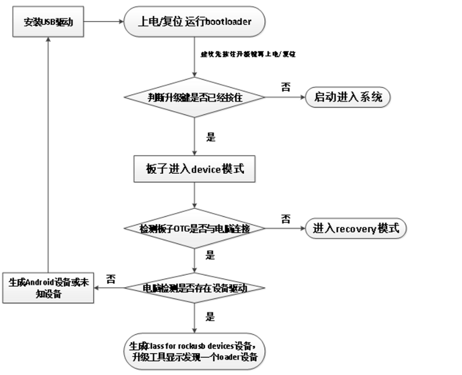
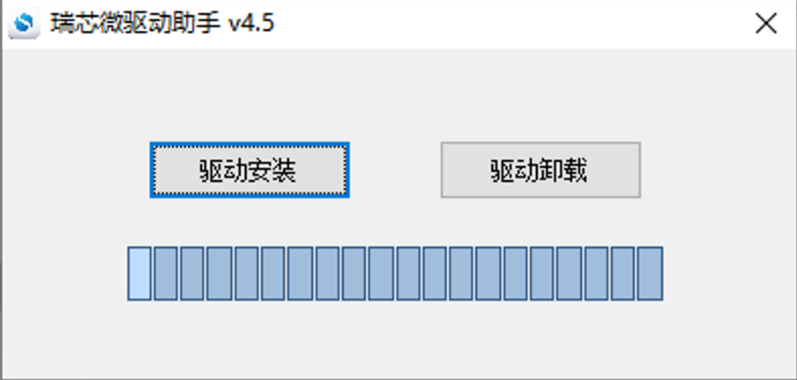
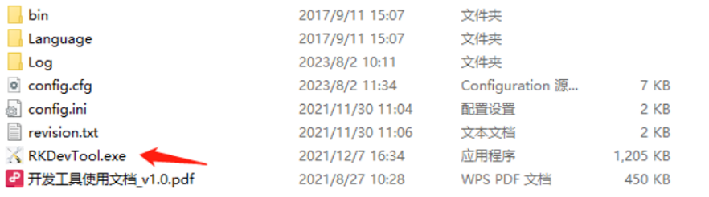
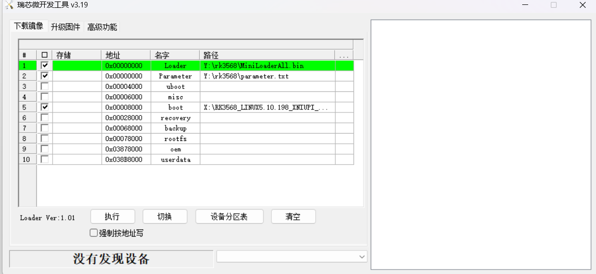
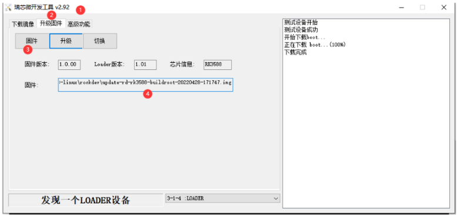
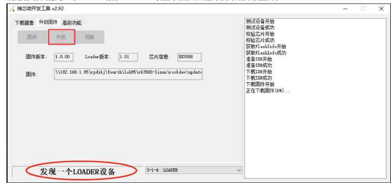
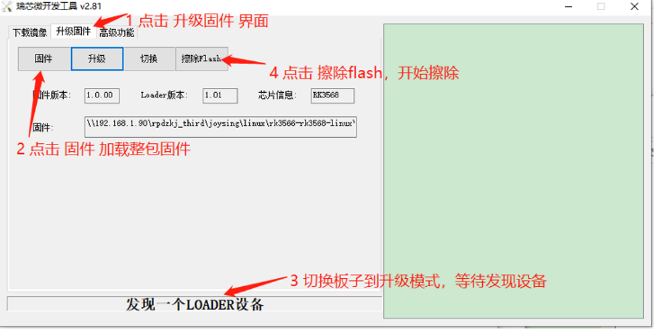
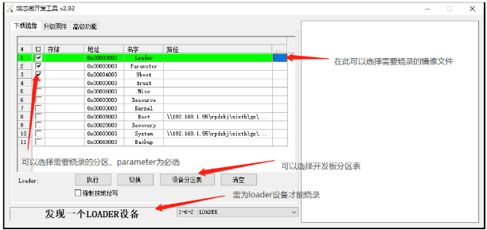

# 固件烧录

基于瑞芯微主控芯片的板卡，一般都是通过特定的USB接口烧录固件。

## 一.主板升级驱动流程

1. 当板子从bootloader开始启动
2. 程序会检测升级按键是否给按住
3. 如果给按住了，会进入device模式，并与电脑进行通信
4. 如果跟电脑没有连接OTG线，进入recovery模式
5. 如果跟电脑有连接OTG线，进入device模式
6. 当进入device模式后
7. 如果没有安装驱动，电脑设备管理器生成一个设备
8. 如果已经安装驱动，电脑设备管理器生成RK专有的设备驱动名称(class for rockusb devices)
9. 升级工具显示为一个loader模式

## 二.驱动安装
烧录固件前，需要先通过瑞芯微驱动助手安装瑞芯微usb驱动，驱动版本以网盘发布版本为准。

以下为瑞芯微USB驱动安装步骤:
    1.解压驱动文件DriverAssitant xxx.zip
    2.进入驱动文件夹/DriverAssitant xxx，并启动DriverInstall.exe
    3.点击驱动安装即可
    

## 三.升级工具
升级工具可咨询我司FAE获取，或者自行在我司发布的网盘资料中下载，工具版本以网盘实际版本为准。升级工
具无需安装，只需解压以后进入解压目录，双击运行RKDevTool.exe即可。
1、双击运行RKDevTool.exe

2.进入升级工具界面:

## 四、固件获取
客户可以选择我司已经编译好的正式发布的固件，也可以通过我司发布的SDK进行修改编译.
## 五.固件烧录(固件升级)
主板支持多种升级方式，一般分为线刷和卡刷，线刷即通过USB接到电脑端进行固件烧录，卡刷则是通过插入SD
卡进行固件升级。
### 5.1 通过连接USB进行固件烧录
进入烧录模式(loader或者maskrom)
通过USB进行固件烧录的方式，首先都需要让主板进入烧录模式(升级状态):
电脑通过数据线连接到板子的Type C或OTG接口,部分3588的板子使用TypeC接口作为OTG使用,另外一
部分使用USB 3.0 接口作为OTG使用，详情可参看开发板丝印和硬件介绍章节[OTG/TypeC口位置]。
长按主板上的reset/up按键3秒以上。
查看升级工具是否发现一个 loader或者mskroom 设备(注意不是ADB设备或者MSC设备)

*注意事项*
loader设备和maskroom设备的区别:
loader:主板已经烧录过固件，按住升级键上电的时候，会进入loader模式，进行升级。
maskroom:当主板为烧录任何固件的时候，上电即为maskroom模式，当主板的loader固件损坏后，也
可以通过maskroom来进行刷机修复。

### 5.2 开始升级固件
#### 整包升级
1.选择固件（整包）

编号1确认版本工具(版本不对应，会导致无法进入系统)
点击编号2 位置，选择升级固件页面
编号3选择固件
编号4当前固件
2.升级固件

特别注意:如果原本板子的固件为安卓系统，现在需要烧录Linux系统，建议先按照如下步骤擦除Flash以后再升
级。反之亦然。
#### 擦除flash
板子切换到 loader 或 maskroom 模式，选择对应的升级固件，进入升级工具进入擦除 Flash

#### 分包升级（分区升级）
按分区烧录一般是用于快速调试验证，!
单独烧录某个分区，省去固件打包和烧录不必更新的分区的时间，首先打
开烧录工具，点击下载镜像。

然后根据表格选择需要升级的分区，各分区镜像可由SDK编译产生。
Linux的都在sdk/rockdev/目录下，如果是安卓系统则在SDK/out/target/product/目录下

| 名字 | 对应镜像文件 | 是否必填 | 说明 |
| ---- | ---- | ---- | ---- |
| Loader | rockdev/MiniloaderAll.bin |  |  |
| Parameter | rockdev/parameter.txt | 是 |  |
| U - boot | rockdev/u - boot.img |  | U - boot镜像 |
| Misc | rockdev/misc.img |  |  |
| Boot | rockdev/boot.img |  | 内核镜像 |
| Recovery | rockdev/recovery.img |  |  |
| System | rockdev/rootfs.img |  | 文件系统 |